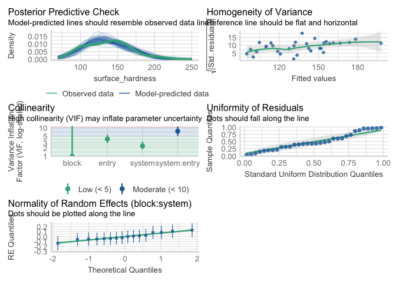
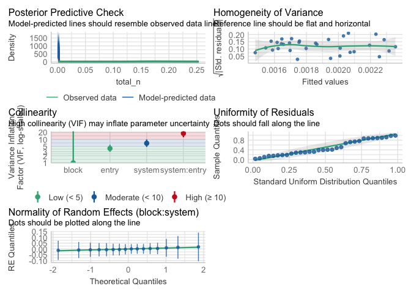
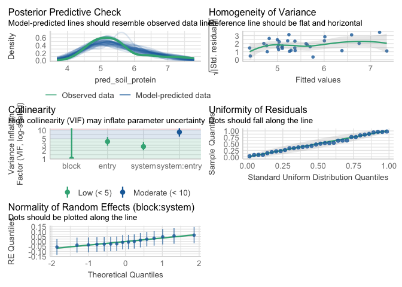
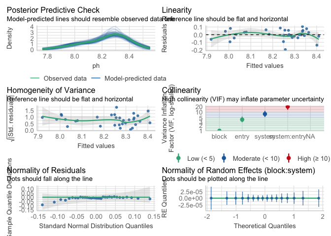
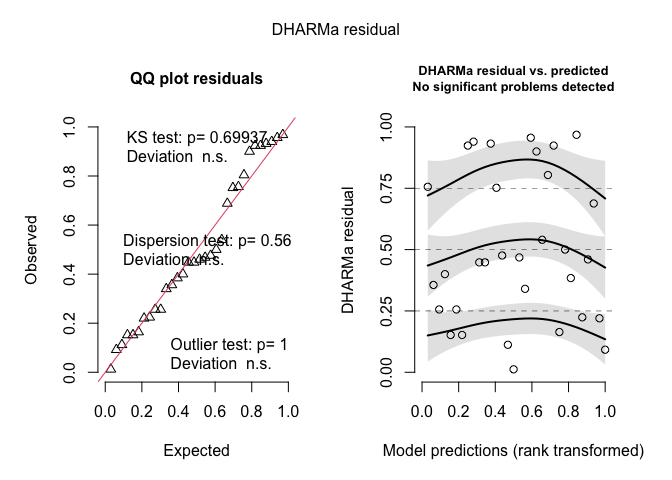
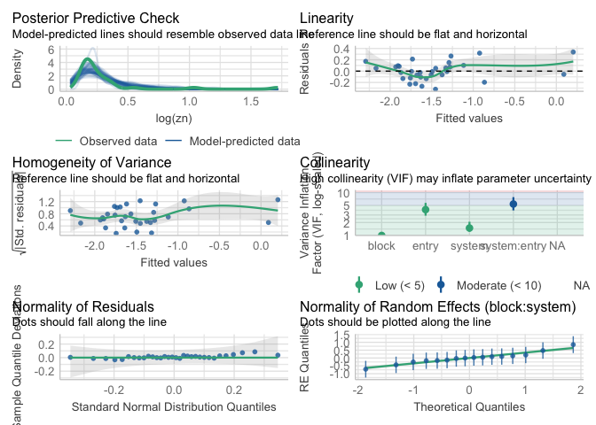
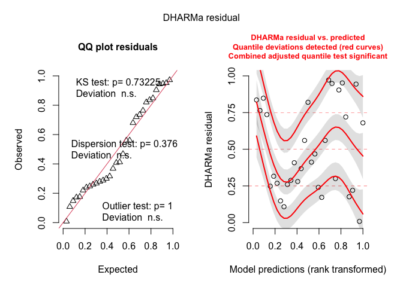
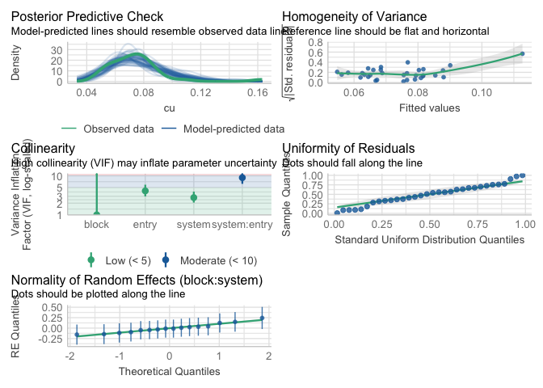
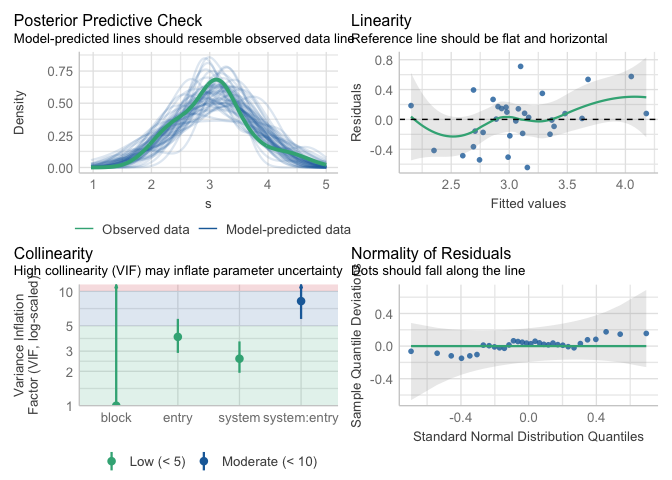

OCS soil health analysis
================

# Load libraries

``` r
library(tidyverse)
library(multcomp)
library(emmeans)
library(knitr)
library(patchwork) ##install.packages("patchwork")
library(skimr)     ##install.packages("skimr")
library(readxl)
library(janitor) ##install.packages("janitor")
library(kableExtra) ##install.packages("kableExtra")
library(WrensBookshelf)##install.packages("WrensBookshelf")
## For GLM modeling
library(monet)
library(DHARMa)
library(glmmTMB)
library(performance)
```

<br>

# Load and clean data

## Load data

``` r
ocs_soil_health_raw <- read_excel("~/Github/OCS_microarthropods/raw-data/ocs_soil_health_2022.xlsx")
ocs_soil_health_raw$block <- as.factor(ocs_soil_health_raw$block)
ocs_soil_health_raw$entry <- as.factor(ocs_soil_health_raw$entry)
ocs_soil_health_raw$system <- as.factor(ocs_soil_health_raw$system)


kable(head(ocs_soil_health_raw))
```

| sample | field | block | entry | system | date | tillage_intensity | soil_texture_sand | soil_texture_silt | soil_texture_clay | pred_water_capacity | surface_hardness | subsurface_hardness | aggregate_stability | organic_matter | soc | total_c | total_n | pred_soil_protein | respiration | active_carbon | ph | p | k | mg | fe | mn | zn | al | ca | cu | s |
|:---|---:|:---|:---|:---|:---|---:|---:|---:|---:|---:|---:|---:|---:|---:|---:|---:|---:|---:|---:|---:|---:|---:|---:|---:|---:|---:|---:|---:|---:|---:|---:|
| 1.1.A | 1 | 1 | A | HF | 2022-04-26 | 3 | 43.78894 | 38.94759 | 17.26347 | 0.2151171 | 163.750 | 363.750 | 11.013698 | 3.279532 | 2.475162 | 3.355 | 0.226 | 7.284740 | 0.7348661 | 675.9906 | 7.859 | 15.411281 | 55.20132 | 134.3313 | 0.4385637 | 5.997551 | 1.0348564 | 1.488808 | 4981.545 | 0.0769410 | 4.258684 |
| 1.1.B | 1 | 1 | B | HF | 2022-04-26 | 3 | 31.65381 | 42.95357 | 25.39262 | 0.2406547 | 137.500 | 334.375 | 16.448171 | 3.958228 | 2.599392 | 3.613 | 0.248 | 7.785285 | 1.1179044 | 765.0517 | 7.981 | 26.736384 | 67.36930 | 155.1208 | 0.6199197 | 6.889562 | 1.7188682 | 1.559192 | 5574.299 | 0.1080163 | 4.625916 |
| 1.2.A | 1 | 1 | A | LF | 2022-04-26 | 3 | 35.72908 | 42.71480 | 21.55612 | 0.2237636 | 103.125 | 308.750 | 12.552440 | 4.056622 | 2.636123 | 2.688 | 0.253 | 7.080389 | 0.7632393 | 571.7617 | 8.028 | 1.168519 | 37.35276 | 168.7945 | 0.4083176 | 4.703952 | 0.1759417 | 1.556919 | 1534.697 | 0.0663931 | 2.891420 |
| 1.2.B | 1 | 1 | B | LF | 2022-04-26 | 3 | 40.51895 | 42.54852 | 16.93253 | 0.2133034 | 132.500 | 343.750 | 22.965539 | 3.698215 | 2.352474 | 2.397 | 0.237 | 6.540035 | 0.5859068 | 530.9501 | 7.913 | 1.238093 | 28.77912 | 155.5995 | 0.4077104 | 1.544811 | 0.1383971 | 1.395193 | 1415.862 | 0.0523665 | 2.113361 |
| 1.3.A | 1 | 1 | A | EWM | 2022-04-26 | 3 | 41.62047 | 40.60886 | 17.77067 | 0.2173521 | 100.625 | 311.875 | 9.497207 | 3.250630 | 2.074495 | 2.224 | 0.205 | 5.562383 | 0.7632393 | 549.5008 | 8.089 | 1.320055 | 29.92011 | 156.6386 | 0.3936410 | 3.244145 | 0.1696729 | 1.398104 | 1689.141 | 0.0678691 | 3.135554 |
| 1.3.B | 1 | 1 | B | EWM | 2022-04-26 | 3 | 40.32626 | 43.57837 | 16.09537 | 0.2160877 | 123.750 | 330.000 | 15.249652 | 3.350125 | 2.092920 | 2.282 | 0.208 | 5.720484 | 0.7774259 | 549.5008 | 8.114 | 1.856948 | 29.86921 | 149.0407 | 0.5315828 | 3.581000 | 0.5459499 | 1.411568 | 1785.242 | 0.0790191 | 2.600446 |

\##Clean data

``` r
 #Filter relevant data (we can't use data from alley and corn)
ocs_soil_health_clean <- ocs_soil_health_raw |>  
  filter(system %in% c("HF", "LF", "EWM", "RT"))

# Display cleaned dataset
kable(head(ocs_soil_health_clean))
```

| sample | field | block | entry | system | date | tillage_intensity | soil_texture_sand | soil_texture_silt | soil_texture_clay | pred_water_capacity | surface_hardness | subsurface_hardness | aggregate_stability | organic_matter | soc | total_c | total_n | pred_soil_protein | respiration | active_carbon | ph | p | k | mg | fe | mn | zn | al | ca | cu | s |
|:---|---:|:---|:---|:---|:---|---:|---:|---:|---:|---:|---:|---:|---:|---:|---:|---:|---:|---:|---:|---:|---:|---:|---:|---:|---:|---:|---:|---:|---:|---:|---:|
| 1.1.A | 1 | 1 | A | HF | 2022-04-26 | 3 | 43.78894 | 38.94759 | 17.26347 | 0.2151171 | 163.750 | 363.750 | 11.013698 | 3.279532 | 2.475162 | 3.355 | 0.226 | 7.284740 | 0.7348661 | 675.9906 | 7.859 | 15.411281 | 55.20132 | 134.3313 | 0.4385637 | 5.997551 | 1.0348564 | 1.488808 | 4981.545 | 0.0769410 | 4.258684 |
| 1.1.B | 1 | 1 | B | HF | 2022-04-26 | 3 | 31.65381 | 42.95357 | 25.39262 | 0.2406547 | 137.500 | 334.375 | 16.448171 | 3.958228 | 2.599392 | 3.613 | 0.248 | 7.785285 | 1.1179044 | 765.0517 | 7.981 | 26.736384 | 67.36930 | 155.1208 | 0.6199197 | 6.889562 | 1.7188682 | 1.559192 | 5574.299 | 0.1080163 | 4.625916 |
| 1.2.A | 1 | 1 | A | LF | 2022-04-26 | 3 | 35.72908 | 42.71480 | 21.55612 | 0.2237636 | 103.125 | 308.750 | 12.552440 | 4.056622 | 2.636123 | 2.688 | 0.253 | 7.080389 | 0.7632393 | 571.7617 | 8.028 | 1.168519 | 37.35276 | 168.7945 | 0.4083176 | 4.703952 | 0.1759417 | 1.556919 | 1534.697 | 0.0663931 | 2.891420 |
| 1.2.B | 1 | 1 | B | LF | 2022-04-26 | 3 | 40.51895 | 42.54852 | 16.93253 | 0.2133034 | 132.500 | 343.750 | 22.965539 | 3.698215 | 2.352474 | 2.397 | 0.237 | 6.540035 | 0.5859068 | 530.9501 | 7.913 | 1.238093 | 28.77912 | 155.5995 | 0.4077104 | 1.544811 | 0.1383971 | 1.395193 | 1415.862 | 0.0523665 | 2.113361 |
| 1.3.A | 1 | 1 | A | EWM | 2022-04-26 | 3 | 41.62047 | 40.60886 | 17.77067 | 0.2173521 | 100.625 | 311.875 | 9.497207 | 3.250630 | 2.074495 | 2.224 | 0.205 | 5.562383 | 0.7632393 | 549.5008 | 8.089 | 1.320055 | 29.92011 | 156.6386 | 0.3936410 | 3.244145 | 0.1696729 | 1.398104 | 1689.141 | 0.0678691 | 3.135554 |
| 1.3.B | 1 | 1 | B | EWM | 2022-04-26 | 3 | 40.32626 | 43.57837 | 16.09537 | 0.2160877 | 123.750 | 330.000 | 15.249652 | 3.350125 | 2.092920 | 2.282 | 0.208 | 5.720484 | 0.7774259 | 549.5008 | 8.114 | 1.856948 | 29.86921 | 149.0407 | 0.5315828 | 3.581000 | 0.5459499 | 1.411568 | 1785.242 | 0.0790191 | 2.600446 |

\#Model testing

\##Soil_texture_sand

``` r
soil_texture_sand.beta <- glmmTMB(soil_texture_sand / 100 ~ system * entry + block + (1 | block:system),
                                    data = ocs_soil_health_clean,
                                    family = beta_family())

simulateResiduals(soil_texture_sand.beta,plot = TRUE) 
```

<!-- -->

    ## Object of Class DHARMa with simulated residuals based on 250 simulations with refit = FALSE . See ?DHARMa::simulateResiduals for help. 
    ##  
    ## Scaled residual values: 0.94 0.004 0.084 0.788 0.904 0.72 0.26 0.632 0.512 0.732 0.26 0.06 0.348 0.528 0.972 0.704 0.308 0.98 0.968 0.716 ...

``` r
check_model(soil_texture_sand.beta)
```

    ## `check_outliers()` does not yet support models of class `glmmTMB`.

<!-- -->

<br> \###anova

``` r
## `test_terms` is from monet and allows for a Type III anova for glmmTMB

soil_texture_sand.anova <- test_terms(formula = soil_texture_sand/100~ system * entry + block, # fixed effects go here
                                   data = ocs_soil_health_clean,
                                   extra_formula = ~ (1|block:system), # random effects go here
                                   fit_fun = glmmTMB,
                                   fit_arg = list(family = beta_family()));soil_texture_sand.anova 
```

    ## Detected colnames in anova output:
    ##  Df 1: Df, Df 0: Chi Df
    ##  Statistic: Chisq
    ##  p-value: Pr(>Chisq)

    ## glmmTMB Anova Table (Type III tests)
    ## 
    ## Model: soil_texture_sand/100 ~ system * entry + block + (1 | block:system)
    ## Data: ocs_soil_health_clean
    ##         Effect Df 1 Df 0 Chisq Pr(>Chisq)
    ## 1       system   13    3  1.66        .65
    ## 2        entry   13    1  0.09        .76
    ## 3        block   13    3  0.40        .94
    ## 4 system:entry   13    3  2.90        .41
    ## ---
    ## Signif. codes:  0 '***' 0.001 '**' 0.01 '*' 0.05 '+' 0.1 ' ' 1

``` r
soil_texture_sand.anova
```

    ## glmmTMB Anova Table (Type III tests)
    ## 
    ## Model: soil_texture_sand/100 ~ system * entry + block + (1 | block:system)
    ## Data: ocs_soil_health_clean
    ##         Effect Df 1 Df 0 Chisq Pr(>Chisq)
    ## 1       system   13    3  1.66        .65
    ## 2        entry   13    1  0.09        .76
    ## 3        block   13    3  0.40        .94
    ## 4 system:entry   13    3  2.90        .41
    ## ---
    ## Signif. codes:  0 '***' 0.001 '**' 0.01 '*' 0.05 '+' 0.1 ' ' 1

<br> \### means comparisons

``` r
# Define model object (you can swap in different ones)
mod <- soil_texture_sand.beta

# Create a named list of comparisons and corresponding CLDs
library(emmeans)
library(multcompView)

tukey_results <- list(
  entry = emmeans(mod, pairwise ~ entry, adjust = "tukey", type = "response"),
  system = emmeans(mod, pairwise ~ system, adjust = "tukey", type = "response"),
  system_entry = emmeans(mod, list(pairwise ~ system | entry), adjust = "tukey", type = "response")
)
```

    ## NOTE: Results may be misleading due to involvement in interactions
    ## NOTE: Results may be misleading due to involvement in interactions

``` r
# Extract compact letter displays
cld_results <- list(
  entry = cld(emmeans(mod, ~entry), adjust = "tukey", type = "response", 
              Letters = letters, sort = TRUE, reversed = TRUE),
  system = cld(emmeans(mod, ~system), adjust = "tukey", type = "response", 
               Letters = letters, sort = TRUE, reversed = TRUE),
  system_entry = cld(emmeans(mod, ~system | entry), adjust = "tukey", type = "response", 
                     Letters = letters, sort = TRUE, reversed = TRUE)
)
```

    ## NOTE: Results may be misleading due to involvement in interactions

    ## Note: adjust = "tukey" was changed to "sidak"
    ## because "tukey" is only appropriate for one set of pairwise comparisons

    ## NOTE: Results may be misleading due to involvement in interactions

    ## Note: adjust = "tukey" was changed to "sidak"
    ## because "tukey" is only appropriate for one set of pairwise comparisons
    ## Note: adjust = "tukey" was changed to "sidak"
    ## because "tukey" is only appropriate for one set of pairwise comparisons

``` r
# Access them like this:
tukey_results$entry$emmeans
```

    ##  entry response      SE  df asymp.LCL asymp.UCL
    ##  A        0.396 0.00567 Inf     0.385     0.408
    ##  B        0.386 0.00565 Inf     0.375     0.397
    ## 
    ## Results are averaged over the levels of: system, block 
    ## Confidence level used: 0.95 
    ## Intervals are back-transformed from the logit scale

``` r
tukey_results$system$emmeans
```

    ##  system response      SE  df asymp.LCL asymp.UCL
    ##  EWM       0.390 0.00800 Inf     0.375     0.406
    ##  HF        0.391 0.00801 Inf     0.375     0.407
    ##  LF        0.391 0.00800 Inf     0.376     0.407
    ##  RT        0.393 0.00801 Inf     0.378     0.409
    ## 
    ## Results are averaged over the levels of: entry, block 
    ## Confidence level used: 0.95 
    ## Intervals are back-transformed from the logit scale

``` r
tukey_results$system_entry$emmeans
```

    ## entry = A:
    ##  system response     SE  df asymp.LCL asymp.UCL
    ##  EWM       0.388 0.0113 Inf     0.366     0.410
    ##  HF        0.407 0.0114 Inf     0.385     0.430
    ##  LF        0.392 0.0113 Inf     0.370     0.414
    ##  RT        0.399 0.0114 Inf     0.377     0.422
    ## 
    ## entry = B:
    ##  system response     SE  df asymp.LCL asymp.UCL
    ##  EWM       0.392 0.0113 Inf     0.371     0.415
    ##  HF        0.375 0.0112 Inf     0.354     0.398
    ##  LF        0.391 0.0113 Inf     0.369     0.413
    ##  RT        0.387 0.0113 Inf     0.365     0.410
    ## 
    ## Results are averaged over the levels of: block 
    ## Confidence level used: 0.95 
    ## Intervals are back-transformed from the logit scale

``` r
tukey_results$entry$contrasts
```

    ##  contrast odds.ratio    SE  df null z.ratio p.value
    ##  A / B          1.04 0.035 Inf    1   1.254  0.2097
    ## 
    ## Results are averaged over the levels of: system, block 
    ## Tests are performed on the log odds ratio scale

``` r
tukey_results$system$contrasts
```

    ##  contrast odds.ratio     SE  df null z.ratio p.value
    ##  EWM / HF      0.996 0.0474 Inf    1  -0.084  0.9998
    ##  EWM / LF      0.996 0.0473 Inf    1  -0.094  0.9997
    ##  EWM / RT      0.987 0.0469 Inf    1  -0.282  0.9922
    ##  HF / LF       1.000 0.0475 Inf    1  -0.010  1.0000
    ##  HF / RT       0.991 0.0471 Inf    1  -0.198  0.9973
    ##  LF / RT       0.991 0.0471 Inf    1  -0.188  0.9977
    ## 
    ## Results are averaged over the levels of: entry, block 
    ## P value adjustment: tukey method for comparing a family of 4 estimates 
    ## Tests are performed on the log odds ratio scale

``` r
tukey_results$system_entry$contrasts
```

    ## NULL

``` r
cld_results$entry
```

    ##  entry response      SE  df asymp.LCL asymp.UCL .group
    ##  A        0.396 0.00567 Inf     0.384     0.409  a    
    ##  B        0.386 0.00565 Inf     0.374     0.399  a    
    ## 
    ## Results are averaged over the levels of: system, block 
    ## Confidence level used: 0.95 
    ## Conf-level adjustment: sidak method for 2 estimates 
    ## Intervals are back-transformed from the logit scale 
    ## Tests are performed on the log odds ratio scale 
    ## significance level used: alpha = 0.05 
    ## NOTE: If two or more means share the same grouping symbol,
    ##       then we cannot show them to be different.
    ##       But we also did not show them to be the same.

``` r
cld_results$system
```

    ##  system response      SE  df asymp.LCL asymp.UCL .group
    ##  RT        0.393 0.00801 Inf     0.373     0.413  a    
    ##  LF        0.391 0.00800 Inf     0.371     0.411  a    
    ##  HF        0.391 0.00801 Inf     0.371     0.411  a    
    ##  EWM       0.390 0.00800 Inf     0.370     0.410  a    
    ## 
    ## Results are averaged over the levels of: entry, block 
    ## Confidence level used: 0.95 
    ## Conf-level adjustment: sidak method for 4 estimates 
    ## Intervals are back-transformed from the logit scale 
    ## P value adjustment: tukey method for comparing a family of 4 estimates 
    ## Tests are performed on the log odds ratio scale 
    ## significance level used: alpha = 0.05 
    ## NOTE: If two or more means share the same grouping symbol,
    ##       then we cannot show them to be different.
    ##       But we also did not show them to be the same.

``` r
cld_results$system_entry
```

    ## entry = A:
    ##  system response     SE  df asymp.LCL asymp.UCL .group
    ##  HF        0.407 0.0114 Inf     0.379     0.436  a    
    ##  RT        0.399 0.0114 Inf     0.371     0.428  a    
    ##  LF        0.392 0.0113 Inf     0.364     0.420  a    
    ##  EWM       0.388 0.0113 Inf     0.360     0.416  a    
    ## 
    ## entry = B:
    ##  system response     SE  df asymp.LCL asymp.UCL .group
    ##  EWM       0.392 0.0113 Inf     0.365     0.421  a    
    ##  LF        0.391 0.0113 Inf     0.363     0.419  a    
    ##  RT        0.387 0.0113 Inf     0.359     0.416  a    
    ##  HF        0.375 0.0112 Inf     0.348     0.404  a    
    ## 
    ## Results are averaged over the levels of: block 
    ## Confidence level used: 0.95 
    ## Conf-level adjustment: sidak method for 4 estimates 
    ## Intervals are back-transformed from the logit scale 
    ## P value adjustment: tukey method for comparing a family of 4 estimates 
    ## Tests are performed on the log odds ratio scale 
    ## significance level used: alpha = 0.05 
    ## NOTE: If two or more means share the same grouping symbol,
    ##       then we cannot show them to be different.
    ##       But we also did not show them to be the same.

<br>

\##Soil_texture_silt

``` r
soil_texture_silt.beta <- glmmTMB(soil_texture_silt / 100 ~ system * entry + block + (1 | block:system),
                                    data = ocs_soil_health_clean,
                                    family = beta_family())

simulateResiduals(soil_texture_silt.beta ,plot = TRUE) 
```

<!-- -->

    ## Object of Class DHARMa with simulated residuals based on 250 simulations with refit = FALSE . See ?DHARMa::simulateResiduals for help. 
    ##  
    ## Scaled residual values: 0.08 0.564 0.54 0.376 0.208 0.676 0.772 0.808 0.948 0.788 0.928 0.936 0.432 0.132 0.004 0.076 0.372 0.096 0.112 0.34 ...

``` r
check_model(soil_texture_silt.beta )
```

    ## `check_outliers()` does not yet support models of class `glmmTMB`.

<!-- -->

\###anova

``` r
## `test_terms` is from monet and allows for a Type III anova for glmmTMB

soil_texture_silt.anova <- test_terms(formula = soil_texture_silt/100~ system * entry + block, # fixed effects go here
                                   data = ocs_soil_health_clean,
                                   extra_formula = ~ (1|block:system), # random effects go here
                                   fit_fun = glmmTMB,
                                   fit_arg = list(family = beta_family()));soil_texture_silt.anova 
```

    ## Detected colnames in anova output:
    ##  Df 1: Df, Df 0: Chi Df
    ##  Statistic: Chisq
    ##  p-value: Pr(>Chisq)

    ## glmmTMB Anova Table (Type III tests)
    ## 
    ## Model: soil_texture_silt/100 ~ system * entry + block + (1 | block:system)
    ## Data: ocs_soil_health_clean
    ##         Effect Df 1 Df 0 Chisq Pr(>Chisq)
    ## 1       system   13    3  0.39        .94
    ## 2        entry   13    1  1.22        .27
    ## 3        block   13    3  1.55        .67
    ## 4 system:entry   13    3  0.28        .96
    ## ---
    ## Signif. codes:  0 '***' 0.001 '**' 0.01 '*' 0.05 '+' 0.1 ' ' 1

``` r
soil_texture_silt.anova 
```

    ## glmmTMB Anova Table (Type III tests)
    ## 
    ## Model: soil_texture_silt/100 ~ system * entry + block + (1 | block:system)
    ## Data: ocs_soil_health_clean
    ##         Effect Df 1 Df 0 Chisq Pr(>Chisq)
    ## 1       system   13    3  0.39        .94
    ## 2        entry   13    1  1.22        .27
    ## 3        block   13    3  1.55        .67
    ## 4 system:entry   13    3  0.28        .96
    ## ---
    ## Signif. codes:  0 '***' 0.001 '**' 0.01 '*' 0.05 '+' 0.1 ' ' 1

<br> \### means comparisons

``` r
# Define model object (you can swap in different ones)
mod <- soil_texture_silt.beta


tukey_results <- list(
  entry = emmeans(mod, pairwise ~ entry, adjust = "tukey", type = "response"),
  system = emmeans(mod, pairwise ~ system, adjust = "tukey", type = "response"),
  system_entry = emmeans(mod, list(pairwise ~ system | entry), adjust = "tukey", type = "response")
)
```

    ## NOTE: Results may be misleading due to involvement in interactions
    ## NOTE: Results may be misleading due to involvement in interactions

``` r
# Extract compact letter displays
cld_results <- list(
  entry = cld(emmeans(mod, ~entry), adjust = "tukey", type = "response", 
              Letters = letters, sort = TRUE, reversed = TRUE),
  system = cld(emmeans(mod, ~system), adjust = "tukey", type = "response", 
               Letters = letters, sort = TRUE, reversed = TRUE),
  system_entry = cld(emmeans(mod, ~system | entry), adjust = "tukey", type = "response", 
                     Letters = letters, sort = TRUE, reversed = TRUE)
)
```

    ## NOTE: Results may be misleading due to involvement in interactions

    ## Note: adjust = "tukey" was changed to "sidak"
    ## because "tukey" is only appropriate for one set of pairwise comparisons

    ## NOTE: Results may be misleading due to involvement in interactions

    ## Note: adjust = "tukey" was changed to "sidak"
    ## because "tukey" is only appropriate for one set of pairwise comparisons
    ## Note: adjust = "tukey" was changed to "sidak"
    ## because "tukey" is only appropriate for one set of pairwise comparisons

``` r
# Access them like this:
#tukey_results$entry$emmeans
#tukey_results$system$emmeans
#tukey_results$system_entry$emmeans
#tukey_results$entry$contrasts
#tukey_results$system$contrasts
#tukey_results$system_entry$contrasts
#cld_results$entry
#cld_results$system
#cld_results$system_entry
```

\##Soil_texture_clay

``` r
soil_texture_clay.beta <- glmmTMB(soil_texture_clay / 100 ~ system * entry + block + (1 | block:system),
                                    data = ocs_soil_health_clean,
                                    family = beta_family())

simulateResiduals(soil_texture_clay.beta,plot = TRUE) 
```

<!-- -->

    ## Object of Class DHARMa with simulated residuals based on 250 simulations with refit = FALSE . See ?DHARMa::simulateResiduals for help. 
    ##  
    ## Scaled residual values: 0.384 1 0.928 0.188 0.168 0.092 0.52 0.096 0.044 0.136 0.26 0.68 0.788 0.88 0.708 0.848 0.796 0.156 0.18 0.48 ...

``` r
check_model(soil_texture_clay.beta)
```

    ## `check_outliers()` does not yet support models of class `glmmTMB`.

<!-- -->

\###anova

``` r
## `test_terms` is from monet and allows for a Type III anova for glmmTMB

soil_texture_clay.anova <- test_terms(formula = soil_texture_clay/100~ system * entry + block, # fixed effects go here
                                   data = ocs_soil_health_clean,
                                   extra_formula = ~ (1|block:system), # random effects go here
                                   fit_fun = glmmTMB,
                                   fit_arg = list(family = beta_family()));soil_texture_clay.anova 
```

    ## Detected colnames in anova output:
    ##  Df 1: Df, Df 0: Chi Df
    ##  Statistic: Chisq
    ##  p-value: Pr(>Chisq)

    ## glmmTMB Anova Table (Type III tests)
    ## 
    ## Model: soil_texture_clay/100 ~ system * entry + block + (1 | block:system)
    ## Data: ocs_soil_health_clean
    ##         Effect Df 1 Df 0 Chisq Pr(>Chisq)
    ## 1       system   13    3  1.98        .58
    ## 2        entry   13    1  1.17        .28
    ## 3        block   13    3  0.98        .81
    ## 4 system:entry   13    3  3.93        .27
    ## ---
    ## Signif. codes:  0 '***' 0.001 '**' 0.01 '*' 0.05 '+' 0.1 ' ' 1

<br> \### means comparisons

``` r
# Define model object (you can swap in different ones)
mod <- soil_texture_clay.beta

# Create a named list of comparisons and corresponding CLDs
library(emmeans)
library(multcompView)

tukey_results <- list(
  entry = emmeans(mod, pairwise ~ entry, adjust = "tukey", type = "response"),
  system = emmeans(mod, pairwise ~ system, adjust = "tukey", type = "response"),
  system_entry = emmeans(mod, list(pairwise ~ system | entry), adjust = "tukey", type = "response")
)
```

    ## NOTE: Results may be misleading due to involvement in interactions
    ## NOTE: Results may be misleading due to involvement in interactions

``` r
# Extract compact letter displays
cld_results <- list(
  entry = cld(emmeans(mod, ~entry), adjust = "tukey", type = "response", 
              Letters = letters, sort = TRUE, reversed = TRUE),
  system = cld(emmeans(mod, ~system), adjust = "tukey", type = "response", 
               Letters = letters, sort = TRUE, reversed = TRUE),
  system_entry = cld(emmeans(mod, ~system | entry), adjust = "tukey", type = "response", 
                     Letters = letters, sort = TRUE, reversed = TRUE)
)
```

    ## NOTE: Results may be misleading due to involvement in interactions

    ## Note: adjust = "tukey" was changed to "sidak"
    ## because "tukey" is only appropriate for one set of pairwise comparisons

    ## NOTE: Results may be misleading due to involvement in interactions

    ## Note: adjust = "tukey" was changed to "sidak"
    ## because "tukey" is only appropriate for one set of pairwise comparisons
    ## Note: adjust = "tukey" was changed to "sidak"
    ## because "tukey" is only appropriate for one set of pairwise comparisons

``` r
# Access them like this:
tukey_results$entry$emmeans
```

    ##  entry response      SE  df asymp.LCL asymp.UCL
    ##  A        0.192 0.00442 Inf     0.183     0.200
    ##  B        0.193 0.00443 Inf     0.185     0.202
    ## 
    ## Results are averaged over the levels of: system, block 
    ## Confidence level used: 0.95 
    ## Intervals are back-transformed from the logit scale

``` r
tukey_results$system$emmeans
```

    ##  system response      SE  df asymp.LCL asymp.UCL
    ##  EWM       0.194 0.00631 Inf     0.182     0.206
    ##  HF        0.193 0.00632 Inf     0.181     0.206
    ##  LF        0.190 0.00627 Inf     0.178     0.203
    ##  RT        0.193 0.00630 Inf     0.181     0.205
    ## 
    ## Results are averaged over the levels of: entry, block 
    ## Confidence level used: 0.95 
    ## Intervals are back-transformed from the logit scale

``` r
tukey_results$system_entry$emmeans
```

    ## entry = A:
    ##  system response      SE  df asymp.LCL asymp.UCL
    ##  EWM       0.201 0.00898 Inf     0.184     0.219
    ##  HF        0.183 0.00866 Inf     0.166     0.200
    ##  LF        0.192 0.00883 Inf     0.175     0.210
    ##  RT        0.192 0.00883 Inf     0.175     0.210
    ## 
    ## entry = B:
    ##  system response      SE  df asymp.LCL asymp.UCL
    ##  EWM       0.187 0.00874 Inf     0.171     0.205
    ##  HF        0.204 0.00906 Inf     0.187     0.223
    ##  LF        0.189 0.00878 Inf     0.172     0.206
    ##  RT        0.194 0.00886 Inf     0.177     0.212
    ## 
    ## Results are averaged over the levels of: block 
    ## Confidence level used: 0.95 
    ## Intervals are back-transformed from the logit scale

``` r
tukey_results$entry$contrasts
```

    ##  contrast odds.ratio     SE  df null z.ratio p.value
    ##  A / B         0.989 0.0395 Inf    1  -0.270  0.7869
    ## 
    ## Results are averaged over the levels of: system, block 
    ## Tests are performed on the log odds ratio scale

``` r
tukey_results$system$contrasts
```

    ##  contrast odds.ratio     SE  df null z.ratio p.value
    ##  EWM / HF      1.002 0.0574 Inf    1   0.036  1.0000
    ##  EWM / LF      1.024 0.0587 Inf    1   0.406  0.9773
    ##  EWM / RT      1.007 0.0576 Inf    1   0.123  0.9993
    ##  HF / LF       1.021 0.0587 Inf    1   0.370  0.9827
    ##  HF / RT       1.005 0.0576 Inf    1   0.087  0.9998
    ##  LF / RT       0.984 0.0565 Inf    1  -0.284  0.9920
    ## 
    ## Results are averaged over the levels of: entry, block 
    ## P value adjustment: tukey method for comparing a family of 4 estimates 
    ## Tests are performed on the log odds ratio scale

``` r
tukey_results$system_entry$contrasts
```

    ## NULL

``` r
cld_results$entry
```

    ##  entry response      SE  df asymp.LCL asymp.UCL .group
    ##  B        0.193 0.00443 Inf     0.184     0.203  a    
    ##  A        0.192 0.00442 Inf     0.182     0.202  a    
    ## 
    ## Results are averaged over the levels of: system, block 
    ## Confidence level used: 0.95 
    ## Conf-level adjustment: sidak method for 2 estimates 
    ## Intervals are back-transformed from the logit scale 
    ## Tests are performed on the log odds ratio scale 
    ## significance level used: alpha = 0.05 
    ## NOTE: If two or more means share the same grouping symbol,
    ##       then we cannot show them to be different.
    ##       But we also did not show them to be the same.

``` r
cld_results$system
```

    ##  system response      SE  df asymp.LCL asymp.UCL .group
    ##  EWM       0.194 0.00631 Inf     0.179     0.210  a    
    ##  HF        0.193 0.00632 Inf     0.178     0.210  a    
    ##  RT        0.193 0.00630 Inf     0.177     0.209  a    
    ##  LF        0.190 0.00627 Inf     0.175     0.206  a    
    ## 
    ## Results are averaged over the levels of: entry, block 
    ## Confidence level used: 0.95 
    ## Conf-level adjustment: sidak method for 4 estimates 
    ## Intervals are back-transformed from the logit scale 
    ## P value adjustment: tukey method for comparing a family of 4 estimates 
    ## Tests are performed on the log odds ratio scale 
    ## significance level used: alpha = 0.05 
    ## NOTE: If two or more means share the same grouping symbol,
    ##       then we cannot show them to be different.
    ##       But we also did not show them to be the same.

``` r
cld_results$system_entry
```

    ## entry = A:
    ##  system response      SE  df asymp.LCL asymp.UCL .group
    ##  EWM       0.201 0.00898 Inf     0.179     0.224  a    
    ##  LF        0.192 0.00883 Inf     0.171     0.215  a    
    ##  RT        0.192 0.00883 Inf     0.171     0.215  a    
    ##  HF        0.183 0.00866 Inf     0.162     0.205  a    
    ## 
    ## entry = B:
    ##  system response      SE  df asymp.LCL asymp.UCL .group
    ##  HF        0.204 0.00906 Inf     0.183     0.228  a    
    ##  RT        0.194 0.00886 Inf     0.173     0.217  a    
    ##  LF        0.189 0.00878 Inf     0.168     0.211  a    
    ##  EWM       0.187 0.00874 Inf     0.166     0.210  a    
    ## 
    ## Results are averaged over the levels of: block 
    ## Confidence level used: 0.95 
    ## Conf-level adjustment: sidak method for 4 estimates 
    ## Intervals are back-transformed from the logit scale 
    ## P value adjustment: tukey method for comparing a family of 4 estimates 
    ## Tests are performed on the log odds ratio scale 
    ## significance level used: alpha = 0.05 
    ## NOTE: If two or more means share the same grouping symbol,
    ##       then we cannot show them to be different.
    ##       But we also did not show them to be the same.

<br>

\##Pred_water_capacity

``` r
pred_water_capacity.beta <- glmmTMB(pred_water_capacity ~ system * entry + block + (1 | block:system),
                                    data = ocs_soil_health_clean,
                                    family = beta_family())

simulateResiduals(pred_water_capacity.beta,plot = TRUE) 
```

<!-- -->

    ## Object of Class DHARMa with simulated residuals based on 250 simulations with refit = FALSE . See ?DHARMa::simulateResiduals for help. 
    ##  
    ## Scaled residual values: 0.104 0.996 0.696 0.176 0.44 0.324 0.54 0.46 0.74 0.256 0.716 0.904 0.116 0.232 0.268 0.744 0.504 0.096 0.172 0.824 ...

``` r
check_model(pred_water_capacity.beta)
```

    ## `check_outliers()` does not yet support models of class `glmmTMB`.

<!-- -->
<br> \###anova

``` r
## `test_terms` is from monet and allows for a Type III anova for glmmTMB

pred_water_capacity.anova <- test_terms(formula = pred_water_capacity~ system * entry + block, # fixed effects go here
                                   data = ocs_soil_health_clean,
                                   extra_formula = ~ (1|block:system), # random effects go here
                                   fit_fun = glmmTMB,
                                   fit_arg = list(family = beta_family()));pred_water_capacity.anova 
```

    ## Detected colnames in anova output:
    ##  Df 1: Df, Df 0: Chi Df
    ##  Statistic: Chisq
    ##  p-value: Pr(>Chisq)

    ## glmmTMB Anova Table (Type III tests)
    ## 
    ## Model: pred_water_capacity ~ system * entry + block + (1 | block:system)
    ## Data: ocs_soil_health_clean
    ##         Effect Df 1 Df 0    Chisq Pr(>Chisq)
    ## 1       system   13    3     2.17        .54
    ## 2        entry   13    1     0.00        .96
    ## 3        block   13    3 15.44 **       .001
    ## 4 system:entry   13    3     1.36        .72
    ## ---
    ## Signif. codes:  0 '***' 0.001 '**' 0.01 '*' 0.05 '+' 0.1 ' ' 1

<br> \### means comparisons

``` r
# Define model object (you can swap in different ones)
mod <- pred_water_capacity.beta

# Create a named list of comparisons and corresponding CLDs
library(emmeans)
library(multcompView)

tukey_results <- list(
  entry = emmeans(mod, pairwise ~ entry, adjust = "tukey", type = "response"),
  system = emmeans(mod, pairwise ~ system, adjust = "tukey", type = "response"),
  system_entry = emmeans(mod, list(pairwise ~ system | entry), adjust = "tukey", type = "response")
)
```

    ## NOTE: Results may be misleading due to involvement in interactions
    ## NOTE: Results may be misleading due to involvement in interactions

``` r
# Extract compact letter displays
cld_results <- list(
  entry = cld(emmeans(mod, ~entry), adjust = "tukey", type = "response", 
              Letters = letters, sort = TRUE, reversed = TRUE),
  system = cld(emmeans(mod, ~system), adjust = "tukey", type = "response", 
               Letters = letters, sort = TRUE, reversed = TRUE),
  system_entry = cld(emmeans(mod, ~system | entry), adjust = "tukey", type = "response", 
                     Letters = letters, sort = TRUE, reversed = TRUE)
)
```

    ## NOTE: Results may be misleading due to involvement in interactions

    ## Note: adjust = "tukey" was changed to "sidak"
    ## because "tukey" is only appropriate for one set of pairwise comparisons

    ## NOTE: Results may be misleading due to involvement in interactions

    ## Note: adjust = "tukey" was changed to "sidak"
    ## because "tukey" is only appropriate for one set of pairwise comparisons
    ## Note: adjust = "tukey" was changed to "sidak"
    ## because "tukey" is only appropriate for one set of pairwise comparisons

``` r
# Access them like this:
tukey_results$entry$emmeans
```

    ##  entry response      SE  df asymp.LCL asymp.UCL
    ##  A        0.211 0.00151 Inf     0.208     0.214
    ##  B        0.213 0.00152 Inf     0.210     0.216
    ## 
    ## Results are averaged over the levels of: system, block 
    ## Confidence level used: 0.95 
    ## Intervals are back-transformed from the logit scale

``` r
tukey_results$system$emmeans
```

    ##  system response      SE  df asymp.LCL asymp.UCL
    ##  EWM       0.210 0.00214 Inf     0.206     0.214
    ##  HF        0.217 0.00216 Inf     0.212     0.221
    ##  LF        0.211 0.00214 Inf     0.207     0.215
    ##  RT        0.210 0.00214 Inf     0.206     0.214
    ## 
    ## Results are averaged over the levels of: entry, block 
    ## Confidence level used: 0.95 
    ## Intervals are back-transformed from the logit scale

``` r
tukey_results$system_entry$emmeans
```

    ## entry = A:
    ##  system response      SE  df asymp.LCL asymp.UCL
    ##  EWM       0.210 0.00302 Inf     0.204     0.216
    ##  HF        0.214 0.00305 Inf     0.208     0.220
    ##  LF        0.212 0.00303 Inf     0.206     0.218
    ##  RT        0.208 0.00301 Inf     0.202     0.214
    ## 
    ## entry = B:
    ##  system response      SE  df asymp.LCL asymp.UCL
    ##  EWM       0.210 0.00302 Inf     0.204     0.216
    ##  HF        0.219 0.00307 Inf     0.213     0.225
    ##  LF        0.210 0.00303 Inf     0.204     0.216
    ##  RT        0.212 0.00303 Inf     0.206     0.218
    ## 
    ## Results are averaged over the levels of: block 
    ## Confidence level used: 0.95 
    ## Intervals are back-transformed from the logit scale

``` r
tukey_results$entry$contrasts
```

    ##  contrast odds.ratio     SE  df null z.ratio p.value
    ##  A / B         0.991 0.0127 Inf    1  -0.713  0.4756
    ## 
    ## Results are averaged over the levels of: system, block 
    ## Tests are performed on the log odds ratio scale

``` r
tukey_results$system$contrasts
```

    ##  contrast odds.ratio     SE  df null z.ratio p.value
    ##  EWM / HF      0.961 0.0174 Inf    1  -2.187  0.1267
    ##  EWM / LF      0.993 0.0181 Inf    1  -0.407  0.9773
    ##  EWM / RT      0.999 0.0182 Inf    1  -0.041  1.0000
    ##  HF / LF       1.033 0.0187 Inf    1   1.781  0.2825
    ##  HF / RT       1.040 0.0188 Inf    1   2.146  0.1387
    ##  LF / RT       1.007 0.0183 Inf    1   0.365  0.9833
    ## 
    ## Results are averaged over the levels of: entry, block 
    ## P value adjustment: tukey method for comparing a family of 4 estimates 
    ## Tests are performed on the log odds ratio scale

``` r
tukey_results$system_entry$contrasts
```

    ## NULL

``` r
cld_results$entry
```

    ##  entry response      SE  df asymp.LCL asymp.UCL .group
    ##  B        0.213 0.00152 Inf     0.209     0.216  a    
    ##  A        0.211 0.00151 Inf     0.208     0.215  a    
    ## 
    ## Results are averaged over the levels of: system, block 
    ## Confidence level used: 0.95 
    ## Conf-level adjustment: sidak method for 2 estimates 
    ## Intervals are back-transformed from the logit scale 
    ## Tests are performed on the log odds ratio scale 
    ## significance level used: alpha = 0.05 
    ## NOTE: If two or more means share the same grouping symbol,
    ##       then we cannot show them to be different.
    ##       But we also did not show them to be the same.

``` r
cld_results$system
```

    ##  system response      SE  df asymp.LCL asymp.UCL .group
    ##  HF        0.217 0.00216 Inf     0.211     0.222  a    
    ##  LF        0.211 0.00214 Inf     0.206     0.217  a    
    ##  RT        0.210 0.00214 Inf     0.205     0.215  a    
    ##  EWM       0.210 0.00214 Inf     0.205     0.215  a    
    ## 
    ## Results are averaged over the levels of: entry, block 
    ## Confidence level used: 0.95 
    ## Conf-level adjustment: sidak method for 4 estimates 
    ## Intervals are back-transformed from the logit scale 
    ## P value adjustment: tukey method for comparing a family of 4 estimates 
    ## Tests are performed on the log odds ratio scale 
    ## significance level used: alpha = 0.05 
    ## NOTE: If two or more means share the same grouping symbol,
    ##       then we cannot show them to be different.
    ##       But we also did not show them to be the same.

``` r
cld_results$system_entry
```

    ## entry = A:
    ##  system response      SE  df asymp.LCL asymp.UCL .group
    ##  HF        0.214 0.00305 Inf     0.207     0.222  a    
    ##  LF        0.212 0.00303 Inf     0.205     0.220  a    
    ##  EWM       0.210 0.00302 Inf     0.203     0.218  a    
    ##  RT        0.208 0.00301 Inf     0.201     0.216  a    
    ## 
    ## entry = B:
    ##  system response      SE  df asymp.LCL asymp.UCL .group
    ##  HF        0.219 0.00307 Inf     0.211     0.227  a    
    ##  RT        0.212 0.00303 Inf     0.204     0.220  a    
    ##  LF        0.210 0.00303 Inf     0.203     0.218  a    
    ##  EWM       0.210 0.00302 Inf     0.202     0.217  a    
    ## 
    ## Results are averaged over the levels of: block 
    ## Confidence level used: 0.95 
    ## Conf-level adjustment: sidak method for 4 estimates 
    ## Intervals are back-transformed from the logit scale 
    ## P value adjustment: tukey method for comparing a family of 4 estimates 
    ## Tests are performed on the log odds ratio scale 
    ## significance level used: alpha = 0.05 
    ## NOTE: If two or more means share the same grouping symbol,
    ##       then we cannot show them to be different.
    ##       But we also did not show them to be the same.

\##Surface_hardness

``` r
surface_hardness.gauss<- glmmTMB(surface_hardness~ system* entry + block + (1 | block:system),
                      data = ocs_soil_health_clean,
                      family = gaussian())

surface_hardness.gamma <- glmmTMB(surface_hardness~ system * entry + block + (1 | block:system),
                                     data = ocs_soil_health_clean,
                                     family = Gamma(link = "log"))


#look at the AIC
AIC(surface_hardness.gauss,surface_hardness.gamma )
```

    ##                        df      AIC
    ## surface_hardness.gauss 13 290.9193
    ## surface_hardness.gamma 13 287.1498

``` r
#look at the AIC
AIC(surface_hardness.gamma)
```

    ## [1] 287.1498

``` r
simulateResiduals(surface_hardness.gamma,plot = TRUE) 
```

<!-- -->

    ## Object of Class DHARMa with simulated residuals based on 250 simulations with refit = FALSE . See ?DHARMa::simulateResiduals for help. 
    ##  
    ## Scaled residual values: 0.948 0.688 0.22 0.6 0.324 0.204 0.384 0.608 0.428 0.176 0.476 0.088 0.416 0.988 0.6 0.504 0.316 0.732 0.892 0.948 ...

``` r
check_model(surface_hardness.gamma)
```

    ## `check_outliers()` does not yet support models of class `glmmTMB`.

<!-- -->
<br> \### anova

``` r
## `test_terms` is from monet and allows for a Type III anova for glmmTMB

surface_hardness.anova <- test_terms(formula = surface_hardness~ system * entry + block, # fixed effects go here
                                   data = ocs_soil_health_clean,
                                   extra_formula = ~ (1|block:system), # random effects go here
                                   fit_fun = glmmTMB,
                                   fit_arg = list(family = Gamma(link = "log")));surface_hardness.anova 
```

    ## Detected colnames in anova output:
    ##  Df 1: Df, Df 0: Chi Df
    ##  Statistic: Chisq
    ##  p-value: Pr(>Chisq)

    ## glmmTMB Anova Table (Type III tests)
    ## 
    ## Model: surface_hardness ~ system * entry + block + (1 | block:system)
    ## Data: ocs_soil_health_clean
    ##         Effect Df 1 Df 0     Chisq Pr(>Chisq)
    ## 1       system   13    3   10.81 *        .01
    ## 2        entry   13    1 14.43 ***      .0001
    ## 3        block   13    3  14.62 **       .002
    ## 4 system:entry   13    3  15.12 **       .002
    ## ---
    ## Signif. codes:  0 '***' 0.001 '**' 0.01 '*' 0.05 '+' 0.1 ' ' 1

<br> \### means comparisons

``` r
# Define model object (you can swap in different ones)
mod <- surface_hardness.gamma

# Tukey HSD pairwise comparisons
tukey_results <- list(
  entry = emmeans(mod, pairwise ~ entry, adjust = "tukey", type = "response"),
  system = emmeans(mod, pairwise ~ system, adjust = "tukey", type = "response"),
  system_entry = emmeans(mod, list(pairwise ~ system | entry), adjust = "tukey", type = "response")
)
```

    ## NOTE: Results may be misleading due to involvement in interactions
    ## NOTE: Results may be misleading due to involvement in interactions

``` r
# Fisher LSD (no adjustment)
lsd_results <- list(
  entry = emmeans(mod, pairwise ~ entry, adjust = "none", type = "response"),
  system = emmeans(mod, pairwise ~ system, adjust = "none", type = "response"),
  system_entry = emmeans(mod, list(pairwise ~ system | entry), adjust = "none", type = "response")
)
```

    ## NOTE: Results may be misleading due to involvement in interactions
    ## NOTE: Results may be misleading due to involvement in interactions

``` r
# CLDs for Tukey
cld_results_tukey <- list(
  entry = cld(emmeans(mod, ~entry), adjust = "tukey", type = "response", 
              Letters = letters, sort = TRUE, reversed = TRUE),
  system = cld(emmeans(mod, ~system), adjust = "tukey", type = "response", 
               Letters = letters, sort = TRUE, reversed = TRUE),
  system_entry = cld(emmeans(mod, ~system | entry), adjust = "tukey", type = "response", 
                     Letters = letters, sort = TRUE, reversed = TRUE)
)
```

    ## NOTE: Results may be misleading due to involvement in interactions

    ## Note: adjust = "tukey" was changed to "sidak"
    ## because "tukey" is only appropriate for one set of pairwise comparisons

    ## NOTE: Results may be misleading due to involvement in interactions

    ## Note: adjust = "tukey" was changed to "sidak"
    ## because "tukey" is only appropriate for one set of pairwise comparisons
    ## Note: adjust = "tukey" was changed to "sidak"
    ## because "tukey" is only appropriate for one set of pairwise comparisons

``` r
# CLDs for Fisher LSD
cld_results_lsd <- list(
  entry = cld(emmeans(mod, ~entry), adjust = "none", type = "response", 
              Letters = letters, sort = TRUE, reversed = TRUE),
  system = cld(emmeans(mod, ~system), adjust = "none", type = "response", 
               Letters = letters, sort = TRUE, reversed = TRUE),
  system_entry = cld(emmeans(mod, ~system | entry), adjust = "none", type = "response", 
                     Letters = letters, sort = TRUE, reversed = TRUE)
)
```

    ## NOTE: Results may be misleading due to involvement in interactions

    ## NOTE: Results may be misleading due to involvement in interactions

``` r
# Example: Accessing outputs
# Tukey
tukey_results$entry$emmeans
```

    ##  entry response   SE  df asymp.LCL asymp.UCL
    ##  A          122 3.54 Inf       116       130
    ##  B          147 4.25 Inf       139       155
    ## 
    ## Results are averaged over the levels of: system, block 
    ## Confidence level used: 0.95 
    ## Intervals are back-transformed from the log scale

``` r
tukey_results$system$emmeans
```

    ##  system response   SE  df asymp.LCL asymp.UCL
    ##  EWM         130 6.57 Inf       118       144
    ##  HF          144 7.24 Inf       130       159
    ##  LF          131 6.59 Inf       119       144
    ##  RT          132 6.62 Inf       119       145
    ## 
    ## Results are averaged over the levels of: entry, block 
    ## Confidence level used: 0.95 
    ## Intervals are back-transformed from the log scale

``` r
tukey_results$system_entry$emmeans
```

    ## entry = A:
    ##  system response   SE  df asymp.LCL asymp.UCL
    ##  EWM         114 6.59 Inf     101.7       128
    ##  HF          146 8.45 Inf     130.4       164
    ##  LF          122 7.03 Inf     108.5       136
    ##  RT          111 6.42 Inf      99.1       124
    ## 
    ## entry = B:
    ##  system response   SE  df asymp.LCL asymp.UCL
    ##  EWM         149 8.65 Inf     133.4       167
    ##  HF          142 8.18 Inf     126.3       158
    ##  LF          141 8.15 Inf     125.8       158
    ##  RT          156 9.01 Inf     139.1       175
    ## 
    ## Results are averaged over the levels of: block 
    ## Confidence level used: 0.95 
    ## Intervals are back-transformed from the log scale

``` r
tukey_results$entry$contrasts
```

    ##  contrast ratio     SE  df null z.ratio p.value
    ##  A / B    0.834 0.0238 Inf    1  -6.370  <.0001
    ## 
    ## Results are averaged over the levels of: system, block 
    ## Tests are performed on the log scale

``` r
tukey_results$system$contrasts
```

    ##  contrast ratio     SE  df null z.ratio p.value
    ##  EWM / HF 0.907 0.0646 Inf    1  -1.364  0.5221
    ##  EWM / LF 0.997 0.0710 Inf    1  -0.044  1.0000
    ##  EWM / RT 0.992 0.0706 Inf    1  -0.113  0.9995
    ##  HF / LF  1.098 0.0782 Inf    1   1.320  0.5504
    ##  HF / RT  1.093 0.0778 Inf    1   1.251  0.5944
    ##  LF / RT  0.995 0.0709 Inf    1  -0.069  0.9999
    ## 
    ## Results are averaged over the levels of: entry, block 
    ## P value adjustment: tukey method for comparing a family of 4 estimates 
    ## Tests are performed on the log scale

``` r
tukey_results$system_entry$contrasts
```

    ## NULL

``` r
cld_results_tukey$entry
```

    ##  entry response   SE  df asymp.LCL asymp.UCL .group
    ##  B          147 4.25 Inf       138       157  a    
    ##  A          122 3.54 Inf       115       131   b   
    ## 
    ## Results are averaged over the levels of: system, block 
    ## Confidence level used: 0.95 
    ## Conf-level adjustment: sidak method for 2 estimates 
    ## Intervals are back-transformed from the log scale 
    ## Tests are performed on the log scale 
    ## significance level used: alpha = 0.05 
    ## NOTE: If two or more means share the same grouping symbol,
    ##       then we cannot show them to be different.
    ##       But we also did not show them to be the same.

``` r
cld_results_tukey$system
```

    ##  system response   SE  df asymp.LCL asymp.UCL .group
    ##  HF          144 7.24 Inf       127       163  a    
    ##  RT          132 6.62 Inf       116       149  a    
    ##  LF          131 6.59 Inf       115       148  a    
    ##  EWM         130 6.57 Inf       115       148  a    
    ## 
    ## Results are averaged over the levels of: entry, block 
    ## Confidence level used: 0.95 
    ## Conf-level adjustment: sidak method for 4 estimates 
    ## Intervals are back-transformed from the log scale 
    ## P value adjustment: tukey method for comparing a family of 4 estimates 
    ## Tests are performed on the log scale 
    ## significance level used: alpha = 0.05 
    ## NOTE: If two or more means share the same grouping symbol,
    ##       then we cannot show them to be different.
    ##       But we also did not show them to be the same.

``` r
cld_results_tukey$system_entry
```

    ## entry = A:
    ##  system response   SE  df asymp.LCL asymp.UCL .group
    ##  HF          146 8.45 Inf     126.5       169  a    
    ##  LF          122 7.03 Inf     105.3       140  ab   
    ##  EWM         114 6.59 Inf      98.6       132   b   
    ##  RT          111 6.42 Inf      96.1       128   b   
    ## 
    ## entry = B:
    ##  system response   SE  df asymp.LCL asymp.UCL .group
    ##  RT          156 9.01 Inf     134.9       180  a    
    ##  EWM         149 8.65 Inf     129.3       173  a    
    ##  HF          142 8.18 Inf     122.5       163  a    
    ##  LF          141 8.15 Inf     122.0       163  a    
    ## 
    ## Results are averaged over the levels of: block 
    ## Confidence level used: 0.95 
    ## Conf-level adjustment: sidak method for 4 estimates 
    ## Intervals are back-transformed from the log scale 
    ## P value adjustment: tukey method for comparing a family of 4 estimates 
    ## Tests are performed on the log scale 
    ## significance level used: alpha = 0.05 
    ## NOTE: If two or more means share the same grouping symbol,
    ##       then we cannot show them to be different.
    ##       But we also did not show them to be the same.

``` r
# LSD
lsd_results$entry$emmeans
```

    ##  entry response   SE  df asymp.LCL asymp.UCL
    ##  A          122 3.54 Inf       116       130
    ##  B          147 4.25 Inf       139       155
    ## 
    ## Results are averaged over the levels of: system, block 
    ## Confidence level used: 0.95 
    ## Intervals are back-transformed from the log scale

``` r
lsd_results$system$emmeans
```

    ##  system response   SE  df asymp.LCL asymp.UCL
    ##  EWM         130 6.57 Inf       118       144
    ##  HF          144 7.24 Inf       130       159
    ##  LF          131 6.59 Inf       119       144
    ##  RT          132 6.62 Inf       119       145
    ## 
    ## Results are averaged over the levels of: entry, block 
    ## Confidence level used: 0.95 
    ## Intervals are back-transformed from the log scale

``` r
lsd_results$system_entry$emmeans
```

    ## entry = A:
    ##  system response   SE  df asymp.LCL asymp.UCL
    ##  EWM         114 6.59 Inf     101.7       128
    ##  HF          146 8.45 Inf     130.4       164
    ##  LF          122 7.03 Inf     108.5       136
    ##  RT          111 6.42 Inf      99.1       124
    ## 
    ## entry = B:
    ##  system response   SE  df asymp.LCL asymp.UCL
    ##  EWM         149 8.65 Inf     133.4       167
    ##  HF          142 8.18 Inf     126.3       158
    ##  LF          141 8.15 Inf     125.8       158
    ##  RT          156 9.01 Inf     139.1       175
    ## 
    ## Results are averaged over the levels of: block 
    ## Confidence level used: 0.95 
    ## Intervals are back-transformed from the log scale

``` r
lsd_results$entry$contrasts
```

    ##  contrast ratio     SE  df null z.ratio p.value
    ##  A / B    0.834 0.0238 Inf    1  -6.370  <.0001
    ## 
    ## Results are averaged over the levels of: system, block 
    ## Tests are performed on the log scale

``` r
lsd_results$system$contrasts
```

    ##  contrast ratio     SE  df null z.ratio p.value
    ##  EWM / HF 0.907 0.0646 Inf    1  -1.364  0.1726
    ##  EWM / LF 0.997 0.0710 Inf    1  -0.044  0.9645
    ##  EWM / RT 0.992 0.0706 Inf    1  -0.113  0.9100
    ##  HF / LF  1.098 0.0782 Inf    1   1.320  0.1870
    ##  HF / RT  1.093 0.0778 Inf    1   1.251  0.2110
    ##  LF / RT  0.995 0.0709 Inf    1  -0.069  0.9453
    ## 
    ## Results are averaged over the levels of: entry, block 
    ## Tests are performed on the log scale

``` r
lsd_results$system_entry$contrasts
```

    ## NULL

``` r
cld_results_lsd$entry
```

    ##  entry response   SE  df asymp.LCL asymp.UCL .group
    ##  B          147 4.25 Inf       139       155  a    
    ##  A          122 3.54 Inf       116       130   b   
    ## 
    ## Results are averaged over the levels of: system, block 
    ## Confidence level used: 0.95 
    ## Intervals are back-transformed from the log scale 
    ## Tests are performed on the log scale 
    ## significance level used: alpha = 0.05 
    ## NOTE: If two or more means share the same grouping symbol,
    ##       then we cannot show them to be different.
    ##       But we also did not show them to be the same.

``` r
cld_results_lsd$system
```

    ##  system response   SE  df asymp.LCL asymp.UCL .group
    ##  HF          144 7.24 Inf       130       159  a    
    ##  RT          132 6.62 Inf       119       145  a    
    ##  LF          131 6.59 Inf       119       144  a    
    ##  EWM         130 6.57 Inf       118       144  a    
    ## 
    ## Results are averaged over the levels of: entry, block 
    ## Confidence level used: 0.95 
    ## Intervals are back-transformed from the log scale 
    ## Tests are performed on the log scale 
    ## significance level used: alpha = 0.05 
    ## NOTE: If two or more means share the same grouping symbol,
    ##       then we cannot show them to be different.
    ##       But we also did not show them to be the same.

``` r
cld_results_lsd$system_entry
```

    ## entry = A:
    ##  system response   SE  df asymp.LCL asymp.UCL .group
    ##  HF          146 8.45 Inf     130.4       164  a    
    ##  LF          122 7.03 Inf     108.5       136   b   
    ##  EWM         114 6.59 Inf     101.7       128   b   
    ##  RT          111 6.42 Inf      99.1       124   b   
    ## 
    ## entry = B:
    ##  system response   SE  df asymp.LCL asymp.UCL .group
    ##  RT          156 9.01 Inf     139.1       175  a    
    ##  EWM         149 8.65 Inf     133.4       167  a    
    ##  HF          142 8.18 Inf     126.3       158  a    
    ##  LF          141 8.15 Inf     125.8       158  a    
    ## 
    ## Results are averaged over the levels of: block 
    ## Confidence level used: 0.95 
    ## Intervals are back-transformed from the log scale 
    ## Tests are performed on the log scale 
    ## significance level used: alpha = 0.05 
    ## NOTE: If two or more means share the same grouping symbol,
    ##       then we cannot show them to be different.
    ##       But we also did not show them to be the same.

<br>

\##Subsurface_hardness

``` r
subsurface_hardness.gauss<- glmmTMB(subsurface_hardness~ system* entry + block + (1 | block:system),
                      data = ocs_soil_health_clean,
                      family = gaussian())

subsurface_hardness.gamma <- glmmTMB(surface_hardness~ system * entry + block + (1 | block:system),
                                     data = ocs_soil_health_clean,
                                     family = Gamma(link = "log"))


#look at the AIC
AIC(subsurface_hardness.gauss,subsurface_hardness.gamma )
```

    ##                           df      AIC
    ## subsurface_hardness.gauss 13 287.0007
    ## subsurface_hardness.gamma 13 287.1498

``` r
#look at the AIC
AIC(subsurface_hardness.gauss)
```

    ## [1] 287.0007

``` r
simulateResiduals(subsurface_hardness.gauss,plot = TRUE) 
```

<!-- -->

    ## Object of Class DHARMa with simulated residuals based on 250 simulations with refit = FALSE . See ?DHARMa::simulateResiduals for help. 
    ##  
    ## Scaled residual values: 0.984 0.828 0.172 0.42 0.632 0.524 0.06 0.364 0.132 0.136 0.688 0.588 0.872 0.956 0.08 0.404 0.36 0.8 0.72 0.904 ...

``` r
check_model(subsurface_hardness.gauss)
```

    ## `check_outliers()` does not yet support models of class `glmmTMB`.

<!-- -->
<br> \### anova

``` r
## `test_terms` is from monet and allows for a Type III anova for glmmTMB

subsurface_hardness.anova <- test_terms(formula = subsurface_hardness~ system * entry + block, # fixed effects go here
                                   data = ocs_soil_health_clean,
                                   extra_formula = ~ (1|block:system), # random effects go here
                                   fit_fun = glmmTMB,
                                   fit_arg = list(family = gaussian()));subsurface_hardness.anova 
```

    ## Detected colnames in anova output:
    ##  Df 1: Df, Df 0: Chi Df
    ##  Statistic: Chisq
    ##  p-value: Pr(>Chisq)

    ## glmmTMB Anova Table (Type III tests)
    ## 
    ## Model: subsurface_hardness ~ system * entry + block + (1 | block:system)
    ## Data: ocs_soil_health_clean
    ##         Effect Df 1 Df 0   Chisq Pr(>Chisq)
    ## 1       system   13    3    3.87        .28
    ## 2        entry   13    1 7.93 **       .005
    ## 3        block   13    3  9.93 *        .02
    ## 4 system:entry   13    3 10.62 *        .01
    ## ---
    ## Signif. codes:  0 '***' 0.001 '**' 0.01 '*' 0.05 '+' 0.1 ' ' 1

<br> \### means comparisons

``` r
# Define model object (you can swap in different ones)
mod <- subsurface_hardness.gauss

# Tukey HSD pairwise comparisons
tukey_results <- list(
  entry = emmeans(mod, pairwise ~ entry, adjust = "tukey", type = "response"),
  system = emmeans(mod, pairwise ~ system, adjust = "tukey", type = "response"),
  system_entry = emmeans(mod, list(pairwise ~ system | entry), adjust = "tukey", type = "response")
)
```

    ## NOTE: Results may be misleading due to involvement in interactions
    ## NOTE: Results may be misleading due to involvement in interactions

``` r
# Fisher LSD (no adjustment)
lsd_results <- list(
  entry = emmeans(mod, pairwise ~ entry, adjust = "none", type = "response"),
  system = emmeans(mod, pairwise ~ system, adjust = "none", type = "response"),
  system_entry = emmeans(mod, list(pairwise ~ system | entry), adjust = "none", type = "response")
)
```

    ## NOTE: Results may be misleading due to involvement in interactions
    ## NOTE: Results may be misleading due to involvement in interactions

``` r
# CLDs for Tukey
cld_results_tukey <- list(
  entry = cld(emmeans(mod, ~entry), adjust = "tukey", type = "response", 
              Letters = letters, sort = TRUE, reversed = TRUE),
  system = cld(emmeans(mod, ~system), adjust = "tukey", type = "response", 
               Letters = letters, sort = TRUE, reversed = TRUE),
  system_entry = cld(emmeans(mod, ~system | entry), adjust = "tukey", type = "response", 
                     Letters = letters, sort = TRUE, reversed = TRUE)
)
```

    ## NOTE: Results may be misleading due to involvement in interactions

    ## Note: adjust = "tukey" was changed to "sidak"
    ## because "tukey" is only appropriate for one set of pairwise comparisons

    ## NOTE: Results may be misleading due to involvement in interactions

    ## Note: adjust = "tukey" was changed to "sidak"
    ## because "tukey" is only appropriate for one set of pairwise comparisons
    ## Note: adjust = "tukey" was changed to "sidak"
    ## because "tukey" is only appropriate for one set of pairwise comparisons

``` r
# CLDs for Fisher LSD
cld_results_lsd <- list(
  entry = cld(emmeans(mod, ~entry), adjust = "none", type = "response", 
              Letters = letters, sort = TRUE, reversed = TRUE),
  system = cld(emmeans(mod, ~system), adjust = "none", type = "response", 
               Letters = letters, sort = TRUE, reversed = TRUE),
  system_entry = cld(emmeans(mod, ~system | entry), adjust = "none", type = "response", 
                     Letters = letters, sort = TRUE, reversed = TRUE)
)
```

    ## NOTE: Results may be misleading due to involvement in interactions

    ## NOTE: Results may be misleading due to involvement in interactions

``` r
# Example: Accessing outputs
# Tukey
tukey_results$entry$emmeans
```

    ##  entry emmean SE df lower.CL upper.CL
    ##  A        332  4 19      323      340
    ##  B        341  4 19      333      350
    ## 
    ## Results are averaged over the levels of: system, block 
    ## Confidence level used: 0.95

``` r
tukey_results$system$emmeans
```

    ##  system emmean   SE df lower.CL upper.CL
    ##  EWM       330 7.17 19      315      345
    ##  HF        336 7.17 19      321      351
    ##  LF        344 7.17 19      329      359
    ##  RT        336 7.17 19      321      351
    ## 
    ## Results are averaged over the levels of: entry, block 
    ## Confidence level used: 0.95

``` r
tukey_results$system_entry$emmeans
```

    ## entry = A:
    ##  system emmean SE df lower.CL upper.CL
    ##  EWM       318  8 19      302      335
    ##  HF        341  8 19      324      358
    ##  LF        333  8 19      317      350
    ##  RT        333  8 19      316      350
    ## 
    ## entry = B:
    ##  system emmean SE df lower.CL upper.CL
    ##  EWM       341  8 19      325      358
    ##  HF        330  8 19      313      347
    ##  LF        355  8 19      338      372
    ##  RT        339  8 19      322      356
    ## 
    ## Results are averaged over the levels of: block 
    ## Confidence level used: 0.95

``` r
tukey_results$entry$contrasts
```

    ##  contrast estimate   SE df t.ratio p.value
    ##  A - B       -9.87 3.56 19  -2.772  0.0121
    ## 
    ## Results are averaged over the levels of: system, block

``` r
tukey_results$system$contrasts
```

    ##  contrast estimate   SE df t.ratio p.value
    ##  EWM - HF   -5.734 10.1 19  -0.566  0.9410
    ##  EWM - LF  -14.453 10.1 19  -1.426  0.4992
    ##  EWM - RT   -6.172 10.1 19  -0.609  0.9279
    ##  HF - LF    -8.719 10.1 19  -0.860  0.8249
    ##  HF - RT    -0.437 10.1 19  -0.043  1.0000
    ##  LF - RT     8.281 10.1 19   0.817  0.8456
    ## 
    ## Results are averaged over the levels of: entry, block 
    ## P value adjustment: tukey method for comparing a family of 4 estimates

``` r
tukey_results$system_entry$contrasts
```

    ## NULL

``` r
cld_results_tukey$entry
```

    ##  entry emmean SE df lower.CL upper.CL .group
    ##  B        341  4 19      332      351  a    
    ##  A        332  4 19      322      341   b   
    ## 
    ## Results are averaged over the levels of: system, block 
    ## Confidence level used: 0.95 
    ## Conf-level adjustment: sidak method for 2 estimates 
    ## significance level used: alpha = 0.05 
    ## NOTE: If two or more means share the same grouping symbol,
    ##       then we cannot show them to be different.
    ##       But we also did not show them to be the same.

``` r
cld_results_tukey$system
```

    ##  system emmean   SE df lower.CL upper.CL .group
    ##  LF        344 7.17 19      325      364  a    
    ##  RT        336 7.17 19      316      356  a    
    ##  HF        336 7.17 19      316      355  a    
    ##  EWM       330 7.17 19      310      350  a    
    ## 
    ## Results are averaged over the levels of: entry, block 
    ## Confidence level used: 0.95 
    ## Conf-level adjustment: sidak method for 4 estimates 
    ## P value adjustment: tukey method for comparing a family of 4 estimates 
    ## significance level used: alpha = 0.05 
    ## NOTE: If two or more means share the same grouping symbol,
    ##       then we cannot show them to be different.
    ##       But we also did not show them to be the same.

``` r
cld_results_tukey$system_entry
```

    ## entry = A:
    ##  system emmean SE df lower.CL upper.CL .group
    ##  HF        341  8 19      319      363  a    
    ##  LF        333  8 19      311      355  a    
    ##  RT        333  8 19      311      355  a    
    ##  EWM       318  8 19      296      340  a    
    ## 
    ## entry = B:
    ##  system emmean SE df lower.CL upper.CL .group
    ##  LF        355  8 19      333      377  a    
    ##  EWM       341  8 19      319      363  a    
    ##  RT        339  8 19      317      361  a    
    ##  HF        330  8 19      308      352  a    
    ## 
    ## Results are averaged over the levels of: block 
    ## Confidence level used: 0.95 
    ## Conf-level adjustment: sidak method for 4 estimates 
    ## P value adjustment: tukey method for comparing a family of 4 estimates 
    ## significance level used: alpha = 0.05 
    ## NOTE: If two or more means share the same grouping symbol,
    ##       then we cannot show them to be different.
    ##       But we also did not show them to be the same.

``` r
# LSD
lsd_results$entry$emmeans
```

    ##  entry emmean SE df lower.CL upper.CL
    ##  A        332  4 19      323      340
    ##  B        341  4 19      333      350
    ## 
    ## Results are averaged over the levels of: system, block 
    ## Confidence level used: 0.95

``` r
lsd_results$system$emmeans
```

    ##  system emmean   SE df lower.CL upper.CL
    ##  EWM       330 7.17 19      315      345
    ##  HF        336 7.17 19      321      351
    ##  LF        344 7.17 19      329      359
    ##  RT        336 7.17 19      321      351
    ## 
    ## Results are averaged over the levels of: entry, block 
    ## Confidence level used: 0.95

``` r
lsd_results$system_entry$emmeans
```

    ## entry = A:
    ##  system emmean SE df lower.CL upper.CL
    ##  EWM       318  8 19      302      335
    ##  HF        341  8 19      324      358
    ##  LF        333  8 19      317      350
    ##  RT        333  8 19      316      350
    ## 
    ## entry = B:
    ##  system emmean SE df lower.CL upper.CL
    ##  EWM       341  8 19      325      358
    ##  HF        330  8 19      313      347
    ##  LF        355  8 19      338      372
    ##  RT        339  8 19      322      356
    ## 
    ## Results are averaged over the levels of: block 
    ## Confidence level used: 0.95

``` r
lsd_results$entry$contrasts
```

    ##  contrast estimate   SE df t.ratio p.value
    ##  A - B       -9.87 3.56 19  -2.772  0.0121
    ## 
    ## Results are averaged over the levels of: system, block

``` r
lsd_results$system$contrasts
```

    ##  contrast estimate   SE df t.ratio p.value
    ##  EWM - HF   -5.734 10.1 19  -0.566  0.5781
    ##  EWM - LF  -14.453 10.1 19  -1.426  0.1700
    ##  EWM - RT   -6.172 10.1 19  -0.609  0.5497
    ##  HF - LF    -8.719 10.1 19  -0.860  0.4003
    ##  HF - RT    -0.437 10.1 19  -0.043  0.9660
    ##  LF - RT     8.281 10.1 19   0.817  0.4239
    ## 
    ## Results are averaged over the levels of: entry, block

``` r
lsd_results$system_entry$contrasts
```

    ## NULL

``` r
cld_results_lsd$entry
```

    ##  entry emmean SE df lower.CL upper.CL .group
    ##  B        341  4 19      333      350  a    
    ##  A        332  4 19      323      340   b   
    ## 
    ## Results are averaged over the levels of: system, block 
    ## Confidence level used: 0.95 
    ## significance level used: alpha = 0.05 
    ## NOTE: If two or more means share the same grouping symbol,
    ##       then we cannot show them to be different.
    ##       But we also did not show them to be the same.

``` r
cld_results_lsd$system
```

    ##  system emmean   SE df lower.CL upper.CL .group
    ##  LF        344 7.17 19      329      359  a    
    ##  RT        336 7.17 19      321      351  a    
    ##  HF        336 7.17 19      321      351  a    
    ##  EWM       330 7.17 19      315      345  a    
    ## 
    ## Results are averaged over the levels of: entry, block 
    ## Confidence level used: 0.95 
    ## significance level used: alpha = 0.05 
    ## NOTE: If two or more means share the same grouping symbol,
    ##       then we cannot show them to be different.
    ##       But we also did not show them to be the same.

``` r
cld_results_lsd$system_entry
```

    ## entry = A:
    ##  system emmean SE df lower.CL upper.CL .group
    ##  HF        341  8 19      324      358  a    
    ##  LF        333  8 19      317      350  a    
    ##  RT        333  8 19      316      350  a    
    ##  EWM       318  8 19      302      335  a    
    ## 
    ## entry = B:
    ##  system emmean SE df lower.CL upper.CL .group
    ##  LF        355  8 19      338      372  a    
    ##  EWM       341  8 19      325      358  ab   
    ##  RT        339  8 19      322      356  ab   
    ##  HF        330  8 19      313      347   b   
    ## 
    ## Results are averaged over the levels of: block 
    ## Confidence level used: 0.95 
    ## significance level used: alpha = 0.05 
    ## NOTE: If two or more means share the same grouping symbol,
    ##       then we cannot show them to be different.
    ##       But we also did not show them to be the same.

\##Aggregate_stability

``` r
aggregate_stability.beta <- glmmTMB(aggregate_stability / 100 ~ system * entry + block + (1 | block:system),
                                    data = ocs_soil_health_clean,
                                    family = beta_family())

simulateResiduals(aggregate_stability.beta,plot = TRUE) 
```

<!-- -->

    ## Object of Class DHARMa with simulated residuals based on 250 simulations with refit = FALSE . See ?DHARMa::simulateResiduals for help. 
    ##  
    ## Scaled residual values: 0.148 0.64 0.364 0.968 0.192 0.512 0.572 0.364 0.42 0.704 0.02 0.048 0.812 0.46 0.796 0.976 0.756 0.244 0.996 0.252 ...

``` r
check_model(aggregate_stability.beta)
```

    ## `check_outliers()` does not yet support models of class `glmmTMB`.

<!-- -->
<br> \###anova

``` r
## `test_terms` is from monet and allows for a Type III anova for glmmTMB

aggregate_stability.anova <- test_terms(formula = aggregate_stability/100~ system * entry + block, # fixed effects go here
                                   data = ocs_soil_health_clean,
                                   extra_formula = ~ (1|block:system), # random effects go here
                                   fit_fun = glmmTMB,
                                   fit_arg = list(family = beta_family()));aggregate_stability.anova 
```

    ## Detected colnames in anova output:
    ##  Df 1: Df, Df 0: Chi Df
    ##  Statistic: Chisq
    ##  p-value: Pr(>Chisq)

    ## glmmTMB Anova Table (Type III tests)
    ## 
    ## Model: aggregate_stability/100 ~ system * entry + block + (1 | block:system)
    ## Data: ocs_soil_health_clean
    ##         Effect Df 1 Df 0  Chisq Pr(>Chisq)
    ## 1       system   13    3   4.09        .25
    ## 2        entry   13    1 2.85 +        .09
    ## 3        block   13    3   4.19        .24
    ## 4 system:entry   13    3   0.74        .86
    ## ---
    ## Signif. codes:  0 '***' 0.001 '**' 0.01 '*' 0.05 '+' 0.1 ' ' 1

``` r
aggregate_stability.anova 
```

    ## glmmTMB Anova Table (Type III tests)
    ## 
    ## Model: aggregate_stability/100 ~ system * entry + block + (1 | block:system)
    ## Data: ocs_soil_health_clean
    ##         Effect Df 1 Df 0  Chisq Pr(>Chisq)
    ## 1       system   13    3   4.09        .25
    ## 2        entry   13    1 2.85 +        .09
    ## 3        block   13    3   4.19        .24
    ## 4 system:entry   13    3   0.74        .86
    ## ---
    ## Signif. codes:  0 '***' 0.001 '**' 0.01 '*' 0.05 '+' 0.1 ' ' 1

<br> \### means comparisons

``` r
# Define model object (you can swap in different ones)
mod <- aggregate_stability.beta

# Create a named list of comparisons and corresponding CLDs
library(emmeans)
library(multcompView)

tukey_results <- list(
  entry = emmeans(mod, pairwise ~ entry, adjust = "tukey", type = "response"),
  system = emmeans(mod, pairwise ~ system, adjust = "tukey", type = "response"),
  system_entry = emmeans(mod, list(pairwise ~ system | entry), adjust = "tukey", type = "response")
)
```

    ## NOTE: Results may be misleading due to involvement in interactions
    ## NOTE: Results may be misleading due to involvement in interactions

``` r
# Extract compact letter displays
cld_results <- list(
  entry = cld(emmeans(mod, ~entry), adjust = "tukey", type = "response", 
              Letters = letters, sort = TRUE, reversed = TRUE),
  system = cld(emmeans(mod, ~system), adjust = "tukey", type = "response", 
               Letters = letters, sort = TRUE, reversed = TRUE),
  system_entry = cld(emmeans(mod, ~system | entry), adjust = "tukey", type = "response", 
                     Letters = letters, sort = TRUE, reversed = TRUE)
)
```

    ## NOTE: Results may be misleading due to involvement in interactions

    ## Note: adjust = "tukey" was changed to "sidak"
    ## because "tukey" is only appropriate for one set of pairwise comparisons

    ## NOTE: Results may be misleading due to involvement in interactions

    ## Note: adjust = "tukey" was changed to "sidak"
    ## because "tukey" is only appropriate for one set of pairwise comparisons
    ## Note: adjust = "tukey" was changed to "sidak"
    ## because "tukey" is only appropriate for one set of pairwise comparisons

``` r
# Access them like this:
tukey_results$entry$emmeans
```

    ##  entry response      SE  df asymp.LCL asymp.UCL
    ##  A        0.142 0.00724 Inf     0.128     0.157
    ##  B        0.173 0.00796 Inf     0.158     0.189
    ## 
    ## Results are averaged over the levels of: system, block 
    ## Confidence level used: 0.95 
    ## Intervals are back-transformed from the logit scale

``` r
tukey_results$system$emmeans
```

    ##  system response     SE  df asymp.LCL asymp.UCL
    ##  EWM       0.137 0.0107 Inf     0.117     0.159
    ##  HF        0.152 0.0113 Inf     0.131     0.176
    ##  LF        0.156 0.0115 Inf     0.135     0.180
    ##  RT        0.185 0.0125 Inf     0.162     0.211
    ## 
    ## Results are averaged over the levels of: entry, block 
    ## Confidence level used: 0.95 
    ## Intervals are back-transformed from the logit scale

``` r
tukey_results$system_entry$emmeans
```

    ## entry = A:
    ##  system response     SE  df asymp.LCL asymp.UCL
    ##  EWM       0.122 0.0133 Inf    0.0979     0.150
    ##  HF        0.144 0.0145 Inf    0.1181     0.175
    ##  LF        0.140 0.0144 Inf    0.1143     0.171
    ##  RT        0.164 0.0154 Inf    0.1358     0.196
    ## 
    ## entry = B:
    ##  system response     SE  df asymp.LCL asymp.UCL
    ##  EWM       0.154 0.0150 Inf    0.1269     0.186
    ##  HF        0.161 0.0153 Inf    0.1330     0.193
    ##  LF        0.173 0.0159 Inf    0.1445     0.207
    ##  RT        0.208 0.0171 Inf    0.1764     0.244
    ## 
    ## Results are averaged over the levels of: block 
    ## Confidence level used: 0.95 
    ## Intervals are back-transformed from the logit scale

``` r
tukey_results$entry$contrasts
```

    ##  contrast odds.ratio    SE  df null z.ratio p.value
    ##  A / B         0.789 0.059 Inf    1  -3.163  0.0016
    ## 
    ## Results are averaged over the levels of: system, block 
    ## Tests are performed on the log odds ratio scale

``` r
tukey_results$system$contrasts
```

    ##  contrast odds.ratio     SE  df null z.ratio p.value
    ##  EWM / HF      0.884 0.1110 Inf    1  -0.983  0.7593
    ##  EWM / LF      0.859 0.1080 Inf    1  -1.209  0.6213
    ##  EWM / RT      0.700 0.0857 Inf    1  -2.914  0.0187
    ##  HF / LF       0.971 0.1200 Inf    1  -0.234  0.9955
    ##  HF / RT       0.792 0.0952 Inf    1  -1.940  0.2115
    ##  LF / RT       0.815 0.0983 Inf    1  -1.693  0.3272
    ## 
    ## Results are averaged over the levels of: entry, block 
    ## P value adjustment: tukey method for comparing a family of 4 estimates 
    ## Tests are performed on the log odds ratio scale

``` r
tukey_results$system_entry$contrasts
```

    ## NULL

``` r
cld_results$entry
```

    ##  entry response      SE  df asymp.LCL asymp.UCL .group
    ##  B        0.173 0.00796 Inf     0.156     0.192  a    
    ##  A        0.142 0.00724 Inf     0.126     0.159   b   
    ## 
    ## Results are averaged over the levels of: system, block 
    ## Confidence level used: 0.95 
    ## Conf-level adjustment: sidak method for 2 estimates 
    ## Intervals are back-transformed from the logit scale 
    ## Tests are performed on the log odds ratio scale 
    ## significance level used: alpha = 0.05 
    ## NOTE: If two or more means share the same grouping symbol,
    ##       then we cannot show them to be different.
    ##       But we also did not show them to be the same.

``` r
cld_results$system
```

    ##  system response     SE  df asymp.LCL asymp.UCL .group
    ##  RT        0.185 0.0125 Inf     0.156     0.218  a    
    ##  LF        0.156 0.0115 Inf     0.130     0.187  ab   
    ##  HF        0.152 0.0113 Inf     0.126     0.183  ab   
    ##  EWM       0.137 0.0107 Inf     0.112     0.166   b   
    ## 
    ## Results are averaged over the levels of: entry, block 
    ## Confidence level used: 0.95 
    ## Conf-level adjustment: sidak method for 4 estimates 
    ## Intervals are back-transformed from the logit scale 
    ## P value adjustment: tukey method for comparing a family of 4 estimates 
    ## Tests are performed on the log odds ratio scale 
    ## significance level used: alpha = 0.05 
    ## NOTE: If two or more means share the same grouping symbol,
    ##       then we cannot show them to be different.
    ##       But we also did not show them to be the same.

``` r
cld_results$system_entry
```

    ## entry = A:
    ##  system response     SE  df asymp.LCL asymp.UCL .group
    ##  RT        0.164 0.0154 Inf    0.1290     0.206  a    
    ##  HF        0.144 0.0145 Inf    0.1117     0.184  a    
    ##  LF        0.140 0.0144 Inf    0.1080     0.180  a    
    ##  EWM       0.122 0.0133 Inf    0.0922     0.159  a    
    ## 
    ## entry = B:
    ##  system response     SE  df asymp.LCL asymp.UCL .group
    ##  RT        0.208 0.0171 Inf    0.1685     0.254  a    
    ##  LF        0.173 0.0159 Inf    0.1374     0.217  a    
    ##  HF        0.161 0.0153 Inf    0.1262     0.202  a    
    ##  EWM       0.154 0.0150 Inf    0.1203     0.195  a    
    ## 
    ## Results are averaged over the levels of: block 
    ## Confidence level used: 0.95 
    ## Conf-level adjustment: sidak method for 4 estimates 
    ## Intervals are back-transformed from the logit scale 
    ## P value adjustment: tukey method for comparing a family of 4 estimates 
    ## Tests are performed on the log odds ratio scale 
    ## significance level used: alpha = 0.05 
    ## NOTE: If two or more means share the same grouping symbol,
    ##       then we cannot show them to be different.
    ##       But we also did not show them to be the same.

<br> \# Organic_matter

``` r
organic_matter.beta <- glmmTMB(organic_matter / 100 ~ system * entry + block + (1 | block:system),
                                    data = ocs_soil_health_clean,
                                    family = beta_family())

# The simulate residuals function comes from DHARMa and allows visual inspection of
# glmm fit. Another useful way of deciding which model you will use for this response variable.
simulateResiduals(organic_matter.beta,plot = TRUE) 
```

<!-- -->

    ## Object of Class DHARMa with simulated residuals based on 250 simulations with refit = FALSE . See ?DHARMa::simulateResiduals for help. 
    ##  
    ## Scaled residual values: 0.048 0.88 0.992 0.608 0.324 0.156 0.316 0.272 0.484 0.332 0.048 0.536 0.28 0.472 0.704 0.98 0.728 0.22 0.18 0.732 ...

``` r
check_model(organic_matter.beta)
```

    ## `check_outliers()` does not yet support models of class `glmmTMB`.

<!-- -->

<br>

\###anova

``` r
## `test_terms` is from monet and allows for a Type III anova for glmmTMB

organic_matter.anova <- test_terms(formula = organic_matter/100~ system * entry + block, # fixed effects go here
                                   data = ocs_soil_health_clean,
                                   extra_formula = ~ (1|block:system), # random effects go here
                                   fit_fun = glmmTMB,
                                   fit_arg = list(family = beta_family()));organic_matter.anova 
```

    ## Detected colnames in anova output:
    ##  Df 1: Df, Df 0: Chi Df
    ##  Statistic: Chisq
    ##  p-value: Pr(>Chisq)

    ## glmmTMB Anova Table (Type III tests)
    ## 
    ## Model: organic_matter/100 ~ system * entry + block + (1 | block:system)
    ## Data: ocs_soil_health_clean
    ##         Effect Df 1 Df 0     Chisq Pr(>Chisq)
    ## 1       system   13    3    6.47 +        .09
    ## 2        entry   13    1      1.91        .17
    ## 3        block   13    3 24.03 ***     <.0001
    ## 4 system:entry   13    3      2.12        .55
    ## ---
    ## Signif. codes:  0 '***' 0.001 '**' 0.01 '*' 0.05 '+' 0.1 ' ' 1

<br> \### means comparisons

``` r
# Define model object (you can swap in different ones)
mod <- organic_matter.beta

# Create a named list of comparisons and corresponding CLDs
library(emmeans)
library(multcompView)

tukey_results <- list(
  entry = emmeans(mod, pairwise ~ entry, adjust = "tukey", type = "response"),
  system = emmeans(mod, pairwise ~ system, adjust = "tukey", type = "response"),
  system_entry = emmeans(mod, list(pairwise ~ system | entry), adjust = "tukey", type = "response")
)
```

    ## NOTE: Results may be misleading due to involvement in interactions
    ## NOTE: Results may be misleading due to involvement in interactions

``` r
# Extract compact letter displays
cld_results <- list(
  entry = cld(emmeans(mod, ~entry), adjust = "tukey", type = "response", 
              Letters = letters, sort = TRUE, reversed = TRUE),
  system = cld(emmeans(mod, ~system), adjust = "tukey", type = "response", 
               Letters = letters, sort = TRUE, reversed = TRUE),
  system_entry = cld(emmeans(mod, ~system | entry), adjust = "tukey", type = "response", 
                     Letters = letters, sort = TRUE, reversed = TRUE)
)
```

    ## NOTE: Results may be misleading due to involvement in interactions

    ## Note: adjust = "tukey" was changed to "sidak"
    ## because "tukey" is only appropriate for one set of pairwise comparisons

    ## NOTE: Results may be misleading due to involvement in interactions

    ## Note: adjust = "tukey" was changed to "sidak"
    ## because "tukey" is only appropriate for one set of pairwise comparisons
    ## Note: adjust = "tukey" was changed to "sidak"
    ## because "tukey" is only appropriate for one set of pairwise comparisons

``` r
# Access them like this:
tukey_results$entry$emmeans
```

    ##  entry response       SE  df asymp.LCL asymp.UCL
    ##  A       0.0307 0.000433 Inf    0.0299    0.0316
    ##  B       0.0324 0.000444 Inf    0.0315    0.0333
    ## 
    ## Results are averaged over the levels of: system, block 
    ## Confidence level used: 0.95 
    ## Intervals are back-transformed from the logit scale

``` r
tukey_results$system$emmeans
```

    ##  system response       SE  df asymp.LCL asymp.UCL
    ##  EWM      0.0303 0.000623 Inf    0.0291    0.0316
    ##  HF       0.0325 0.000647 Inf    0.0313    0.0338
    ##  LF       0.0322 0.000644 Inf    0.0310    0.0335
    ##  RT       0.0312 0.000633 Inf    0.0300    0.0325
    ## 
    ## Results are averaged over the levels of: entry, block 
    ## Confidence level used: 0.95 
    ## Intervals are back-transformed from the logit scale

``` r
tukey_results$system_entry$emmeans
```

    ## entry = A:
    ##  system response       SE  df asymp.LCL asymp.UCL
    ##  EWM      0.0295 0.000846 Inf    0.0279    0.0312
    ##  HF       0.0319 0.000882 Inf    0.0302    0.0337
    ##  LF       0.0319 0.000880 Inf    0.0302    0.0336
    ##  RT       0.0297 0.000849 Inf    0.0281    0.0314
    ## 
    ## entry = B:
    ##  system response       SE  df asymp.LCL asymp.UCL
    ##  EWM      0.0312 0.000871 Inf    0.0295    0.0329
    ##  HF       0.0331 0.000898 Inf    0.0314    0.0349
    ##  LF       0.0326 0.000893 Inf    0.0309    0.0344
    ##  RT       0.0328 0.000893 Inf    0.0311    0.0346
    ## 
    ## Results are averaged over the levels of: block 
    ## Confidence level used: 0.95 
    ## Intervals are back-transformed from the logit scale

``` r
tukey_results$entry$contrasts
```

    ##  contrast odds.ratio     SE  df null z.ratio p.value
    ##  A / B         0.947 0.0187 Inf    1  -2.790  0.0053
    ## 
    ## Results are averaged over the levels of: system, block 
    ## Tests are performed on the log odds ratio scale

``` r
tukey_results$system$contrasts
```

    ##  contrast odds.ratio     SE  df null z.ratio p.value
    ##  EWM / HF      0.930 0.0274 Inf    1  -2.463  0.0659
    ##  EWM / LF      0.939 0.0278 Inf    1  -2.125  0.1452
    ##  EWM / RT      0.971 0.0289 Inf    1  -1.006  0.7461
    ##  HF / LF       1.010 0.0294 Inf    1   0.335  0.9871
    ##  HF / RT       1.044 0.0306 Inf    1   1.458  0.4633
    ##  LF / RT       1.034 0.0304 Inf    1   1.122  0.6760
    ## 
    ## Results are averaged over the levels of: entry, block 
    ## P value adjustment: tukey method for comparing a family of 4 estimates 
    ## Tests are performed on the log odds ratio scale

``` r
tukey_results$system_entry$contrasts
```

    ## NULL

``` r
cld_results$entry
```

    ##  entry response       SE  df asymp.LCL asymp.UCL .group
    ##  B       0.0324 0.000444 Inf    0.0314    0.0334  a    
    ##  A       0.0307 0.000433 Inf    0.0298    0.0317   b   
    ## 
    ## Results are averaged over the levels of: system, block 
    ## Confidence level used: 0.95 
    ## Conf-level adjustment: sidak method for 2 estimates 
    ## Intervals are back-transformed from the logit scale 
    ## Tests are performed on the log odds ratio scale 
    ## significance level used: alpha = 0.05 
    ## NOTE: If two or more means share the same grouping symbol,
    ##       then we cannot show them to be different.
    ##       But we also did not show them to be the same.

``` r
cld_results$system
```

    ##  system response       SE  df asymp.LCL asymp.UCL .group
    ##  HF       0.0325 0.000647 Inf    0.0309    0.0342  a    
    ##  LF       0.0322 0.000644 Inf    0.0306    0.0339  a    
    ##  RT       0.0312 0.000633 Inf    0.0297    0.0328  a    
    ##  EWM      0.0303 0.000623 Inf    0.0288    0.0319  a    
    ## 
    ## Results are averaged over the levels of: entry, block 
    ## Confidence level used: 0.95 
    ## Conf-level adjustment: sidak method for 4 estimates 
    ## Intervals are back-transformed from the logit scale 
    ## P value adjustment: tukey method for comparing a family of 4 estimates 
    ## Tests are performed on the log odds ratio scale 
    ## significance level used: alpha = 0.05 
    ## NOTE: If two or more means share the same grouping symbol,
    ##       then we cannot show them to be different.
    ##       But we also did not show them to be the same.

``` r
cld_results$system_entry
```

    ## entry = A:
    ##  system response       SE  df asymp.LCL asymp.UCL .group
    ##  HF       0.0319 0.000882 Inf    0.0298    0.0342  a    
    ##  LF       0.0319 0.000880 Inf    0.0298    0.0341  a    
    ##  RT       0.0297 0.000849 Inf    0.0277    0.0319  a    
    ##  EWM      0.0295 0.000846 Inf    0.0274    0.0317  a    
    ## 
    ## entry = B:
    ##  system response       SE  df asymp.LCL asymp.UCL .group
    ##  HF       0.0331 0.000898 Inf    0.0310    0.0354  a    
    ##  RT       0.0328 0.000893 Inf    0.0306    0.0351  a    
    ##  LF       0.0326 0.000893 Inf    0.0304    0.0349  a    
    ##  EWM      0.0312 0.000871 Inf    0.0291    0.0334  a    
    ## 
    ## Results are averaged over the levels of: block 
    ## Confidence level used: 0.95 
    ## Conf-level adjustment: sidak method for 4 estimates 
    ## Intervals are back-transformed from the logit scale 
    ## P value adjustment: tukey method for comparing a family of 4 estimates 
    ## Tests are performed on the log odds ratio scale 
    ## significance level used: alpha = 0.05 
    ## NOTE: If two or more means share the same grouping symbol,
    ##       then we cannot show them to be different.
    ##       But we also did not show them to be the same.

# Soc

``` r
soc.beta <- glmmTMB(soc / 100 ~ system * entry + block + (1 | block:system),
                                    data = ocs_soil_health_clean,
                                    family = beta_family())

# The simulate residuals function comes from DHARMa and allows visual inspection of
# glmm fit. Another useful way of deciding which model you will use for this response variable.
simulateResiduals(soc.beta,plot = TRUE) 
```

<!-- -->

    ## Object of Class DHARMa with simulated residuals based on 250 simulations with refit = FALSE . See ?DHARMa::simulateResiduals for help. 
    ##  
    ## Scaled residual values: 0.676 0.892 0.96 0.544 0.288 0.24 0.04 0.332 0.416 0.204 0.18 0.612 0.244 0.348 0.856 0.964 0.124 0.636 0.088 0.88 ...

``` r
check_model(soc.beta)
```

    ## `check_outliers()` does not yet support models of class `glmmTMB`.

<!-- -->

<br>

\###anova

``` r
## `test_terms` is from monet and allows for a Type III anova for glmmTMB

soc.anova <- test_terms(formula = soc/100~ system * entry + block, # fixed effects go here
                                   data = ocs_soil_health_clean,
                                   extra_formula = ~ (1|block:system), # random effects go here
                                   fit_fun = glmmTMB,
                                   fit_arg = list(family = beta_family()));soc.anova 
```

    ## Detected colnames in anova output:
    ##  Df 1: Df, Df 0: Chi Df
    ##  Statistic: Chisq
    ##  p-value: Pr(>Chisq)

    ## glmmTMB Anova Table (Type III tests)
    ## 
    ## Model: soc/100 ~ system * entry + block + (1 | block:system)
    ## Data: ocs_soil_health_clean
    ##         Effect Df 1 Df 0     Chisq Pr(>Chisq)
    ## 1       system   13    3      5.32        .15
    ## 2        entry   13    1      0.19        .66
    ## 3        block   13    3 22.88 ***     <.0001
    ## 4 system:entry   13    3      3.57        .31
    ## ---
    ## Signif. codes:  0 '***' 0.001 '**' 0.01 '*' 0.05 '+' 0.1 ' ' 1

<br> \### means comparisons

``` r
# Define model object (you can swap in different ones)
mod <- soc.beta

# Create a named list of comparisons and corresponding CLDs
library(emmeans)
library(multcompView)

tukey_results <- list(
  entry = emmeans(mod, pairwise ~ entry, adjust = "tukey", type = "response"),
  system = emmeans(mod, pairwise ~ system, adjust = "tukey", type = "response"),
  system_entry = emmeans(mod, list(pairwise ~ system | entry), adjust = "tukey", type = "response")
)
```

    ## NOTE: Results may be misleading due to involvement in interactions
    ## NOTE: Results may be misleading due to involvement in interactions

``` r
# Extract compact letter displays
cld_results <- list(
  entry = cld(emmeans(mod, ~entry), adjust = "tukey", type = "response", 
              Letters = letters, sort = TRUE, reversed = TRUE),
  system = cld(emmeans(mod, ~system), adjust = "tukey", type = "response", 
               Letters = letters, sort = TRUE, reversed = TRUE),
  system_entry = cld(emmeans(mod, ~system | entry), adjust = "tukey", type = "response", 
                     Letters = letters, sort = TRUE, reversed = TRUE)
)
```

    ## NOTE: Results may be misleading due to involvement in interactions

    ## Note: adjust = "tukey" was changed to "sidak"
    ## because "tukey" is only appropriate for one set of pairwise comparisons

    ## NOTE: Results may be misleading due to involvement in interactions

    ## Note: adjust = "tukey" was changed to "sidak"
    ## because "tukey" is only appropriate for one set of pairwise comparisons
    ## Note: adjust = "tukey" was changed to "sidak"
    ## because "tukey" is only appropriate for one set of pairwise comparisons

``` r
# Access them like this:
tukey_results$entry$emmeans
```

    ##  entry response       SE  df asymp.LCL asymp.UCL
    ##  A       0.0188 0.000431 Inf    0.0179    0.0196
    ##  B       0.0196 0.000442 Inf    0.0188    0.0205
    ## 
    ## Results are averaged over the levels of: system, block 
    ## Confidence level used: 0.95 
    ## Intervals are back-transformed from the logit scale

``` r
tukey_results$system$emmeans
```

    ##  system response       SE  df asymp.LCL asymp.UCL
    ##  EWM      0.0185 0.000623 Inf    0.0173    0.0198
    ##  HF       0.0201 0.000652 Inf    0.0188    0.0214
    ##  LF       0.0194 0.000641 Inf    0.0182    0.0207
    ##  RT       0.0188 0.000629 Inf    0.0176    0.0201
    ## 
    ## Results are averaged over the levels of: entry, block 
    ## Confidence level used: 0.95 
    ## Intervals are back-transformed from the logit scale

``` r
tukey_results$system_entry$emmeans
```

    ## entry = A:
    ##  system response       SE  df asymp.LCL asymp.UCL
    ##  EWM      0.0183 0.000848 Inf    0.0167    0.0200
    ##  HF       0.0203 0.000897 Inf    0.0186    0.0221
    ##  LF       0.0191 0.000868 Inf    0.0175    0.0209
    ##  RT       0.0175 0.000831 Inf    0.0159    0.0192
    ## 
    ## entry = B:
    ##  system response       SE  df asymp.LCL asymp.UCL
    ##  EWM      0.0188 0.000861 Inf    0.0172    0.0206
    ##  HF       0.0199 0.000887 Inf    0.0182    0.0217
    ##  LF       0.0197 0.000885 Inf    0.0180    0.0215
    ##  RT       0.0202 0.000893 Inf    0.0185    0.0221
    ## 
    ## Results are averaged over the levels of: block 
    ## Confidence level used: 0.95 
    ## Intervals are back-transformed from the logit scale

``` r
tukey_results$entry$contrasts
```

    ##  contrast odds.ratio     SE  df null z.ratio p.value
    ##  A / B         0.954 0.0302 Inf    1  -1.481  0.1385
    ## 
    ## Results are averaged over the levels of: system, block 
    ## Tests are performed on the log odds ratio scale

``` r
tukey_results$system$contrasts
```

    ##  contrast odds.ratio     SE  df null z.ratio p.value
    ##  EWM / HF      0.921 0.0439 Inf    1  -1.728  0.3089
    ##  EWM / LF      0.955 0.0459 Inf    1  -0.958  0.7733
    ##  EWM / RT      0.985 0.0475 Inf    1  -0.305  0.9901
    ##  HF / LF       1.037 0.0487 Inf    1   0.773  0.8668
    ##  HF / RT       1.070 0.0510 Inf    1   1.420  0.4869
    ##  LF / RT       1.032 0.0496 Inf    1   0.652  0.9149
    ## 
    ## Results are averaged over the levels of: entry, block 
    ## P value adjustment: tukey method for comparing a family of 4 estimates 
    ## Tests are performed on the log odds ratio scale

``` r
tukey_results$system_entry$contrasts
```

    ## NULL

``` r
cld_results$entry
```

    ##  entry response       SE  df asymp.LCL asymp.UCL .group
    ##  B       0.0196 0.000442 Inf    0.0187    0.0207  a    
    ##  A       0.0188 0.000431 Inf    0.0178    0.0197  a    
    ## 
    ## Results are averaged over the levels of: system, block 
    ## Confidence level used: 0.95 
    ## Conf-level adjustment: sidak method for 2 estimates 
    ## Intervals are back-transformed from the logit scale 
    ## Tests are performed on the log odds ratio scale 
    ## significance level used: alpha = 0.05 
    ## NOTE: If two or more means share the same grouping symbol,
    ##       then we cannot show them to be different.
    ##       But we also did not show them to be the same.

``` r
cld_results$system
```

    ##  system response       SE  df asymp.LCL asymp.UCL .group
    ##  HF       0.0201 0.000652 Inf    0.0185    0.0218  a    
    ##  LF       0.0194 0.000641 Inf    0.0179    0.0210  a    
    ##  RT       0.0188 0.000629 Inf    0.0173    0.0204  a    
    ##  EWM      0.0185 0.000623 Inf    0.0170    0.0201  a    
    ## 
    ## Results are averaged over the levels of: entry, block 
    ## Confidence level used: 0.95 
    ## Conf-level adjustment: sidak method for 4 estimates 
    ## Intervals are back-transformed from the logit scale 
    ## P value adjustment: tukey method for comparing a family of 4 estimates 
    ## Tests are performed on the log odds ratio scale 
    ## significance level used: alpha = 0.05 
    ## NOTE: If two or more means share the same grouping symbol,
    ##       then we cannot show them to be different.
    ##       But we also did not show them to be the same.

``` r
cld_results$system_entry
```

    ## entry = A:
    ##  system response       SE  df asymp.LCL asymp.UCL .group
    ##  HF       0.0203 0.000897 Inf    0.0182    0.0227  a    
    ##  LF       0.0191 0.000868 Inf    0.0170    0.0214  a    
    ##  EWM      0.0183 0.000848 Inf    0.0163    0.0205  a    
    ##  RT       0.0175 0.000831 Inf    0.0155    0.0197  a    
    ## 
    ## entry = B:
    ##  system response       SE  df asymp.LCL asymp.UCL .group
    ##  RT       0.0202 0.000893 Inf    0.0181    0.0226  a    
    ##  HF       0.0199 0.000887 Inf    0.0178    0.0222  a    
    ##  LF       0.0197 0.000885 Inf    0.0176    0.0220  a    
    ##  EWM      0.0188 0.000861 Inf    0.0168    0.0211  a    
    ## 
    ## Results are averaged over the levels of: block 
    ## Confidence level used: 0.95 
    ## Conf-level adjustment: sidak method for 4 estimates 
    ## Intervals are back-transformed from the logit scale 
    ## P value adjustment: tukey method for comparing a family of 4 estimates 
    ## Tests are performed on the log odds ratio scale 
    ## significance level used: alpha = 0.05 
    ## NOTE: If two or more means share the same grouping symbol,
    ##       then we cannot show them to be different.
    ##       But we also did not show them to be the same.

# Total_c

``` r
total_c.beta <- glmmTMB(total_c / 100 ~ system * entry + block + (1 | block:system),
                                    data = ocs_soil_health_clean,
                                    family = beta_family())

# The simulate residuals function comes from DHARMa and allows visual inspection of
# glmm fit. Another useful way of deciding which model you will use for this response variable.
simulateResiduals(total_c.beta,plot = TRUE) 
```

<!-- -->

    ## Object of Class DHARMa with simulated residuals based on 250 simulations with refit = FALSE . See ?DHARMa::simulateResiduals for help. 
    ##  
    ## Scaled residual values: 0.964 0.996 0.7 0.312 0.18 0.196 0.024 0.112 0.248 0.208 0.488 0.856 0.648 0.64 0.348 0.644 0.272 0.636 0.448 0.72 ...

``` r
check_model(total_c.beta)
```

    ## `check_outliers()` does not yet support models of class `glmmTMB`.

<!-- -->

<br>

\###anova

``` r
## `test_terms` is from monet and allows for a Type III anova for glmmTMB

total_c.anova <- test_terms(formula = total_c/100~ system * entry + block, # fixed effects go here
                                   data = ocs_soil_health_clean,
                                   extra_formula = ~ (1|block:system), # random effects go here
                                   fit_fun = glmmTMB,
                                   fit_arg = list(family = beta_family()));total_c.anova 
```

    ## Detected colnames in anova output:
    ##  Df 1: Df, Df 0: Chi Df
    ##  Statistic: Chisq
    ##  p-value: Pr(>Chisq)

    ## glmmTMB Anova Table (Type III tests)
    ## 
    ## Model: total_c/100 ~ system * entry + block + (1 | block:system)
    ## Data: ocs_soil_health_clean
    ##         Effect Df 1 Df 0   Chisq Pr(>Chisq)
    ## 1       system   13    3    3.89        .27
    ## 2        entry   13    1    0.17        .68
    ## 3        block   13    3 11.01 *        .01
    ## 4 system:entry   13    3    3.36        .34
    ## ---
    ## Signif. codes:  0 '***' 0.001 '**' 0.01 '*' 0.05 '+' 0.1 ' ' 1

<br> \### means comparisons

``` r
# Define model object (you can swap in different ones)
mod <- total_c.beta

# Create a named list of comparisons and corresponding CLDs
library(emmeans)
library(multcompView)

tukey_results <- list(
  entry = emmeans(mod, pairwise ~ entry, adjust = "tukey", type = "response"),
  system = emmeans(mod, pairwise ~ system, adjust = "tukey", type = "response"),
  system_entry = emmeans(mod, list(pairwise ~ system | entry), adjust = "tukey", type = "response")
)
```

    ## NOTE: Results may be misleading due to involvement in interactions
    ## NOTE: Results may be misleading due to involvement in interactions

``` r
# Extract compact letter displays
cld_results <- list(
  entry = cld(emmeans(mod, ~entry), adjust = "tukey", type = "response", 
              Letters = letters, sort = TRUE, reversed = TRUE),
  system = cld(emmeans(mod, ~system), adjust = "tukey", type = "response", 
               Letters = letters, sort = TRUE, reversed = TRUE),
  system_entry = cld(emmeans(mod, ~system | entry), adjust = "tukey", type = "response", 
                     Letters = letters, sort = TRUE, reversed = TRUE)
)
```

    ## NOTE: Results may be misleading due to involvement in interactions

    ## Note: adjust = "tukey" was changed to "sidak"
    ## because "tukey" is only appropriate for one set of pairwise comparisons

    ## NOTE: Results may be misleading due to involvement in interactions

    ## Note: adjust = "tukey" was changed to "sidak"
    ## because "tukey" is only appropriate for one set of pairwise comparisons
    ## Note: adjust = "tukey" was changed to "sidak"
    ## because "tukey" is only appropriate for one set of pairwise comparisons

``` r
# Access them like this:
tukey_results$entry$emmeans
```

    ##  entry response       SE  df asymp.LCL asymp.UCL
    ##  A       0.0222 0.000594 Inf    0.0210    0.0234
    ##  B       0.0229 0.000610 Inf    0.0217    0.0241
    ## 
    ## Results are averaged over the levels of: system, block 
    ## Confidence level used: 0.95 
    ## Intervals are back-transformed from the logit scale

``` r
tukey_results$system$emmeans
```

    ##  system response      SE  df asymp.LCL asymp.UCL
    ##  EWM      0.0212 0.00103 Inf    0.0193    0.0233
    ##  HF       0.0245 0.00117 Inf    0.0223    0.0269
    ##  LF       0.0218 0.00106 Inf    0.0198    0.0240
    ##  RT       0.0227 0.00110 Inf    0.0207    0.0250
    ## 
    ## Results are averaged over the levels of: entry, block 
    ## Confidence level used: 0.95 
    ## Intervals are back-transformed from the logit scale

``` r
tukey_results$system_entry$emmeans
```

    ## entry = A:
    ##  system response      SE  df asymp.LCL asymp.UCL
    ##  EWM      0.0210 0.00114 Inf    0.0189    0.0234
    ##  HF       0.0243 0.00128 Inf    0.0219    0.0269
    ##  LF       0.0219 0.00118 Inf    0.0197    0.0243
    ##  RT       0.0216 0.00116 Inf    0.0194    0.0240
    ## 
    ## entry = B:
    ##  system response      SE  df asymp.LCL asymp.UCL
    ##  EWM      0.0214 0.00116 Inf    0.0193    0.0238
    ##  HF       0.0247 0.00129 Inf    0.0223    0.0274
    ##  LF       0.0217 0.00117 Inf    0.0195    0.0241
    ##  RT       0.0240 0.00126 Inf    0.0216    0.0266
    ## 
    ## Results are averaged over the levels of: block 
    ## Confidence level used: 0.95 
    ## Intervals are back-transformed from the logit scale

``` r
tukey_results$entry$contrasts
```

    ##  contrast odds.ratio     SE  df null z.ratio p.value
    ##  A / B         0.967 0.0226 Inf    1  -1.440  0.1497
    ## 
    ## Results are averaged over the levels of: system, block 
    ## Tests are performed on the log odds ratio scale

``` r
tukey_results$system$contrasts
```

    ##  contrast odds.ratio     SE  df null z.ratio p.value
    ##  EWM / HF      0.863 0.0602 Inf    1  -2.113  0.1489
    ##  EWM / LF      0.973 0.0683 Inf    1  -0.387  0.9803
    ##  EWM / RT      0.932 0.0652 Inf    1  -1.012  0.7426
    ##  HF / LF       1.128 0.0786 Inf    1   1.727  0.3095
    ##  HF / RT       1.080 0.0751 Inf    1   1.102  0.6881
    ##  LF / RT       0.957 0.0669 Inf    1  -0.625  0.9242
    ## 
    ## Results are averaged over the levels of: entry, block 
    ## P value adjustment: tukey method for comparing a family of 4 estimates 
    ## Tests are performed on the log odds ratio scale

``` r
tukey_results$system_entry$contrasts
```

    ## NULL

``` r
cld_results$entry
```

    ##  entry response       SE  df asymp.LCL asymp.UCL .group
    ##  B       0.0229 0.000610 Inf    0.0216    0.0243  a    
    ##  A       0.0222 0.000594 Inf    0.0209    0.0235  a    
    ## 
    ## Results are averaged over the levels of: system, block 
    ## Confidence level used: 0.95 
    ## Conf-level adjustment: sidak method for 2 estimates 
    ## Intervals are back-transformed from the logit scale 
    ## Tests are performed on the log odds ratio scale 
    ## significance level used: alpha = 0.05 
    ## NOTE: If two or more means share the same grouping symbol,
    ##       then we cannot show them to be different.
    ##       But we also did not show them to be the same.

``` r
cld_results$system
```

    ##  system response      SE  df asymp.LCL asymp.UCL .group
    ##  HF       0.0245 0.00117 Inf    0.0218    0.0276  a    
    ##  RT       0.0227 0.00110 Inf    0.0202    0.0256  a    
    ##  LF       0.0218 0.00106 Inf    0.0193    0.0246  a    
    ##  EWM      0.0212 0.00103 Inf    0.0188    0.0240  a    
    ## 
    ## Results are averaged over the levels of: entry, block 
    ## Confidence level used: 0.95 
    ## Conf-level adjustment: sidak method for 4 estimates 
    ## Intervals are back-transformed from the logit scale 
    ## P value adjustment: tukey method for comparing a family of 4 estimates 
    ## Tests are performed on the log odds ratio scale 
    ## significance level used: alpha = 0.05 
    ## NOTE: If two or more means share the same grouping symbol,
    ##       then we cannot show them to be different.
    ##       But we also did not show them to be the same.

``` r
cld_results$system_entry
```

    ## entry = A:
    ##  system response      SE  df asymp.LCL asymp.UCL .group
    ##  HF       0.0243 0.00128 Inf    0.0213    0.0277  a    
    ##  LF       0.0219 0.00118 Inf    0.0192    0.0251  a    
    ##  RT       0.0216 0.00116 Inf    0.0189    0.0247  a    
    ##  EWM      0.0210 0.00114 Inf    0.0184    0.0240  a    
    ## 
    ## entry = B:
    ##  system response      SE  df asymp.LCL asymp.UCL .group
    ##  HF       0.0247 0.00129 Inf    0.0217    0.0282  a    
    ##  RT       0.0240 0.00126 Inf    0.0210    0.0273  a    
    ##  LF       0.0217 0.00117 Inf    0.0190    0.0248  a    
    ##  EWM      0.0214 0.00116 Inf    0.0187    0.0245  a    
    ## 
    ## Results are averaged over the levels of: block 
    ## Confidence level used: 0.95 
    ## Conf-level adjustment: sidak method for 4 estimates 
    ## Intervals are back-transformed from the logit scale 
    ## P value adjustment: tukey method for comparing a family of 4 estimates 
    ## Tests are performed on the log odds ratio scale 
    ## significance level used: alpha = 0.05 
    ## NOTE: If two or more means share the same grouping symbol,
    ##       then we cannot show them to be different.
    ##       But we also did not show them to be the same.

# Total_n

``` r
total_n.beta <- glmmTMB(total_n / 100 ~ system * entry + block + (1 | block:system),
                                    data = ocs_soil_health_clean,
                                    family = beta_family())

# The simulate residuals function comes from DHARMa and allows visual inspection of
# glmm fit. Another useful way of deciding which model you will use for this response variable.
simulateResiduals(total_n.beta,plot = TRUE) 
```

<!-- -->

    ## Object of Class DHARMa with simulated residuals based on 250 simulations with refit = FALSE . See ?DHARMa::simulateResiduals for help. 
    ##  
    ## Scaled residual values: 0.32 0.88 0.976 0.72 0.32 0.188 0.028 0.408 0.392 0.28 0.104 0.404 0.244 0.512 0.896 0.988 0.292 0.476 0.172 0.888 ...

``` r
check_model(total_n.beta)
```

    ## `check_outliers()` does not yet support models of class `glmmTMB`.

<!-- -->

<br>

\###anova

``` r
## `test_terms` is from monet and allows for a Type III anova for glmmTMB

total_n.anova <- test_terms(formula = total_n/100~ system * entry + block, # fixed effects go here
                                   data = ocs_soil_health_clean,
                                   extra_formula = ~ (1|block:system), # random effects go here
                                   fit_fun = glmmTMB,
                                   fit_arg = list(family = beta_family()));total_n.anova 
```

    ## Detected colnames in anova output:
    ##  Df 1: Df, Df 0: Chi Df
    ##  Statistic: Chisq
    ##  p-value: Pr(>Chisq)

    ## glmmTMB Anova Table (Type III tests)
    ## 
    ## Model: total_n/100 ~ system * entry + block + (1 | block:system)
    ## Data: ocs_soil_health_clean
    ##         Effect Df 1 Df 0     Chisq Pr(>Chisq)
    ## 1       system   13    3      5.31        .15
    ## 2        entry   13    1      0.61        .44
    ## 3        block   13    3 26.90 ***     <.0001
    ## 4 system:entry   13    3      2.69        .44
    ## ---
    ## Signif. codes:  0 '***' 0.001 '**' 0.01 '*' 0.05 '+' 0.1 ' ' 1

<br> \### means comparisons

``` r
# Define model object (you can swap in different ones)
mod <- total_n.beta

# Create a named list of comparisons and corresponding CLDs
library(emmeans)
library(multcompView)

tukey_results <- list(
  entry = emmeans(mod, pairwise ~ entry, adjust = "tukey", type = "response"),
  system = emmeans(mod, pairwise ~ system, adjust = "tukey", type = "response"),
  system_entry = emmeans(mod, list(pairwise ~ system | entry), adjust = "tukey", type = "response")
)
```

    ## NOTE: Results may be misleading due to involvement in interactions
    ## NOTE: Results may be misleading due to involvement in interactions

``` r
# Extract compact letter displays
cld_results <- list(
  entry = cld(emmeans(mod, ~entry), adjust = "tukey", type = "response", 
              Letters = letters, sort = TRUE, reversed = TRUE),
  system = cld(emmeans(mod, ~system), adjust = "tukey", type = "response", 
               Letters = letters, sort = TRUE, reversed = TRUE),
  system_entry = cld(emmeans(mod, ~system | entry), adjust = "tukey", type = "response", 
                     Letters = letters, sort = TRUE, reversed = TRUE)
)
```

    ## NOTE: Results may be misleading due to involvement in interactions

    ## Note: adjust = "tukey" was changed to "sidak"
    ## because "tukey" is only appropriate for one set of pairwise comparisons

    ## NOTE: Results may be misleading due to involvement in interactions

    ## Note: adjust = "tukey" was changed to "sidak"
    ## because "tukey" is only appropriate for one set of pairwise comparisons
    ## Note: adjust = "tukey" was changed to "sidak"
    ## because "tukey" is only appropriate for one set of pairwise comparisons

``` r
# Access them like this:
tukey_results$entry$emmeans
```

    ##  entry response       SE  df asymp.LCL asymp.UCL
    ##  A      0.00182 3.83e-05 Inf   0.00175   0.00190
    ##  B      0.00190 3.90e-05 Inf   0.00182   0.00198
    ## 
    ## Results are averaged over the levels of: system, block 
    ## Confidence level used: 0.95 
    ## Intervals are back-transformed from the logit scale

``` r
tukey_results$system$emmeans
```

    ##  system response       SE  df asymp.LCL asymp.UCL
    ##  EWM     0.00181 5.56e-05 Inf   0.00170   0.00192
    ##  HF      0.00194 5.78e-05 Inf   0.00183   0.00205
    ##  LF      0.00188 5.70e-05 Inf   0.00177   0.00200
    ##  RT      0.00182 5.57e-05 Inf   0.00171   0.00193
    ## 
    ## Results are averaged over the levels of: entry, block 
    ## Confidence level used: 0.95 
    ## Intervals are back-transformed from the logit scale

``` r
tukey_results$system_entry$emmeans
```

    ## entry = A:
    ##  system response       SE  df asymp.LCL asymp.UCL
    ##  EWM     0.00177 7.50e-05 Inf   0.00163   0.00192
    ##  HF      0.00197 7.95e-05 Inf   0.00182   0.00213
    ##  LF      0.00185 7.68e-05 Inf   0.00170   0.00200
    ##  RT      0.00172 7.40e-05 Inf   0.00158   0.00187
    ## 
    ## entry = B:
    ##  system response       SE  df asymp.LCL asymp.UCL
    ##  EWM     0.00185 7.69e-05 Inf   0.00171   0.00201
    ##  HF      0.00191 7.81e-05 Inf   0.00176   0.00207
    ##  LF      0.00192 7.84e-05 Inf   0.00177   0.00208
    ##  RT      0.00191 7.81e-05 Inf   0.00177   0.00207
    ## 
    ## Results are averaged over the levels of: block 
    ## Confidence level used: 0.95 
    ## Intervals are back-transformed from the logit scale

``` r
tukey_results$entry$contrasts
```

    ##  contrast odds.ratio     SE  df null z.ratio p.value
    ##  A / B         0.962 0.0271 Inf    1  -1.378  0.1683
    ## 
    ## Results are averaged over the levels of: system, block 
    ## Tests are performed on the log odds ratio scale

``` r
tukey_results$system$contrasts
```

    ##  contrast odds.ratio     SE  df null z.ratio p.value
    ##  EWM / HF      0.934 0.0400 Inf    1  -1.592  0.3834
    ##  EWM / LF      0.962 0.0416 Inf    1  -0.887  0.8114
    ##  EWM / RT      0.997 0.0433 Inf    1  -0.072  0.9999
    ##  HF / LF       1.030 0.0437 Inf    1   0.705  0.8952
    ##  HF / RT       1.067 0.0457 Inf    1   1.521  0.4248
    ##  LF / RT       1.036 0.0447 Inf    1   0.817  0.8466
    ## 
    ## Results are averaged over the levels of: entry, block 
    ## P value adjustment: tukey method for comparing a family of 4 estimates 
    ## Tests are performed on the log odds ratio scale

``` r
tukey_results$system_entry$contrasts
```

    ## NULL

``` r
cld_results$entry
```

    ##  entry response       SE  df asymp.LCL asymp.UCL .group
    ##  B      0.00190 3.90e-05 Inf   0.00181   0.00199  a    
    ##  A      0.00182 3.83e-05 Inf   0.00174   0.00191  a    
    ## 
    ## Results are averaged over the levels of: system, block 
    ## Confidence level used: 0.95 
    ## Conf-level adjustment: sidak method for 2 estimates 
    ## Intervals are back-transformed from the logit scale 
    ## Tests are performed on the log odds ratio scale 
    ## significance level used: alpha = 0.05 
    ## NOTE: If two or more means share the same grouping symbol,
    ##       then we cannot show them to be different.
    ##       But we also did not show them to be the same.

``` r
cld_results$system
```

    ##  system response       SE  df asymp.LCL asymp.UCL .group
    ##  HF      0.00194 5.78e-05 Inf   0.00180   0.00209  a    
    ##  LF      0.00188 5.70e-05 Inf   0.00174   0.00203  a    
    ##  RT      0.00182 5.57e-05 Inf   0.00168   0.00196  a    
    ##  EWM     0.00181 5.56e-05 Inf   0.00168   0.00195  a    
    ## 
    ## Results are averaged over the levels of: entry, block 
    ## Confidence level used: 0.95 
    ## Conf-level adjustment: sidak method for 4 estimates 
    ## Intervals are back-transformed from the logit scale 
    ## P value adjustment: tukey method for comparing a family of 4 estimates 
    ## Tests are performed on the log odds ratio scale 
    ## significance level used: alpha = 0.05 
    ## NOTE: If two or more means share the same grouping symbol,
    ##       then we cannot show them to be different.
    ##       But we also did not show them to be the same.

``` r
cld_results$system_entry
```

    ## entry = A:
    ##  system response       SE  df asymp.LCL asymp.UCL .group
    ##  HF      0.00197 7.95e-05 Inf   0.00178   0.00218  a    
    ##  LF      0.00185 7.68e-05 Inf   0.00167   0.00205  a    
    ##  EWM     0.00177 7.50e-05 Inf   0.00159   0.00197  a    
    ##  RT      0.00172 7.40e-05 Inf   0.00155   0.00192  a    
    ## 
    ## entry = B:
    ##  system response       SE  df asymp.LCL asymp.UCL .group
    ##  LF      0.00192 7.84e-05 Inf   0.00173   0.00212  a    
    ##  RT      0.00191 7.81e-05 Inf   0.00173   0.00212  a    
    ##  HF      0.00191 7.81e-05 Inf   0.00172   0.00211  a    
    ##  EWM     0.00185 7.69e-05 Inf   0.00167   0.00205  a    
    ## 
    ## Results are averaged over the levels of: block 
    ## Confidence level used: 0.95 
    ## Conf-level adjustment: sidak method for 4 estimates 
    ## Intervals are back-transformed from the logit scale 
    ## P value adjustment: tukey method for comparing a family of 4 estimates 
    ## Tests are performed on the log odds ratio scale 
    ## significance level used: alpha = 0.05 
    ## NOTE: If two or more means share the same grouping symbol,
    ##       then we cannot show them to be different.
    ##       But we also did not show them to be the same.

\#Pred_soil_protein

``` r
pred_soil_protein.gauss<- glmmTMB(pred_soil_protein~ system * entry + block + (1 | block:system),
                      data = ocs_soil_health_clean,
                      family = gaussian())


pred_soil_protein.gamma <- glmmTMB(pred_soil_protein~ system * entry + block + (1 | block:system),
                                     data = ocs_soil_health_clean,
                                     family = Gamma(link = "log"))


#look at the AIC
AIC(pred_soil_protein.gauss,pred_soil_protein.gamma )
```

    ##                         df      AIC
    ## pred_soil_protein.gauss 13 55.23262
    ## pred_soil_protein.gamma 13 49.80048

``` r
# The simulate residuals function comes from DHARMa and allows visual inspection of
# glmm fit. Another useful way of deciding which model you will use for this response variable.
simulateResiduals(pred_soil_protein.gamma,plot = TRUE) 
```

<!-- -->

    ## Object of Class DHARMa with simulated residuals based on 250 simulations with refit = FALSE . See ?DHARMa::simulateResiduals for help. 
    ##  
    ## Scaled residual values: 0.764 0.976 0.96 0.532 0.14 0.072 0.18 0.264 0.332 0.212 0.024 0.628 0.4 0.54 0.856 0.96 0.364 0.532 0.476 0.884 ...

``` r
check_model(pred_soil_protein.gamma)
```

    ## `check_outliers()` does not yet support models of class `glmmTMB`.

<!-- -->

<br> \### anova

``` r
## `test_terms` is from monet and allows for a Type III anova for glmmTMB

pred_soil_protein.anova <- test_terms(formula = pred_soil_protein~ system * entry + block, # fixed effects go here
                                   data = ocs_soil_health_clean,
                                   extra_formula = ~ (1|block:system), # random effects go here
                                   fit_fun = glmmTMB,
                                   fit_arg = list(family = Gamma(link = "log")));pred_soil_protein.anova 
```

    ## Detected colnames in anova output:
    ##  Df 1: Df, Df 0: Chi Df
    ##  Statistic: Chisq
    ##  p-value: Pr(>Chisq)

    ## glmmTMB Anova Table (Type III tests)
    ## 
    ## Model: pred_soil_protein ~ system * entry + block + (1 | block:system)
    ## Data: ocs_soil_health_clean
    ##         Effect Df 1 Df 0     Chisq Pr(>Chisq)
    ## 1       system   13    3  11.65 **       .009
    ## 2        entry   13    1      1.96        .16
    ## 3        block   13    3 24.02 ***     <.0001
    ## 4 system:entry   13    3    7.14 +        .07
    ## ---
    ## Signif. codes:  0 '***' 0.001 '**' 0.01 '*' 0.05 '+' 0.1 ' ' 1

<br> \### means comparisons

``` r
# Define model object (you can swap in different ones)
mod <- pred_soil_protein.gamma

# Tukey HSD pairwise comparisons
tukey_results <- list(
  entry = emmeans(mod, pairwise ~ entry, adjust = "tukey", type = "response"),
  system = emmeans(mod, pairwise ~ system, adjust = "tukey", type = "response"),
  system_entry = emmeans(mod, list(pairwise ~ system | entry), adjust = "tukey", type = "response")
)
```

    ## NOTE: Results may be misleading due to involvement in interactions
    ## NOTE: Results may be misleading due to involvement in interactions

``` r
# Fisher LSD (no adjustment)
lsd_results <- list(
  entry = emmeans(mod, pairwise ~ entry, adjust = "none", type = "response"),
  system = emmeans(mod, pairwise ~ system, adjust = "none", type = "response"),
  system_entry = emmeans(mod, list(pairwise ~ system | entry), adjust = "none", type = "response")
)
```

    ## NOTE: Results may be misleading due to involvement in interactions
    ## NOTE: Results may be misleading due to involvement in interactions

``` r
# CLDs for Tukey
cld_results_tukey <- list(
  entry = cld(emmeans(mod, ~entry), adjust = "tukey", type = "response", 
              Letters = letters, sort = TRUE, reversed = TRUE),
  system = cld(emmeans(mod, ~system), adjust = "tukey", type = "response", 
               Letters = letters, sort = TRUE, reversed = TRUE),
  system_entry = cld(emmeans(mod, ~system | entry), adjust = "tukey", type = "response", 
                     Letters = letters, sort = TRUE, reversed = TRUE)
)
```

    ## NOTE: Results may be misleading due to involvement in interactions

    ## Note: adjust = "tukey" was changed to "sidak"
    ## because "tukey" is only appropriate for one set of pairwise comparisons

    ## NOTE: Results may be misleading due to involvement in interactions

    ## Note: adjust = "tukey" was changed to "sidak"
    ## because "tukey" is only appropriate for one set of pairwise comparisons
    ## Note: adjust = "tukey" was changed to "sidak"
    ## because "tukey" is only appropriate for one set of pairwise comparisons

``` r
# CLDs for Fisher LSD
cld_results_lsd <- list(
  entry = cld(emmeans(mod, ~entry), adjust = "none", type = "response", 
              Letters = letters, sort = TRUE, reversed = TRUE),
  system = cld(emmeans(mod, ~system), adjust = "none", type = "response", 
               Letters = letters, sort = TRUE, reversed = TRUE),
  system_entry = cld(emmeans(mod, ~system | entry), adjust = "none", type = "response", 
                     Letters = letters, sort = TRUE, reversed = TRUE)
)
```

    ## NOTE: Results may be misleading due to involvement in interactions

    ## NOTE: Results may be misleading due to involvement in interactions

``` r
# Example: Accessing outputs
# Tukey
tukey_results$entry$emmeans
```

    ##  entry response     SE  df asymp.LCL asymp.UCL
    ##  A         5.28 0.0906 Inf      5.11      5.46
    ##  B         5.53 0.0948 Inf      5.35      5.72
    ## 
    ## Results are averaged over the levels of: system, block 
    ## Confidence level used: 0.95 
    ## Intervals are back-transformed from the log scale

``` r
tukey_results$system$emmeans
```

    ##  system response    SE  df asymp.LCL asymp.UCL
    ##  EWM        5.21 0.151 Inf      4.92      5.51
    ##  HF         5.78 0.168 Inf      5.46      6.11
    ##  LF         5.43 0.158 Inf      5.13      5.75
    ##  RT         5.23 0.152 Inf      4.94      5.53
    ## 
    ## Results are averaged over the levels of: entry, block 
    ## Confidence level used: 0.95 
    ## Intervals are back-transformed from the log scale

``` r
tukey_results$system_entry$emmeans
```

    ## entry = A:
    ##  system response    SE  df asymp.LCL asymp.UCL
    ##  EWM        5.07 0.174 Inf      4.74      5.43
    ##  HF         5.84 0.200 Inf      5.46      6.24
    ##  LF         5.37 0.184 Inf      5.02      5.74
    ##  RT         4.90 0.168 Inf      4.58      5.24
    ## 
    ## entry = B:
    ##  system response    SE  df asymp.LCL asymp.UCL
    ##  EWM        5.35 0.183 Inf      5.00      5.72
    ##  HF         5.71 0.196 Inf      5.34      6.11
    ##  LF         5.50 0.188 Inf      5.14      5.88
    ##  RT         5.57 0.191 Inf      5.21      5.96
    ## 
    ## Results are averaged over the levels of: block 
    ## Confidence level used: 0.95 
    ## Intervals are back-transformed from the log scale

``` r
tukey_results$entry$contrasts
```

    ##  contrast ratio     SE  df null z.ratio p.value
    ##  A / B    0.955 0.0174 Inf    1  -2.534  0.0113
    ## 
    ## Results are averaged over the levels of: system, block 
    ## Tests are performed on the log scale

``` r
tukey_results$system$contrasts
```

    ##  contrast ratio     SE  df null z.ratio p.value
    ##  EWM / HF 0.902 0.0371 Inf    1  -2.510  0.0583
    ##  EWM / LF 0.959 0.0394 Inf    1  -1.014  0.7410
    ##  EWM / RT 0.997 0.0410 Inf    1  -0.084  0.9998
    ##  HF / LF  1.063 0.0437 Inf    1   1.496  0.4399
    ##  HF / RT  1.105 0.0454 Inf    1   2.426  0.0722
    ##  LF / RT  1.039 0.0427 Inf    1   0.930  0.7887
    ## 
    ## Results are averaged over the levels of: entry, block 
    ## P value adjustment: tukey method for comparing a family of 4 estimates 
    ## Tests are performed on the log scale

``` r
tukey_results$system_entry$contrasts
```

    ## NULL

``` r
cld_results_tukey$entry
```

    ##  entry response     SE  df asymp.LCL asymp.UCL .group
    ##  B         5.53 0.0948 Inf      5.32      5.75  a    
    ##  A         5.28 0.0906 Inf      5.08      5.49   b   
    ## 
    ## Results are averaged over the levels of: system, block 
    ## Confidence level used: 0.95 
    ## Conf-level adjustment: sidak method for 2 estimates 
    ## Intervals are back-transformed from the log scale 
    ## Tests are performed on the log scale 
    ## significance level used: alpha = 0.05 
    ## NOTE: If two or more means share the same grouping symbol,
    ##       then we cannot show them to be different.
    ##       But we also did not show them to be the same.

``` r
cld_results_tukey$system
```

    ##  system response    SE  df asymp.LCL asymp.UCL .group
    ##  HF         5.78 0.168 Inf      5.37      6.21  a    
    ##  LF         5.43 0.158 Inf      5.05      5.84  a    
    ##  RT         5.23 0.152 Inf      4.86      5.62  a    
    ##  EWM        5.21 0.151 Inf      4.85      5.60  a    
    ## 
    ## Results are averaged over the levels of: entry, block 
    ## Confidence level used: 0.95 
    ## Conf-level adjustment: sidak method for 4 estimates 
    ## Intervals are back-transformed from the log scale 
    ## P value adjustment: tukey method for comparing a family of 4 estimates 
    ## Tests are performed on the log scale 
    ## significance level used: alpha = 0.05 
    ## NOTE: If two or more means share the same grouping symbol,
    ##       then we cannot show them to be different.
    ##       But we also did not show them to be the same.

``` r
cld_results_tukey$system_entry
```

    ## entry = A:
    ##  system response    SE  df asymp.LCL asymp.UCL .group
    ##  HF         5.84 0.200 Inf      5.36      6.36  a    
    ##  LF         5.37 0.184 Inf      4.93      5.84  ab   
    ##  EWM        5.07 0.174 Inf      4.66      5.53   b   
    ##  RT         4.90 0.168 Inf      4.50      5.34   b   
    ## 
    ## entry = B:
    ##  system response    SE  df asymp.LCL asymp.UCL .group
    ##  HF         5.71 0.196 Inf      5.25      6.22  a    
    ##  RT         5.57 0.191 Inf      5.12      6.07  a    
    ##  LF         5.50 0.188 Inf      5.05      5.99  a    
    ##  EWM        5.35 0.183 Inf      4.91      5.82  a    
    ## 
    ## Results are averaged over the levels of: block 
    ## Confidence level used: 0.95 
    ## Conf-level adjustment: sidak method for 4 estimates 
    ## Intervals are back-transformed from the log scale 
    ## P value adjustment: tukey method for comparing a family of 4 estimates 
    ## Tests are performed on the log scale 
    ## significance level used: alpha = 0.05 
    ## NOTE: If two or more means share the same grouping symbol,
    ##       then we cannot show them to be different.
    ##       But we also did not show them to be the same.

``` r
# LSD
lsd_results$entry$emmeans
```

    ##  entry response     SE  df asymp.LCL asymp.UCL
    ##  A         5.28 0.0906 Inf      5.11      5.46
    ##  B         5.53 0.0948 Inf      5.35      5.72
    ## 
    ## Results are averaged over the levels of: system, block 
    ## Confidence level used: 0.95 
    ## Intervals are back-transformed from the log scale

``` r
lsd_results$system$emmeans
```

    ##  system response    SE  df asymp.LCL asymp.UCL
    ##  EWM        5.21 0.151 Inf      4.92      5.51
    ##  HF         5.78 0.168 Inf      5.46      6.11
    ##  LF         5.43 0.158 Inf      5.13      5.75
    ##  RT         5.23 0.152 Inf      4.94      5.53
    ## 
    ## Results are averaged over the levels of: entry, block 
    ## Confidence level used: 0.95 
    ## Intervals are back-transformed from the log scale

``` r
lsd_results$system_entry$emmeans
```

    ## entry = A:
    ##  system response    SE  df asymp.LCL asymp.UCL
    ##  EWM        5.07 0.174 Inf      4.74      5.43
    ##  HF         5.84 0.200 Inf      5.46      6.24
    ##  LF         5.37 0.184 Inf      5.02      5.74
    ##  RT         4.90 0.168 Inf      4.58      5.24
    ## 
    ## entry = B:
    ##  system response    SE  df asymp.LCL asymp.UCL
    ##  EWM        5.35 0.183 Inf      5.00      5.72
    ##  HF         5.71 0.196 Inf      5.34      6.11
    ##  LF         5.50 0.188 Inf      5.14      5.88
    ##  RT         5.57 0.191 Inf      5.21      5.96
    ## 
    ## Results are averaged over the levels of: block 
    ## Confidence level used: 0.95 
    ## Intervals are back-transformed from the log scale

``` r
lsd_results$entry$contrasts
```

    ##  contrast ratio     SE  df null z.ratio p.value
    ##  A / B    0.955 0.0174 Inf    1  -2.534  0.0113
    ## 
    ## Results are averaged over the levels of: system, block 
    ## Tests are performed on the log scale

``` r
lsd_results$system$contrasts
```

    ##  contrast ratio     SE  df null z.ratio p.value
    ##  EWM / HF 0.902 0.0371 Inf    1  -2.510  0.0121
    ##  EWM / LF 0.959 0.0394 Inf    1  -1.014  0.3104
    ##  EWM / RT 0.997 0.0410 Inf    1  -0.084  0.9328
    ##  HF / LF  1.063 0.0437 Inf    1   1.496  0.1346
    ##  HF / RT  1.105 0.0454 Inf    1   2.426  0.0153
    ##  LF / RT  1.039 0.0427 Inf    1   0.930  0.3523
    ## 
    ## Results are averaged over the levels of: entry, block 
    ## Tests are performed on the log scale

``` r
lsd_results$system_entry$contrasts
```

    ## NULL

``` r
cld_results_lsd$entry
```

    ##  entry response     SE  df asymp.LCL asymp.UCL .group
    ##  B         5.53 0.0948 Inf      5.35      5.72  a    
    ##  A         5.28 0.0906 Inf      5.11      5.46   b   
    ## 
    ## Results are averaged over the levels of: system, block 
    ## Confidence level used: 0.95 
    ## Intervals are back-transformed from the log scale 
    ## Tests are performed on the log scale 
    ## significance level used: alpha = 0.05 
    ## NOTE: If two or more means share the same grouping symbol,
    ##       then we cannot show them to be different.
    ##       But we also did not show them to be the same.

``` r
cld_results_lsd$system
```

    ##  system response    SE  df asymp.LCL asymp.UCL .group
    ##  HF         5.78 0.168 Inf      5.46      6.11  a    
    ##  LF         5.43 0.158 Inf      5.13      5.75  ab   
    ##  RT         5.23 0.152 Inf      4.94      5.53   b   
    ##  EWM        5.21 0.151 Inf      4.92      5.51   b   
    ## 
    ## Results are averaged over the levels of: entry, block 
    ## Confidence level used: 0.95 
    ## Intervals are back-transformed from the log scale 
    ## Tests are performed on the log scale 
    ## significance level used: alpha = 0.05 
    ## NOTE: If two or more means share the same grouping symbol,
    ##       then we cannot show them to be different.
    ##       But we also did not show them to be the same.

``` r
cld_results_lsd$system_entry
```

    ## entry = A:
    ##  system response    SE  df asymp.LCL asymp.UCL .group
    ##  HF         5.84 0.200 Inf      5.46      6.24  a    
    ##  LF         5.37 0.184 Inf      5.02      5.74  ab   
    ##  EWM        5.07 0.174 Inf      4.74      5.43   b   
    ##  RT         4.90 0.168 Inf      4.58      5.24   b   
    ## 
    ## entry = B:
    ##  system response    SE  df asymp.LCL asymp.UCL .group
    ##  HF         5.71 0.196 Inf      5.34      6.11  a    
    ##  RT         5.57 0.191 Inf      5.21      5.96  a    
    ##  LF         5.50 0.188 Inf      5.14      5.88  a    
    ##  EWM        5.35 0.183 Inf      5.00      5.72  a    
    ## 
    ## Results are averaged over the levels of: block 
    ## Confidence level used: 0.95 
    ## Intervals are back-transformed from the log scale 
    ## Tests are performed on the log scale 
    ## significance level used: alpha = 0.05 
    ## NOTE: If two or more means share the same grouping symbol,
    ##       then we cannot show them to be different.
    ##       But we also did not show them to be the same.

\#Respiration

``` r
respiration.gauss<- glmmTMB(respiration~ system * entry + block + (1 | block:system),
                      data = ocs_soil_health_clean,
                      family = gaussian())


respiration.gamma <- glmmTMB(respiration~ system * entry + block + (1 | block:system),
                                     data = ocs_soil_health_clean,
                                     family = Gamma(link = "log"))


#look at the AIC
AIC(respiration.gauss,respiration.gamma )
```

    ##                   df       AIC
    ## respiration.gauss 13 -31.80018
    ## respiration.gamma 13 -30.40970

``` r
res_gauss <- simulateResiduals(respiration.gauss, plot = TRUE)
```

<!-- -->

``` r
res_gamma <- simulateResiduals(respiration.gamma, plot = TRUE)
```

<!-- -->

``` r
# The simulate residuals function comes from DHARMa and allows visual inspection of
# glmm fit. Another useful way of deciding which model you will use for this response variable.
simulateResiduals(respiration.gauss,plot = TRUE) 
```

<!-- -->

    ## Object of Class DHARMa with simulated residuals based on 250 simulations with refit = FALSE . See ?DHARMa::simulateResiduals for help. 
    ##  
    ## Scaled residual values: 0.24 0.992 0.332 0.056 0.472 0.66 0.34 0.716 0.124 0.176 0.248 0.692 0.54 0.752 0.664 0.792 0.916 0.592 0.32 0.66 ...

``` r
check_model(respiration.gauss)
```

    ## `check_outliers()` does not yet support models of class `glmmTMB`.

<!-- -->

<br> \### anova

``` r
## `test_terms` is from monet and allows for a Type III anova for glmmTMB

respiration.anova <- test_terms(formula = respiration~ system * entry + block, # fixed effects go here
                                   data = ocs_soil_health_clean,
                                   extra_formula = ~ (1|block:system), # random effects go here
                                   fit_fun = glmmTMB,
                                   fit_arg = list(family = gaussian()));respiration.anova 
```

    ## Detected colnames in anova output:
    ##  Df 1: Df, Df 0: Chi Df
    ##  Statistic: Chisq
    ##  p-value: Pr(>Chisq)

    ## glmmTMB Anova Table (Type III tests)
    ## 
    ## Model: respiration ~ system * entry + block + (1 | block:system)
    ## Data: ocs_soil_health_clean
    ##         Effect Df 1 Df 0  Chisq Pr(>Chisq)
    ## 1       system   13    3   1.90        .59
    ## 2        entry   13    1   0.15        .70
    ## 3        block   13    3   2.04        .56
    ## 4 system:entry   13    3 6.31 +        .10
    ## ---
    ## Signif. codes:  0 '***' 0.001 '**' 0.01 '*' 0.05 '+' 0.1 ' ' 1

<br> \### means comparisons

``` r
# Define model object (you can swap in different ones)
mod <- respiration.gauss

# Tukey HSD pairwise comparisons
tukey_results <- list(
  entry = emmeans(mod, pairwise ~ entry, adjust = "tukey", type = "response"),
  system = emmeans(mod, pairwise ~ system, adjust = "tukey", type = "response"),
  system_entry = emmeans(mod, list(pairwise ~ system | entry), adjust = "tukey", type = "response")
)
```

    ## NOTE: Results may be misleading due to involvement in interactions
    ## NOTE: Results may be misleading due to involvement in interactions

``` r
# Fisher LSD (no adjustment)
lsd_results <- list(
  entry = emmeans(mod, pairwise ~ entry, adjust = "none", type = "response"),
  system = emmeans(mod, pairwise ~ system, adjust = "none", type = "response"),
  system_entry = emmeans(mod, list(pairwise ~ system | entry), adjust = "none", type = "response")
)
```

    ## NOTE: Results may be misleading due to involvement in interactions
    ## NOTE: Results may be misleading due to involvement in interactions

``` r
# CLDs for Tukey
cld_results_tukey <- list(
  entry = cld(emmeans(mod, ~entry), adjust = "tukey", type = "response", 
              Letters = letters, sort = TRUE, reversed = TRUE),
  system = cld(emmeans(mod, ~system), adjust = "tukey", type = "response", 
               Letters = letters, sort = TRUE, reversed = TRUE),
  system_entry = cld(emmeans(mod, ~system | entry), adjust = "tukey", type = "response", 
                     Letters = letters, sort = TRUE, reversed = TRUE)
)
```

    ## NOTE: Results may be misleading due to involvement in interactions

    ## Note: adjust = "tukey" was changed to "sidak"
    ## because "tukey" is only appropriate for one set of pairwise comparisons

    ## NOTE: Results may be misleading due to involvement in interactions

    ## Note: adjust = "tukey" was changed to "sidak"
    ## because "tukey" is only appropriate for one set of pairwise comparisons
    ## Note: adjust = "tukey" was changed to "sidak"
    ## because "tukey" is only appropriate for one set of pairwise comparisons

``` r
# CLDs for Fisher LSD
cld_results_lsd <- list(
  entry = cld(emmeans(mod, ~entry), adjust = "none", type = "response", 
              Letters = letters, sort = TRUE, reversed = TRUE),
  system = cld(emmeans(mod, ~system), adjust = "none", type = "response", 
               Letters = letters, sort = TRUE, reversed = TRUE),
  system_entry = cld(emmeans(mod, ~system | entry), adjust = "none", type = "response", 
                     Letters = letters, sort = TRUE, reversed = TRUE)
)
```

    ## NOTE: Results may be misleading due to involvement in interactions

    ## NOTE: Results may be misleading due to involvement in interactions

``` r
# Example: Accessing outputs
# Tukey
tukey_results$entry$emmeans
```

    ##  entry emmean     SE df lower.CL upper.CL
    ##  A      0.774 0.0245 19    0.722    0.825
    ##  B      0.726 0.0245 19    0.675    0.777
    ## 
    ## Results are averaged over the levels of: system, block 
    ## Confidence level used: 0.95

``` r
tukey_results$system$emmeans
```

    ##  system emmean     SE df lower.CL upper.CL
    ##  EWM     0.718 0.0347 19    0.645    0.790
    ##  HF      0.813 0.0347 19    0.740    0.885
    ##  LF      0.722 0.0347 19    0.650    0.795
    ##  RT      0.747 0.0347 19    0.674    0.819
    ## 
    ## Results are averaged over the levels of: entry, block 
    ## Confidence level used: 0.95

``` r
tukey_results$system_entry$emmeans
```

    ## entry = A:
    ##  system emmean    SE df lower.CL upper.CL
    ##  EWM     0.731 0.049 19    0.628    0.834
    ##  HF      0.768 0.049 19    0.666    0.871
    ##  LF      0.768 0.049 19    0.666    0.871
    ##  RT      0.827 0.049 19    0.724    0.929
    ## 
    ## entry = B:
    ##  system emmean    SE df lower.CL upper.CL
    ##  EWM     0.704 0.049 19    0.602    0.807
    ##  HF      0.857 0.049 19    0.754    0.960
    ##  LF      0.676 0.049 19    0.573    0.779
    ##  RT      0.667 0.049 19    0.564    0.770
    ## 
    ## Results are averaged over the levels of: block 
    ## Confidence level used: 0.95

``` r
tukey_results$entry$contrasts
```

    ##  contrast estimate     SE df t.ratio p.value
    ##  A - B      0.0474 0.0347 19   1.368  0.1872
    ## 
    ## Results are averaged over the levels of: system, block

``` r
tukey_results$system$contrasts
```

    ##  contrast estimate    SE df t.ratio p.value
    ##  EWM - HF -0.09487 0.049 19  -1.935  0.2473
    ##  EWM - LF -0.00443 0.049 19  -0.090  0.9997
    ##  EWM - RT -0.02926 0.049 19  -0.597  0.9318
    ##  HF - LF   0.09044 0.049 19   1.844  0.2844
    ##  HF - RT   0.06561 0.049 19   1.338  0.5512
    ##  LF - RT  -0.02483 0.049 19  -0.506  0.9566
    ## 
    ## Results are averaged over the levels of: entry, block 
    ## P value adjustment: tukey method for comparing a family of 4 estimates

``` r
tukey_results$system_entry$contrasts
```

    ## NULL

``` r
cld_results_tukey$entry
```

    ##  entry emmean     SE df lower.CL upper.CL .group
    ##  A      0.774 0.0245 19    0.714    0.833  a    
    ##  B      0.726 0.0245 19    0.667    0.786  a    
    ## 
    ## Results are averaged over the levels of: system, block 
    ## Confidence level used: 0.95 
    ## Conf-level adjustment: sidak method for 2 estimates 
    ## significance level used: alpha = 0.05 
    ## NOTE: If two or more means share the same grouping symbol,
    ##       then we cannot show them to be different.
    ##       But we also did not show them to be the same.

``` r
cld_results_tukey$system
```

    ##  system emmean     SE df lower.CL upper.CL .group
    ##  HF      0.813 0.0347 19    0.717    0.908  a    
    ##  RT      0.747 0.0347 19    0.652    0.842  a    
    ##  LF      0.722 0.0347 19    0.627    0.817  a    
    ##  EWM     0.718 0.0347 19    0.622    0.813  a    
    ## 
    ## Results are averaged over the levels of: entry, block 
    ## Confidence level used: 0.95 
    ## Conf-level adjustment: sidak method for 4 estimates 
    ## P value adjustment: tukey method for comparing a family of 4 estimates 
    ## significance level used: alpha = 0.05 
    ## NOTE: If two or more means share the same grouping symbol,
    ##       then we cannot show them to be different.
    ##       But we also did not show them to be the same.

``` r
cld_results_tukey$system_entry
```

    ## entry = A:
    ##  system emmean    SE df lower.CL upper.CL .group
    ##  RT      0.827 0.049 19    0.692    0.962  a    
    ##  LF      0.768 0.049 19    0.633    0.903  a    
    ##  HF      0.768 0.049 19    0.633    0.903  a    
    ##  EWM     0.731 0.049 19    0.596    0.866  a    
    ## 
    ## entry = B:
    ##  system emmean    SE df lower.CL upper.CL .group
    ##  HF      0.857 0.049 19    0.722    0.992  a    
    ##  EWM     0.704 0.049 19    0.570    0.839  a    
    ##  LF      0.676 0.049 19    0.541    0.811  a    
    ##  RT      0.667 0.049 19    0.532    0.802  a    
    ## 
    ## Results are averaged over the levels of: block 
    ## Confidence level used: 0.95 
    ## Conf-level adjustment: sidak method for 4 estimates 
    ## P value adjustment: tukey method for comparing a family of 4 estimates 
    ## significance level used: alpha = 0.05 
    ## NOTE: If two or more means share the same grouping symbol,
    ##       then we cannot show them to be different.
    ##       But we also did not show them to be the same.

``` r
# LSD
lsd_results$entry$emmeans
```

    ##  entry emmean     SE df lower.CL upper.CL
    ##  A      0.774 0.0245 19    0.722    0.825
    ##  B      0.726 0.0245 19    0.675    0.777
    ## 
    ## Results are averaged over the levels of: system, block 
    ## Confidence level used: 0.95

``` r
lsd_results$system$emmeans
```

    ##  system emmean     SE df lower.CL upper.CL
    ##  EWM     0.718 0.0347 19    0.645    0.790
    ##  HF      0.813 0.0347 19    0.740    0.885
    ##  LF      0.722 0.0347 19    0.650    0.795
    ##  RT      0.747 0.0347 19    0.674    0.819
    ## 
    ## Results are averaged over the levels of: entry, block 
    ## Confidence level used: 0.95

``` r
lsd_results$system_entry$emmeans
```

    ## entry = A:
    ##  system emmean    SE df lower.CL upper.CL
    ##  EWM     0.731 0.049 19    0.628    0.834
    ##  HF      0.768 0.049 19    0.666    0.871
    ##  LF      0.768 0.049 19    0.666    0.871
    ##  RT      0.827 0.049 19    0.724    0.929
    ## 
    ## entry = B:
    ##  system emmean    SE df lower.CL upper.CL
    ##  EWM     0.704 0.049 19    0.602    0.807
    ##  HF      0.857 0.049 19    0.754    0.960
    ##  LF      0.676 0.049 19    0.573    0.779
    ##  RT      0.667 0.049 19    0.564    0.770
    ## 
    ## Results are averaged over the levels of: block 
    ## Confidence level used: 0.95

``` r
lsd_results$entry$contrasts
```

    ##  contrast estimate     SE df t.ratio p.value
    ##  A - B      0.0474 0.0347 19   1.368  0.1872
    ## 
    ## Results are averaged over the levels of: system, block

``` r
lsd_results$system$contrasts
```

    ##  contrast estimate    SE df t.ratio p.value
    ##  EWM - HF -0.09487 0.049 19  -1.935  0.0680
    ##  EWM - LF -0.00443 0.049 19  -0.090  0.9289
    ##  EWM - RT -0.02926 0.049 19  -0.597  0.5577
    ##  HF - LF   0.09044 0.049 19   1.844  0.0808
    ##  HF - RT   0.06561 0.049 19   1.338  0.1967
    ##  LF - RT  -0.02483 0.049 19  -0.506  0.6185
    ## 
    ## Results are averaged over the levels of: entry, block

``` r
lsd_results$system_entry$contrasts
```

    ## NULL

``` r
cld_results_lsd$entry
```

    ##  entry emmean     SE df lower.CL upper.CL .group
    ##  A      0.774 0.0245 19    0.722    0.825  a    
    ##  B      0.726 0.0245 19    0.675    0.777  a    
    ## 
    ## Results are averaged over the levels of: system, block 
    ## Confidence level used: 0.95 
    ## significance level used: alpha = 0.05 
    ## NOTE: If two or more means share the same grouping symbol,
    ##       then we cannot show them to be different.
    ##       But we also did not show them to be the same.

``` r
cld_results_lsd$system
```

    ##  system emmean     SE df lower.CL upper.CL .group
    ##  HF      0.813 0.0347 19    0.740    0.885  a    
    ##  RT      0.747 0.0347 19    0.674    0.819  a    
    ##  LF      0.722 0.0347 19    0.650    0.795  a    
    ##  EWM     0.718 0.0347 19    0.645    0.790  a    
    ## 
    ## Results are averaged over the levels of: entry, block 
    ## Confidence level used: 0.95 
    ## significance level used: alpha = 0.05 
    ## NOTE: If two or more means share the same grouping symbol,
    ##       then we cannot show them to be different.
    ##       But we also did not show them to be the same.

``` r
cld_results_lsd$system_entry
```

    ## entry = A:
    ##  system emmean    SE df lower.CL upper.CL .group
    ##  RT      0.827 0.049 19    0.724    0.929  a    
    ##  LF      0.768 0.049 19    0.666    0.871  a    
    ##  HF      0.768 0.049 19    0.666    0.871  a    
    ##  EWM     0.731 0.049 19    0.628    0.834  a    
    ## 
    ## entry = B:
    ##  system emmean    SE df lower.CL upper.CL .group
    ##  HF      0.857 0.049 19    0.754    0.960  a    
    ##  EWM     0.704 0.049 19    0.602    0.807   b   
    ##  LF      0.676 0.049 19    0.573    0.779   b   
    ##  RT      0.667 0.049 19    0.564    0.770   b   
    ## 
    ## Results are averaged over the levels of: block 
    ## Confidence level used: 0.95 
    ## significance level used: alpha = 0.05 
    ## NOTE: If two or more means share the same grouping symbol,
    ##       then we cannot show them to be different.
    ##       But we also did not show them to be the same.

\#Active_carbon

``` r
active_carbon.gauss<- glmmTMB(active_carbon~ system * entry + block + (1 | block:system),
                      data = ocs_soil_health_clean,
                      family = gaussian())


active_carbon.gamma <- glmmTMB(active_carbon~ system * entry + block + (1 | block:system),
                                     data = ocs_soil_health_clean,
                                     family = Gamma(link = "log"))


#look at the AIC
AIC(active_carbon.gauss,active_carbon.gamma )
```

    ##                     df      AIC
    ## active_carbon.gauss 13 350.7295
    ## active_carbon.gamma 13 346.6214

``` r
res_gauss <- simulateResiduals(active_carbon.gauss, plot = TRUE)
```

<!-- -->

``` r
res_gamma <- simulateResiduals(active_carbon.gamma, plot = TRUE)
```

<!-- -->

``` r
# The simulate residuals function comes from DHARMa and allows visual inspection of
# glmm fit. Another useful way of deciding which model you will use for this response variable.
simulateResiduals(active_carbon.gamma,plot = TRUE) 
```

    ## Object of Class DHARMa with simulated residuals based on 250 simulations with refit = FALSE . See ?DHARMa::simulateResiduals for help. 
    ##  
    ## Scaled residual values: 0.68 0.988 0.62 0.104 0.22 0.112 0.696 0.42 0.392 0.02 0.08 0.572 0.496 0.568 0.92 0.964 0.6 0.544 0.536 0.912 ...

``` r
check_model(active_carbon.gamma)
```

    ## `check_outliers()` does not yet support models of class `glmmTMB`.

<!-- -->

<br> \### anova

``` r
## `test_terms` is from monet and allows for a Type III anova for glmmTMB

active_carbon.anova <- test_terms(formula = active_carbon~ system * entry + block, # fixed effects go here
                                   data = ocs_soil_health_clean,
                                   extra_formula = ~ (1|block:system), # random effects go here
                                   fit_fun = glmmTMB,
                                   fit_arg = list(family = Gamma(link = "log")));active_carbon.anova
```

    ## Detected colnames in anova output:
    ##  Df 1: Df, Df 0: Chi Df
    ##  Statistic: Chisq
    ##  p-value: Pr(>Chisq)

    ## glmmTMB Anova Table (Type III tests)
    ## 
    ## Model: active_carbon ~ system * entry + block + (1 | block:system)
    ## Data: ocs_soil_health_clean
    ##         Effect Df 1 Df 0    Chisq Pr(>Chisq)
    ## 1       system   13    3  10.98 *        .01
    ## 2        entry   13    1     0.45        .50
    ## 3        block   13    3 14.56 **       .002
    ## 4 system:entry   13    3     3.66        .30
    ## ---
    ## Signif. codes:  0 '***' 0.001 '**' 0.01 '*' 0.05 '+' 0.1 ' ' 1

<br> \### means comparisons

``` r
# Define model object (you can swap in different ones)
mod <- active_carbon.gamma

# Tukey HSD pairwise comparisons
tukey_results <- list(
  entry = emmeans(mod, pairwise ~ entry, adjust = "tukey", type = "response"),
  system = emmeans(mod, pairwise ~ system, adjust = "tukey", type = "response"),
  system_entry = emmeans(mod, list(pairwise ~ system | entry), adjust = "tukey", type = "response")
)
```

    ## NOTE: Results may be misleading due to involvement in interactions
    ## NOTE: Results may be misleading due to involvement in interactions

``` r
# Fisher LSD (no adjustment)
lsd_results <- list(
  entry = emmeans(mod, pairwise ~ entry, adjust = "none", type = "response"),
  system = emmeans(mod, pairwise ~ system, adjust = "none", type = "response"),
  system_entry = emmeans(mod, list(pairwise ~ system | entry), adjust = "none", type = "response")
)
```

    ## NOTE: Results may be misleading due to involvement in interactions
    ## NOTE: Results may be misleading due to involvement in interactions

``` r
# CLDs for Tukey
cld_results_tukey <- list(
  entry = cld(emmeans(mod, ~entry), adjust = "tukey", type = "response", 
              Letters = letters, sort = TRUE, reversed = TRUE),
  system = cld(emmeans(mod, ~system), adjust = "tukey", type = "response", 
               Letters = letters, sort = TRUE, reversed = TRUE),
  system_entry = cld(emmeans(mod, ~system | entry), adjust = "tukey", type = "response", 
                     Letters = letters, sort = TRUE, reversed = TRUE)
)
```

    ## NOTE: Results may be misleading due to involvement in interactions

    ## Note: adjust = "tukey" was changed to "sidak"
    ## because "tukey" is only appropriate for one set of pairwise comparisons

    ## NOTE: Results may be misleading due to involvement in interactions

    ## Note: adjust = "tukey" was changed to "sidak"
    ## because "tukey" is only appropriate for one set of pairwise comparisons
    ## Note: adjust = "tukey" was changed to "sidak"
    ## because "tukey" is only appropriate for one set of pairwise comparisons

``` r
# CLDs for Fisher LSD
cld_results_lsd <- list(
  entry = cld(emmeans(mod, ~entry), adjust = "none", type = "response", 
              Letters = letters, sort = TRUE, reversed = TRUE),
  system = cld(emmeans(mod, ~system), adjust = "none", type = "response", 
               Letters = letters, sort = TRUE, reversed = TRUE),
  system_entry = cld(emmeans(mod, ~system | entry), adjust = "none", type = "response", 
                     Letters = letters, sort = TRUE, reversed = TRUE)
)
```

    ## NOTE: Results may be misleading due to involvement in interactions

    ## NOTE: Results may be misleading due to involvement in interactions

``` r
# Example: Accessing outputs
# Tukey
tukey_results$entry$emmeans
```

    ##  entry response   SE  df asymp.LCL asymp.UCL
    ##  A          516 9.51 Inf       498       535
    ##  B          536 9.87 Inf       517       556
    ## 
    ## Results are averaged over the levels of: system, block 
    ## Confidence level used: 0.95 
    ## Intervals are back-transformed from the log scale

``` r
tukey_results$system$emmeans
```

    ##  system response   SE  df asymp.LCL asymp.UCL
    ##  EWM         523 16.6 Inf       492       557
    ##  HF          573 18.1 Inf       538       609
    ##  LF          509 16.1 Inf       479       542
    ##  RT          501 15.9 Inf       471       533
    ## 
    ## Results are averaged over the levels of: entry, block 
    ## Confidence level used: 0.95 
    ## Intervals are back-transformed from the log scale

``` r
tukey_results$system_entry$emmeans
```

    ## entry = A:
    ##  system response   SE  df asymp.LCL asymp.UCL
    ##  EWM         517 19.0 Inf       481       556
    ##  HF          575 21.2 Inf       535       618
    ##  LF          501 18.5 Inf       466       538
    ##  RT          477 17.6 Inf       444       513
    ## 
    ## entry = B:
    ##  system response   SE  df asymp.LCL asymp.UCL
    ##  EWM         530 19.5 Inf       493       570
    ##  HF          570 21.0 Inf       531       613
    ##  LF          518 19.1 Inf       482       557
    ##  RT          526 19.4 Inf       489       565
    ## 
    ## Results are averaged over the levels of: block 
    ## Confidence level used: 0.95 
    ## Intervals are back-transformed from the log scale

``` r
tukey_results$entry$contrasts
```

    ##  contrast ratio     SE  df null z.ratio p.value
    ##  A / B    0.963 0.0181 Inf    1  -1.993  0.0462
    ## 
    ## Results are averaged over the levels of: system, block 
    ## Tests are performed on the log scale

``` r
tukey_results$system$contrasts
```

    ##  contrast ratio     SE  df null z.ratio p.value
    ##  EWM / HF 0.914 0.0410 Inf    1  -2.001  0.1875
    ##  EWM / LF 1.028 0.0460 Inf    1   0.606  0.9302
    ##  EWM / RT 1.045 0.0468 Inf    1   0.988  0.7562
    ##  HF / LF  1.124 0.0504 Inf    1   2.607  0.0451
    ##  HF / RT  1.143 0.0512 Inf    1   2.989  0.0148
    ##  LF / RT  1.017 0.0456 Inf    1   0.382  0.9810
    ## 
    ## Results are averaged over the levels of: entry, block 
    ## P value adjustment: tukey method for comparing a family of 4 estimates 
    ## Tests are performed on the log scale

``` r
tukey_results$system_entry$contrasts
```

    ## NULL

``` r
cld_results_tukey$entry
```

    ##  entry response   SE  df asymp.LCL asymp.UCL .group
    ##  B          536 9.87 Inf       514       558  a    
    ##  A          516 9.51 Inf       495       538   b   
    ## 
    ## Results are averaged over the levels of: system, block 
    ## Confidence level used: 0.95 
    ## Conf-level adjustment: sidak method for 2 estimates 
    ## Intervals are back-transformed from the log scale 
    ## Tests are performed on the log scale 
    ## significance level used: alpha = 0.05 
    ## NOTE: If two or more means share the same grouping symbol,
    ##       then we cannot show them to be different.
    ##       But we also did not show them to be the same.

``` r
cld_results_tukey$system
```

    ##  system response   SE  df asymp.LCL asymp.UCL .group
    ##  HF          573 18.1 Inf       529       620  a    
    ##  EWM         523 16.6 Inf       484       566  ab   
    ##  LF          509 16.1 Inf       471       551   b   
    ##  RT          501 15.9 Inf       463       542   b   
    ## 
    ## Results are averaged over the levels of: entry, block 
    ## Confidence level used: 0.95 
    ## Conf-level adjustment: sidak method for 4 estimates 
    ## Intervals are back-transformed from the log scale 
    ## P value adjustment: tukey method for comparing a family of 4 estimates 
    ## Tests are performed on the log scale 
    ## significance level used: alpha = 0.05 
    ## NOTE: If two or more means share the same grouping symbol,
    ##       then we cannot show them to be different.
    ##       But we also did not show them to be the same.

``` r
cld_results_tukey$system_entry
```

    ## entry = A:
    ##  system response   SE  df asymp.LCL asymp.UCL .group
    ##  HF          575 21.2 Inf       524       630  a    
    ##  EWM         517 19.0 Inf       472       567  ab   
    ##  LF          501 18.5 Inf       457       549   b   
    ##  RT          477 17.6 Inf       435       523   b   
    ## 
    ## entry = B:
    ##  system response   SE  df asymp.LCL asymp.UCL .group
    ##  HF          570 21.0 Inf       520       625  a    
    ##  EWM         530 19.5 Inf       484       581  a    
    ##  RT          526 19.4 Inf       480       577  a    
    ##  LF          518 19.1 Inf       473       568  a    
    ## 
    ## Results are averaged over the levels of: block 
    ## Confidence level used: 0.95 
    ## Conf-level adjustment: sidak method for 4 estimates 
    ## Intervals are back-transformed from the log scale 
    ## P value adjustment: tukey method for comparing a family of 4 estimates 
    ## Tests are performed on the log scale 
    ## significance level used: alpha = 0.05 
    ## NOTE: If two or more means share the same grouping symbol,
    ##       then we cannot show them to be different.
    ##       But we also did not show them to be the same.

``` r
# LSD
lsd_results$entry$emmeans
```

    ##  entry response   SE  df asymp.LCL asymp.UCL
    ##  A          516 9.51 Inf       498       535
    ##  B          536 9.87 Inf       517       556
    ## 
    ## Results are averaged over the levels of: system, block 
    ## Confidence level used: 0.95 
    ## Intervals are back-transformed from the log scale

``` r
lsd_results$system$emmeans
```

    ##  system response   SE  df asymp.LCL asymp.UCL
    ##  EWM         523 16.6 Inf       492       557
    ##  HF          573 18.1 Inf       538       609
    ##  LF          509 16.1 Inf       479       542
    ##  RT          501 15.9 Inf       471       533
    ## 
    ## Results are averaged over the levels of: entry, block 
    ## Confidence level used: 0.95 
    ## Intervals are back-transformed from the log scale

``` r
lsd_results$system_entry$emmeans
```

    ## entry = A:
    ##  system response   SE  df asymp.LCL asymp.UCL
    ##  EWM         517 19.0 Inf       481       556
    ##  HF          575 21.2 Inf       535       618
    ##  LF          501 18.5 Inf       466       538
    ##  RT          477 17.6 Inf       444       513
    ## 
    ## entry = B:
    ##  system response   SE  df asymp.LCL asymp.UCL
    ##  EWM         530 19.5 Inf       493       570
    ##  HF          570 21.0 Inf       531       613
    ##  LF          518 19.1 Inf       482       557
    ##  RT          526 19.4 Inf       489       565
    ## 
    ## Results are averaged over the levels of: block 
    ## Confidence level used: 0.95 
    ## Intervals are back-transformed from the log scale

``` r
lsd_results$entry$contrasts
```

    ##  contrast ratio     SE  df null z.ratio p.value
    ##  A / B    0.963 0.0181 Inf    1  -1.993  0.0462
    ## 
    ## Results are averaged over the levels of: system, block 
    ## Tests are performed on the log scale

``` r
lsd_results$system$contrasts
```

    ##  contrast ratio     SE  df null z.ratio p.value
    ##  EWM / HF 0.914 0.0410 Inf    1  -2.001  0.0454
    ##  EWM / LF 1.028 0.0460 Inf    1   0.606  0.5445
    ##  EWM / RT 1.045 0.0468 Inf    1   0.988  0.3231
    ##  HF / LF  1.124 0.0504 Inf    1   2.607  0.0091
    ##  HF / RT  1.143 0.0512 Inf    1   2.989  0.0028
    ##  LF / RT  1.017 0.0456 Inf    1   0.382  0.7023
    ## 
    ## Results are averaged over the levels of: entry, block 
    ## Tests are performed on the log scale

``` r
lsd_results$system_entry$contrasts
```

    ## NULL

``` r
cld_results_lsd$entry
```

    ##  entry response   SE  df asymp.LCL asymp.UCL .group
    ##  B          536 9.87 Inf       517       556  a    
    ##  A          516 9.51 Inf       498       535   b   
    ## 
    ## Results are averaged over the levels of: system, block 
    ## Confidence level used: 0.95 
    ## Intervals are back-transformed from the log scale 
    ## Tests are performed on the log scale 
    ## significance level used: alpha = 0.05 
    ## NOTE: If two or more means share the same grouping symbol,
    ##       then we cannot show them to be different.
    ##       But we also did not show them to be the same.

``` r
cld_results_lsd$system
```

    ##  system response   SE  df asymp.LCL asymp.UCL .group
    ##  HF          573 18.1 Inf       538       609  a    
    ##  EWM         523 16.6 Inf       492       557   b   
    ##  LF          509 16.1 Inf       479       542   b   
    ##  RT          501 15.9 Inf       471       533   b   
    ## 
    ## Results are averaged over the levels of: entry, block 
    ## Confidence level used: 0.95 
    ## Intervals are back-transformed from the log scale 
    ## Tests are performed on the log scale 
    ## significance level used: alpha = 0.05 
    ## NOTE: If two or more means share the same grouping symbol,
    ##       then we cannot show them to be different.
    ##       But we also did not show them to be the same.

``` r
cld_results_lsd$system_entry
```

    ## entry = A:
    ##  system response   SE  df asymp.LCL asymp.UCL .group
    ##  HF          575 21.2 Inf       535       618  a    
    ##  EWM         517 19.0 Inf       481       556   b   
    ##  LF          501 18.5 Inf       466       538   b   
    ##  RT          477 17.6 Inf       444       513   b   
    ## 
    ## entry = B:
    ##  system response   SE  df asymp.LCL asymp.UCL .group
    ##  HF          570 21.0 Inf       531       613  a    
    ##  EWM         530 19.5 Inf       493       570  a    
    ##  RT          526 19.4 Inf       489       565  a    
    ##  LF          518 19.1 Inf       482       557  a    
    ## 
    ## Results are averaged over the levels of: block 
    ## Confidence level used: 0.95 
    ## Intervals are back-transformed from the log scale 
    ## Tests are performed on the log scale 
    ## significance level used: alpha = 0.05 
    ## NOTE: If two or more means share the same grouping symbol,
    ##       then we cannot show them to be different.
    ##       But we also did not show them to be the same.

\#Ph

``` r
ph.gauss<- glmmTMB(ph~ system * entry + block + (1 | block:system),
                      data = ocs_soil_health_clean,
                      family = gaussian())


#look at the AIC
AIC(ph.gauss)
```

    ## [1] -58.33117

``` r
res_gauss <- simulateResiduals(ph.gauss, plot = TRUE)
```

<!-- -->

``` r
# The simulate residuals function comes from DHARMa and allows visual inspection of
# glmm fit. Another useful way of deciding which model you will use for this response variable.
simulateResiduals(ph.gauss,plot = TRUE) 
```

    ## Object of Class DHARMa with simulated residuals based on 250 simulations with refit = FALSE . See ?DHARMa::simulateResiduals for help. 
    ##  
    ## Scaled residual values: 0.196 0.22 0.8 0.052 0.92 0.716 0.536 0.656 0.388 0.876 0.268 0.72 0.796 0.38 0.7 0.028 0.876 0.5 0.928 0.828 ...

``` r
check_model(ph.gauss)
```

    ## `check_outliers()` does not yet support models of class `glmmTMB`.

<!-- -->
\##anova

``` r
## `test_terms` is from monet and allows for a Type III anova for glmmTMB

ph.anova <- test_terms(formula = ph~ system * entry + block, # fixed effects go here
                                   data = ocs_soil_health_clean,
                                   extra_formula = ~ (1|block:system), # random effects go here
                                   fit_fun = glmmTMB,
                                   fit_arg = list(family = gaussian()));ph.anova 
```

    ## Detected colnames in anova output:
    ##  Df 1: Df, Df 0: Chi Df
    ##  Statistic: Chisq
    ##  p-value: Pr(>Chisq)

    ## glmmTMB Anova Table (Type III tests)
    ## 
    ## Model: ph ~ system * entry + block + (1 | block:system)
    ## Data: ocs_soil_health_clean
    ##         Effect Df 1 Df 0     Chisq Pr(>Chisq)
    ## 1       system   13    3      6.21        .10
    ## 2        entry   13    1      2.40        .12
    ## 3        block   13    3 34.80 ***     <.0001
    ## 4 system:entry   13    3      1.94        .58
    ## ---
    ## Signif. codes:  0 '***' 0.001 '**' 0.01 '*' 0.05 '+' 0.1 ' ' 1

\##means comparison

``` r
# Define model object (you can swap in different ones)
mod <- ph.gauss

# Tukey HSD pairwise comparisons
tukey_results <- list(
  entry = emmeans(mod, pairwise ~ entry, adjust = "tukey", type = "response"),
  system = emmeans(mod, pairwise ~ system, adjust = "tukey", type = "response"),
  system_entry = emmeans(mod, list(pairwise ~ system | entry), adjust = "tukey", type = "response")
)
```

    ## NOTE: Results may be misleading due to involvement in interactions
    ## NOTE: Results may be misleading due to involvement in interactions

``` r
# Fisher LSD (no adjustment)
lsd_results <- list(
  entry = emmeans(mod, pairwise ~ entry, adjust = "none", type = "response"),
  system = emmeans(mod, pairwise ~ system, adjust = "none", type = "response"),
  system_entry = emmeans(mod, list(pairwise ~ system | entry), adjust = "none", type = "response")
)
```

    ## NOTE: Results may be misleading due to involvement in interactions
    ## NOTE: Results may be misleading due to involvement in interactions

``` r
# CLDs for Tukey
cld_results_tukey <- list(
  entry = cld(emmeans(mod, ~entry), adjust = "tukey", type = "response", 
              Letters = letters, sort = TRUE, reversed = TRUE),
  system = cld(emmeans(mod, ~system), adjust = "tukey", type = "response", 
               Letters = letters, sort = TRUE, reversed = TRUE),
  system_entry = cld(emmeans(mod, ~system | entry), adjust = "tukey", type = "response", 
                     Letters = letters, sort = TRUE, reversed = TRUE)
)
```

    ## NOTE: Results may be misleading due to involvement in interactions

    ## Note: adjust = "tukey" was changed to "sidak"
    ## because "tukey" is only appropriate for one set of pairwise comparisons

    ## NOTE: Results may be misleading due to involvement in interactions

    ## Note: adjust = "tukey" was changed to "sidak"
    ## because "tukey" is only appropriate for one set of pairwise comparisons
    ## Note: adjust = "tukey" was changed to "sidak"
    ## because "tukey" is only appropriate for one set of pairwise comparisons

``` r
# CLDs for Fisher LSD
cld_results_lsd <- list(
  entry = cld(emmeans(mod, ~entry), adjust = "none", type = "response", 
              Letters = letters, sort = TRUE, reversed = TRUE),
  system = cld(emmeans(mod, ~system), adjust = "none", type = "response", 
               Letters = letters, sort = TRUE, reversed = TRUE),
  system_entry = cld(emmeans(mod, ~system | entry), adjust = "none", type = "response", 
                     Letters = letters, sort = TRUE, reversed = TRUE)
)
```

    ## NOTE: Results may be misleading due to involvement in interactions

    ## NOTE: Results may be misleading due to involvement in interactions

``` r
# Example: Accessing outputs
# Tukey
tukey_results$entry$emmeans
```

    ##  entry emmean     SE df lower.CL upper.CL
    ##  A      8.197 0.0162 19    8.163    8.231
    ##  B      8.256 0.0162 19    8.222    8.290
    ## 
    ## Results are averaged over the levels of: system, block 
    ## Confidence level used: 0.95

``` r
tukey_results$system$emmeans
```

    ##  system emmean     SE df lower.CL upper.CL
    ##  EWM      8.25 0.0229 19     8.21     8.30
    ##  HF       8.18 0.0229 19     8.14     8.23
    ##  LF       8.21 0.0229 19     8.16     8.25
    ##  RT       8.26 0.0229 19     8.22     8.31
    ## 
    ## Results are averaged over the levels of: entry, block 
    ## Confidence level used: 0.95

``` r
tukey_results$system_entry$emmeans
```

    ## entry = A:
    ##  system emmean     SE df lower.CL upper.CL
    ##  EWM      8.22 0.0324 19     8.15     8.29
    ##  HF       8.13 0.0324 19     8.06     8.20
    ##  LF       8.20 0.0324 19     8.13     8.26
    ##  RT       8.24 0.0324 19     8.18     8.31
    ## 
    ## entry = B:
    ##  system emmean     SE df lower.CL upper.CL
    ##  EWM      8.29 0.0324 19     8.22     8.36
    ##  HF       8.24 0.0324 19     8.17     8.30
    ##  LF       8.22 0.0324 19     8.15     8.28
    ##  RT       8.28 0.0324 19     8.21     8.35
    ## 
    ## Results are averaged over the levels of: block 
    ## Confidence level used: 0.95

``` r
tukey_results$entry$contrasts
```

    ##  contrast estimate     SE df t.ratio p.value
    ##  A - B     -0.0589 0.0229 19  -2.570  0.0187
    ## 
    ## Results are averaged over the levels of: system, block

``` r
tukey_results$system$contrasts
```

    ##  contrast estimate     SE df t.ratio p.value
    ##  EWM - HF   0.0716 0.0324 19   2.211  0.1561
    ##  EWM - LF   0.0486 0.0324 19   1.501  0.4563
    ##  EWM - RT  -0.0090 0.0324 19  -0.278  0.9923
    ##  HF - LF   -0.0230 0.0324 19  -0.710  0.8919
    ##  HF - RT   -0.0806 0.0324 19  -2.489  0.0941
    ##  LF - RT   -0.0576 0.0324 19  -1.779  0.3135
    ## 
    ## Results are averaged over the levels of: entry, block 
    ## P value adjustment: tukey method for comparing a family of 4 estimates

``` r
tukey_results$system_entry$contrasts
```

    ## NULL

``` r
cld_results_tukey$entry
```

    ##  entry emmean     SE df lower.CL upper.CL .group
    ##  B      8.256 0.0162 19    8.217    8.296  a    
    ##  A      8.197 0.0162 19    8.158    8.237   b   
    ## 
    ## Results are averaged over the levels of: system, block 
    ## Confidence level used: 0.95 
    ## Conf-level adjustment: sidak method for 2 estimates 
    ## significance level used: alpha = 0.05 
    ## NOTE: If two or more means share the same grouping symbol,
    ##       then we cannot show them to be different.
    ##       But we also did not show them to be the same.

``` r
cld_results_tukey$system
```

    ##  system emmean     SE df lower.CL upper.CL .group
    ##  RT       8.26 0.0229 19     8.20     8.33  a    
    ##  EWM      8.25 0.0229 19     8.19     8.32  a    
    ##  LF       8.21 0.0229 19     8.14     8.27  a    
    ##  HF       8.18 0.0229 19     8.12     8.25  a    
    ## 
    ## Results are averaged over the levels of: entry, block 
    ## Confidence level used: 0.95 
    ## Conf-level adjustment: sidak method for 4 estimates 
    ## P value adjustment: tukey method for comparing a family of 4 estimates 
    ## significance level used: alpha = 0.05 
    ## NOTE: If two or more means share the same grouping symbol,
    ##       then we cannot show them to be different.
    ##       But we also did not show them to be the same.

``` r
cld_results_tukey$system_entry
```

    ## entry = A:
    ##  system emmean     SE df lower.CL upper.CL .group
    ##  RT       8.24 0.0324 19     8.16     8.33  a    
    ##  EWM      8.22 0.0324 19     8.13     8.31  a    
    ##  LF       8.20 0.0324 19     8.11     8.28  a    
    ##  HF       8.13 0.0324 19     8.04     8.22  a    
    ## 
    ## entry = B:
    ##  system emmean     SE df lower.CL upper.CL .group
    ##  EWM      8.29 0.0324 19     8.20     8.38  a    
    ##  RT       8.28 0.0324 19     8.19     8.37  a    
    ##  HF       8.24 0.0324 19     8.15     8.32  a    
    ##  LF       8.22 0.0324 19     8.13     8.31  a    
    ## 
    ## Results are averaged over the levels of: block 
    ## Confidence level used: 0.95 
    ## Conf-level adjustment: sidak method for 4 estimates 
    ## P value adjustment: tukey method for comparing a family of 4 estimates 
    ## significance level used: alpha = 0.05 
    ## NOTE: If two or more means share the same grouping symbol,
    ##       then we cannot show them to be different.
    ##       But we also did not show them to be the same.

``` r
# LSD
lsd_results$entry$emmeans
```

    ##  entry emmean     SE df lower.CL upper.CL
    ##  A      8.197 0.0162 19    8.163    8.231
    ##  B      8.256 0.0162 19    8.222    8.290
    ## 
    ## Results are averaged over the levels of: system, block 
    ## Confidence level used: 0.95

``` r
lsd_results$system$emmeans
```

    ##  system emmean     SE df lower.CL upper.CL
    ##  EWM      8.25 0.0229 19     8.21     8.30
    ##  HF       8.18 0.0229 19     8.14     8.23
    ##  LF       8.21 0.0229 19     8.16     8.25
    ##  RT       8.26 0.0229 19     8.22     8.31
    ## 
    ## Results are averaged over the levels of: entry, block 
    ## Confidence level used: 0.95

``` r
lsd_results$system_entry$emmeans
```

    ## entry = A:
    ##  system emmean     SE df lower.CL upper.CL
    ##  EWM      8.22 0.0324 19     8.15     8.29
    ##  HF       8.13 0.0324 19     8.06     8.20
    ##  LF       8.20 0.0324 19     8.13     8.26
    ##  RT       8.24 0.0324 19     8.18     8.31
    ## 
    ## entry = B:
    ##  system emmean     SE df lower.CL upper.CL
    ##  EWM      8.29 0.0324 19     8.22     8.36
    ##  HF       8.24 0.0324 19     8.17     8.30
    ##  LF       8.22 0.0324 19     8.15     8.28
    ##  RT       8.28 0.0324 19     8.21     8.35
    ## 
    ## Results are averaged over the levels of: block 
    ## Confidence level used: 0.95

``` r
lsd_results$entry$contrasts
```

    ##  contrast estimate     SE df t.ratio p.value
    ##  A - B     -0.0589 0.0229 19  -2.570  0.0187
    ## 
    ## Results are averaged over the levels of: system, block

``` r
lsd_results$system$contrasts
```

    ##  contrast estimate     SE df t.ratio p.value
    ##  EWM - HF   0.0716 0.0324 19   2.211  0.0395
    ##  EWM - LF   0.0486 0.0324 19   1.501  0.1498
    ##  EWM - RT  -0.0090 0.0324 19  -0.278  0.7841
    ##  HF - LF   -0.0230 0.0324 19  -0.710  0.4863
    ##  HF - RT   -0.0806 0.0324 19  -2.489  0.0223
    ##  LF - RT   -0.0576 0.0324 19  -1.779  0.0913
    ## 
    ## Results are averaged over the levels of: entry, block

``` r
lsd_results$system_entry$contrasts
```

    ## NULL

``` r
cld_results_lsd$entry
```

    ##  entry emmean     SE df lower.CL upper.CL .group
    ##  B      8.256 0.0162 19    8.222    8.290  a    
    ##  A      8.197 0.0162 19    8.163    8.231   b   
    ## 
    ## Results are averaged over the levels of: system, block 
    ## Confidence level used: 0.95 
    ## significance level used: alpha = 0.05 
    ## NOTE: If two or more means share the same grouping symbol,
    ##       then we cannot show them to be different.
    ##       But we also did not show them to be the same.

``` r
cld_results_lsd$system
```

    ##  system emmean     SE df lower.CL upper.CL .group
    ##  RT       8.26 0.0229 19     8.22     8.31  a    
    ##  EWM      8.25 0.0229 19     8.21     8.30  a    
    ##  LF       8.21 0.0229 19     8.16     8.25  ab   
    ##  HF       8.18 0.0229 19     8.14     8.23   b   
    ## 
    ## Results are averaged over the levels of: entry, block 
    ## Confidence level used: 0.95 
    ## significance level used: alpha = 0.05 
    ## NOTE: If two or more means share the same grouping symbol,
    ##       then we cannot show them to be different.
    ##       But we also did not show them to be the same.

``` r
cld_results_lsd$system_entry
```

    ## entry = A:
    ##  system emmean     SE df lower.CL upper.CL .group
    ##  RT       8.24 0.0324 19     8.18     8.31  a    
    ##  EWM      8.22 0.0324 19     8.15     8.29  ab   
    ##  LF       8.20 0.0324 19     8.13     8.26  ab   
    ##  HF       8.13 0.0324 19     8.06     8.20   b   
    ## 
    ## entry = B:
    ##  system emmean     SE df lower.CL upper.CL .group
    ##  EWM      8.29 0.0324 19     8.22     8.36  a    
    ##  RT       8.28 0.0324 19     8.21     8.35  a    
    ##  HF       8.24 0.0324 19     8.17     8.30  a    
    ##  LF       8.22 0.0324 19     8.15     8.28  a    
    ## 
    ## Results are averaged over the levels of: block 
    ## Confidence level used: 0.95 
    ## significance level used: alpha = 0.05 
    ## NOTE: If two or more means share the same grouping symbol,
    ##       then we cannot show them to be different.
    ##       But we also did not show them to be the same.

<br> \#Phosphorous

``` r
p.gauss<- glmmTMB(p~ system * entry + block + (1 | block:system),
                      data = ocs_soil_health_clean,
                      family = gaussian())

p.gauss_log <- glmmTMB(log(p) ~ system * entry + block + (1 | block:system),
                       data = ocs_soil_health_clean,
                       family = gaussian())


p.gamma <- glmmTMB(p~ system * entry + block + (1 | block:system),
                                     data = ocs_soil_health_clean,
                                     family = Gamma(link = "identity"))


#look at the AIC
AIC(p.gauss,p.gamma,p.gauss_log )
```

    ##             df       AIC
    ## p.gauss     13 185.36118
    ## p.gamma     13 130.87061
    ## p.gauss_log 13  38.46792

``` r
res_gauss <- simulateResiduals(p.gauss, plot = TRUE)
```

<!-- -->

``` r
res_gamma <- simulateResiduals(p.gamma, plot = TRUE)
```

<!-- -->

``` r
res_gauss_log <- simulateResiduals(p.gauss_log, plot = TRUE)
```

    ## qu = 0.25, log(sigma) = -3.161799 : outer Newton did not converge fully.

    ## qu = 0.25, log(sigma) = -3.441312 : outer Newton did not converge fully.

    ## qu = 0.25, log(sigma) = -3.264055 : outer Newton did not converge fully.

<!-- -->

``` r
# The simulate residuals function comes from DHARMa and allows visual inspection of
# glmm fit. Another useful way of deciding which model you will use for this response variable.
simulateResiduals(p.gauss_log,plot = TRUE) 
```

    ## qu = 0.25, log(sigma) = -3.161799 : outer Newton did not converge fully.

    ## qu = 0.25, log(sigma) = -3.441312 : outer Newton did not converge fully.

    ## qu = 0.25, log(sigma) = -3.264055 : outer Newton did not converge fully.

<!-- -->

    ## Object of Class DHARMa with simulated residuals based on 250 simulations with refit = FALSE . See ?DHARMa::simulateResiduals for help. 
    ##  
    ## Scaled residual values: 0.984 0.996 0.076 0.06 0.168 0.136 0.588 0.584 0.352 0.252 0.436 0.544 0.704 0.752 0.476 0.324 0.14 0.032 0.936 0.936 ...

``` r
check_model(p.gauss_log)
```

    ## `check_outliers()` does not yet support models of class `glmmTMB`.

<!-- -->

\##anova

``` r
## `test_terms` is from monet and allows for a Type III anova for glmmTMB

p.anova <- test_terms(formula = log(p)~ system * entry + block, # fixed effects go here
                                   data = ocs_soil_health_clean,
                                   extra_formula = ~ (1|block:system), # random effects go here
                                   fit_fun = glmmTMB,
                                   fit_arg = list(family = gaussian()));p.anova 
```

    ## Detected colnames in anova output:
    ##  Df 1: Df, Df 0: Chi Df
    ##  Statistic: Chisq
    ##  p-value: Pr(>Chisq)

    ## glmmTMB Anova Table (Type III tests)
    ## 
    ## Model: log(p) ~ system * entry + block + (1 | block:system)
    ## Data: ocs_soil_health_clean
    ##         Effect Df 1 Df 0     Chisq Pr(>Chisq)
    ## 1       system   13    3    6.50 +        .09
    ## 2        entry   13    1 11.09 ***      .0009
    ## 3        block   13    3      5.52        .14
    ## 4 system:entry   13    3    7.38 +        .06
    ## ---
    ## Signif. codes:  0 '***' 0.001 '**' 0.01 '*' 0.05 '+' 0.1 ' ' 1

\##means comparison

``` r
# Define model object (you can swap in different ones)
mod <- p.gauss

# Tukey HSD pairwise comparisons
tukey_results <- list(
  entry = emmeans(mod, pairwise ~ entry, adjust = "tukey", type = "response"),
  system = emmeans(mod, pairwise ~ system, adjust = "tukey", type = "response"),
  system_entry = emmeans(mod, list(pairwise ~ system | entry), adjust = "tukey", type = "response")
)
```

    ## NOTE: Results may be misleading due to involvement in interactions
    ## NOTE: Results may be misleading due to involvement in interactions

``` r
# Fisher LSD (no adjustment)
lsd_results <- list(
  entry = emmeans(mod, pairwise ~ entry, adjust = "none", type = "response"),
  system = emmeans(mod, pairwise ~ system, adjust = "none", type = "response"),
  system_entry = emmeans(mod, list(pairwise ~ system | entry), adjust = "none", type = "response")
)
```

    ## NOTE: Results may be misleading due to involvement in interactions
    ## NOTE: Results may be misleading due to involvement in interactions

``` r
# CLDs for Tukey
cld_results_tukey <- list(
  entry = cld(emmeans(mod, ~entry), adjust = "tukey", type = "response", 
              Letters = letters, sort = TRUE, reversed = TRUE),
  system = cld(emmeans(mod, ~system), adjust = "tukey", type = "response", 
               Letters = letters, sort = TRUE, reversed = TRUE),
  system_entry = cld(emmeans(mod, ~system | entry), adjust = "tukey", type = "response", 
                     Letters = letters, sort = TRUE, reversed = TRUE)
)
```

    ## NOTE: Results may be misleading due to involvement in interactions

    ## Note: adjust = "tukey" was changed to "sidak"
    ## because "tukey" is only appropriate for one set of pairwise comparisons

    ## NOTE: Results may be misleading due to involvement in interactions

    ## Note: adjust = "tukey" was changed to "sidak"
    ## because "tukey" is only appropriate for one set of pairwise comparisons
    ## Note: adjust = "tukey" was changed to "sidak"
    ## because "tukey" is only appropriate for one set of pairwise comparisons

``` r
# CLDs for Fisher LSD
cld_results_lsd <- list(
  entry = cld(emmeans(mod, ~entry), adjust = "none", type = "response", 
              Letters = letters, sort = TRUE, reversed = TRUE),
  system = cld(emmeans(mod, ~system), adjust = "none", type = "response", 
               Letters = letters, sort = TRUE, reversed = TRUE),
  system_entry = cld(emmeans(mod, ~system | entry), adjust = "none", type = "response", 
                     Letters = letters, sort = TRUE, reversed = TRUE)
)
```

    ## NOTE: Results may be misleading due to involvement in interactions

    ## NOTE: Results may be misleading due to involvement in interactions

``` r
# Example: Accessing outputs
# Tukey
tukey_results$entry$emmeans
```

    ##  entry emmean    SE df lower.CL upper.CL
    ##  A       2.49 0.928 19    0.545     4.43
    ##  B       3.74 0.928 19    1.796     5.68
    ## 
    ## Results are averaged over the levels of: system, block 
    ## Confidence level used: 0.95

``` r
tukey_results$system$emmeans
```

    ##  system emmean   SE df lower.CL upper.CL
    ##  EWM      1.66 1.75 19    -2.01     5.33
    ##  HF       6.84 1.75 19     3.17    10.50
    ##  LF       1.58 1.75 19    -2.09     5.25
    ##  RT       2.38 1.75 19    -1.29     6.05
    ## 
    ## Results are averaged over the levels of: entry, block 
    ## Confidence level used: 0.95

``` r
tukey_results$system_entry$emmeans
```

    ## entry = A:
    ##  system emmean   SE df lower.CL upper.CL
    ##  EWM      1.36 1.86 19   -2.528     5.24
    ##  HF       5.33 1.86 19    1.444     9.21
    ##  LF       1.47 1.86 19   -2.409     5.36
    ##  RT       1.79 1.86 19   -2.092     5.68
    ## 
    ## entry = B:
    ##  system emmean   SE df lower.CL upper.CL
    ##  EWM      1.96 1.86 19   -1.925     5.84
    ##  HF       8.34 1.86 19    4.460    12.23
    ##  LF       1.68 1.86 19   -2.201     5.57
    ##  RT       2.97 1.86 19   -0.918     6.85
    ## 
    ## Results are averaged over the levels of: block 
    ## Confidence level used: 0.95

``` r
tukey_results$entry$contrasts
```

    ##  contrast estimate    SE df t.ratio p.value
    ##  A - B       -1.25 0.607 19  -2.059  0.0535
    ## 
    ## Results are averaged over the levels of: system, block

``` r
tukey_results$system$contrasts
```

    ##  contrast estimate   SE df t.ratio p.value
    ##  EWM - HF  -5.1783 2.48 19  -2.089  0.1925
    ##  EWM - LF   0.0786 2.48 19   0.032  1.0000
    ##  EWM - RT  -0.7219 2.48 19  -0.291  0.9911
    ##  HF - LF    5.2570 2.48 19   2.120  0.1825
    ##  HF - RT    4.4564 2.48 19   1.797  0.3050
    ##  LF - RT   -0.8005 2.48 19  -0.323  0.9880
    ## 
    ## Results are averaged over the levels of: entry, block 
    ## P value adjustment: tukey method for comparing a family of 4 estimates

``` r
tukey_results$system_entry$contrasts
```

    ## NULL

``` r
cld_results_tukey$entry
```

    ##  entry emmean    SE df lower.CL upper.CL .group
    ##  B       3.74 0.928 19    1.486     5.99  a    
    ##  A       2.49 0.928 19    0.235     4.74  a    
    ## 
    ## Results are averaged over the levels of: system, block 
    ## Confidence level used: 0.95 
    ## Conf-level adjustment: sidak method for 2 estimates 
    ## significance level used: alpha = 0.05 
    ## NOTE: If two or more means share the same grouping symbol,
    ##       then we cannot show them to be different.
    ##       But we also did not show them to be the same.

``` r
cld_results_tukey$system
```

    ##  system emmean   SE df lower.CL upper.CL .group
    ##  HF       6.84 1.75 19     2.01    11.66  a    
    ##  RT       2.38 1.75 19    -2.44     7.20  a    
    ##  EWM      1.66 1.75 19    -3.16     6.48  a    
    ##  LF       1.58 1.75 19    -3.24     6.40  a    
    ## 
    ## Results are averaged over the levels of: entry, block 
    ## Confidence level used: 0.95 
    ## Conf-level adjustment: sidak method for 4 estimates 
    ## P value adjustment: tukey method for comparing a family of 4 estimates 
    ## significance level used: alpha = 0.05 
    ## NOTE: If two or more means share the same grouping symbol,
    ##       then we cannot show them to be different.
    ##       But we also did not show them to be the same.

``` r
cld_results_tukey$system_entry
```

    ## entry = A:
    ##  system emmean   SE df lower.CL upper.CL .group
    ##  HF       5.33 1.86 19    0.226    10.43  a    
    ##  RT       1.79 1.86 19   -3.310     6.89  a    
    ##  LF       1.47 1.86 19   -3.628     6.58  a    
    ##  EWM      1.36 1.86 19   -3.747     6.46  a    
    ## 
    ## entry = B:
    ##  system emmean   SE df lower.CL upper.CL .group
    ##  HF       8.34 1.86 19    3.241    13.44  a    
    ##  RT       2.97 1.86 19   -2.136     8.07  a    
    ##  EWM      1.96 1.86 19   -3.143     7.06  a    
    ##  LF       1.68 1.86 19   -3.420     6.78  a    
    ## 
    ## Results are averaged over the levels of: block 
    ## Confidence level used: 0.95 
    ## Conf-level adjustment: sidak method for 4 estimates 
    ## P value adjustment: tukey method for comparing a family of 4 estimates 
    ## significance level used: alpha = 0.05 
    ## NOTE: If two or more means share the same grouping symbol,
    ##       then we cannot show them to be different.
    ##       But we also did not show them to be the same.

``` r
# LSD
lsd_results$entry$emmeans
```

    ##  entry emmean    SE df lower.CL upper.CL
    ##  A       2.49 0.928 19    0.545     4.43
    ##  B       3.74 0.928 19    1.796     5.68
    ## 
    ## Results are averaged over the levels of: system, block 
    ## Confidence level used: 0.95

``` r
lsd_results$system$emmeans
```

    ##  system emmean   SE df lower.CL upper.CL
    ##  EWM      1.66 1.75 19    -2.01     5.33
    ##  HF       6.84 1.75 19     3.17    10.50
    ##  LF       1.58 1.75 19    -2.09     5.25
    ##  RT       2.38 1.75 19    -1.29     6.05
    ## 
    ## Results are averaged over the levels of: entry, block 
    ## Confidence level used: 0.95

``` r
lsd_results$system_entry$emmeans
```

    ## entry = A:
    ##  system emmean   SE df lower.CL upper.CL
    ##  EWM      1.36 1.86 19   -2.528     5.24
    ##  HF       5.33 1.86 19    1.444     9.21
    ##  LF       1.47 1.86 19   -2.409     5.36
    ##  RT       1.79 1.86 19   -2.092     5.68
    ## 
    ## entry = B:
    ##  system emmean   SE df lower.CL upper.CL
    ##  EWM      1.96 1.86 19   -1.925     5.84
    ##  HF       8.34 1.86 19    4.460    12.23
    ##  LF       1.68 1.86 19   -2.201     5.57
    ##  RT       2.97 1.86 19   -0.918     6.85
    ## 
    ## Results are averaged over the levels of: block 
    ## Confidence level used: 0.95

``` r
lsd_results$entry$contrasts
```

    ##  contrast estimate    SE df t.ratio p.value
    ##  A - B       -1.25 0.607 19  -2.059  0.0535
    ## 
    ## Results are averaged over the levels of: system, block

``` r
lsd_results$system$contrasts
```

    ##  contrast estimate   SE df t.ratio p.value
    ##  EWM - HF  -5.1783 2.48 19  -2.089  0.0504
    ##  EWM - LF   0.0786 2.48 19   0.032  0.9750
    ##  EWM - RT  -0.7219 2.48 19  -0.291  0.7741
    ##  HF - LF    5.2570 2.48 19   2.120  0.0474
    ##  HF - RT    4.4564 2.48 19   1.797  0.0882
    ##  LF - RT   -0.8005 2.48 19  -0.323  0.7503
    ## 
    ## Results are averaged over the levels of: entry, block

``` r
lsd_results$system_entry$contrasts
```

    ## NULL

``` r
cld_results_lsd$entry
```

    ##  entry emmean    SE df lower.CL upper.CL .group
    ##  B       3.74 0.928 19    1.796     5.68  a    
    ##  A       2.49 0.928 19    0.545     4.43  a    
    ## 
    ## Results are averaged over the levels of: system, block 
    ## Confidence level used: 0.95 
    ## significance level used: alpha = 0.05 
    ## NOTE: If two or more means share the same grouping symbol,
    ##       then we cannot show them to be different.
    ##       But we also did not show them to be the same.

``` r
cld_results_lsd$system
```

    ##  system emmean   SE df lower.CL upper.CL .group
    ##  HF       6.84 1.75 19     3.17    10.50  a    
    ##  RT       2.38 1.75 19    -1.29     6.05  ab   
    ##  EWM      1.66 1.75 19    -2.01     5.33  ab   
    ##  LF       1.58 1.75 19    -2.09     5.25   b   
    ## 
    ## Results are averaged over the levels of: entry, block 
    ## Confidence level used: 0.95 
    ## significance level used: alpha = 0.05 
    ## NOTE: If two or more means share the same grouping symbol,
    ##       then we cannot show them to be different.
    ##       But we also did not show them to be the same.

``` r
cld_results_lsd$system_entry
```

    ## entry = A:
    ##  system emmean   SE df lower.CL upper.CL .group
    ##  HF       5.33 1.86 19    1.444     9.21  a    
    ##  RT       1.79 1.86 19   -2.092     5.68  a    
    ##  LF       1.47 1.86 19   -2.409     5.36  a    
    ##  EWM      1.36 1.86 19   -2.528     5.24  a    
    ## 
    ## entry = B:
    ##  system emmean   SE df lower.CL upper.CL .group
    ##  HF       8.34 1.86 19    4.460    12.23  a    
    ##  RT       2.97 1.86 19   -0.918     6.85  ab   
    ##  EWM      1.96 1.86 19   -1.925     5.84   b   
    ##  LF       1.68 1.86 19   -2.201     5.57   b   
    ## 
    ## Results are averaged over the levels of: block 
    ## Confidence level used: 0.95 
    ## significance level used: alpha = 0.05 
    ## NOTE: If two or more means share the same grouping symbol,
    ##       then we cannot show them to be different.
    ##       But we also did not show them to be the same.

<br>

\#Potassium

``` r
k.gauss<- glmmTMB(k~ system * entry + block + (1 | block:system),
                      data = ocs_soil_health_clean,
                      family = gaussian())

k.gauss_log <- glmmTMB(log(k) ~ system * entry + block + (1 | block:system),
                       data = ocs_soil_health_clean,
                       family = gaussian())


k.gamma <- glmmTMB(k~ system * entry + block + (1 | block:system),
                                     data = ocs_soil_health_clean,
                                     family = Gamma(link = "identity"))


#look at the AIC
AIC(k.gauss,k.gamma,k.gauss_log )
```

    ##             df        AIC
    ## k.gauss     13 230.845631
    ## k.gamma     13 227.102856
    ## k.gauss_log 13  -5.213154

``` r
res_gauss <- simulateResiduals(k.gauss, plot = TRUE)
```

<!-- -->

``` r
res_gamma <- simulateResiduals(k.gamma, plot = TRUE)
```

<!-- -->

``` r
res_gauss_log <- simulateResiduals(k.gauss_log, plot = TRUE)
```

<!-- -->

``` r
# The simulate residuals function comes from DHARMa and allows visual inspection of
# glmm fit. Another useful way of deciding which model you will use for this response variable.
simulateResiduals(k.gauss_log,plot = TRUE) 
```

    ## Object of Class DHARMa with simulated residuals based on 250 simulations with refit = FALSE . See ?DHARMa::simulateResiduals for help. 
    ##  
    ## Scaled residual values: 0.976 1 0.568 0.08 0.24 0.056 0.308 0.38 0.156 0.328 0.532 0.668 0.848 0.896 0.164 0.284 0.196 0.04 0.504 0.836 ...

``` r
check_model(k.gauss_log)
```

    ## `check_outliers()` does not yet support models of class `glmmTMB`.

<!-- -->

\##anova

``` r
## `test_terms` is from monet and allows for a Type III anova for glmmTMB

k.anova <- test_terms(formula = log(k)~ system * entry + block, # fixed effects go here
                                   data = ocs_soil_health_clean,
                                   extra_formula = ~ (1|block:system), # random effects go here
                                   fit_fun = glmmTMB,
                                   fit_arg = list(family = gaussian()));k.anova 
```

    ## Detected colnames in anova output:
    ##  Df 1: Df, Df 0: Chi Df
    ##  Statistic: Chisq
    ##  p-value: Pr(>Chisq)

    ## glmmTMB Anova Table (Type III tests)
    ## 
    ## Model: log(k) ~ system * entry + block + (1 | block:system)
    ## Data: ocs_soil_health_clean
    ##         Effect Df 1 Df 0  Chisq Pr(>Chisq)
    ## 1       system   13    3   0.93        .82
    ## 2        entry   13    1 2.72 +        .10
    ## 3        block   13    3   2.23        .53
    ## 4 system:entry   13    3   1.92        .59
    ## ---
    ## Signif. codes:  0 '***' 0.001 '**' 0.01 '*' 0.05 '+' 0.1 ' ' 1

\##means comparison

``` r
# Define model object (you can swap in different ones)
mod <- k.gauss_log

# Tukey HSD pairwise comparisons
tukey_results <- list(
  entry = emmeans(mod, pairwise ~ entry, adjust = "tukey", type = "response"),
  system = emmeans(mod, pairwise ~ system, adjust = "tukey", type = "response"),
  system_entry = emmeans(mod, list(pairwise ~ system | entry), adjust = "tukey", type = "response")
)
```

    ## NOTE: Results may be misleading due to involvement in interactions
    ## NOTE: Results may be misleading due to involvement in interactions

``` r
# Fisher LSD (no adjustment)
lsd_results <- list(
  entry = emmeans(mod, pairwise ~ entry, adjust = "none", type = "response"),
  system = emmeans(mod, pairwise ~ system, adjust = "none", type = "response"),
  system_entry = emmeans(mod, list(pairwise ~ system | entry), adjust = "none", type = "response")
)
```

    ## NOTE: Results may be misleading due to involvement in interactions
    ## NOTE: Results may be misleading due to involvement in interactions

``` r
# CLDs for Tukey
cld_results_tukey <- list(
  entry = cld(emmeans(mod, ~entry), adjust = "tukey", type = "response", 
              Letters = letters, sort = TRUE, reversed = TRUE),
  system = cld(emmeans(mod, ~system), adjust = "tukey", type = "response", 
               Letters = letters, sort = TRUE, reversed = TRUE),
  system_entry = cld(emmeans(mod, ~system | entry), adjust = "tukey", type = "response", 
                     Letters = letters, sort = TRUE, reversed = TRUE)
)
```

    ## NOTE: Results may be misleading due to involvement in interactions

    ## Note: adjust = "tukey" was changed to "sidak"
    ## because "tukey" is only appropriate for one set of pairwise comparisons

    ## NOTE: Results may be misleading due to involvement in interactions

    ## Note: adjust = "tukey" was changed to "sidak"
    ## because "tukey" is only appropriate for one set of pairwise comparisons
    ## Note: adjust = "tukey" was changed to "sidak"
    ## because "tukey" is only appropriate for one set of pairwise comparisons

``` r
# CLDs for Fisher LSD
cld_results_lsd <- list(
  entry = cld(emmeans(mod, ~entry), adjust = "none", type = "response", 
              Letters = letters, sort = TRUE, reversed = TRUE),
  system = cld(emmeans(mod, ~system), adjust = "none", type = "response", 
               Letters = letters, sort = TRUE, reversed = TRUE),
  system_entry = cld(emmeans(mod, ~system | entry), adjust = "none", type = "response", 
                     Letters = letters, sort = TRUE, reversed = TRUE)
)
```

    ## NOTE: Results may be misleading due to involvement in interactions

    ## NOTE: Results may be misleading due to involvement in interactions

``` r
# Example: Accessing outputs
# Tukey
tukey_results$entry$emmeans
```

    ##  entry response   SE df lower.CL upper.CL
    ##  A         33.7 1.46 19     30.8     36.9
    ##  B         36.2 1.57 19     33.1     39.7
    ## 
    ## Results are averaged over the levels of: system, block 
    ## Confidence level used: 0.95 
    ## Intervals are back-transformed from the log scale

``` r
tukey_results$system$emmeans
```

    ##  system response   SE df lower.CL upper.CL
    ##  EWM        33.7 2.69 19     28.5     39.8
    ##  HF         36.5 2.91 19     30.9     43.1
    ##  LF         32.9 2.62 19     27.8     38.8
    ##  RT         36.9 2.94 19     31.2     43.6
    ## 
    ## Results are averaged over the levels of: entry, block 
    ## Confidence level used: 0.95 
    ## Intervals are back-transformed from the log scale

``` r
tukey_results$system_entry$emmeans
```

    ## entry = A:
    ##  system response   SE df lower.CL upper.CL
    ##  EWM        31.7 2.76 19     26.5     38.1
    ##  HF         35.1 3.05 19     29.2     42.1
    ##  LF         33.0 2.87 19     27.5     39.6
    ##  RT         35.1 3.05 19     29.2     42.1
    ## 
    ## entry = B:
    ##  system response   SE df lower.CL upper.CL
    ##  EWM        35.8 3.11 19     29.8     42.9
    ##  HF         38.0 3.30 19     31.7     45.6
    ##  LF         32.7 2.84 19     27.3     39.2
    ##  RT         38.8 3.37 19     32.3     46.5
    ## 
    ## Results are averaged over the levels of: block 
    ## Confidence level used: 0.95 
    ## Intervals are back-transformed from the log scale

``` r
tukey_results$entry$contrasts
```

    ##  contrast ratio     SE df null t.ratio p.value
    ##  A / B     0.93 0.0322 19    1  -2.097  0.0496
    ## 
    ## Results are averaged over the levels of: system, block 
    ## Tests are performed on the log scale

``` r
tukey_results$system$contrasts
```

    ##  contrast ratio    SE df null t.ratio p.value
    ##  EWM / HF 0.923 0.104 19    1  -0.711  0.8917
    ##  EWM / LF 1.025 0.116 19    1   0.221  0.9961
    ##  EWM / RT 0.913 0.103 19    1  -0.806  0.8509
    ##  HF / LF  1.111 0.125 19    1   0.931  0.7887
    ##  HF / RT  0.989 0.112 19    1  -0.095  0.9997
    ##  LF / RT  0.891 0.100 19    1  -1.026  0.7363
    ## 
    ## Results are averaged over the levels of: entry, block 
    ## P value adjustment: tukey method for comparing a family of 4 estimates 
    ## Tests are performed on the log scale

``` r
tukey_results$system_entry$contrasts
```

    ## NULL

``` r
cld_results_tukey$entry
```

    ##  entry response   SE df lower.CL upper.CL .group
    ##  B         36.2 1.57 19     32.6     40.3  a    
    ##  A         33.7 1.46 19     30.3     37.4   b   
    ## 
    ## Results are averaged over the levels of: system, block 
    ## Confidence level used: 0.95 
    ## Conf-level adjustment: sidak method for 2 estimates 
    ## Intervals are back-transformed from the log scale 
    ## Tests are performed on the log scale 
    ## significance level used: alpha = 0.05 
    ## NOTE: If two or more means share the same grouping symbol,
    ##       then we cannot show them to be different.
    ##       But we also did not show them to be the same.

``` r
cld_results_tukey$system
```

    ##  system response   SE df lower.CL upper.CL .group
    ##  RT         36.9 2.94 19     29.6     45.9  a    
    ##  HF         36.5 2.91 19     29.3     45.4  a    
    ##  EWM        33.7 2.69 19     27.1     41.9  a    
    ##  LF         32.9 2.62 19     26.4     40.9  a    
    ## 
    ## Results are averaged over the levels of: entry, block 
    ## Confidence level used: 0.95 
    ## Conf-level adjustment: sidak method for 4 estimates 
    ## Intervals are back-transformed from the log scale 
    ## P value adjustment: tukey method for comparing a family of 4 estimates 
    ## Tests are performed on the log scale 
    ## significance level used: alpha = 0.05 
    ## NOTE: If two or more means share the same grouping symbol,
    ##       then we cannot show them to be different.
    ##       But we also did not show them to be the same.

``` r
cld_results_tukey$system_entry
```

    ## entry = A:
    ##  system response   SE df lower.CL upper.CL .group
    ##  RT         35.1 3.05 19     27.6     44.6  a    
    ##  HF         35.1 3.05 19     27.6     44.5  a    
    ##  LF         33.0 2.87 19     26.0     41.9  a    
    ##  EWM        31.7 2.76 19     25.0     40.3  a    
    ## 
    ## entry = B:
    ##  system response   SE df lower.CL upper.CL .group
    ##  RT         38.8 3.37 19     30.5     49.3  a    
    ##  HF         38.0 3.30 19     29.9     48.2  a    
    ##  EWM        35.8 3.11 19     28.2     45.4  a    
    ##  LF         32.7 2.84 19     25.8     41.5  a    
    ## 
    ## Results are averaged over the levels of: block 
    ## Confidence level used: 0.95 
    ## Conf-level adjustment: sidak method for 4 estimates 
    ## Intervals are back-transformed from the log scale 
    ## P value adjustment: tukey method for comparing a family of 4 estimates 
    ## Tests are performed on the log scale 
    ## significance level used: alpha = 0.05 
    ## NOTE: If two or more means share the same grouping symbol,
    ##       then we cannot show them to be different.
    ##       But we also did not show them to be the same.

``` r
# LSD
lsd_results$entry$emmeans
```

    ##  entry response   SE df lower.CL upper.CL
    ##  A         33.7 1.46 19     30.8     36.9
    ##  B         36.2 1.57 19     33.1     39.7
    ## 
    ## Results are averaged over the levels of: system, block 
    ## Confidence level used: 0.95 
    ## Intervals are back-transformed from the log scale

``` r
lsd_results$system$emmeans
```

    ##  system response   SE df lower.CL upper.CL
    ##  EWM        33.7 2.69 19     28.5     39.8
    ##  HF         36.5 2.91 19     30.9     43.1
    ##  LF         32.9 2.62 19     27.8     38.8
    ##  RT         36.9 2.94 19     31.2     43.6
    ## 
    ## Results are averaged over the levels of: entry, block 
    ## Confidence level used: 0.95 
    ## Intervals are back-transformed from the log scale

``` r
lsd_results$system_entry$emmeans
```

    ## entry = A:
    ##  system response   SE df lower.CL upper.CL
    ##  EWM        31.7 2.76 19     26.5     38.1
    ##  HF         35.1 3.05 19     29.2     42.1
    ##  LF         33.0 2.87 19     27.5     39.6
    ##  RT         35.1 3.05 19     29.2     42.1
    ## 
    ## entry = B:
    ##  system response   SE df lower.CL upper.CL
    ##  EWM        35.8 3.11 19     29.8     42.9
    ##  HF         38.0 3.30 19     31.7     45.6
    ##  LF         32.7 2.84 19     27.3     39.2
    ##  RT         38.8 3.37 19     32.3     46.5
    ## 
    ## Results are averaged over the levels of: block 
    ## Confidence level used: 0.95 
    ## Intervals are back-transformed from the log scale

``` r
lsd_results$entry$contrasts
```

    ##  contrast ratio     SE df null t.ratio p.value
    ##  A / B     0.93 0.0322 19    1  -2.097  0.0496
    ## 
    ## Results are averaged over the levels of: system, block 
    ## Tests are performed on the log scale

``` r
lsd_results$system$contrasts
```

    ##  contrast ratio    SE df null t.ratio p.value
    ##  EWM / HF 0.923 0.104 19    1  -0.711  0.4860
    ##  EWM / LF 1.025 0.116 19    1   0.221  0.8277
    ##  EWM / RT 0.913 0.103 19    1  -0.806  0.4303
    ##  HF / LF  1.111 0.125 19    1   0.931  0.3634
    ##  HF / RT  0.989 0.112 19    1  -0.095  0.9252
    ##  LF / RT  0.891 0.100 19    1  -1.026  0.3176
    ## 
    ## Results are averaged over the levels of: entry, block 
    ## Tests are performed on the log scale

``` r
lsd_results$system_entry$contrasts
```

    ## NULL

``` r
cld_results_lsd$entry
```

    ##  entry response   SE df lower.CL upper.CL .group
    ##  B         36.2 1.57 19     33.1     39.7  a    
    ##  A         33.7 1.46 19     30.8     36.9   b   
    ## 
    ## Results are averaged over the levels of: system, block 
    ## Confidence level used: 0.95 
    ## Intervals are back-transformed from the log scale 
    ## Tests are performed on the log scale 
    ## significance level used: alpha = 0.05 
    ## NOTE: If two or more means share the same grouping symbol,
    ##       then we cannot show them to be different.
    ##       But we also did not show them to be the same.

``` r
cld_results_lsd$system
```

    ##  system response   SE df lower.CL upper.CL .group
    ##  RT         36.9 2.94 19     31.2     43.6  a    
    ##  HF         36.5 2.91 19     30.9     43.1  a    
    ##  EWM        33.7 2.69 19     28.5     39.8  a    
    ##  LF         32.9 2.62 19     27.8     38.8  a    
    ## 
    ## Results are averaged over the levels of: entry, block 
    ## Confidence level used: 0.95 
    ## Intervals are back-transformed from the log scale 
    ## Tests are performed on the log scale 
    ## significance level used: alpha = 0.05 
    ## NOTE: If two or more means share the same grouping symbol,
    ##       then we cannot show them to be different.
    ##       But we also did not show them to be the same.

``` r
cld_results_lsd$system_entry
```

    ## entry = A:
    ##  system response   SE df lower.CL upper.CL .group
    ##  RT         35.1 3.05 19     29.2     42.1  a    
    ##  HF         35.1 3.05 19     29.2     42.1  a    
    ##  LF         33.0 2.87 19     27.5     39.6  a    
    ##  EWM        31.7 2.76 19     26.5     38.1  a    
    ## 
    ## entry = B:
    ##  system response   SE df lower.CL upper.CL .group
    ##  RT         38.8 3.37 19     32.3     46.5  a    
    ##  HF         38.0 3.30 19     31.7     45.6  a    
    ##  EWM        35.8 3.11 19     29.8     42.9  a    
    ##  LF         32.7 2.84 19     27.3     39.2  a    
    ## 
    ## Results are averaged over the levels of: block 
    ## Confidence level used: 0.95 
    ## Intervals are back-transformed from the log scale 
    ## Tests are performed on the log scale 
    ## significance level used: alpha = 0.05 
    ## NOTE: If two or more means share the same grouping symbol,
    ##       then we cannot show them to be different.
    ##       But we also did not show them to be the same.

<br> \#Magnesium

``` r
mg.gauss<- glmmTMB(mg~ system * entry + block + (1 | block:system),
                      data = ocs_soil_health_clean,
                      family = gaussian())

mg.gauss_log <- glmmTMB(log(mg) ~ system * entry + block + (1 | block:system),
                       data = ocs_soil_health_clean,
                       family = gaussian())


mg.gamma <- glmmTMB(mg~ system * entry + block + (1 | block:system),
                                     data = ocs_soil_health_clean,
                                     family = Gamma(link = "identity"))


#look at the AIC
AIC(mg.gauss,mg.gamma,mg.gauss_log )
```

    ##              df       AIC
    ## mg.gauss     13 285.44348
    ## mg.gamma     13 284.88014
    ## mg.gauss_log 13 -41.05709

``` r
res_gauss <- simulateResiduals(mg.gauss, plot = TRUE)
```

<!-- -->

``` r
res_gamma <- simulateResiduals(mg.gamma, plot = TRUE)
```

<!-- -->

``` r
res_gauss_log <- simulateResiduals(mg.gauss_log, plot = TRUE)
```

<!-- -->

``` r
# The simulate residuals function comes from DHARMa and allows visual inspection of
# glmm fit. Another useful way of deciding which model you will use for this response variable.
simulateResiduals(mg.gauss_log,plot = TRUE) 
```

    ## Object of Class DHARMa with simulated residuals based on 250 simulations with refit = FALSE . See ?DHARMa::simulateResiduals for help. 
    ##  
    ## Scaled residual values: 0.284 0.752 0.812 0.432 0.752 0.4 0.18 0.572 0.272 0.536 0.784 0.604 0.92 0.756 0.06 0.084 0.656 0.796 0.568 0.616 ...

``` r
check_model(mg.gauss_log)
```

    ## `check_outliers()` does not yet support models of class `glmmTMB`.

<!-- -->
<br> \##anova

``` r
## `test_terms` is from monet and allows for a Type III anova for glmmTMB

mg.anova <- test_terms(formula = log(mg)~ system * entry + block, # fixed effects go here
                                   data = ocs_soil_health_clean,
                                   extra_formula = ~ (1|block:system), # random effects go here
                                   fit_fun = glmmTMB,
                                   fit_arg = list(family = gaussian()));mg.anova 
```

    ## Detected colnames in anova output:
    ##  Df 1: Df, Df 0: Chi Df
    ##  Statistic: Chisq
    ##  p-value: Pr(>Chisq)

    ## glmmTMB Anova Table (Type III tests)
    ## 
    ## Model: log(mg) ~ system * entry + block + (1 | block:system)
    ## Data: ocs_soil_health_clean
    ##         Effect Df 1 Df 0  Chisq Pr(>Chisq)
    ## 1       system   13    3   3.47        .32
    ## 2        entry   13    1   0.45        .50
    ## 3        block   13    3 9.45 *        .02
    ## 4 system:entry   13    3   0.54        .91
    ## ---
    ## Signif. codes:  0 '***' 0.001 '**' 0.01 '*' 0.05 '+' 0.1 ' ' 1

<br> \##means comparison

``` r
# Define model object (you can swap in different ones)
mod <- mg.gauss_log

# Tukey HSD pairwise comparisons
tukey_results <- list(
  entry = emmeans(mod, pairwise ~ entry, adjust = "tukey", type = "response"),
  system = emmeans(mod, pairwise ~ system, adjust = "tukey", type = "response"),
  system_entry = emmeans(mod, list(pairwise ~ system | entry), adjust = "tukey", type = "response")
)
```

    ## NOTE: Results may be misleading due to involvement in interactions
    ## NOTE: Results may be misleading due to involvement in interactions

``` r
# Fisher LSD (no adjustment)
lsd_results <- list(
  entry = emmeans(mod, pairwise ~ entry, adjust = "none", type = "response"),
  system = emmeans(mod, pairwise ~ system, adjust = "none", type = "response"),
  system_entry = emmeans(mod, list(pairwise ~ system | entry), adjust = "none", type = "response")
)
```

    ## NOTE: Results may be misleading due to involvement in interactions
    ## NOTE: Results may be misleading due to involvement in interactions

``` r
# CLDs for Tukey
cld_results_tukey <- list(
  entry = cld(emmeans(mod, ~entry), adjust = "tukey", type = "response", 
              Letters = letters, sort = TRUE, reversed = TRUE),
  system = cld(emmeans(mod, ~system), adjust = "tukey", type = "response", 
               Letters = letters, sort = TRUE, reversed = TRUE),
  system_entry = cld(emmeans(mod, ~system | entry), adjust = "tukey", type = "response", 
                     Letters = letters, sort = TRUE, reversed = TRUE)
)
```

    ## NOTE: Results may be misleading due to involvement in interactions

    ## Note: adjust = "tukey" was changed to "sidak"
    ## because "tukey" is only appropriate for one set of pairwise comparisons

    ## NOTE: Results may be misleading due to involvement in interactions

    ## Note: adjust = "tukey" was changed to "sidak"
    ## because "tukey" is only appropriate for one set of pairwise comparisons
    ## Note: adjust = "tukey" was changed to "sidak"
    ## because "tukey" is only appropriate for one set of pairwise comparisons

``` r
# CLDs for Fisher LSD
cld_results_lsd <- list(
  entry = cld(emmeans(mod, ~entry), adjust = "none", type = "response", 
              Letters = letters, sort = TRUE, reversed = TRUE),
  system = cld(emmeans(mod, ~system), adjust = "none", type = "response", 
               Letters = letters, sort = TRUE, reversed = TRUE),
  system_entry = cld(emmeans(mod, ~system | entry), adjust = "none", type = "response", 
                     Letters = letters, sort = TRUE, reversed = TRUE)
)
```

    ## NOTE: Results may be misleading due to involvement in interactions

    ## NOTE: Results may be misleading due to involvement in interactions

``` r
# Example: Accessing outputs
# Tukey
tukey_results$entry$emmeans
```

    ##  entry response   SE df lower.CL upper.CL
    ##  A          161 3.44 19      154      168
    ##  B          165 3.53 19      157      172
    ## 
    ## Results are averaged over the levels of: system, block 
    ## Confidence level used: 0.95 
    ## Intervals are back-transformed from the log scale

``` r
tukey_results$system$emmeans
```

    ##  system response   SE df lower.CL upper.CL
    ##  EWM         162 5.37 19      152      174
    ##  HF          155 5.12 19      145      166
    ##  LF          170 5.60 19      158      182
    ##  RT          164 5.43 19      153      176
    ## 
    ## Results are averaged over the levels of: entry, block 
    ## Confidence level used: 0.95 
    ## Intervals are back-transformed from the log scale

``` r
tukey_results$system_entry$emmeans
```

    ## entry = A:
    ##  system response   SE df lower.CL upper.CL
    ##  EWM         160 6.83 19      146      174
    ##  HF          152 6.50 19      139      166
    ##  LF          170 7.30 19      156      186
    ##  RT          162 6.95 19      148      177
    ## 
    ## entry = B:
    ##  system response   SE df lower.CL upper.CL
    ##  EWM         166 7.09 19      151      181
    ##  HF          158 6.78 19      145      173
    ##  LF          169 7.22 19      154      184
    ##  RT          166 7.12 19      152      182
    ## 
    ## Results are averaged over the levels of: block 
    ## Confidence level used: 0.95 
    ## Intervals are back-transformed from the log scale

``` r
tukey_results$entry$contrasts
```

    ##  contrast ratio     SE df null t.ratio p.value
    ##  A / B    0.977 0.0266 19    1  -0.861  0.3999
    ## 
    ## Results are averaged over the levels of: system, block 
    ## Tests are performed on the log scale

``` r
tukey_results$system$contrasts
```

    ##  contrast ratio     SE df null t.ratio p.value
    ##  EWM / HF 1.048 0.0490 19    1   0.997  0.7527
    ##  EWM / LF 0.959 0.0448 19    1  -0.907  0.8015
    ##  EWM / RT 0.989 0.0462 19    1  -0.232  0.9955
    ##  HF / LF  0.915 0.0428 19    1  -1.904  0.2595
    ##  HF / RT  0.944 0.0441 19    1  -1.229  0.6167
    ##  LF / RT  1.032 0.0482 19    1   0.675  0.9054
    ## 
    ## Results are averaged over the levels of: entry, block 
    ## P value adjustment: tukey method for comparing a family of 4 estimates 
    ## Tests are performed on the log scale

``` r
tukey_results$system_entry$contrasts
```

    ## NULL

``` r
cld_results_tukey$entry
```

    ##  entry response   SE df lower.CL upper.CL .group
    ##  B          165 3.53 19      156      173  a    
    ##  A          161 3.44 19      153      169  a    
    ## 
    ## Results are averaged over the levels of: system, block 
    ## Confidence level used: 0.95 
    ## Conf-level adjustment: sidak method for 2 estimates 
    ## Intervals are back-transformed from the log scale 
    ## Tests are performed on the log scale 
    ## significance level used: alpha = 0.05 
    ## NOTE: If two or more means share the same grouping symbol,
    ##       then we cannot show them to be different.
    ##       But we also did not show them to be the same.

``` r
cld_results_tukey$system
```

    ##  system response   SE df lower.CL upper.CL .group
    ##  LF          170 5.60 19      155      186  a    
    ##  RT          164 5.43 19      150      180  a    
    ##  EWM         162 5.37 19      148      178  a    
    ##  HF          155 5.12 19      142      170  a    
    ## 
    ## Results are averaged over the levels of: entry, block 
    ## Confidence level used: 0.95 
    ## Conf-level adjustment: sidak method for 4 estimates 
    ## Intervals are back-transformed from the log scale 
    ## P value adjustment: tukey method for comparing a family of 4 estimates 
    ## Tests are performed on the log scale 
    ## significance level used: alpha = 0.05 
    ## NOTE: If two or more means share the same grouping symbol,
    ##       then we cannot show them to be different.
    ##       But we also did not show them to be the same.

``` r
cld_results_tukey$system_entry
```

    ## entry = A:
    ##  system response   SE df lower.CL upper.CL .group
    ##  LF          170 7.30 19      151      192  a    
    ##  RT          162 6.95 19      144      182  a    
    ##  EWM         160 6.83 19      142      179  a    
    ##  HF          152 6.50 19      135      171  a    
    ## 
    ## entry = B:
    ##  system response   SE df lower.CL upper.CL .group
    ##  LF          169 7.22 19      150      190  a    
    ##  RT          166 7.12 19      148      187  a    
    ##  EWM         166 7.09 19      147      186  a    
    ##  HF          158 6.78 19      141      178  a    
    ## 
    ## Results are averaged over the levels of: block 
    ## Confidence level used: 0.95 
    ## Conf-level adjustment: sidak method for 4 estimates 
    ## Intervals are back-transformed from the log scale 
    ## P value adjustment: tukey method for comparing a family of 4 estimates 
    ## Tests are performed on the log scale 
    ## significance level used: alpha = 0.05 
    ## NOTE: If two or more means share the same grouping symbol,
    ##       then we cannot show them to be different.
    ##       But we also did not show them to be the same.

``` r
# LSD
lsd_results$entry$emmeans
```

    ##  entry response   SE df lower.CL upper.CL
    ##  A          161 3.44 19      154      168
    ##  B          165 3.53 19      157      172
    ## 
    ## Results are averaged over the levels of: system, block 
    ## Confidence level used: 0.95 
    ## Intervals are back-transformed from the log scale

``` r
lsd_results$system$emmeans
```

    ##  system response   SE df lower.CL upper.CL
    ##  EWM         162 5.37 19      152      174
    ##  HF          155 5.12 19      145      166
    ##  LF          170 5.60 19      158      182
    ##  RT          164 5.43 19      153      176
    ## 
    ## Results are averaged over the levels of: entry, block 
    ## Confidence level used: 0.95 
    ## Intervals are back-transformed from the log scale

``` r
lsd_results$system_entry$emmeans
```

    ## entry = A:
    ##  system response   SE df lower.CL upper.CL
    ##  EWM         160 6.83 19      146      174
    ##  HF          152 6.50 19      139      166
    ##  LF          170 7.30 19      156      186
    ##  RT          162 6.95 19      148      177
    ## 
    ## entry = B:
    ##  system response   SE df lower.CL upper.CL
    ##  EWM         166 7.09 19      151      181
    ##  HF          158 6.78 19      145      173
    ##  LF          169 7.22 19      154      184
    ##  RT          166 7.12 19      152      182
    ## 
    ## Results are averaged over the levels of: block 
    ## Confidence level used: 0.95 
    ## Intervals are back-transformed from the log scale

``` r
lsd_results$entry$contrasts
```

    ##  contrast ratio     SE df null t.ratio p.value
    ##  A / B    0.977 0.0266 19    1  -0.861  0.3999
    ## 
    ## Results are averaged over the levels of: system, block 
    ## Tests are performed on the log scale

``` r
lsd_results$system$contrasts
```

    ##  contrast ratio     SE df null t.ratio p.value
    ##  EWM / HF 1.048 0.0490 19    1   0.997  0.3311
    ##  EWM / LF 0.959 0.0448 19    1  -0.907  0.3760
    ##  EWM / RT 0.989 0.0462 19    1  -0.232  0.8191
    ##  HF / LF  0.915 0.0428 19    1  -1.904  0.0722
    ##  HF / RT  0.944 0.0441 19    1  -1.229  0.2340
    ##  LF / RT  1.032 0.0482 19    1   0.675  0.5080
    ## 
    ## Results are averaged over the levels of: entry, block 
    ## Tests are performed on the log scale

``` r
lsd_results$system_entry$contrasts
```

    ## NULL

``` r
cld_results_lsd$entry
```

    ##  entry response   SE df lower.CL upper.CL .group
    ##  B          165 3.53 19      157      172  a    
    ##  A          161 3.44 19      154      168  a    
    ## 
    ## Results are averaged over the levels of: system, block 
    ## Confidence level used: 0.95 
    ## Intervals are back-transformed from the log scale 
    ## Tests are performed on the log scale 
    ## significance level used: alpha = 0.05 
    ## NOTE: If two or more means share the same grouping symbol,
    ##       then we cannot show them to be different.
    ##       But we also did not show them to be the same.

``` r
cld_results_lsd$system
```

    ##  system response   SE df lower.CL upper.CL .group
    ##  LF          170 5.60 19      158      182  a    
    ##  RT          164 5.43 19      153      176  a    
    ##  EWM         162 5.37 19      152      174  a    
    ##  HF          155 5.12 19      145      166  a    
    ## 
    ## Results are averaged over the levels of: entry, block 
    ## Confidence level used: 0.95 
    ## Intervals are back-transformed from the log scale 
    ## Tests are performed on the log scale 
    ## significance level used: alpha = 0.05 
    ## NOTE: If two or more means share the same grouping symbol,
    ##       then we cannot show them to be different.
    ##       But we also did not show them to be the same.

``` r
cld_results_lsd$system_entry
```

    ## entry = A:
    ##  system response   SE df lower.CL upper.CL .group
    ##  LF          170 7.30 19      156      186  a    
    ##  RT          162 6.95 19      148      177  a    
    ##  EWM         160 6.83 19      146      174  a    
    ##  HF          152 6.50 19      139      166  a    
    ## 
    ## entry = B:
    ##  system response   SE df lower.CL upper.CL .group
    ##  LF          169 7.22 19      154      184  a    
    ##  RT          166 7.12 19      152      182  a    
    ##  EWM         166 7.09 19      151      181  a    
    ##  HF          158 6.78 19      145      173  a    
    ## 
    ## Results are averaged over the levels of: block 
    ## Confidence level used: 0.95 
    ## Intervals are back-transformed from the log scale 
    ## Tests are performed on the log scale 
    ## significance level used: alpha = 0.05 
    ## NOTE: If two or more means share the same grouping symbol,
    ##       then we cannot show them to be different.
    ##       But we also did not show them to be the same.

<br> \#Iron

``` r
fe.gauss<- glmmTMB(fe~ system * entry + block + (1 | block:system),
                      data = ocs_soil_health_clean,
                      family = gaussian())

fe.gauss_log <- glmmTMB(log(fe) ~ system * entry + block + (1 | block:system),
                       data = ocs_soil_health_clean,
                       family = gaussian())


fe.gamma <- glmmTMB(fe~ system * entry + block + (1 | block:system),
                                     data = ocs_soil_health_clean,
                                     family = Gamma(link = "log"))


#look at the AIC
AIC(mg.gauss,mg.gamma,mg.gauss_log )
```

    ##              df       AIC
    ## mg.gauss     13 285.44348
    ## mg.gamma     13 284.88014
    ## mg.gauss_log 13 -41.05709

``` r
res_gauss <- simulateResiduals(fe.gauss, plot = TRUE)
```

<!-- -->

``` r
res_gamma <- simulateResiduals(fe.gamma, plot = TRUE)
```

<!-- -->

``` r
res_gauss_log <- simulateResiduals(fe.gauss_log, plot = TRUE)
```

<!-- -->

``` r
# The simulate residuals function comes from DHARMa and allows visual inspection of
# glmm fit. Another useful way of deciding which model you will use for this response variable.
simulateResiduals(mg.gauss_log,plot = TRUE) 
```

<!-- -->

    ## Object of Class DHARMa with simulated residuals based on 250 simulations with refit = FALSE . See ?DHARMa::simulateResiduals for help. 
    ##  
    ## Scaled residual values: 0.284 0.752 0.812 0.432 0.752 0.4 0.18 0.572 0.272 0.536 0.784 0.604 0.92 0.756 0.06 0.084 0.656 0.796 0.568 0.616 ...

``` r
check_model(mg.gauss_log)
```

    ## `check_outliers()` does not yet support models of class `glmmTMB`.

<!-- -->

<br> \##anova

``` r
## `test_terms` is from monet and allows for a Type III anova for glmmTMB

fe.anova <- test_terms(formula = log(fe)~ system * entry + block, # fixed effects go here
                                   data = ocs_soil_health_clean,
                                   extra_formula = ~ (1|block:system), # random effects go here
                                   fit_fun = glmmTMB,
                                   fit_arg = list(family = gaussian()));fe.anova 
```

    ## Detected colnames in anova output:
    ##  Df 1: Df, Df 0: Chi Df
    ##  Statistic: Chisq
    ##  p-value: Pr(>Chisq)

    ## glmmTMB Anova Table (Type III tests)
    ## 
    ## Model: log(fe) ~ system * entry + block + (1 | block:system)
    ## Data: ocs_soil_health_clean
    ##         Effect Df 1 Df 0  Chisq Pr(>Chisq)
    ## 1       system   13    3   3.30        .35
    ## 2        entry   13    1 3.92 *        .05
    ## 3        block   13    3 6.81 +        .08
    ## 4 system:entry   13    3   2.85        .42
    ## ---
    ## Signif. codes:  0 '***' 0.001 '**' 0.01 '*' 0.05 '+' 0.1 ' ' 1

<br> \##means comparison

``` r
# Define model object (you can swap in different ones)
mod <- fe.gauss_log

# Tukey HSD pairwise comparisons
tukey_results <- list(
  entry = emmeans(mod, pairwise ~ entry, adjust = "tukey", type = "response"),
  system = emmeans(mod, pairwise ~ system, adjust = "tukey", type = "response"),
  system_entry = emmeans(mod, list(pairwise ~ system | entry), adjust = "tukey", type = "response")
)
```

    ## NOTE: Results may be misleading due to involvement in interactions
    ## NOTE: Results may be misleading due to involvement in interactions

``` r
# Fisher LSD (no adjustment)
lsd_results <- list(
  entry = emmeans(mod, pairwise ~ entry, adjust = "none", type = "response"),
  system = emmeans(mod, pairwise ~ system, adjust = "none", type = "response"),
  system_entry = emmeans(mod, list(pairwise ~ system | entry), adjust = "none", type = "response")
)
```

    ## NOTE: Results may be misleading due to involvement in interactions
    ## NOTE: Results may be misleading due to involvement in interactions

``` r
# CLDs for Tukey
cld_results_tukey <- list(
  entry = cld(emmeans(mod, ~entry), adjust = "tukey", type = "response", 
              Letters = letters, sort = TRUE, reversed = TRUE),
  system = cld(emmeans(mod, ~system), adjust = "tukey", type = "response", 
               Letters = letters, sort = TRUE, reversed = TRUE),
  system_entry = cld(emmeans(mod, ~system | entry), adjust = "tukey", type = "response", 
                     Letters = letters, sort = TRUE, reversed = TRUE)
)
```

    ## NOTE: Results may be misleading due to involvement in interactions

    ## Note: adjust = "tukey" was changed to "sidak"
    ## because "tukey" is only appropriate for one set of pairwise comparisons

    ## NOTE: Results may be misleading due to involvement in interactions

    ## Note: adjust = "tukey" was changed to "sidak"
    ## because "tukey" is only appropriate for one set of pairwise comparisons
    ## Note: adjust = "tukey" was changed to "sidak"
    ## because "tukey" is only appropriate for one set of pairwise comparisons

``` r
# CLDs for Fisher LSD
cld_results_lsd <- list(
  entry = cld(emmeans(mod, ~entry), adjust = "none", type = "response", 
              Letters = letters, sort = TRUE, reversed = TRUE),
  system = cld(emmeans(mod, ~system), adjust = "none", type = "response", 
               Letters = letters, sort = TRUE, reversed = TRUE),
  system_entry = cld(emmeans(mod, ~system | entry), adjust = "none", type = "response", 
                     Letters = letters, sort = TRUE, reversed = TRUE)
)
```

    ## NOTE: Results may be misleading due to involvement in interactions

    ## NOTE: Results may be misleading due to involvement in interactions

``` r
# Example: Accessing outputs
# Tukey
tukey_results$entry$emmeans
```

    ##  entry response     SE df lower.CL upper.CL
    ##  A        0.476 0.0310 19    0.416    0.546
    ##  B        0.529 0.0345 19    0.462    0.607
    ## 
    ## Results are averaged over the levels of: system, block 
    ## Confidence level used: 0.95 
    ## Intervals are back-transformed from the log scale

``` r
tukey_results$system$emmeans
```

    ##  system response     SE df lower.CL upper.CL
    ##  EWM       0.486 0.0448 19    0.401    0.589
    ##  HF        0.460 0.0424 19    0.380    0.558
    ##  LF        0.521 0.0480 19    0.430    0.632
    ##  RT        0.546 0.0503 19    0.450    0.662
    ## 
    ## Results are averaged over the levels of: entry, block 
    ## Confidence level used: 0.95 
    ## Intervals are back-transformed from the log scale

``` r
tukey_results$system_entry$emmeans
```

    ## entry = A:
    ##  system response     SE df lower.CL upper.CL
    ##  EWM       0.403 0.0525 19    0.307    0.529
    ##  HF        0.448 0.0584 19    0.341    0.588
    ##  LF        0.528 0.0688 19    0.402    0.694
    ##  RT        0.541 0.0705 19    0.412    0.711
    ## 
    ## entry = B:
    ##  system response     SE df lower.CL upper.CL
    ##  EWM       0.587 0.0764 19    0.447    0.771
    ##  HF        0.473 0.0616 19    0.360    0.621
    ##  LF        0.514 0.0669 19    0.391    0.675
    ##  RT        0.551 0.0718 19    0.420    0.724
    ## 
    ## Results are averaged over the levels of: block 
    ## Confidence level used: 0.95 
    ## Intervals are back-transformed from the log scale

``` r
tukey_results$entry$contrasts
```

    ##  contrast ratio     SE df null t.ratio p.value
    ##  A / B      0.9 0.0829 19    1  -1.144  0.2667
    ## 
    ## Results are averaged over the levels of: system, block 
    ## Tests are performed on the log scale

``` r
tukey_results$system$contrasts
```

    ##  contrast ratio    SE df null t.ratio p.value
    ##  EWM / HF 1.056 0.138 19    1   0.417  0.9749
    ##  EWM / LF 0.933 0.122 19    1  -0.533  0.9498
    ##  EWM / RT 0.890 0.116 19    1  -0.893  0.8084
    ##  HF / LF  0.884 0.115 19    1  -0.950  0.7784
    ##  HF / RT  0.843 0.110 19    1  -1.310  0.5679
    ##  LF / RT  0.954 0.124 19    1  -0.360  0.9836
    ## 
    ## Results are averaged over the levels of: entry, block 
    ## P value adjustment: tukey method for comparing a family of 4 estimates 
    ## Tests are performed on the log scale

``` r
tukey_results$system_entry$contrasts
```

    ## NULL

``` r
cld_results_tukey$entry
```

    ##  entry response     SE df lower.CL upper.CL .group
    ##  B        0.529 0.0345 19    0.452    0.620  a    
    ##  A        0.476 0.0310 19    0.407    0.558  a    
    ## 
    ## Results are averaged over the levels of: system, block 
    ## Confidence level used: 0.95 
    ## Conf-level adjustment: sidak method for 2 estimates 
    ## Intervals are back-transformed from the log scale 
    ## Tests are performed on the log scale 
    ## significance level used: alpha = 0.05 
    ## NOTE: If two or more means share the same grouping symbol,
    ##       then we cannot show them to be different.
    ##       But we also did not show them to be the same.

``` r
cld_results_tukey$system
```

    ##  system response     SE df lower.CL upper.CL .group
    ##  RT        0.546 0.0503 19    0.424    0.703  a    
    ##  LF        0.521 0.0480 19    0.404    0.671  a    
    ##  EWM       0.486 0.0448 19    0.377    0.626  a    
    ##  HF        0.460 0.0424 19    0.357    0.593  a    
    ## 
    ## Results are averaged over the levels of: entry, block 
    ## Confidence level used: 0.95 
    ## Conf-level adjustment: sidak method for 4 estimates 
    ## Intervals are back-transformed from the log scale 
    ## P value adjustment: tukey method for comparing a family of 4 estimates 
    ## Tests are performed on the log scale 
    ## significance level used: alpha = 0.05 
    ## NOTE: If two or more means share the same grouping symbol,
    ##       then we cannot show them to be different.
    ##       But we also did not show them to be the same.

``` r
cld_results_tukey$system_entry
```

    ## entry = A:
    ##  system response     SE df lower.CL upper.CL .group
    ##  RT        0.541 0.0705 19    0.378    0.774  a    
    ##  LF        0.528 0.0688 19    0.369    0.756  a    
    ##  HF        0.448 0.0584 19    0.313    0.641  a    
    ##  EWM       0.403 0.0525 19    0.281    0.576  a    
    ## 
    ## entry = B:
    ##  system response     SE df lower.CL upper.CL .group
    ##  EWM       0.587 0.0764 19    0.410    0.839  a    
    ##  RT        0.551 0.0718 19    0.385    0.789  a    
    ##  LF        0.514 0.0669 19    0.359    0.735  a    
    ##  HF        0.473 0.0616 19    0.331    0.677  a    
    ## 
    ## Results are averaged over the levels of: block 
    ## Confidence level used: 0.95 
    ## Conf-level adjustment: sidak method for 4 estimates 
    ## Intervals are back-transformed from the log scale 
    ## P value adjustment: tukey method for comparing a family of 4 estimates 
    ## Tests are performed on the log scale 
    ## significance level used: alpha = 0.05 
    ## NOTE: If two or more means share the same grouping symbol,
    ##       then we cannot show them to be different.
    ##       But we also did not show them to be the same.

``` r
# LSD
lsd_results$entry$emmeans
```

    ##  entry response     SE df lower.CL upper.CL
    ##  A        0.476 0.0310 19    0.416    0.546
    ##  B        0.529 0.0345 19    0.462    0.607
    ## 
    ## Results are averaged over the levels of: system, block 
    ## Confidence level used: 0.95 
    ## Intervals are back-transformed from the log scale

``` r
lsd_results$system$emmeans
```

    ##  system response     SE df lower.CL upper.CL
    ##  EWM       0.486 0.0448 19    0.401    0.589
    ##  HF        0.460 0.0424 19    0.380    0.558
    ##  LF        0.521 0.0480 19    0.430    0.632
    ##  RT        0.546 0.0503 19    0.450    0.662
    ## 
    ## Results are averaged over the levels of: entry, block 
    ## Confidence level used: 0.95 
    ## Intervals are back-transformed from the log scale

``` r
lsd_results$system_entry$emmeans
```

    ## entry = A:
    ##  system response     SE df lower.CL upper.CL
    ##  EWM       0.403 0.0525 19    0.307    0.529
    ##  HF        0.448 0.0584 19    0.341    0.588
    ##  LF        0.528 0.0688 19    0.402    0.694
    ##  RT        0.541 0.0705 19    0.412    0.711
    ## 
    ## entry = B:
    ##  system response     SE df lower.CL upper.CL
    ##  EWM       0.587 0.0764 19    0.447    0.771
    ##  HF        0.473 0.0616 19    0.360    0.621
    ##  LF        0.514 0.0669 19    0.391    0.675
    ##  RT        0.551 0.0718 19    0.420    0.724
    ## 
    ## Results are averaged over the levels of: block 
    ## Confidence level used: 0.95 
    ## Intervals are back-transformed from the log scale

``` r
lsd_results$entry$contrasts
```

    ##  contrast ratio     SE df null t.ratio p.value
    ##  A / B      0.9 0.0829 19    1  -1.144  0.2667
    ## 
    ## Results are averaged over the levels of: system, block 
    ## Tests are performed on the log scale

``` r
lsd_results$system$contrasts
```

    ##  contrast ratio    SE df null t.ratio p.value
    ##  EWM / HF 1.056 0.138 19    1   0.417  0.6814
    ##  EWM / LF 0.933 0.122 19    1  -0.533  0.5999
    ##  EWM / RT 0.890 0.116 19    1  -0.893  0.3829
    ##  HF / LF  0.884 0.115 19    1  -0.950  0.3539
    ##  HF / RT  0.843 0.110 19    1  -1.310  0.2058
    ##  LF / RT  0.954 0.124 19    1  -0.360  0.7229
    ## 
    ## Results are averaged over the levels of: entry, block 
    ## Tests are performed on the log scale

``` r
lsd_results$system_entry$contrasts
```

    ## NULL

``` r
cld_results_lsd$entry
```

    ##  entry response     SE df lower.CL upper.CL .group
    ##  B        0.529 0.0345 19    0.462    0.607  a    
    ##  A        0.476 0.0310 19    0.416    0.546  a    
    ## 
    ## Results are averaged over the levels of: system, block 
    ## Confidence level used: 0.95 
    ## Intervals are back-transformed from the log scale 
    ## Tests are performed on the log scale 
    ## significance level used: alpha = 0.05 
    ## NOTE: If two or more means share the same grouping symbol,
    ##       then we cannot show them to be different.
    ##       But we also did not show them to be the same.

``` r
cld_results_lsd$system
```

    ##  system response     SE df lower.CL upper.CL .group
    ##  RT        0.546 0.0503 19    0.450    0.662  a    
    ##  LF        0.521 0.0480 19    0.430    0.632  a    
    ##  EWM       0.486 0.0448 19    0.401    0.589  a    
    ##  HF        0.460 0.0424 19    0.380    0.558  a    
    ## 
    ## Results are averaged over the levels of: entry, block 
    ## Confidence level used: 0.95 
    ## Intervals are back-transformed from the log scale 
    ## Tests are performed on the log scale 
    ## significance level used: alpha = 0.05 
    ## NOTE: If two or more means share the same grouping symbol,
    ##       then we cannot show them to be different.
    ##       But we also did not show them to be the same.

``` r
cld_results_lsd$system_entry
```

    ## entry = A:
    ##  system response     SE df lower.CL upper.CL .group
    ##  RT        0.541 0.0705 19    0.412    0.711  a    
    ##  LF        0.528 0.0688 19    0.402    0.694  a    
    ##  HF        0.448 0.0584 19    0.341    0.588  a    
    ##  EWM       0.403 0.0525 19    0.307    0.529  a    
    ## 
    ## entry = B:
    ##  system response     SE df lower.CL upper.CL .group
    ##  EWM       0.587 0.0764 19    0.447    0.771  a    
    ##  RT        0.551 0.0718 19    0.420    0.724  a    
    ##  LF        0.514 0.0669 19    0.391    0.675  a    
    ##  HF        0.473 0.0616 19    0.360    0.621  a    
    ## 
    ## Results are averaged over the levels of: block 
    ## Confidence level used: 0.95 
    ## Intervals are back-transformed from the log scale 
    ## Tests are performed on the log scale 
    ## significance level used: alpha = 0.05 
    ## NOTE: If two or more means share the same grouping symbol,
    ##       then we cannot show them to be different.
    ##       But we also did not show them to be the same.

<br> \# Manganese

``` r
mn.gauss<- glmmTMB(mn~ system * entry + block + (1 | block:system),
                      data = ocs_soil_health_clean,
                      family = gaussian())

mn.gauss_log <- glmmTMB(log(mn) ~ system * entry + block + (1 | block:system),
                       data = ocs_soil_health_clean,
                       family = gaussian())


mn.gamma <- glmmTMB(mn~ system * entry + block + (1 | block:system),
                                     data = ocs_soil_health_clean,
                                     family = Gamma(link = "log"))


#look at the AIC
AIC(mn.gauss,mn.gamma,mn.gauss_log )
```

    ##              df       AIC
    ## mn.gauss     13 136.52227
    ## mn.gamma     13 130.07612
    ## mn.gauss_log 13  46.63885

``` r
res_gauss <- simulateResiduals(mn.gauss, plot = TRUE)
```

    ## We had to increase `err` for some of the quantiles. See fit$calibr$err
    ## We had to increase `err` for some of the quantiles. See fit$calibr$err
    ## We had to increase `err` for some of the quantiles. See fit$calibr$err

<!-- -->

``` r
res_gamma <- simulateResiduals(mn.gamma, plot = TRUE)
```

<!-- -->

``` r
res_gauss_log <- simulateResiduals(mn.gauss_log, plot = TRUE)
```

<!-- -->

``` r
# The simulate residuals function comes from DHARMa and allows visual inspection of
# glmm fit. Another useful way of deciding which model you will use for this response variable.
simulateResiduals(mn.gauss_log,plot = TRUE) 
```

    ## Object of Class DHARMa with simulated residuals based on 250 simulations with refit = FALSE . See ?DHARMa::simulateResiduals for help. 
    ##  
    ## Scaled residual values: 0.936 0.904 0.428 0.012 0.48 0.496 0.712 0.192 0.38 0.432 0.268 0.892 0.712 0.772 0.068 0.344 0.156 0.376 0.984 0.964 ...

``` r
check_model(mn.gauss_log)
```

    ## `check_outliers()` does not yet support models of class `glmmTMB`.

<!-- -->

<br> \##anova

``` r
## `test_terms` is from monet and allows for a Type III anova for glmmTMB

mn.anova <- test_terms(formula = log(mn)~ system * entry + block, # fixed effects go here
                                   data = ocs_soil_health_clean,
                                   extra_formula = ~ (1|block:system), # random effects go here
                                   fit_fun = glmmTMB,
                                   fit_arg = list(family = gaussian()));mn.anova 
```

    ## Detected colnames in anova output:
    ##  Df 1: Df, Df 0: Chi Df
    ##  Statistic: Chisq
    ##  p-value: Pr(>Chisq)

    ## glmmTMB Anova Table (Type III tests)
    ## 
    ## Model: log(mn) ~ system * entry + block + (1 | block:system)
    ## Data: ocs_soil_health_clean
    ##         Effect Df 1 Df 0 Chisq Pr(>Chisq)
    ## 1       system   13    3  4.46        .22
    ## 2        entry   13    1  0.39        .53
    ## 3        block   13    3  2.55        .47
    ## 4 system:entry   13    3  5.22        .16
    ## ---
    ## Signif. codes:  0 '***' 0.001 '**' 0.01 '*' 0.05 '+' 0.1 ' ' 1

<br> \##means comparison

``` r
# Define model object (you can swap in different ones)
mod <- mn.gauss_log

# Tukey HSD pairwise comparisons
tukey_results <- list(
  entry = emmeans(mod, pairwise ~ entry, adjust = "tukey", type = "response"),
  system = emmeans(mod, pairwise ~ system, adjust = "tukey", type = "response"),
  system_entry = emmeans(mod, list(pairwise ~ system | entry), adjust = "tukey", type = "response")
)
```

    ## NOTE: Results may be misleading due to involvement in interactions
    ## NOTE: Results may be misleading due to involvement in interactions

``` r
# Fisher LSD (no adjustment)
lsd_results <- list(
  entry = emmeans(mod, pairwise ~ entry, adjust = "none", type = "response"),
  system = emmeans(mod, pairwise ~ system, adjust = "none", type = "response"),
  system_entry = emmeans(mod, list(pairwise ~ system | entry), adjust = "none", type = "response")
)
```

    ## NOTE: Results may be misleading due to involvement in interactions
    ## NOTE: Results may be misleading due to involvement in interactions

``` r
# CLDs for Tukey
cld_results_tukey <- list(
  entry = cld(emmeans(mod, ~entry), adjust = "tukey", type = "response", 
              Letters = letters, sort = TRUE, reversed = TRUE),
  system = cld(emmeans(mod, ~system), adjust = "tukey", type = "response", 
               Letters = letters, sort = TRUE, reversed = TRUE),
  system_entry = cld(emmeans(mod, ~system | entry), adjust = "tukey", type = "response", 
                     Letters = letters, sort = TRUE, reversed = TRUE)
)
```

    ## NOTE: Results may be misleading due to involvement in interactions

    ## Note: adjust = "tukey" was changed to "sidak"
    ## because "tukey" is only appropriate for one set of pairwise comparisons

    ## NOTE: Results may be misleading due to involvement in interactions

    ## Note: adjust = "tukey" was changed to "sidak"
    ## because "tukey" is only appropriate for one set of pairwise comparisons
    ## Note: adjust = "tukey" was changed to "sidak"
    ## because "tukey" is only appropriate for one set of pairwise comparisons

``` r
# CLDs for Fisher LSD
cld_results_lsd <- list(
  entry = cld(emmeans(mod, ~entry), adjust = "none", type = "response", 
              Letters = letters, sort = TRUE, reversed = TRUE),
  system = cld(emmeans(mod, ~system), adjust = "none", type = "response", 
               Letters = letters, sort = TRUE, reversed = TRUE),
  system_entry = cld(emmeans(mod, ~system | entry), adjust = "none", type = "response", 
                     Letters = letters, sort = TRUE, reversed = TRUE)
)
```

    ## NOTE: Results may be misleading due to involvement in interactions

    ## NOTE: Results may be misleading due to involvement in interactions

``` r
# Example: Accessing outputs
# Tukey
tukey_results$entry$emmeans
```

    ##  entry response    SE df lower.CL upper.CL
    ##  A         3.81 0.345 19     3.15      4.6
    ##  B         3.64 0.329 19     3.01      4.4
    ## 
    ## Results are averaged over the levels of: system, block 
    ## Confidence level used: 0.95 
    ## Intervals are back-transformed from the log scale

``` r
tukey_results$system$emmeans
```

    ##  system response    SE df lower.CL upper.CL
    ##  EWM        3.28 0.518 19     2.36     4.57
    ##  HF         3.49 0.551 19     2.51     4.85
    ##  LF         3.88 0.612 19     2.79     5.39
    ##  RT         4.32 0.682 19     3.11     6.02
    ## 
    ## Results are averaged over the levels of: entry, block 
    ## Confidence level used: 0.95 
    ## Intervals are back-transformed from the log scale

``` r
tukey_results$system_entry$emmeans
```

    ## entry = A:
    ##  system response    SE df lower.CL upper.CL
    ##  EWM        3.11 0.562 19     2.13     4.54
    ##  HF         3.13 0.567 19     2.15     4.58
    ##  LF         4.58 0.829 19     3.14     6.69
    ##  RT         4.72 0.854 19     3.23     6.90
    ## 
    ## entry = B:
    ##  system response    SE df lower.CL upper.CL
    ##  EWM        3.47 0.628 19     2.38     5.07
    ##  HF         3.89 0.703 19     2.66     5.67
    ##  LF         3.28 0.594 19     2.25     4.79
    ##  RT         3.96 0.716 19     2.71     5.78
    ## 
    ## Results are averaged over the levels of: block 
    ## Confidence level used: 0.95 
    ## Intervals are back-transformed from the log scale

``` r
tukey_results$entry$contrasts
```

    ##  contrast ratio     SE df null t.ratio p.value
    ##  A / B     1.05 0.0925 19    1   0.520  0.6091
    ## 
    ## Results are averaged over the levels of: system, block 
    ## Tests are performed on the log scale

``` r
tukey_results$system$contrasts
```

    ##  contrast ratio    SE df null t.ratio p.value
    ##  EWM / HF 0.941 0.210 19    1  -0.272  0.9927
    ##  EWM / LF 0.847 0.189 19    1  -0.744  0.8780
    ##  EWM / RT 0.760 0.170 19    1  -1.232  0.6147
    ##  HF / LF  0.900 0.201 19    1  -0.472  0.9643
    ##  HF / RT  0.807 0.180 19    1  -0.960  0.7730
    ##  LF / RT  0.897 0.200 19    1  -0.488  0.9608
    ## 
    ## Results are averaged over the levels of: entry, block 
    ## P value adjustment: tukey method for comparing a family of 4 estimates 
    ## Tests are performed on the log scale

``` r
tukey_results$system_entry$contrasts
```

    ## NULL

``` r
cld_results_tukey$entry
```

    ##  entry response    SE df lower.CL upper.CL .group
    ##  A         3.81 0.345 19     3.06     4.74  a    
    ##  B         3.64 0.329 19     2.92     4.53  a    
    ## 
    ## Results are averaged over the levels of: system, block 
    ## Confidence level used: 0.95 
    ## Conf-level adjustment: sidak method for 2 estimates 
    ## Intervals are back-transformed from the log scale 
    ## Tests are performed on the log scale 
    ## significance level used: alpha = 0.05 
    ## NOTE: If two or more means share the same grouping symbol,
    ##       then we cannot show them to be different.
    ##       But we also did not show them to be the same.

``` r
cld_results_tukey$system
```

    ##  system response    SE df lower.CL upper.CL .group
    ##  RT         4.32 0.682 19     2.80     6.67  a    
    ##  LF         3.88 0.612 19     2.51     5.98  a    
    ##  HF         3.49 0.551 19     2.26     5.39  a    
    ##  EWM        3.28 0.518 19     2.13     5.07  a    
    ## 
    ## Results are averaged over the levels of: entry, block 
    ## Confidence level used: 0.95 
    ## Conf-level adjustment: sidak method for 4 estimates 
    ## Intervals are back-transformed from the log scale 
    ## P value adjustment: tukey method for comparing a family of 4 estimates 
    ## Tests are performed on the log scale 
    ## significance level used: alpha = 0.05 
    ## NOTE: If two or more means share the same grouping symbol,
    ##       then we cannot show them to be different.
    ##       But we also did not show them to be the same.

``` r
cld_results_tukey$system_entry
```

    ## entry = A:
    ##  system response    SE df lower.CL upper.CL .group
    ##  RT         4.72 0.854 19     2.87     7.77  a    
    ##  LF         4.58 0.829 19     2.79     7.53  a    
    ##  HF         3.13 0.567 19     1.91     5.15  a    
    ##  EWM        3.11 0.562 19     1.89     5.11  a    
    ## 
    ## entry = B:
    ##  system response    SE df lower.CL upper.CL .group
    ##  RT         3.96 0.716 19     2.41     6.51  a    
    ##  HF         3.89 0.703 19     2.36     6.39  a    
    ##  EWM        3.47 0.628 19     2.11     5.71  a    
    ##  LF         3.28 0.594 19     2.00     5.40  a    
    ## 
    ## Results are averaged over the levels of: block 
    ## Confidence level used: 0.95 
    ## Conf-level adjustment: sidak method for 4 estimates 
    ## Intervals are back-transformed from the log scale 
    ## P value adjustment: tukey method for comparing a family of 4 estimates 
    ## Tests are performed on the log scale 
    ## significance level used: alpha = 0.05 
    ## NOTE: If two or more means share the same grouping symbol,
    ##       then we cannot show them to be different.
    ##       But we also did not show them to be the same.

``` r
# LSD
lsd_results$entry$emmeans
```

    ##  entry response    SE df lower.CL upper.CL
    ##  A         3.81 0.345 19     3.15      4.6
    ##  B         3.64 0.329 19     3.01      4.4
    ## 
    ## Results are averaged over the levels of: system, block 
    ## Confidence level used: 0.95 
    ## Intervals are back-transformed from the log scale

``` r
lsd_results$system$emmeans
```

    ##  system response    SE df lower.CL upper.CL
    ##  EWM        3.28 0.518 19     2.36     4.57
    ##  HF         3.49 0.551 19     2.51     4.85
    ##  LF         3.88 0.612 19     2.79     5.39
    ##  RT         4.32 0.682 19     3.11     6.02
    ## 
    ## Results are averaged over the levels of: entry, block 
    ## Confidence level used: 0.95 
    ## Intervals are back-transformed from the log scale

``` r
lsd_results$system_entry$emmeans
```

    ## entry = A:
    ##  system response    SE df lower.CL upper.CL
    ##  EWM        3.11 0.562 19     2.13     4.54
    ##  HF         3.13 0.567 19     2.15     4.58
    ##  LF         4.58 0.829 19     3.14     6.69
    ##  RT         4.72 0.854 19     3.23     6.90
    ## 
    ## entry = B:
    ##  system response    SE df lower.CL upper.CL
    ##  EWM        3.47 0.628 19     2.38     5.07
    ##  HF         3.89 0.703 19     2.66     5.67
    ##  LF         3.28 0.594 19     2.25     4.79
    ##  RT         3.96 0.716 19     2.71     5.78
    ## 
    ## Results are averaged over the levels of: block 
    ## Confidence level used: 0.95 
    ## Intervals are back-transformed from the log scale

``` r
lsd_results$entry$contrasts
```

    ##  contrast ratio     SE df null t.ratio p.value
    ##  A / B     1.05 0.0925 19    1   0.520  0.6091
    ## 
    ## Results are averaged over the levels of: system, block 
    ## Tests are performed on the log scale

``` r
lsd_results$system$contrasts
```

    ##  contrast ratio    SE df null t.ratio p.value
    ##  EWM / HF 0.941 0.210 19    1  -0.272  0.7885
    ##  EWM / LF 0.847 0.189 19    1  -0.744  0.4658
    ##  EWM / RT 0.760 0.170 19    1  -1.232  0.2328
    ##  HF / LF  0.900 0.201 19    1  -0.472  0.6421
    ##  HF / RT  0.807 0.180 19    1  -0.960  0.3489
    ##  LF / RT  0.897 0.200 19    1  -0.488  0.6310
    ## 
    ## Results are averaged over the levels of: entry, block 
    ## Tests are performed on the log scale

``` r
lsd_results$system_entry$contrasts
```

    ## NULL

``` r
cld_results_lsd$entry
```

    ##  entry response    SE df lower.CL upper.CL .group
    ##  A         3.81 0.345 19     3.15      4.6  a    
    ##  B         3.64 0.329 19     3.01      4.4  a    
    ## 
    ## Results are averaged over the levels of: system, block 
    ## Confidence level used: 0.95 
    ## Intervals are back-transformed from the log scale 
    ## Tests are performed on the log scale 
    ## significance level used: alpha = 0.05 
    ## NOTE: If two or more means share the same grouping symbol,
    ##       then we cannot show them to be different.
    ##       But we also did not show them to be the same.

``` r
cld_results_lsd$system
```

    ##  system response    SE df lower.CL upper.CL .group
    ##  RT         4.32 0.682 19     3.11     6.02  a    
    ##  LF         3.88 0.612 19     2.79     5.39  a    
    ##  HF         3.49 0.551 19     2.51     4.85  a    
    ##  EWM        3.28 0.518 19     2.36     4.57  a    
    ## 
    ## Results are averaged over the levels of: entry, block 
    ## Confidence level used: 0.95 
    ## Intervals are back-transformed from the log scale 
    ## Tests are performed on the log scale 
    ## significance level used: alpha = 0.05 
    ## NOTE: If two or more means share the same grouping symbol,
    ##       then we cannot show them to be different.
    ##       But we also did not show them to be the same.

``` r
cld_results_lsd$system_entry
```

    ## entry = A:
    ##  system response    SE df lower.CL upper.CL .group
    ##  RT         4.72 0.854 19     3.23     6.90  a    
    ##  LF         4.58 0.829 19     3.14     6.69  a    
    ##  HF         3.13 0.567 19     2.15     4.58  a    
    ##  EWM        3.11 0.562 19     2.13     4.54  a    
    ## 
    ## entry = B:
    ##  system response    SE df lower.CL upper.CL .group
    ##  RT         3.96 0.716 19     2.71     5.78  a    
    ##  HF         3.89 0.703 19     2.66     5.67  a    
    ##  EWM        3.47 0.628 19     2.38     5.07  a    
    ##  LF         3.28 0.594 19     2.25     4.79  a    
    ## 
    ## Results are averaged over the levels of: block 
    ## Confidence level used: 0.95 
    ## Intervals are back-transformed from the log scale 
    ## Tests are performed on the log scale 
    ## significance level used: alpha = 0.05 
    ## NOTE: If two or more means share the same grouping symbol,
    ##       then we cannot show them to be different.
    ##       But we also did not show them to be the same.

<br> \# Zinc

``` r
zn.gauss<- glmmTMB(zn~ system * entry + block + (1 | block:system),
                      data = ocs_soil_health_clean,
                      family = gaussian())

zn.gauss_log <- glmmTMB(log(zn) ~ system * entry + block + (1 | block:system),
                       data = ocs_soil_health_clean,
                       family = gaussian())


zn.gamma <- glmmTMB(zn~ system * entry + block + (1 | block:system),
                                     data = ocs_soil_health_clean,
                                     family = Gamma(link = "log"))


#look at the AIC
AIC(zn.gauss,zn.gamma,zn.gauss_log )
```

    ##              df       AIC
    ## zn.gauss     13  11.34466
    ## zn.gamma     13 -45.19805
    ## zn.gauss_log 13  48.81473

``` r
res_gauss <- simulateResiduals(zn.gauss, plot = TRUE)
```

<!-- -->

``` r
res_gamma <- simulateResiduals(zn.gamma, plot = TRUE)
```

<!-- -->

``` r
res_gauss_log <- simulateResiduals(zn.gauss_log, plot = TRUE)
```

<!-- -->

``` r
# The simulate residuals function comes from DHARMa and allows visual inspection of
# glmm fit. Another useful way of deciding which model you will use for this response variable.
simulateResiduals(zn.gauss_log,plot = TRUE) 
```

    ## Object of Class DHARMa with simulated residuals based on 250 simulations with refit = FALSE . See ?DHARMa::simulateResiduals for help. 
    ##  
    ## Scaled residual values: 0.976 1 0.02 0.012 0.268 0.78 0.532 0.268 0.144 0.308 0.752 0.636 0.668 0.516 0.432 0.44 0.144 0.088 0.912 0.904 ...

``` r
check_model(zn.gauss_log)
```

    ## `check_outliers()` does not yet support models of class `glmmTMB`.

<!-- -->

<br> \##anova

``` r
## `test_terms` is from monet and allows for a Type III anova for glmmTMB

zn.anova <- test_terms(formula = log(zn)~ system * entry + block, # fixed effects go here
                                   data = ocs_soil_health_clean,
                                   extra_formula = ~ (1|block:system), # random effects go here
                                   fit_fun = glmmTMB,
                                   fit_arg = list(family = gaussian()));zn.anova 
```

    ## Detected colnames in anova output:
    ##  Df 1: Df, Df 0: Chi Df
    ##  Statistic: Chisq
    ##  p-value: Pr(>Chisq)

    ## glmmTMB Anova Table (Type III tests)
    ## 
    ## Model: log(zn) ~ system * entry + block + (1 | block:system)
    ## Data: ocs_soil_health_clean
    ##         Effect Df 1 Df 0   Chisq Pr(>Chisq)
    ## 1       system   13    3    5.20        .16
    ## 2        entry   13    1 9.24 **       .002
    ## 3        block   13    3  7.44 +        .06
    ## 4 system:entry   13    3 10.59 *        .01
    ## ---
    ## Signif. codes:  0 '***' 0.001 '**' 0.01 '*' 0.05 '+' 0.1 ' ' 1

<br> \##means comparison

``` r
# Define model object (you can swap in different ones)
mod <- zn.gauss_log

# Tukey HSD pairwise comparisons
tukey_results <- list(
  entry = emmeans(mod, pairwise ~ entry, adjust = "tukey", type = "response"),
  system = emmeans(mod, pairwise ~ system, adjust = "tukey", type = "response"),
  system_entry = emmeans(mod, list(pairwise ~ system | entry), adjust = "tukey", type = "response")
)
```

    ## NOTE: Results may be misleading due to involvement in interactions
    ## NOTE: Results may be misleading due to involvement in interactions

``` r
# Fisher LSD (no adjustment)
lsd_results <- list(
  entry = emmeans(mod, pairwise ~ entry, adjust = "none", type = "response"),
  system = emmeans(mod, pairwise ~ system, adjust = "none", type = "response"),
  system_entry = emmeans(mod, list(pairwise ~ system | entry), adjust = "none", type = "response")
)
```

    ## NOTE: Results may be misleading due to involvement in interactions
    ## NOTE: Results may be misleading due to involvement in interactions

``` r
# CLDs for Tukey
cld_results_tukey <- list(
  entry = cld(emmeans(mod, ~entry), adjust = "tukey", type = "response", 
              Letters = letters, sort = TRUE, reversed = TRUE),
  system = cld(emmeans(mod, ~system), adjust = "tukey", type = "response", 
               Letters = letters, sort = TRUE, reversed = TRUE),
  system_entry = cld(emmeans(mod, ~system | entry), adjust = "tukey", type = "response", 
                     Letters = letters, sort = TRUE, reversed = TRUE)
)
```

    ## NOTE: Results may be misleading due to involvement in interactions

    ## Note: adjust = "tukey" was changed to "sidak"
    ## because "tukey" is only appropriate for one set of pairwise comparisons

    ## NOTE: Results may be misleading due to involvement in interactions

    ## Note: adjust = "tukey" was changed to "sidak"
    ## because "tukey" is only appropriate for one set of pairwise comparisons
    ## Note: adjust = "tukey" was changed to "sidak"
    ## because "tukey" is only appropriate for one set of pairwise comparisons

``` r
# CLDs for Fisher LSD
cld_results_lsd <- list(
  entry = cld(emmeans(mod, ~entry), adjust = "none", type = "response", 
              Letters = letters, sort = TRUE, reversed = TRUE),
  system = cld(emmeans(mod, ~system), adjust = "none", type = "response", 
               Letters = letters, sort = TRUE, reversed = TRUE),
  system_entry = cld(emmeans(mod, ~system | entry), adjust = "none", type = "response", 
                     Letters = letters, sort = TRUE, reversed = TRUE)
)
```

    ## NOTE: Results may be misleading due to involvement in interactions

    ## NOTE: Results may be misleading due to involvement in interactions

``` r
# Example: Accessing outputs
# Tukey
tukey_results$entry$emmeans
```

    ##  entry response     SE df lower.CL upper.CL
    ##  A        0.206 0.0219 19    0.165    0.258
    ##  B        0.255 0.0272 19    0.204    0.319
    ## 
    ## Results are averaged over the levels of: system, block 
    ## Confidence level used: 0.95 
    ## Intervals are back-transformed from the log scale

``` r
tukey_results$system$emmeans
```

    ##  system response     SE df lower.CL upper.CL
    ##  EWM       0.184 0.0367 19    0.122    0.280
    ##  HF        0.297 0.0592 19    0.196    0.451
    ##  LF        0.216 0.0429 19    0.142    0.327
    ##  RT        0.234 0.0466 19    0.154    0.355
    ## 
    ## Results are averaged over the levels of: entry, block 
    ## Confidence level used: 0.95 
    ## Intervals are back-transformed from the log scale

``` r
tukey_results$system_entry$emmeans
```

    ## entry = A:
    ##  system response     SE df lower.CL upper.CL
    ##  EWM       0.141 0.0301 19   0.0907    0.221
    ##  HF        0.281 0.0598 19   0.1801    0.439
    ##  LF        0.240 0.0511 19   0.1539    0.375
    ##  RT        0.189 0.0402 19   0.1212    0.295
    ## 
    ## entry = B:
    ##  system response     SE df lower.CL upper.CL
    ##  EWM       0.241 0.0511 19   0.1541    0.375
    ##  HF        0.315 0.0670 19   0.2018    0.491
    ##  LF        0.194 0.0412 19   0.1243    0.303
    ##  RT        0.290 0.0616 19   0.1856    0.452
    ## 
    ## Results are averaged over the levels of: block 
    ## Confidence level used: 0.95 
    ## Intervals are back-transformed from the log scale

``` r
tukey_results$entry$contrasts
```

    ##  contrast ratio     SE df null t.ratio p.value
    ##  A / B    0.807 0.0606 19    1  -2.852  0.0102
    ## 
    ## Results are averaged over the levels of: system, block 
    ## Tests are performed on the log scale

``` r
tukey_results$system$contrasts
```

    ##  contrast ratio    SE df null t.ratio p.value
    ##  EWM / HF 0.620 0.174 19    1  -1.699  0.3515
    ##  EWM / LF 0.855 0.240 19    1  -0.558  0.9432
    ##  EWM / RT 0.788 0.222 19    1  -0.847  0.8313
    ##  HF / LF  1.378 0.388 19    1   1.141  0.6696
    ##  HF / RT  1.271 0.358 19    1   0.852  0.8292
    ##  LF / RT  0.922 0.259 19    1  -0.289  0.9913
    ## 
    ## Results are averaged over the levels of: entry, block 
    ## P value adjustment: tukey method for comparing a family of 4 estimates 
    ## Tests are performed on the log scale

``` r
tukey_results$system_entry$contrasts
```

    ## NULL

``` r
cld_results_tukey$entry
```

    ##  entry response     SE df lower.CL upper.CL .group
    ##  B        0.255 0.0272 19    0.197    0.331  a    
    ##  A        0.206 0.0219 19    0.159    0.267   b   
    ## 
    ## Results are averaged over the levels of: system, block 
    ## Confidence level used: 0.95 
    ## Conf-level adjustment: sidak method for 2 estimates 
    ## Intervals are back-transformed from the log scale 
    ## Tests are performed on the log scale 
    ## significance level used: alpha = 0.05 
    ## NOTE: If two or more means share the same grouping symbol,
    ##       then we cannot show them to be different.
    ##       But we also did not show them to be the same.

``` r
cld_results_tukey$system
```

    ##  system response     SE df lower.CL upper.CL .group
    ##  HF        0.297 0.0592 19    0.172    0.514  a    
    ##  RT        0.234 0.0466 19    0.135    0.405  a    
    ##  LF        0.216 0.0429 19    0.125    0.373  a    
    ##  EWM       0.184 0.0367 19    0.107    0.319  a    
    ## 
    ## Results are averaged over the levels of: entry, block 
    ## Confidence level used: 0.95 
    ## Conf-level adjustment: sidak method for 4 estimates 
    ## Intervals are back-transformed from the log scale 
    ## P value adjustment: tukey method for comparing a family of 4 estimates 
    ## Tests are performed on the log scale 
    ## significance level used: alpha = 0.05 
    ## NOTE: If two or more means share the same grouping symbol,
    ##       then we cannot show them to be different.
    ##       But we also did not show them to be the same.

``` r
cld_results_tukey$system_entry
```

    ## entry = A:
    ##  system response     SE df lower.CL upper.CL .group
    ##  HF        0.281 0.0598 19   0.1566    0.504  a    
    ##  LF        0.240 0.0511 19   0.1338    0.431  a    
    ##  RT        0.189 0.0402 19   0.1054    0.339  a    
    ##  EWM       0.141 0.0301 19   0.0788    0.254  a    
    ## 
    ## entry = B:
    ##  system response     SE df lower.CL upper.CL .group
    ##  HF        0.315 0.0670 19   0.1755    0.565  a    
    ##  RT        0.290 0.0616 19   0.1614    0.520  a    
    ##  EWM       0.241 0.0511 19   0.1340    0.432  a    
    ##  LF        0.194 0.0412 19   0.1081    0.348  a    
    ## 
    ## Results are averaged over the levels of: block 
    ## Confidence level used: 0.95 
    ## Conf-level adjustment: sidak method for 4 estimates 
    ## Intervals are back-transformed from the log scale 
    ## P value adjustment: tukey method for comparing a family of 4 estimates 
    ## Tests are performed on the log scale 
    ## significance level used: alpha = 0.05 
    ## NOTE: If two or more means share the same grouping symbol,
    ##       then we cannot show them to be different.
    ##       But we also did not show them to be the same.

``` r
# LSD
lsd_results$entry$emmeans
```

    ##  entry response     SE df lower.CL upper.CL
    ##  A        0.206 0.0219 19    0.165    0.258
    ##  B        0.255 0.0272 19    0.204    0.319
    ## 
    ## Results are averaged over the levels of: system, block 
    ## Confidence level used: 0.95 
    ## Intervals are back-transformed from the log scale

``` r
lsd_results$system$emmeans
```

    ##  system response     SE df lower.CL upper.CL
    ##  EWM       0.184 0.0367 19    0.122    0.280
    ##  HF        0.297 0.0592 19    0.196    0.451
    ##  LF        0.216 0.0429 19    0.142    0.327
    ##  RT        0.234 0.0466 19    0.154    0.355
    ## 
    ## Results are averaged over the levels of: entry, block 
    ## Confidence level used: 0.95 
    ## Intervals are back-transformed from the log scale

``` r
lsd_results$system_entry$emmeans
```

    ## entry = A:
    ##  system response     SE df lower.CL upper.CL
    ##  EWM       0.141 0.0301 19   0.0907    0.221
    ##  HF        0.281 0.0598 19   0.1801    0.439
    ##  LF        0.240 0.0511 19   0.1539    0.375
    ##  RT        0.189 0.0402 19   0.1212    0.295
    ## 
    ## entry = B:
    ##  system response     SE df lower.CL upper.CL
    ##  EWM       0.241 0.0511 19   0.1541    0.375
    ##  HF        0.315 0.0670 19   0.2018    0.491
    ##  LF        0.194 0.0412 19   0.1243    0.303
    ##  RT        0.290 0.0616 19   0.1856    0.452
    ## 
    ## Results are averaged over the levels of: block 
    ## Confidence level used: 0.95 
    ## Intervals are back-transformed from the log scale

``` r
lsd_results$entry$contrasts
```

    ##  contrast ratio     SE df null t.ratio p.value
    ##  A / B    0.807 0.0606 19    1  -2.852  0.0102
    ## 
    ## Results are averaged over the levels of: system, block 
    ## Tests are performed on the log scale

``` r
lsd_results$system$contrasts
```

    ##  contrast ratio    SE df null t.ratio p.value
    ##  EWM / HF 0.620 0.174 19    1  -1.699  0.1056
    ##  EWM / LF 0.855 0.240 19    1  -0.558  0.5833
    ##  EWM / RT 0.788 0.222 19    1  -0.847  0.4074
    ##  HF / LF  1.378 0.388 19    1   1.141  0.2681
    ##  HF / RT  1.271 0.358 19    1   0.852  0.4050
    ##  LF / RT  0.922 0.259 19    1  -0.289  0.7756
    ## 
    ## Results are averaged over the levels of: entry, block 
    ## Tests are performed on the log scale

``` r
lsd_results$system_entry$contrasts
```

    ## NULL

``` r
cld_results_lsd$entry
```

    ##  entry response     SE df lower.CL upper.CL .group
    ##  B        0.255 0.0272 19    0.204    0.319  a    
    ##  A        0.206 0.0219 19    0.165    0.258   b   
    ## 
    ## Results are averaged over the levels of: system, block 
    ## Confidence level used: 0.95 
    ## Intervals are back-transformed from the log scale 
    ## Tests are performed on the log scale 
    ## significance level used: alpha = 0.05 
    ## NOTE: If two or more means share the same grouping symbol,
    ##       then we cannot show them to be different.
    ##       But we also did not show them to be the same.

``` r
cld_results_lsd$system
```

    ##  system response     SE df lower.CL upper.CL .group
    ##  HF        0.297 0.0592 19    0.196    0.451  a    
    ##  RT        0.234 0.0466 19    0.154    0.355  a    
    ##  LF        0.216 0.0429 19    0.142    0.327  a    
    ##  EWM       0.184 0.0367 19    0.122    0.280  a    
    ## 
    ## Results are averaged over the levels of: entry, block 
    ## Confidence level used: 0.95 
    ## Intervals are back-transformed from the log scale 
    ## Tests are performed on the log scale 
    ## significance level used: alpha = 0.05 
    ## NOTE: If two or more means share the same grouping symbol,
    ##       then we cannot show them to be different.
    ##       But we also did not show them to be the same.

``` r
cld_results_lsd$system_entry
```

    ## entry = A:
    ##  system response     SE df lower.CL upper.CL .group
    ##  HF        0.281 0.0598 19   0.1801    0.439  a    
    ##  LF        0.240 0.0511 19   0.1539    0.375  ab   
    ##  RT        0.189 0.0402 19   0.1212    0.295  ab   
    ##  EWM       0.141 0.0301 19   0.0907    0.221   b   
    ## 
    ## entry = B:
    ##  system response     SE df lower.CL upper.CL .group
    ##  HF        0.315 0.0670 19   0.2018    0.491  a    
    ##  RT        0.290 0.0616 19   0.1856    0.452  a    
    ##  EWM       0.241 0.0511 19   0.1541    0.375  a    
    ##  LF        0.194 0.0412 19   0.1243    0.303  a    
    ## 
    ## Results are averaged over the levels of: block 
    ## Confidence level used: 0.95 
    ## Intervals are back-transformed from the log scale 
    ## Tests are performed on the log scale 
    ## significance level used: alpha = 0.05 
    ## NOTE: If two or more means share the same grouping symbol,
    ##       then we cannot show them to be different.
    ##       But we also did not show them to be the same.

<br> \# Aluminum

``` r
al.gauss<- glmmTMB(al~ system * entry + block + (1 | block:system),
                      data = ocs_soil_health_clean,
                      family = gaussian())

al.gauss_log <- glmmTMB(log(al) ~ system * entry + block + (1 | block:system),
                       data = ocs_soil_health_clean,
                       family = gaussian())


al.gamma <- glmmTMB(al~ system * entry + block + (1 | block:system),
                                     data = ocs_soil_health_clean,
                                     family = Gamma(link = "log"))


#look at the AIC
AIC(al.gauss,al.gamma,al.gauss_log )
```

    ##              df       AIC
    ## al.gauss     13 34.423639
    ## al.gamma     13 28.290606
    ## al.gauss_log 13 -5.919073

``` r
res_gauss <- simulateResiduals(al.gauss, plot = TRUE)
```

<!-- -->

``` r
res_gamma <- simulateResiduals(al.gamma, plot = TRUE)
```

    ## qu = 0.25, log(sigma) = -3.146528 : outer Newton did not converge fully.

<!-- -->

``` r
res_gauss_log <- simulateResiduals(al.gauss_log, plot = TRUE)
```

<!-- -->

``` r
# The simulate residuals function comes from DHARMa and allows visual inspection of
# glmm fit. Another useful way of deciding which model you will use for this response variable.
simulateResiduals(al.gauss_log,plot = TRUE) 
```

    ## Object of Class DHARMa with simulated residuals based on 250 simulations with refit = FALSE . See ?DHARMa::simulateResiduals for help. 
    ##  
    ## Scaled residual values: 0.86 0.836 0.7 0.284 0.744 0.284 0.168 0.232 0.42 0.512 0.708 0.948 0.78 0.592 0.004 0.272 0.272 0.28 0.476 0.204 ...

``` r
check_model(al.gauss_log)
```

    ## `check_outliers()` does not yet support models of class `glmmTMB`.

<!-- -->

<br> \##anova

``` r
## `test_terms` is from monet and allows for a Type III anova for glmmTMB

al.anova <- test_terms(formula = log(al)~ system * entry + block, # fixed effects go here
                                   data = ocs_soil_health_clean,
                                   extra_formula = ~ (1|block:system), # random effects go here
                                   fit_fun = glmmTMB,
                                   fit_arg = list(family = gaussian()));al.anova 
```

    ## Detected colnames in anova output:
    ##  Df 1: Df, Df 0: Chi Df
    ##  Statistic: Chisq
    ##  p-value: Pr(>Chisq)

    ## glmmTMB Anova Table (Type III tests)
    ## 
    ## Model: log(al) ~ system * entry + block + (1 | block:system)
    ## Data: ocs_soil_health_clean
    ##         Effect Df 1 Df 0  Chisq Pr(>Chisq)
    ## 1       system   13    3   4.28        .23
    ## 2        entry   13    1 5.36 *        .02
    ## 3        block   13    3 9.67 *        .02
    ## 4 system:entry   13    3   3.80        .28
    ## ---
    ## Signif. codes:  0 '***' 0.001 '**' 0.01 '*' 0.05 '+' 0.1 ' ' 1

<br> \##means comparison

``` r
# Define model object (you can swap in different ones)
mod <- al.gauss_log

# Tukey HSD pairwise comparisons
tukey_results <- list(
  entry = emmeans(mod, pairwise ~ entry, adjust = "tukey", type = "response"),
  system = emmeans(mod, pairwise ~ system, adjust = "tukey", type = "response"),
  system_entry = emmeans(mod, list(pairwise ~ system | entry), adjust = "tukey", type = "response")
)
```

    ## NOTE: Results may be misleading due to involvement in interactions
    ## NOTE: Results may be misleading due to involvement in interactions

``` r
# Fisher LSD (no adjustment)
lsd_results <- list(
  entry = emmeans(mod, pairwise ~ entry, adjust = "none", type = "response"),
  system = emmeans(mod, pairwise ~ system, adjust = "none", type = "response"),
  system_entry = emmeans(mod, list(pairwise ~ system | entry), adjust = "none", type = "response")
)
```

    ## NOTE: Results may be misleading due to involvement in interactions
    ## NOTE: Results may be misleading due to involvement in interactions

``` r
# CLDs for Tukey
cld_results_tukey <- list(
  entry = cld(emmeans(mod, ~entry), adjust = "tukey", type = "response", 
              Letters = letters, sort = TRUE, reversed = TRUE),
  system = cld(emmeans(mod, ~system), adjust = "tukey", type = "response", 
               Letters = letters, sort = TRUE, reversed = TRUE),
  system_entry = cld(emmeans(mod, ~system | entry), adjust = "tukey", type = "response", 
                     Letters = letters, sort = TRUE, reversed = TRUE)
)
```

    ## NOTE: Results may be misleading due to involvement in interactions

    ## Note: adjust = "tukey" was changed to "sidak"
    ## because "tukey" is only appropriate for one set of pairwise comparisons

    ## NOTE: Results may be misleading due to involvement in interactions

    ## Note: adjust = "tukey" was changed to "sidak"
    ## because "tukey" is only appropriate for one set of pairwise comparisons
    ## Note: adjust = "tukey" was changed to "sidak"
    ## because "tukey" is only appropriate for one set of pairwise comparisons

``` r
# CLDs for Fisher LSD
cld_results_lsd <- list(
  entry = cld(emmeans(mod, ~entry), adjust = "none", type = "response", 
              Letters = letters, sort = TRUE, reversed = TRUE),
  system = cld(emmeans(mod, ~system), adjust = "none", type = "response", 
               Letters = letters, sort = TRUE, reversed = TRUE),
  system_entry = cld(emmeans(mod, ~system | entry), adjust = "none", type = "response", 
                     Letters = letters, sort = TRUE, reversed = TRUE)
)
```

    ## NOTE: Results may be misleading due to involvement in interactions

    ## NOTE: Results may be misleading due to involvement in interactions

``` r
# Example: Accessing outputs
# Tukey
tukey_results$entry$emmeans
```

    ##  entry response     SE df lower.CL upper.CL
    ##  A         1.64 0.0625 19     1.52     1.78
    ##  B         1.77 0.0675 19     1.64     1.92
    ## 
    ## Results are averaged over the levels of: system, block 
    ## Confidence level used: 0.95 
    ## Intervals are back-transformed from the log scale

``` r
tukey_results$system$emmeans
```

    ##  system response     SE df lower.CL upper.CL
    ##  EWM        1.69 0.1060 19     1.48     1.93
    ##  HF         1.58 0.0992 19     1.39     1.80
    ##  LF         1.76 0.1110 19     1.55     2.01
    ##  RT         1.81 0.1130 19     1.58     2.06
    ## 
    ## Results are averaged over the levels of: entry, block 
    ## Confidence level used: 0.95 
    ## Intervals are back-transformed from the log scale

``` r
tukey_results$system_entry$emmeans
```

    ## entry = A:
    ##  system response    SE df lower.CL upper.CL
    ##  EWM        1.51 0.115 19     1.29     1.78
    ##  HF         1.52 0.116 19     1.30     1.78
    ##  LF         1.73 0.132 19     1.48     2.03
    ##  RT         1.83 0.139 19     1.56     2.15
    ## 
    ## entry = B:
    ##  system response    SE df lower.CL upper.CL
    ##  EWM        1.88 0.143 19     1.60     2.21
    ##  HF         1.64 0.125 19     1.40     1.92
    ##  LF         1.80 0.137 19     1.53     2.11
    ##  RT         1.78 0.136 19     1.52     2.09
    ## 
    ## Results are averaged over the levels of: block 
    ## Confidence level used: 0.95 
    ## Intervals are back-transformed from the log scale

``` r
tukey_results$entry$contrasts
```

    ##  contrast ratio     SE df null t.ratio p.value
    ##  A / B    0.927 0.0398 19    1  -1.767  0.0933
    ## 
    ## Results are averaged over the levels of: system, block 
    ## Tests are performed on the log scale

``` r
tukey_results$system$contrasts
```

    ##  contrast ratio     SE df null t.ratio p.value
    ##  EWM / HF 1.068 0.0949 19    1   0.743  0.8783
    ##  EWM / LF 0.957 0.0850 19    1  -0.490  0.9605
    ##  EWM / RT 0.935 0.0830 19    1  -0.760  0.8711
    ##  HF / LF  0.896 0.0796 19    1  -1.233  0.6144
    ##  HF / RT  0.875 0.0777 19    1  -1.504  0.4548
    ##  LF / RT  0.976 0.0867 19    1  -0.271  0.9928
    ## 
    ## Results are averaged over the levels of: entry, block 
    ## P value adjustment: tukey method for comparing a family of 4 estimates 
    ## Tests are performed on the log scale

``` r
tukey_results$system_entry$contrasts
```

    ## NULL

``` r
cld_results_tukey$entry
```

    ##  entry response     SE df lower.CL upper.CL .group
    ##  B         1.77 0.0675 19     1.62     1.94  a    
    ##  A         1.64 0.0625 19     1.50     1.80  a    
    ## 
    ## Results are averaged over the levels of: system, block 
    ## Confidence level used: 0.95 
    ## Conf-level adjustment: sidak method for 2 estimates 
    ## Intervals are back-transformed from the log scale 
    ## Tests are performed on the log scale 
    ## significance level used: alpha = 0.05 
    ## NOTE: If two or more means share the same grouping symbol,
    ##       then we cannot show them to be different.
    ##       But we also did not show them to be the same.

``` r
cld_results_tukey$system
```

    ##  system response     SE df lower.CL upper.CL .group
    ##  RT         1.81 0.1130 19     1.52     2.15  a    
    ##  LF         1.76 0.1110 19     1.48     2.10  a    
    ##  EWM        1.69 0.1060 19     1.42     2.01  a    
    ##  HF         1.58 0.0992 19     1.33     1.88  a    
    ## 
    ## Results are averaged over the levels of: entry, block 
    ## Confidence level used: 0.95 
    ## Conf-level adjustment: sidak method for 4 estimates 
    ## Intervals are back-transformed from the log scale 
    ## P value adjustment: tukey method for comparing a family of 4 estimates 
    ## Tests are performed on the log scale 
    ## significance level used: alpha = 0.05 
    ## NOTE: If two or more means share the same grouping symbol,
    ##       then we cannot show them to be different.
    ##       But we also did not show them to be the same.

``` r
cld_results_tukey$system_entry
```

    ## entry = A:
    ##  system response    SE df lower.CL upper.CL .group
    ##  RT         1.83 0.139 19     1.48     2.26  a    
    ##  LF         1.73 0.132 19     1.40     2.13  a    
    ##  HF         1.52 0.116 19     1.23     1.88  a    
    ##  EWM        1.51 0.115 19     1.23     1.87  a    
    ## 
    ## entry = B:
    ##  system response    SE df lower.CL upper.CL .group
    ##  EWM        1.88 0.143 19     1.53     2.32  a    
    ##  LF         1.80 0.137 19     1.46     2.21  a    
    ##  RT         1.78 0.136 19     1.45     2.20  a    
    ##  HF         1.64 0.125 19     1.33     2.02  a    
    ## 
    ## Results are averaged over the levels of: block 
    ## Confidence level used: 0.95 
    ## Conf-level adjustment: sidak method for 4 estimates 
    ## Intervals are back-transformed from the log scale 
    ## P value adjustment: tukey method for comparing a family of 4 estimates 
    ## Tests are performed on the log scale 
    ## significance level used: alpha = 0.05 
    ## NOTE: If two or more means share the same grouping symbol,
    ##       then we cannot show them to be different.
    ##       But we also did not show them to be the same.

``` r
# LSD
lsd_results$entry$emmeans
```

    ##  entry response     SE df lower.CL upper.CL
    ##  A         1.64 0.0625 19     1.52     1.78
    ##  B         1.77 0.0675 19     1.64     1.92
    ## 
    ## Results are averaged over the levels of: system, block 
    ## Confidence level used: 0.95 
    ## Intervals are back-transformed from the log scale

``` r
lsd_results$system$emmeans
```

    ##  system response     SE df lower.CL upper.CL
    ##  EWM        1.69 0.1060 19     1.48     1.93
    ##  HF         1.58 0.0992 19     1.39     1.80
    ##  LF         1.76 0.1110 19     1.55     2.01
    ##  RT         1.81 0.1130 19     1.58     2.06
    ## 
    ## Results are averaged over the levels of: entry, block 
    ## Confidence level used: 0.95 
    ## Intervals are back-transformed from the log scale

``` r
lsd_results$system_entry$emmeans
```

    ## entry = A:
    ##  system response    SE df lower.CL upper.CL
    ##  EWM        1.51 0.115 19     1.29     1.78
    ##  HF         1.52 0.116 19     1.30     1.78
    ##  LF         1.73 0.132 19     1.48     2.03
    ##  RT         1.83 0.139 19     1.56     2.15
    ## 
    ## entry = B:
    ##  system response    SE df lower.CL upper.CL
    ##  EWM        1.88 0.143 19     1.60     2.21
    ##  HF         1.64 0.125 19     1.40     1.92
    ##  LF         1.80 0.137 19     1.53     2.11
    ##  RT         1.78 0.136 19     1.52     2.09
    ## 
    ## Results are averaged over the levels of: block 
    ## Confidence level used: 0.95 
    ## Intervals are back-transformed from the log scale

``` r
lsd_results$entry$contrasts
```

    ##  contrast ratio     SE df null t.ratio p.value
    ##  A / B    0.927 0.0398 19    1  -1.767  0.0933
    ## 
    ## Results are averaged over the levels of: system, block 
    ## Tests are performed on the log scale

``` r
lsd_results$system$contrasts
```

    ##  contrast ratio     SE df null t.ratio p.value
    ##  EWM / HF 1.068 0.0949 19    1   0.743  0.4664
    ##  EWM / LF 0.957 0.0850 19    1  -0.490  0.6301
    ##  EWM / RT 0.935 0.0830 19    1  -0.760  0.4563
    ##  HF / LF  0.896 0.0796 19    1  -1.233  0.2327
    ##  HF / RT  0.875 0.0777 19    1  -1.504  0.1491
    ##  LF / RT  0.976 0.0867 19    1  -0.271  0.7894
    ## 
    ## Results are averaged over the levels of: entry, block 
    ## Tests are performed on the log scale

``` r
lsd_results$system_entry$contrasts
```

    ## NULL

``` r
cld_results_lsd$entry
```

    ##  entry response     SE df lower.CL upper.CL .group
    ##  B         1.77 0.0675 19     1.64     1.92  a    
    ##  A         1.64 0.0625 19     1.52     1.78  a    
    ## 
    ## Results are averaged over the levels of: system, block 
    ## Confidence level used: 0.95 
    ## Intervals are back-transformed from the log scale 
    ## Tests are performed on the log scale 
    ## significance level used: alpha = 0.05 
    ## NOTE: If two or more means share the same grouping symbol,
    ##       then we cannot show them to be different.
    ##       But we also did not show them to be the same.

``` r
cld_results_lsd$system
```

    ##  system response     SE df lower.CL upper.CL .group
    ##  RT         1.81 0.1130 19     1.58     2.06  a    
    ##  LF         1.76 0.1110 19     1.55     2.01  a    
    ##  EWM        1.69 0.1060 19     1.48     1.93  a    
    ##  HF         1.58 0.0992 19     1.39     1.80  a    
    ## 
    ## Results are averaged over the levels of: entry, block 
    ## Confidence level used: 0.95 
    ## Intervals are back-transformed from the log scale 
    ## Tests are performed on the log scale 
    ## significance level used: alpha = 0.05 
    ## NOTE: If two or more means share the same grouping symbol,
    ##       then we cannot show them to be different.
    ##       But we also did not show them to be the same.

``` r
cld_results_lsd$system_entry
```

    ## entry = A:
    ##  system response    SE df lower.CL upper.CL .group
    ##  RT         1.83 0.139 19     1.56     2.15  a    
    ##  LF         1.73 0.132 19     1.48     2.03  a    
    ##  HF         1.52 0.116 19     1.30     1.78  a    
    ##  EWM        1.51 0.115 19     1.29     1.78  a    
    ## 
    ## entry = B:
    ##  system response    SE df lower.CL upper.CL .group
    ##  EWM        1.88 0.143 19     1.60     2.21  a    
    ##  LF         1.80 0.137 19     1.53     2.11  a    
    ##  RT         1.78 0.136 19     1.52     2.09  a    
    ##  HF         1.64 0.125 19     1.40     1.92  a    
    ## 
    ## Results are averaged over the levels of: block 
    ## Confidence level used: 0.95 
    ## Intervals are back-transformed from the log scale 
    ## Tests are performed on the log scale 
    ## significance level used: alpha = 0.05 
    ## NOTE: If two or more means share the same grouping symbol,
    ##       then we cannot show them to be different.
    ##       But we also did not show them to be the same.

<br> \# Calcium

``` r
ca.gauss<- glmmTMB(ca~ system * entry + block + (1 | block:system),
                      data = ocs_soil_health_clean,
                      family = gaussian())

ca.gauss_log <- glmmTMB(log(ca) ~ system * entry + block + (1 | block:system),
                       data = ocs_soil_health_clean,
                       family = gaussian())


ca.gamma <- glmmTMB(ca~ system * entry + block + (1 | block:system),
                                     data = ocs_soil_health_clean,
                                     family = Gamma(link = "log"))


#look at the AIC
AIC(ca.gauss,ca.gamma,ca.gauss_log )
```

    ##              df       AIC
    ## ca.gauss     13 527.58513
    ## ca.gamma     13 517.77615
    ## ca.gauss_log 13  27.62604

``` r
res_gauss <- simulateResiduals(ca.gauss, plot = TRUE)
```

<!-- -->

``` r
res_gamma <- simulateResiduals(ca.gamma, plot = TRUE)
```

<!-- -->

``` r
res_gauss_log <- simulateResiduals(ca.gauss_log, plot = TRUE)
```

<!-- -->

``` r
# The simulate residuals function comes from DHARMa and allows visual inspection of
# glmm fit. Another useful way of deciding which model you will use for this response variable.
simulateResiduals(ca.gauss_log,plot = TRUE) 
```

    ## Object of Class DHARMa with simulated residuals based on 250 simulations with refit = FALSE . See ?DHARMa::simulateResiduals for help. 
    ##  
    ## Scaled residual values: 0.984 0.964 0.236 0.164 0.36 0.352 0.392 0.232 0.288 0.432 0.82 0.604 0.896 0.896 0.04 0.084 0.212 0.472 0.716 0.816 ...

``` r
check_model(ca.gauss_log)
```

    ## `check_outliers()` does not yet support models of class `glmmTMB`.

<!-- -->

<br> \##anova

``` r
## `test_terms` is from monet and allows for a Type III anova for glmmTMB

ca.anova <- test_terms(formula = log(ca)~ system * entry + block, # fixed effects go here
                                   data = ocs_soil_health_clean,
                                   extra_formula = ~ (1|block:system), # random effects go here
                                   fit_fun = glmmTMB,
                                   fit_arg = list(family = gaussian()));ca.anova 
```

    ## Detected colnames in anova output:
    ##  Df 1: Df, Df 0: Chi Df
    ##  Statistic: Chisq
    ##  p-value: Pr(>Chisq)

    ## glmmTMB Anova Table (Type III tests)
    ## 
    ## Model: log(ca) ~ system * entry + block + (1 | block:system)
    ## Data: ocs_soil_health_clean
    ##         Effect Df 1 Df 0 Chisq Pr(>Chisq)
    ## 1       system   13    3  1.80        .62
    ## 2        entry   13    1  0.56        .45
    ## 3        block   13    3  0.43        .93
    ## 4 system:entry   13    3  4.17        .24
    ## ---
    ## Signif. codes:  0 '***' 0.001 '**' 0.01 '*' 0.05 '+' 0.1 ' ' 1

<br> \##means comparison

``` r
# Define model object (you can swap in different ones)
mod <- ca.gauss_log

# Tukey HSD pairwise comparisons
tukey_results <- list(
  entry = emmeans(mod, pairwise ~ entry, adjust = "tukey", type = "response"),
  system = emmeans(mod, pairwise ~ system, adjust = "tukey", type = "response"),
  system_entry = emmeans(mod, list(pairwise ~ system | entry), adjust = "tukey", type = "response")
)
```

    ## NOTE: Results may be misleading due to involvement in interactions
    ## NOTE: Results may be misleading due to involvement in interactions

``` r
# Fisher LSD (no adjustment)
lsd_results <- list(
  entry = emmeans(mod, pairwise ~ entry, adjust = "none", type = "response"),
  system = emmeans(mod, pairwise ~ system, adjust = "none", type = "response"),
  system_entry = emmeans(mod, list(pairwise ~ system | entry), adjust = "none", type = "response")
)
```

    ## NOTE: Results may be misleading due to involvement in interactions
    ## NOTE: Results may be misleading due to involvement in interactions

``` r
# CLDs for Tukey
cld_results_tukey <- list(
  entry = cld(emmeans(mod, ~entry), adjust = "tukey", type = "response", 
              Letters = letters, sort = TRUE, reversed = TRUE),
  system = cld(emmeans(mod, ~system), adjust = "tukey", type = "response", 
               Letters = letters, sort = TRUE, reversed = TRUE),
  system_entry = cld(emmeans(mod, ~system | entry), adjust = "tukey", type = "response", 
                     Letters = letters, sort = TRUE, reversed = TRUE)
)
```

    ## NOTE: Results may be misleading due to involvement in interactions

    ## Note: adjust = "tukey" was changed to "sidak"
    ## because "tukey" is only appropriate for one set of pairwise comparisons

    ## NOTE: Results may be misleading due to involvement in interactions

    ## Note: adjust = "tukey" was changed to "sidak"
    ## because "tukey" is only appropriate for one set of pairwise comparisons
    ## Note: adjust = "tukey" was changed to "sidak"
    ## because "tukey" is only appropriate for one set of pairwise comparisons

``` r
# CLDs for Fisher LSD
cld_results_lsd <- list(
  entry = cld(emmeans(mod, ~entry), adjust = "none", type = "response", 
              Letters = letters, sort = TRUE, reversed = TRUE),
  system = cld(emmeans(mod, ~system), adjust = "none", type = "response", 
               Letters = letters, sort = TRUE, reversed = TRUE),
  system_entry = cld(emmeans(mod, ~system | entry), adjust = "none", type = "response", 
                     Letters = letters, sort = TRUE, reversed = TRUE)
)
```

    ## NOTE: Results may be misleading due to involvement in interactions

    ## NOTE: Results may be misleading due to involvement in interactions

``` r
# Example: Accessing outputs
# Tukey
tukey_results$entry$emmeans
```

    ##  entry response  SE df lower.CL upper.CL
    ##  A         2067 197 19     1694     2524
    ##  B         2174 207 19     1781     2654
    ## 
    ## Results are averaged over the levels of: system, block 
    ## Confidence level used: 0.95 
    ## Intervals are back-transformed from the log scale

``` r
tukey_results$system$emmeans
```

    ##  system response  SE df lower.CL upper.CL
    ##  EWM        1917 357 19     1299     2829
    ##  HF         2301 428 19     1559     3397
    ##  LF         1865 347 19     1264     2753
    ##  RT         2456 457 19     1664     3625
    ## 
    ## Results are averaged over the levels of: entry, block 
    ## Confidence level used: 0.95 
    ## Intervals are back-transformed from the log scale

``` r
tukey_results$system_entry$emmeans
```

    ## entry = A:
    ##  system response  SE df lower.CL upper.CL
    ##  EWM        1858 354 19     1247     2769
    ##  HF         2102 401 19     1410     3132
    ##  LF         1838 350 19     1233     2739
    ##  RT         2546 485 19     1708     3793
    ## 
    ## entry = B:
    ##  system response  SE df lower.CL upper.CL
    ##  EWM        1978 377 19     1327     2947
    ##  HF         2519 480 19     1691     3754
    ##  LF         1893 361 19     1270     2820
    ##  RT         2369 452 19     1590     3531
    ## 
    ## Results are averaged over the levels of: block 
    ## Confidence level used: 0.95 
    ## Intervals are back-transformed from the log scale

``` r
tukey_results$entry$contrasts
```

    ##  contrast ratio     SE df null t.ratio p.value
    ##  A / B    0.951 0.0394 19    1  -1.216  0.2390
    ## 
    ## Results are averaged over the levels of: system, block 
    ## Tests are performed on the log scale

``` r
tukey_results$system$contrasts
```

    ##  contrast ratio    SE df null t.ratio p.value
    ##  EWM / HF 0.833 0.219 19    1  -0.694  0.8979
    ##  EWM / LF 1.028 0.270 19    1   0.104  0.9996
    ##  EWM / RT 0.781 0.205 19    1  -0.942  0.7830
    ##  HF / LF  1.234 0.325 19    1   0.799  0.8542
    ##  HF / RT  0.937 0.247 19    1  -0.247  0.9945
    ##  LF / RT  0.759 0.200 19    1  -1.046  0.7253
    ## 
    ## Results are averaged over the levels of: entry, block 
    ## P value adjustment: tukey method for comparing a family of 4 estimates 
    ## Tests are performed on the log scale

``` r
tukey_results$system_entry$contrasts
```

    ## NULL

``` r
cld_results_tukey$entry
```

    ##  entry response  SE df lower.CL upper.CL .group
    ##  B         2174 207 19     1725     2740  a    
    ##  A         2067 197 19     1641     2606  a    
    ## 
    ## Results are averaged over the levels of: system, block 
    ## Confidence level used: 0.95 
    ## Conf-level adjustment: sidak method for 2 estimates 
    ## Intervals are back-transformed from the log scale 
    ## Tests are performed on the log scale 
    ## significance level used: alpha = 0.05 
    ## NOTE: If two or more means share the same grouping symbol,
    ##       then we cannot show them to be different.
    ##       But we also did not show them to be the same.

``` r
cld_results_tukey$system
```

    ##  system response  SE df lower.CL upper.CL .group
    ##  RT         2456 457 19     1472     4096  a    
    ##  HF         2301 428 19     1380     3838  a    
    ##  EWM        1917 357 19     1149     3197  a    
    ##  LF         1865 347 19     1118     3111  a    
    ## 
    ## Results are averaged over the levels of: entry, block 
    ## Confidence level used: 0.95 
    ## Conf-level adjustment: sidak method for 4 estimates 
    ## Intervals are back-transformed from the log scale 
    ## P value adjustment: tukey method for comparing a family of 4 estimates 
    ## Tests are performed on the log scale 
    ## significance level used: alpha = 0.05 
    ## NOTE: If two or more means share the same grouping symbol,
    ##       then we cannot show them to be different.
    ##       But we also did not show them to be the same.

``` r
cld_results_tukey$system_entry
```

    ## entry = A:
    ##  system response  SE df lower.CL upper.CL .group
    ##  RT         2546 485 19     1507     4299  a    
    ##  HF         2102 401 19     1245     3550  a    
    ##  EWM        1858 354 19     1100     3138  a    
    ##  LF         1838 350 19     1088     3104  a    
    ## 
    ## entry = B:
    ##  system response  SE df lower.CL upper.CL .group
    ##  HF         2519 480 19     1492     4255  a    
    ##  RT         2369 452 19     1403     4002  a    
    ##  EWM        1978 377 19     1171     3340  a    
    ##  LF         1893 361 19     1121     3196  a    
    ## 
    ## Results are averaged over the levels of: block 
    ## Confidence level used: 0.95 
    ## Conf-level adjustment: sidak method for 4 estimates 
    ## Intervals are back-transformed from the log scale 
    ## P value adjustment: tukey method for comparing a family of 4 estimates 
    ## Tests are performed on the log scale 
    ## significance level used: alpha = 0.05 
    ## NOTE: If two or more means share the same grouping symbol,
    ##       then we cannot show them to be different.
    ##       But we also did not show them to be the same.

``` r
# LSD
lsd_results$entry$emmeans
```

    ##  entry response  SE df lower.CL upper.CL
    ##  A         2067 197 19     1694     2524
    ##  B         2174 207 19     1781     2654
    ## 
    ## Results are averaged over the levels of: system, block 
    ## Confidence level used: 0.95 
    ## Intervals are back-transformed from the log scale

``` r
lsd_results$system$emmeans
```

    ##  system response  SE df lower.CL upper.CL
    ##  EWM        1917 357 19     1299     2829
    ##  HF         2301 428 19     1559     3397
    ##  LF         1865 347 19     1264     2753
    ##  RT         2456 457 19     1664     3625
    ## 
    ## Results are averaged over the levels of: entry, block 
    ## Confidence level used: 0.95 
    ## Intervals are back-transformed from the log scale

``` r
lsd_results$system_entry$emmeans
```

    ## entry = A:
    ##  system response  SE df lower.CL upper.CL
    ##  EWM        1858 354 19     1247     2769
    ##  HF         2102 401 19     1410     3132
    ##  LF         1838 350 19     1233     2739
    ##  RT         2546 485 19     1708     3793
    ## 
    ## entry = B:
    ##  system response  SE df lower.CL upper.CL
    ##  EWM        1978 377 19     1327     2947
    ##  HF         2519 480 19     1691     3754
    ##  LF         1893 361 19     1270     2820
    ##  RT         2369 452 19     1590     3531
    ## 
    ## Results are averaged over the levels of: block 
    ## Confidence level used: 0.95 
    ## Intervals are back-transformed from the log scale

``` r
lsd_results$entry$contrasts
```

    ##  contrast ratio     SE df null t.ratio p.value
    ##  A / B    0.951 0.0394 19    1  -1.216  0.2390
    ## 
    ## Results are averaged over the levels of: system, block 
    ## Tests are performed on the log scale

``` r
lsd_results$system$contrasts
```

    ##  contrast ratio    SE df null t.ratio p.value
    ##  EWM / HF 0.833 0.219 19    1  -0.694  0.4958
    ##  EWM / LF 1.028 0.270 19    1   0.104  0.9183
    ##  EWM / RT 0.781 0.205 19    1  -0.942  0.3581
    ##  HF / LF  1.234 0.325 19    1   0.799  0.4344
    ##  HF / RT  0.937 0.247 19    1  -0.247  0.8073
    ##  LF / RT  0.759 0.200 19    1  -1.046  0.3088
    ## 
    ## Results are averaged over the levels of: entry, block 
    ## Tests are performed on the log scale

``` r
lsd_results$system_entry$contrasts
```

    ## NULL

``` r
cld_results_lsd$entry
```

    ##  entry response  SE df lower.CL upper.CL .group
    ##  B         2174 207 19     1781     2654  a    
    ##  A         2067 197 19     1694     2524  a    
    ## 
    ## Results are averaged over the levels of: system, block 
    ## Confidence level used: 0.95 
    ## Intervals are back-transformed from the log scale 
    ## Tests are performed on the log scale 
    ## significance level used: alpha = 0.05 
    ## NOTE: If two or more means share the same grouping symbol,
    ##       then we cannot show them to be different.
    ##       But we also did not show them to be the same.

``` r
cld_results_lsd$system
```

    ##  system response  SE df lower.CL upper.CL .group
    ##  RT         2456 457 19     1664     3625  a    
    ##  HF         2301 428 19     1559     3397  a    
    ##  EWM        1917 357 19     1299     2829  a    
    ##  LF         1865 347 19     1264     2753  a    
    ## 
    ## Results are averaged over the levels of: entry, block 
    ## Confidence level used: 0.95 
    ## Intervals are back-transformed from the log scale 
    ## Tests are performed on the log scale 
    ## significance level used: alpha = 0.05 
    ## NOTE: If two or more means share the same grouping symbol,
    ##       then we cannot show them to be different.
    ##       But we also did not show them to be the same.

``` r
cld_results_lsd$system_entry
```

    ## entry = A:
    ##  system response  SE df lower.CL upper.CL .group
    ##  RT         2546 485 19     1708     3793  a    
    ##  HF         2102 401 19     1410     3132  a    
    ##  EWM        1858 354 19     1247     2769  a    
    ##  LF         1838 350 19     1233     2739  a    
    ## 
    ## entry = B:
    ##  system response  SE df lower.CL upper.CL .group
    ##  HF         2519 480 19     1691     3754  a    
    ##  RT         2369 452 19     1590     3531  a    
    ##  EWM        1978 377 19     1327     2947  a    
    ##  LF         1893 361 19     1270     2820  a    
    ## 
    ## Results are averaged over the levels of: block 
    ## Confidence level used: 0.95 
    ## Intervals are back-transformed from the log scale 
    ## Tests are performed on the log scale 
    ## significance level used: alpha = 0.05 
    ## NOTE: If two or more means share the same grouping symbol,
    ##       then we cannot show them to be different.
    ##       But we also did not show them to be the same.

<br> \# Copper

``` r
cu.gauss<- glmmTMB(cu~ system * entry + block + (1 | block:system),
                      data = ocs_soil_health_clean,
                      family = gaussian())

cu.gauss_log <- glmmTMB(log(cu) ~ system * entry + block + (1 | block:system),
                       data = ocs_soil_health_clean,
                       family = gaussian())


cu.gamma <- glmmTMB(cu~ system * entry + block + (1 | block:system),
                                     data = ocs_soil_health_clean,
                                     family = Gamma(link = "log"))


#look at the AIC
AIC(cu.gauss,cu.gamma,cu.gauss_log )
```

    ##              df        AIC
    ## cu.gauss     13 -141.57301
    ## cu.gamma     13 -154.89516
    ## cu.gauss_log 13   12.90942

``` r
res_gauss <- simulateResiduals(cu.gauss, plot = TRUE)
```

<!-- -->

``` r
res_gamma <- simulateResiduals(cu.gamma, plot = TRUE)
```

<!-- -->

``` r
res_gauss_log <- simulateResiduals(cu.gauss_log, plot = TRUE)
```

<!-- -->

``` r
# The simulate residuals function comes from DHARMa and allows visual inspection of
# glmm fit. Another useful way of deciding which model you will use for this response variable.
simulateResiduals(cu.gamma,plot = TRUE) 
```

<!-- -->

    ## Object of Class DHARMa with simulated residuals based on 250 simulations with refit = FALSE . See ?DHARMa::simulateResiduals for help. 
    ##  
    ## Scaled residual values: 0.776 0.972 0.412 0.092 0.672 0.316 0.344 0.432 0.54 0.508 0.7 0.556 0.18 0.284 0.724 0.556 0.624 0.332 0.904 0.76 ...

``` r
check_model(cu.gamma)
```

    ## `check_outliers()` does not yet support models of class `glmmTMB`.

<!-- -->

### anova

``` r
## `test_terms` is from monet and allows for a Type III anova for glmmTMB

cu.anova <- test_terms(formula = cu~ system * entry + block, # fixed effects go here
                                   data = ocs_soil_health_clean,
                                   extra_formula = ~ (1|block:system), # random effects go here
                                   fit_fun = glmmTMB,
                                   fit_arg = list(family = Gamma(link = "log")));cu.anova
```

    ## Detected colnames in anova output:
    ##  Df 1: Df, Df 0: Chi Df
    ##  Statistic: Chisq
    ##  p-value: Pr(>Chisq)

    ## glmmTMB Anova Table (Type III tests)
    ## 
    ## Model: cu ~ system * entry + block + (1 | block:system)
    ## Data: ocs_soil_health_clean
    ##         Effect Df 1 Df 0   Chisq Pr(>Chisq)
    ## 1       system   13    3    0.90        .83
    ## 2        entry   13    1 7.69 **       .006
    ## 3        block   13    3    0.02       >.99
    ## 4 system:entry   13    3    4.51        .21
    ## ---
    ## Signif. codes:  0 '***' 0.001 '**' 0.01 '*' 0.05 '+' 0.1 ' ' 1

<br> \##means comparison

``` r
# Define model object (you can swap in different ones)
mod <- cu.gamma

# Tukey HSD pairwise comparisons
tukey_results <- list(
  entry = emmeans(mod, pairwise ~ entry, adjust = "tukey", type = "response"),
  system = emmeans(mod, pairwise ~ system, adjust = "tukey", type = "response"),
  system_entry = emmeans(mod, list(pairwise ~ system | entry), adjust = "tukey", type = "response")
)
```

    ## NOTE: Results may be misleading due to involvement in interactions
    ## NOTE: Results may be misleading due to involvement in interactions

``` r
# Fisher LSD (no adjustment)
lsd_results <- list(
  entry = emmeans(mod, pairwise ~ entry, adjust = "none", type = "response"),
  system = emmeans(mod, pairwise ~ system, adjust = "none", type = "response"),
  system_entry = emmeans(mod, list(pairwise ~ system | entry), adjust = "none", type = "response")
)
```

    ## NOTE: Results may be misleading due to involvement in interactions
    ## NOTE: Results may be misleading due to involvement in interactions

``` r
# CLDs for Tukey
cld_results_tukey <- list(
  entry = cld(emmeans(mod, ~entry), adjust = "tukey", type = "response", 
              Letters = letters, sort = TRUE, reversed = TRUE),
  system = cld(emmeans(mod, ~system), adjust = "tukey", type = "response", 
               Letters = letters, sort = TRUE, reversed = TRUE),
  system_entry = cld(emmeans(mod, ~system | entry), adjust = "tukey", type = "response", 
                     Letters = letters, sort = TRUE, reversed = TRUE)
)
```

    ## NOTE: Results may be misleading due to involvement in interactions

    ## Note: adjust = "tukey" was changed to "sidak"
    ## because "tukey" is only appropriate for one set of pairwise comparisons

    ## NOTE: Results may be misleading due to involvement in interactions

    ## Note: adjust = "tukey" was changed to "sidak"
    ## because "tukey" is only appropriate for one set of pairwise comparisons
    ## Note: adjust = "tukey" was changed to "sidak"
    ## because "tukey" is only appropriate for one set of pairwise comparisons

``` r
# CLDs for Fisher LSD
cld_results_lsd <- list(
  entry = cld(emmeans(mod, ~entry), adjust = "none", type = "response", 
              Letters = letters, sort = TRUE, reversed = TRUE),
  system = cld(emmeans(mod, ~system), adjust = "none", type = "response", 
               Letters = letters, sort = TRUE, reversed = TRUE),
  system_entry = cld(emmeans(mod, ~system | entry), adjust = "none", type = "response", 
                     Letters = letters, sort = TRUE, reversed = TRUE)
)
```

    ## NOTE: Results may be misleading due to involvement in interactions

    ## NOTE: Results may be misleading due to involvement in interactions

``` r
# Example: Accessing outputs
# Tukey
tukey_results$entry$emmeans
```

    ##  entry response      SE  df asymp.LCL asymp.UCL
    ##  A       0.0667 0.00346 Inf    0.0602    0.0738
    ##  B       0.0804 0.00420 Inf    0.0726    0.0890
    ## 
    ## Results are averaged over the levels of: system, block 
    ## Confidence level used: 0.95 
    ## Intervals are back-transformed from the log scale

``` r
tukey_results$system$emmeans
```

    ##  system response      SE  df asymp.LCL asymp.UCL
    ##  EWM      0.0751 0.00659 Inf    0.0632    0.0892
    ##  HF       0.0716 0.00627 Inf    0.0603    0.0850
    ##  LF       0.0724 0.00634 Inf    0.0609    0.0859
    ##  RT       0.0739 0.00647 Inf    0.0622    0.0877
    ## 
    ## Results are averaged over the levels of: entry, block 
    ## Confidence level used: 0.95 
    ## Intervals are back-transformed from the log scale

``` r
tukey_results$system_entry$emmeans
```

    ## entry = A:
    ##  system response      SE  df asymp.LCL asymp.UCL
    ##  EWM      0.0634 0.00659 Inf    0.0517    0.0777
    ##  HF       0.0660 0.00685 Inf    0.0538    0.0809
    ##  LF       0.0724 0.00753 Inf    0.0590    0.0888
    ##  RT       0.0653 0.00678 Inf    0.0533    0.0800
    ## 
    ## entry = B:
    ##  system response      SE  df asymp.LCL asymp.UCL
    ##  EWM      0.0889 0.00937 Inf    0.0724    0.1093
    ##  HF       0.0776 0.00808 Inf    0.0633    0.0952
    ##  LF       0.0723 0.00752 Inf    0.0590    0.0887
    ##  RT       0.0835 0.00867 Inf    0.0682    0.1024
    ## 
    ## Results are averaged over the levels of: block 
    ## Confidence level used: 0.95 
    ## Intervals are back-transformed from the log scale

``` r
tukey_results$entry$contrasts
```

    ##  contrast ratio     SE  df null z.ratio p.value
    ##  A / B     0.83 0.0466 Inf    1  -3.326  0.0009
    ## 
    ## Results are averaged over the levels of: system, block 
    ## Tests are performed on the log scale

``` r
tukey_results$system$contrasts
```

    ##  contrast ratio    SE  df null z.ratio p.value
    ##  EWM / HF 1.049 0.130 Inf    1   0.385  0.9807
    ##  EWM / LF 1.038 0.129 Inf    1   0.297  0.9909
    ##  EWM / RT 1.016 0.126 Inf    1   0.132  0.9992
    ##  HF / LF  0.989 0.123 Inf    1  -0.087  0.9998
    ##  HF / RT  0.969 0.120 Inf    1  -0.253  0.9943
    ##  LF / RT  0.980 0.121 Inf    1  -0.166  0.9984
    ## 
    ## Results are averaged over the levels of: entry, block 
    ## P value adjustment: tukey method for comparing a family of 4 estimates 
    ## Tests are performed on the log scale

``` r
tukey_results$system_entry$contrasts
```

    ## NULL

``` r
cld_results_tukey$entry
```

    ##  entry response      SE  df asymp.LCL asymp.UCL .group
    ##  B       0.0804 0.00420 Inf    0.0715    0.0903  a    
    ##  A       0.0667 0.00346 Inf    0.0594    0.0749   b   
    ## 
    ## Results are averaged over the levels of: system, block 
    ## Confidence level used: 0.95 
    ## Conf-level adjustment: sidak method for 2 estimates 
    ## Intervals are back-transformed from the log scale 
    ## Tests are performed on the log scale 
    ## significance level used: alpha = 0.05 
    ## NOTE: If two or more means share the same grouping symbol,
    ##       then we cannot show them to be different.
    ##       But we also did not show them to be the same.

``` r
cld_results_tukey$system
```

    ##  system response      SE  df asymp.LCL asymp.UCL .group
    ##  EWM      0.0751 0.00659 Inf    0.0603    0.0934  a    
    ##  RT       0.0739 0.00647 Inf    0.0594    0.0919  a    
    ##  LF       0.0724 0.00634 Inf    0.0582    0.0900  a    
    ##  HF       0.0716 0.00627 Inf    0.0575    0.0890  a    
    ## 
    ## Results are averaged over the levels of: entry, block 
    ## Confidence level used: 0.95 
    ## Conf-level adjustment: sidak method for 4 estimates 
    ## Intervals are back-transformed from the log scale 
    ## P value adjustment: tukey method for comparing a family of 4 estimates 
    ## Tests are performed on the log scale 
    ## significance level used: alpha = 0.05 
    ## NOTE: If two or more means share the same grouping symbol,
    ##       then we cannot show them to be different.
    ##       But we also did not show them to be the same.

``` r
cld_results_tukey$system_entry
```

    ## entry = A:
    ##  system response      SE  df asymp.LCL asymp.UCL .group
    ##  LF       0.0724 0.00753 Inf    0.0559    0.0938  a    
    ##  HF       0.0660 0.00685 Inf    0.0510    0.0855  a    
    ##  RT       0.0653 0.00678 Inf    0.0504    0.0846  a    
    ##  EWM      0.0634 0.00659 Inf    0.0489    0.0821  a    
    ## 
    ## entry = B:
    ##  system response      SE  df asymp.LCL asymp.UCL .group
    ##  EWM      0.0889 0.00937 Inf    0.0684    0.1156  a    
    ##  RT       0.0835 0.00867 Inf    0.0645    0.1082  a    
    ##  HF       0.0776 0.00808 Inf    0.0599    0.1006  a    
    ##  LF       0.0723 0.00752 Inf    0.0558    0.0937  a    
    ## 
    ## Results are averaged over the levels of: block 
    ## Confidence level used: 0.95 
    ## Conf-level adjustment: sidak method for 4 estimates 
    ## Intervals are back-transformed from the log scale 
    ## P value adjustment: tukey method for comparing a family of 4 estimates 
    ## Tests are performed on the log scale 
    ## significance level used: alpha = 0.05 
    ## NOTE: If two or more means share the same grouping symbol,
    ##       then we cannot show them to be different.
    ##       But we also did not show them to be the same.

``` r
# LSD
lsd_results$entry$emmeans
```

    ##  entry response      SE  df asymp.LCL asymp.UCL
    ##  A       0.0667 0.00346 Inf    0.0602    0.0738
    ##  B       0.0804 0.00420 Inf    0.0726    0.0890
    ## 
    ## Results are averaged over the levels of: system, block 
    ## Confidence level used: 0.95 
    ## Intervals are back-transformed from the log scale

``` r
lsd_results$system$emmeans
```

    ##  system response      SE  df asymp.LCL asymp.UCL
    ##  EWM      0.0751 0.00659 Inf    0.0632    0.0892
    ##  HF       0.0716 0.00627 Inf    0.0603    0.0850
    ##  LF       0.0724 0.00634 Inf    0.0609    0.0859
    ##  RT       0.0739 0.00647 Inf    0.0622    0.0877
    ## 
    ## Results are averaged over the levels of: entry, block 
    ## Confidence level used: 0.95 
    ## Intervals are back-transformed from the log scale

``` r
lsd_results$system_entry$emmeans
```

    ## entry = A:
    ##  system response      SE  df asymp.LCL asymp.UCL
    ##  EWM      0.0634 0.00659 Inf    0.0517    0.0777
    ##  HF       0.0660 0.00685 Inf    0.0538    0.0809
    ##  LF       0.0724 0.00753 Inf    0.0590    0.0888
    ##  RT       0.0653 0.00678 Inf    0.0533    0.0800
    ## 
    ## entry = B:
    ##  system response      SE  df asymp.LCL asymp.UCL
    ##  EWM      0.0889 0.00937 Inf    0.0724    0.1093
    ##  HF       0.0776 0.00808 Inf    0.0633    0.0952
    ##  LF       0.0723 0.00752 Inf    0.0590    0.0887
    ##  RT       0.0835 0.00867 Inf    0.0682    0.1024
    ## 
    ## Results are averaged over the levels of: block 
    ## Confidence level used: 0.95 
    ## Intervals are back-transformed from the log scale

``` r
lsd_results$entry$contrasts
```

    ##  contrast ratio     SE  df null z.ratio p.value
    ##  A / B     0.83 0.0466 Inf    1  -3.326  0.0009
    ## 
    ## Results are averaged over the levels of: system, block 
    ## Tests are performed on the log scale

``` r
lsd_results$system$contrasts
```

    ##  contrast ratio    SE  df null z.ratio p.value
    ##  EWM / HF 1.049 0.130 Inf    1   0.385  0.7005
    ##  EWM / LF 1.038 0.129 Inf    1   0.297  0.7662
    ##  EWM / RT 1.016 0.126 Inf    1   0.132  0.8953
    ##  HF / LF  0.989 0.123 Inf    1  -0.087  0.9305
    ##  HF / RT  0.969 0.120 Inf    1  -0.253  0.8001
    ##  LF / RT  0.980 0.121 Inf    1  -0.166  0.8682
    ## 
    ## Results are averaged over the levels of: entry, block 
    ## Tests are performed on the log scale

``` r
lsd_results$system_entry$contrasts
```

    ## NULL

``` r
cld_results_lsd$entry
```

    ##  entry response      SE  df asymp.LCL asymp.UCL .group
    ##  B       0.0804 0.00420 Inf    0.0726    0.0890  a    
    ##  A       0.0667 0.00346 Inf    0.0602    0.0738   b   
    ## 
    ## Results are averaged over the levels of: system, block 
    ## Confidence level used: 0.95 
    ## Intervals are back-transformed from the log scale 
    ## Tests are performed on the log scale 
    ## significance level used: alpha = 0.05 
    ## NOTE: If two or more means share the same grouping symbol,
    ##       then we cannot show them to be different.
    ##       But we also did not show them to be the same.

``` r
cld_results_lsd$system
```

    ##  system response      SE  df asymp.LCL asymp.UCL .group
    ##  EWM      0.0751 0.00659 Inf    0.0632    0.0892  a    
    ##  RT       0.0739 0.00647 Inf    0.0622    0.0877  a    
    ##  LF       0.0724 0.00634 Inf    0.0609    0.0859  a    
    ##  HF       0.0716 0.00627 Inf    0.0603    0.0850  a    
    ## 
    ## Results are averaged over the levels of: entry, block 
    ## Confidence level used: 0.95 
    ## Intervals are back-transformed from the log scale 
    ## Tests are performed on the log scale 
    ## significance level used: alpha = 0.05 
    ## NOTE: If two or more means share the same grouping symbol,
    ##       then we cannot show them to be different.
    ##       But we also did not show them to be the same.

``` r
cld_results_lsd$system_entry
```

    ## entry = A:
    ##  system response      SE  df asymp.LCL asymp.UCL .group
    ##  LF       0.0724 0.00753 Inf    0.0590    0.0888  a    
    ##  HF       0.0660 0.00685 Inf    0.0538    0.0809  a    
    ##  RT       0.0653 0.00678 Inf    0.0533    0.0800  a    
    ##  EWM      0.0634 0.00659 Inf    0.0517    0.0777  a    
    ## 
    ## entry = B:
    ##  system response      SE  df asymp.LCL asymp.UCL .group
    ##  EWM      0.0889 0.00937 Inf    0.0724    0.1093  a    
    ##  RT       0.0835 0.00867 Inf    0.0682    0.1024  a    
    ##  HF       0.0776 0.00808 Inf    0.0633    0.0952  a    
    ##  LF       0.0723 0.00752 Inf    0.0590    0.0887  a    
    ## 
    ## Results are averaged over the levels of: block 
    ## Confidence level used: 0.95 
    ## Intervals are back-transformed from the log scale 
    ## Tests are performed on the log scale 
    ## significance level used: alpha = 0.05 
    ## NOTE: If two or more means share the same grouping symbol,
    ##       then we cannot show them to be different.
    ##       But we also did not show them to be the same.

<br> \# Sulfer

``` r
s.gauss<- glmmTMB(s~ system * entry + block + (1 | block:system),
                      data = ocs_soil_health_clean,
                      family = gaussian())

s.gauss_log <- glmmTMB(log(s) ~ system * entry + block + (1 | block:system),
                       data = ocs_soil_health_clean,
                       family = gaussian())

s.gamma <- glmmTMB(s~ system * entry + block + (1 | block:system),
                                     data = ocs_soil_health_clean,
                                     family = Gamma(link = "log"))


#look at the AIC
AIC(s.gauss,s.gamma,s.gauss_log )
```

    ##             df      AIC
    ## s.gauss     13 72.35240
    ## s.gamma     13 72.13268
    ## s.gauss_log 13 72.35240

``` r
res_gauss <- simulateResiduals(s.gauss, plot = TRUE, allow.new.levels = TRUE)
```

    ## Warning in checkTerms(data.tmb1$terms, data.tmb0$terms): Predicting new random effect levels for terms: 1 | block:system
    ## Disable this warning with 'allow.new.levels=TRUE'

<!-- -->

``` r
res_gamma <- simulateResiduals(s.gamma, plot = TRUE, allow.new.levels = TRUE)
```

    ## Warning in checkTerms(data.tmb1$terms, data.tmb0$terms): Predicting new random effect levels for terms: 1 | block:system
    ## Disable this warning with 'allow.new.levels=TRUE'

<!-- -->

``` r
res_gauss_log <- simulateResiduals(s.gauss_log, plot = TRUE, allow.new.levels = TRUE)
```

    ## Warning in checkTerms(data.tmb1$terms, data.tmb0$terms): Predicting new random effect levels for terms: 1 | block:system
    ## Disable this warning with 'allow.new.levels=TRUE'

<!-- -->

``` r
# The simulate residuals function comes from DHARMa and allows visual inspection of
# glmm fit. Another useful way of deciding which model you will use for this response variable.
simulateResiduals(s.gauss,plot = TRUE) 
```

    ## Warning in checkTerms(data.tmb1$terms, data.tmb0$terms): Predicting new random effect levels for terms: 1 | block:system
    ## Disable this warning with 'allow.new.levels=TRUE'

    ## Object of Class DHARMa with simulated residuals based on 250 simulations with refit = FALSE . See ?DHARMa::simulateResiduals for help. 
    ##  
    ## Scaled residual values: 0.892 0.984 0.212 0.04 0.644 0.424 0.452 0.288 0.376 0.292 0.628 0.66 0.688 0.764 0.312 0.212 0.1 0.588 0.808 1 ...

``` r
check_model(s.gauss)
```

    ## `check_outliers()` does not yet support models of class `glmmTMB`.

<!-- -->

<br> \##anova

``` r
## `test_terms` is from monet and allows for a Type III anova for glmmTMB

s.anova <- test_terms(formula = s~ system * entry + block, # fixed effects go here
                                   data = ocs_soil_health_clean,
                                   extra_formula = ~ (1|block:system), # random effects go here
                                   fit_fun = glmmTMB,
                                   fit_arg = list(family = gaussian()));s.anova 
```

    ## Detected colnames in anova output:
    ##  Df 1: Df, Df 0: Chi Df
    ##  Statistic: Chisq
    ##  p-value: Pr(>Chisq)

    ## glmmTMB Anova Table (Type III tests)
    ## 
    ## Model: s ~ system * entry + block + (1 | block:system)
    ## Data: ocs_soil_health_clean
    ##         Effect Df 1 Df 0 Chisq Pr(>Chisq)
    ## 1       system   13    3  2.80        .42
    ## 2        entry   13    1  0.51        .48
    ## 3        block   13    3  2.15        .54
    ## 4 system:entry   13    3  0.39        .94
    ## ---
    ## Signif. codes:  0 '***' 0.001 '**' 0.01 '*' 0.05 '+' 0.1 ' ' 1

<br> \##means comparison

``` r
# Define model object (you can swap in different ones)
mod <- s.gauss

# Tukey HSD pairwise comparisons
tukey_results <- list(
  entry = emmeans(mod, pairwise ~ entry, adjust = "tukey", type = "response"),
  system = emmeans(mod, pairwise ~ system, adjust = "tukey", type = "response"),
  system_entry = emmeans(mod, list(pairwise ~ system | entry), adjust = "tukey", type = "response")
)
```

    ## NOTE: Results may be misleading due to involvement in interactions
    ## NOTE: Results may be misleading due to involvement in interactions

``` r
# Fisher LSD (no adjustment)
lsd_results <- list(
  entry = emmeans(mod, pairwise ~ entry, adjust = "none", type = "response"),
  system = emmeans(mod, pairwise ~ system, adjust = "none", type = "response"),
  system_entry = emmeans(mod, list(pairwise ~ system | entry), adjust = "none", type = "response")
)
```

    ## NOTE: Results may be misleading due to involvement in interactions
    ## NOTE: Results may be misleading due to involvement in interactions

``` r
# CLDs for Tukey
cld_results_tukey <- list(
  entry = cld(emmeans(mod, ~entry), adjust = "tukey", type = "response", 
              Letters = letters, sort = TRUE, reversed = TRUE),
  system = cld(emmeans(mod, ~system), adjust = "tukey", type = "response", 
               Letters = letters, sort = TRUE, reversed = TRUE),
  system_entry = cld(emmeans(mod, ~system | entry), adjust = "tukey", type = "response", 
                     Letters = letters, sort = TRUE, reversed = TRUE)
)
```

    ## NOTE: Results may be misleading due to involvement in interactions

    ## Note: adjust = "tukey" was changed to "sidak"
    ## because "tukey" is only appropriate for one set of pairwise comparisons

    ## NOTE: Results may be misleading due to involvement in interactions

    ## Note: adjust = "tukey" was changed to "sidak"
    ## because "tukey" is only appropriate for one set of pairwise comparisons
    ## Note: adjust = "tukey" was changed to "sidak"
    ## because "tukey" is only appropriate for one set of pairwise comparisons

``` r
# CLDs for Fisher LSD
cld_results_lsd <- list(
  entry = cld(emmeans(mod, ~entry), adjust = "none", type = "response", 
              Letters = letters, sort = TRUE, reversed = TRUE),
  system = cld(emmeans(mod, ~system), adjust = "none", type = "response", 
               Letters = letters, sort = TRUE, reversed = TRUE),
  system_entry = cld(emmeans(mod, ~system | entry), adjust = "none", type = "response", 
                     Letters = letters, sort = TRUE, reversed = TRUE)
)
```

    ## NOTE: Results may be misleading due to involvement in interactions

    ## NOTE: Results may be misleading due to involvement in interactions

``` r
# Example: Accessing outputs
# Tukey
tukey_results$entry$emmeans
```

    ##  entry emmean    SE df lower.CL upper.CL
    ##  A       3.16 0.132 19     2.88     3.44
    ##  B       2.99 0.132 19     2.72     3.27
    ## 
    ## Results are averaged over the levels of: system, block 
    ## Confidence level used: 0.95

``` r
tukey_results$system$emmeans
```

    ##  system emmean    SE df lower.CL upper.CL
    ##  EWM      2.74 0.226 19     2.27     3.21
    ##  HF       3.42 0.226 19     2.95     3.89
    ##  LF       3.01 0.226 19     2.54     3.48
    ##  RT       3.14 0.226 19     2.66     3.61
    ## 
    ## Results are averaged over the levels of: entry, block 
    ## Confidence level used: 0.95

``` r
tukey_results$system_entry$emmeans
```

    ## entry = A:
    ##  system emmean    SE df lower.CL upper.CL
    ##  EWM      2.84 0.265 19     2.29     3.39
    ##  HF       3.48 0.265 19     2.93     4.04
    ##  LF       3.15 0.265 19     2.60     3.71
    ##  RT       3.16 0.265 19     2.61     3.72
    ## 
    ## entry = B:
    ##  system emmean    SE df lower.CL upper.CL
    ##  EWM      2.64 0.265 19     2.09     3.20
    ##  HF       3.35 0.265 19     2.80     3.91
    ##  LF       2.87 0.265 19     2.31     3.42
    ##  RT       3.11 0.265 19     2.56     3.66
    ## 
    ## Results are averaged over the levels of: block 
    ## Confidence level used: 0.95

``` r
tukey_results$entry$contrasts
```

    ##  contrast estimate    SE df t.ratio p.value
    ##  A - B       0.167 0.138 19   1.209  0.2413
    ## 
    ## Results are averaged over the levels of: system, block

``` r
tukey_results$system$contrasts
```

    ##  contrast estimate   SE df t.ratio p.value
    ##  EWM - HF   -0.678 0.32 19  -2.120  0.1826
    ##  EWM - LF   -0.270 0.32 19  -0.843  0.8332
    ##  EWM - RT   -0.394 0.32 19  -1.234  0.6141
    ##  HF - LF     0.408 0.32 19   1.276  0.5882
    ##  HF - RT     0.283 0.32 19   0.886  0.8120
    ##  LF - RT    -0.125 0.32 19  -0.390  0.9792
    ## 
    ## Results are averaged over the levels of: entry, block 
    ## P value adjustment: tukey method for comparing a family of 4 estimates

``` r
tukey_results$system_entry$contrasts
```

    ## NULL

``` r
cld_results_tukey$entry
```

    ##  entry emmean    SE df lower.CL upper.CL .group
    ##  A       3.16 0.132 19     2.84     3.48  a    
    ##  B       2.99 0.132 19     2.67     3.31  a    
    ## 
    ## Results are averaged over the levels of: system, block 
    ## Confidence level used: 0.95 
    ## Conf-level adjustment: sidak method for 2 estimates 
    ## significance level used: alpha = 0.05 
    ## NOTE: If two or more means share the same grouping symbol,
    ##       then we cannot show them to be different.
    ##       But we also did not show them to be the same.

``` r
cld_results_tukey$system
```

    ##  system emmean    SE df lower.CL upper.CL .group
    ##  HF       3.42 0.226 19     2.80     4.04  a    
    ##  RT       3.14 0.226 19     2.51     3.76  a    
    ##  LF       3.01 0.226 19     2.39     3.63  a    
    ##  EWM      2.74 0.226 19     2.12     3.36  a    
    ## 
    ## Results are averaged over the levels of: entry, block 
    ## Confidence level used: 0.95 
    ## Conf-level adjustment: sidak method for 4 estimates 
    ## P value adjustment: tukey method for comparing a family of 4 estimates 
    ## significance level used: alpha = 0.05 
    ## NOTE: If two or more means share the same grouping symbol,
    ##       then we cannot show them to be different.
    ##       But we also did not show them to be the same.

``` r
cld_results_tukey$system_entry
```

    ## entry = A:
    ##  system emmean    SE df lower.CL upper.CL .group
    ##  HF       3.48 0.265 19     2.76     4.21  a    
    ##  RT       3.16 0.265 19     2.43     3.89  a    
    ##  LF       3.15 0.265 19     2.43     3.88  a    
    ##  EWM      2.84 0.265 19     2.11     3.57  a    
    ## 
    ## entry = B:
    ##  system emmean    SE df lower.CL upper.CL .group
    ##  HF       3.35 0.265 19     2.63     4.08  a    
    ##  RT       3.11 0.265 19     2.38     3.84  a    
    ##  LF       2.87 0.265 19     2.14     3.59  a    
    ##  EWM      2.64 0.265 19     1.91     3.37  a    
    ## 
    ## Results are averaged over the levels of: block 
    ## Confidence level used: 0.95 
    ## Conf-level adjustment: sidak method for 4 estimates 
    ## P value adjustment: tukey method for comparing a family of 4 estimates 
    ## significance level used: alpha = 0.05 
    ## NOTE: If two or more means share the same grouping symbol,
    ##       then we cannot show them to be different.
    ##       But we also did not show them to be the same.

``` r
# LSD
lsd_results$entry$emmeans
```

    ##  entry emmean    SE df lower.CL upper.CL
    ##  A       3.16 0.132 19     2.88     3.44
    ##  B       2.99 0.132 19     2.72     3.27
    ## 
    ## Results are averaged over the levels of: system, block 
    ## Confidence level used: 0.95

``` r
lsd_results$system$emmeans
```

    ##  system emmean    SE df lower.CL upper.CL
    ##  EWM      2.74 0.226 19     2.27     3.21
    ##  HF       3.42 0.226 19     2.95     3.89
    ##  LF       3.01 0.226 19     2.54     3.48
    ##  RT       3.14 0.226 19     2.66     3.61
    ## 
    ## Results are averaged over the levels of: entry, block 
    ## Confidence level used: 0.95

``` r
lsd_results$system_entry$emmeans
```

    ## entry = A:
    ##  system emmean    SE df lower.CL upper.CL
    ##  EWM      2.84 0.265 19     2.29     3.39
    ##  HF       3.48 0.265 19     2.93     4.04
    ##  LF       3.15 0.265 19     2.60     3.71
    ##  RT       3.16 0.265 19     2.61     3.72
    ## 
    ## entry = B:
    ##  system emmean    SE df lower.CL upper.CL
    ##  EWM      2.64 0.265 19     2.09     3.20
    ##  HF       3.35 0.265 19     2.80     3.91
    ##  LF       2.87 0.265 19     2.31     3.42
    ##  RT       3.11 0.265 19     2.56     3.66
    ## 
    ## Results are averaged over the levels of: block 
    ## Confidence level used: 0.95

``` r
lsd_results$entry$contrasts
```

    ##  contrast estimate    SE df t.ratio p.value
    ##  A - B       0.167 0.138 19   1.209  0.2413
    ## 
    ## Results are averaged over the levels of: system, block

``` r
lsd_results$system$contrasts
```

    ##  contrast estimate   SE df t.ratio p.value
    ##  EWM - HF   -0.678 0.32 19  -2.120  0.0474
    ##  EWM - LF   -0.270 0.32 19  -0.843  0.4095
    ##  EWM - RT   -0.394 0.32 19  -1.234  0.2324
    ##  HF - LF     0.408 0.32 19   1.276  0.2172
    ##  HF - RT     0.283 0.32 19   0.886  0.3866
    ##  LF - RT    -0.125 0.32 19  -0.390  0.7008
    ## 
    ## Results are averaged over the levels of: entry, block

``` r
lsd_results$system_entry$contrasts
```

    ## NULL

``` r
cld_results_lsd$entry
```

    ##  entry emmean    SE df lower.CL upper.CL .group
    ##  A       3.16 0.132 19     2.88     3.44  a    
    ##  B       2.99 0.132 19     2.72     3.27  a    
    ## 
    ## Results are averaged over the levels of: system, block 
    ## Confidence level used: 0.95 
    ## significance level used: alpha = 0.05 
    ## NOTE: If two or more means share the same grouping symbol,
    ##       then we cannot show them to be different.
    ##       But we also did not show them to be the same.

``` r
cld_results_lsd$system
```

    ##  system emmean    SE df lower.CL upper.CL .group
    ##  HF       3.42 0.226 19     2.95     3.89  a    
    ##  RT       3.14 0.226 19     2.66     3.61  ab   
    ##  LF       3.01 0.226 19     2.54     3.48  ab   
    ##  EWM      2.74 0.226 19     2.27     3.21   b   
    ## 
    ## Results are averaged over the levels of: entry, block 
    ## Confidence level used: 0.95 
    ## significance level used: alpha = 0.05 
    ## NOTE: If two or more means share the same grouping symbol,
    ##       then we cannot show them to be different.
    ##       But we also did not show them to be the same.

``` r
cld_results_lsd$system_entry
```

    ## entry = A:
    ##  system emmean    SE df lower.CL upper.CL .group
    ##  HF       3.48 0.265 19     2.93     4.04  a    
    ##  RT       3.16 0.265 19     2.61     3.72  a    
    ##  LF       3.15 0.265 19     2.60     3.71  a    
    ##  EWM      2.84 0.265 19     2.29     3.39  a    
    ## 
    ## entry = B:
    ##  system emmean    SE df lower.CL upper.CL .group
    ##  HF       3.35 0.265 19     2.80     3.91  a    
    ##  RT       3.11 0.265 19     2.56     3.66  a    
    ##  LF       2.87 0.265 19     2.31     3.42  a    
    ##  EWM      2.64 0.265 19     2.09     3.20  a    
    ## 
    ## Results are averaged over the levels of: block 
    ## Confidence level used: 0.95 
    ## significance level used: alpha = 0.05 
    ## NOTE: If two or more means share the same grouping symbol,
    ##       then we cannot show them to be different.
    ##       But we also did not show them to be the same.

\#T-tests \##Soil_texture_sand

``` r
# Load the data

ocs_soil_health_raw <- read_excel("~/Github/OCS_microarthropods/raw-data/ocs_soil_health_2022.xlsx")
ocs_soil_health_raw$block <- as.factor(ocs_soil_health_raw$block)
ocs_soil_health_raw$entry <- as.factor(ocs_soil_health_raw$entry)
ocs_soil_health_raw$system <- as.factor(ocs_soil_health_raw$system)

# Step 1: Create subsets
alley_data <- ocs_soil_health_raw %>% filter(system == "Alley")
corn_data  <- ocs_soil_health_raw %>% filter(system == "Corn")
treatment_data <- ocs_soil_health_raw %>% filter(!system %in% c("Alley", "Corn"))

# Subset
alley_data <- ocs_soil_health_raw |> filter(system == "Alley")
corn_data  <- ocs_soil_health_raw |> filter(system == "Corn")
treatment_data <- ocs_soil_health_raw |> filter(!system %in% c("Alley", "Corn"))

## ---- ALLEYWAY COMPARISONS ----

# a. Alley vs each cropping system
alley_vs_system <- ocs_soil_health_raw |>
  group_by(system) |>
  summarise(
    treatment_mean = mean(soil_texture_sand, na.rm = TRUE),
    alley_mean = mean(alley_data$soil_texture_sand, na.rm = TRUE),
    p_value = t.test(alley_data$soil_texture_sand, soil_texture_sand)$p.value,
    .groups = "drop"
  )

# b. Alley vs each entry point
alley_vs_entry <- ocs_soil_health_raw |>
  group_by(entry) |>
  summarise(
    treatment_mean = mean(soil_texture_sand, na.rm = TRUE),
    alley_mean = mean(alley_data$soil_texture_sand, na.rm = TRUE),
    p_value = t.test(alley_data$soil_texture_sand, soil_texture_sand)$p.value,
    .groups = "drop"
  )

# c. Alley vs system x entry
alley_vs_sys_entry <- ocs_soil_health_raw |>
  group_by(system, entry) |>
  summarise(
    treatment_mean = mean(soil_texture_sand, na.rm = TRUE),
    alley_mean = mean(alley_data$soil_texture_sand, na.rm = TRUE),
    p_value = t.test(alley_data$soil_texture_sand, soil_texture_sand)$p.value,
    .groups = "drop"
  )

## ---- CORN FIELD COMPARISONS ----

# a. Corn vs each cropping system
corn_vs_system <- ocs_soil_health_raw |>
  group_by(system) |>
  summarise(
    treatment_mean = mean(soil_texture_sand, na.rm = TRUE),
    corn_mean = mean(corn_data$soil_texture_sand, na.rm = TRUE),
    p_value = t.test(corn_data$soil_texture_sand, soil_texture_sand)$p.value,
    .groups = "drop"
  )

# b. Corn vs each entry point
corn_vs_entry <- ocs_soil_health_raw |>
  group_by(entry) |>
  summarise(
    treatment_mean = mean(soil_texture_sand, na.rm = TRUE),
    corn_mean = mean(corn_data$soil_texture_sand, na.rm = TRUE),
    p_value = t.test(corn_data$soil_texture_sand, soil_texture_sand)$p.value,
    .groups = "drop"
  )

# c. Corn vs system x entry
corn_vs_sys_entry <- ocs_soil_health_raw |>
  group_by(system, entry) |>
  summarise(
    treatment_mean = mean(soil_texture_sand, na.rm = TRUE),
    corn_mean = mean(corn_data$soil_texture_sand, na.rm = TRUE),
    p_value = t.test(corn_data$soil_texture_sand, soil_texture_sand)$p.value,
    .groups = "drop"
  )

# View tables
alley_vs_system
```

    ## # A tibble: 6  4
    ##   system treatment_mean alley_mean p_value
    ##   <fct>           <dbl>      <dbl>   <dbl>
    ## 1 Alley            39.7       39.7   1    
    ## 2 Corn             43.1       39.7   0.145
    ## 3 EWM              39.0       39.7   0.349
    ## 4 HF               39.1       39.7   0.697
    ## 5 LF               39.1       39.7   0.605
    ## 6 RT               39.3       39.7   0.679

``` r
alley_vs_entry
```

    ## # A tibble: 4  4
    ##   entry treatment_mean alley_mean p_value
    ##   <fct>          <dbl>      <dbl>   <dbl>
    ## 1 A               39.6       39.7   0.949
    ## 2 Alley           39.7       39.7   1    
    ## 3 B               38.6       39.7   0.205
    ## 4 Corn            43.1       39.7   0.145

``` r
alley_vs_sys_entry
```

    ## # A tibble: 10  5
    ##    system entry treatment_mean alley_mean p_value
    ##    <fct>  <fct>          <dbl>      <dbl>   <dbl>
    ##  1 Alley  Alley           39.7       39.7   1    
    ##  2 Corn   Corn            43.1       39.7   0.145
    ##  3 EWM    A               38.8       39.7   0.439
    ##  4 EWM    B               39.2       39.7   0.493
    ##  5 HF     A               40.7       39.7   0.477
    ##  6 HF     B               37.6       39.7   0.408
    ##  7 LF     A               39.2       39.7   0.784
    ##  8 LF     B               39.1       39.7   0.652
    ##  9 RT     A               39.9       39.7   0.870
    ## 10 RT     B               38.7       39.7   0.283

``` r
corn_vs_system
```

    ## # A tibble: 6  4
    ##   system treatment_mean corn_mean p_value
    ##   <fct>           <dbl>     <dbl>   <dbl>
    ## 1 Alley            39.7      43.1  0.145 
    ## 2 Corn             43.1      43.1  1     
    ## 3 EWM              39.0      43.1  0.0964
    ## 4 HF               39.1      43.1  0.115 
    ## 5 LF               39.1      43.1  0.104 
    ## 6 RT               39.3      43.1  0.115

``` r
corn_vs_entry
```

    ## # A tibble: 4  4
    ##   entry treatment_mean corn_mean p_value
    ##   <fct>          <dbl>     <dbl>   <dbl>
    ## 1 A               39.6      43.1  0.140 
    ## 2 Alley           39.7      43.1  0.145 
    ## 3 B               38.6      43.1  0.0777
    ## 4 Corn            43.1      43.1  1

``` r
corn_vs_sys_entry
```

    ## # A tibble: 10  5
    ##    system entry treatment_mean corn_mean p_value
    ##    <fct>  <fct>          <dbl>     <dbl>   <dbl>
    ##  1 Alley  Alley           39.7      43.1  0.145 
    ##  2 Corn   Corn            43.1      43.1  1     
    ##  3 EWM    A               38.8      43.1  0.0859
    ##  4 EWM    B               39.2      43.1  0.111 
    ##  5 HF     A               40.7      43.1  0.305 
    ##  6 HF     B               37.6      43.1  0.0984
    ##  7 LF     A               39.2      43.1  0.157 
    ##  8 LF     B               39.1      43.1  0.112 
    ##  9 RT     A               39.9      43.1  0.202 
    ## 10 RT     B               38.7      43.1  0.0809

``` r
tibble(
  alley_mean = mean(alley_data$soil_texture_sand, na.rm = TRUE),
  corn_mean  = mean(corn_data$soil_texture_sand, na.rm = TRUE),
  p_value    = t.test(alley_data$soil_texture_sand, corn_data$soil_texture_sand)$p.value
)
```

    ## # A tibble: 1  3
    ##   alley_mean corn_mean p_value
    ##        <dbl>     <dbl>   <dbl>
    ## 1       39.7      43.1   0.145

\##Soil_texture_silt

``` r
# Load the data

ocs_soil_health_raw <- read_excel("~/Github/OCS_microarthropods/raw-data/ocs_soil_health_2022.xlsx")
ocs_soil_health_raw$block <- as.factor(ocs_soil_health_raw$block)
ocs_soil_health_raw$entry <- as.factor(ocs_soil_health_raw$entry)
ocs_soil_health_raw$system <- as.factor(ocs_soil_health_raw$system)

# Step 1: Create subsets
alley_data <- ocs_soil_health_raw %>% filter(system == "Alley")
corn_data  <- ocs_soil_health_raw %>% filter(system == "Corn")
treatment_data <- ocs_soil_health_raw %>% filter(!system %in% c("Alley", "Corn"))

# Subset
alley_data <- ocs_soil_health_raw |> filter(system == "Alley")
corn_data  <- ocs_soil_health_raw |> filter(system == "Corn")
treatment_data <- ocs_soil_health_raw |> filter(!system %in% c("Alley", "Corn"))

## ---- ALLEYWAY COMPARISONS ----

# a. Alley vs each cropping system
alley_vs_system <- ocs_soil_health_raw |>
  group_by(system) |>
  summarise(
    treatment_mean = mean(soil_texture_silt, na.rm = TRUE),
    alley_mean = mean(alley_data$soil_texture_silt, na.rm = TRUE),
    p_value = t.test(alley_data$soil_texture_silt, soil_texture_silt)$p.value,
    .groups = "drop"
  )

# b. Alley vs each entry point
alley_vs_entry <- ocs_soil_health_raw |>
  group_by(entry) |>
  summarise(
    treatment_mean = mean(soil_texture_silt, na.rm = TRUE),
    alley_mean = mean(alley_data$soil_texture_silt, na.rm = TRUE),
    p_value = t.test(alley_data$soil_texture_silt, soil_texture_silt)$p.value,
    .groups = "drop"
  )

# c. Alley vs system x entry
alley_vs_sys_entry <- ocs_soil_health_raw |>
  group_by(system, entry) |>
  summarise(
    treatment_mean = mean(soil_texture_silt, na.rm = TRUE),
    alley_mean = mean(alley_data$soil_texture_silt, na.rm = TRUE),
    p_value = t.test(alley_data$soil_texture_silt, soil_texture_silt)$p.value,
    .groups = "drop"
  )

## ---- CORN FIELD COMPARISONS ----

# a. Corn vs each cropping system
corn_vs_system <- ocs_soil_health_raw |>
  group_by(system) |>
  summarise(
    treatment_mean = mean(soil_texture_silt, na.rm = TRUE),
    corn_mean = mean(corn_data$soil_texture_silt, na.rm = TRUE),
    p_value = t.test(corn_data$soil_texture_silt, soil_texture_silt)$p.value,
    .groups = "drop"
  )

# b. Corn vs each entry point
corn_vs_entry <- ocs_soil_health_raw |>
  group_by(entry) |>
  summarise(
    treatment_mean = mean(soil_texture_silt, na.rm = TRUE),
    corn_mean = mean(corn_data$soil_texture_silt, na.rm = TRUE),
    p_value = t.test(corn_data$soil_texture_silt, soil_texture_silt)$p.value,
    .groups = "drop"
  )

# c. Corn vs system x entry
corn_vs_sys_entry <- ocs_soil_health_raw |>
  group_by(system, entry) |>
  summarise(
    treatment_mean = mean(soil_texture_silt, na.rm = TRUE),
    corn_mean = mean(corn_data$soil_texture_silt, na.rm = TRUE),
    p_value = t.test(corn_data$soil_texture_silt, soil_texture_silt)$p.value,
    .groups = "drop"
  )

# View tables
alley_vs_system
```

    ## # A tibble: 6  4
    ##   system treatment_mean alley_mean p_value
    ##   <fct>           <dbl>      <dbl>   <dbl>
    ## 1 Alley            39.9       39.9  1     
    ## 2 Corn             38.7       39.9  0.288 
    ## 3 EWM              41.6       39.9  0.0406
    ## 4 HF               41.4       39.9  0.121 
    ## 5 LF               41.9       39.9  0.0617
    ## 6 RT               41.4       39.9  0.189

``` r
alley_vs_entry
```

    ## # A tibble: 4  4
    ##   entry treatment_mean alley_mean p_value
    ##   <fct>          <dbl>      <dbl>   <dbl>
    ## 1 A               41.2       39.9  0.118 
    ## 2 Alley           39.9       39.9  1     
    ## 3 B               42.0       39.9  0.0188
    ## 4 Corn            38.7       39.9  0.288

``` r
alley_vs_sys_entry
```

    ## # A tibble: 10  5
    ##    system entry treatment_mean alley_mean p_value
    ##    <fct>  <fct>          <dbl>      <dbl>   <dbl>
    ##  1 Alley  Alley           39.9       39.9  1     
    ##  2 Corn   Corn            38.7       39.9  0.288 
    ##  3 EWM    A               41.2       39.9  0.106 
    ##  4 EWM    B               42.1       39.9  0.0506
    ##  5 HF     A               41.0       39.9  0.415 
    ##  6 HF     B               41.9       39.9  0.164 
    ##  7 LF     A               41.7       39.9  0.269 
    ##  8 LF     B               42.1       39.9  0.131 
    ##  9 RT     A               40.9       39.9  0.556 
    ## 10 RT     B               41.9       39.9  0.226

``` r
corn_vs_system
```

    ## # A tibble: 6  4
    ##   system treatment_mean corn_mean p_value
    ##   <fct>           <dbl>     <dbl>   <dbl>
    ## 1 Alley            39.9      38.7  0.288 
    ## 2 Corn             38.7      38.7  1     
    ## 3 EWM              41.6      38.7  0.0308
    ## 4 HF               41.4      38.7  0.0427
    ## 5 LF               41.9      38.7  0.0248
    ## 6 RT               41.4      38.7  0.0594

``` r
corn_vs_entry
```

    ## # A tibble: 4  4
    ##   entry treatment_mean corn_mean p_value
    ##   <fct>          <dbl>     <dbl>   <dbl>
    ## 1 A               41.2      38.7  0.0500
    ## 2 Alley           39.9      38.7  0.288 
    ## 3 B               42.0      38.7  0.0189
    ## 4 Corn            38.7      38.7  1

``` r
corn_vs_sys_entry
```

    ## # A tibble: 10  5
    ##    system entry treatment_mean corn_mean p_value
    ##    <fct>  <fct>          <dbl>     <dbl>   <dbl>
    ##  1 Alley  Alley           39.9      38.7  0.288 
    ##  2 Corn   Corn            38.7      38.7  1     
    ##  3 EWM    A               41.2      38.7  0.0526
    ##  4 EWM    B               42.1      38.7  0.0227
    ##  5 HF     A               41.0      38.7  0.150 
    ##  6 HF     B               41.9      38.7  0.0596
    ##  7 LF     A               41.7      38.7  0.106 
    ##  8 LF     B               42.1      38.7  0.0487
    ##  9 RT     A               40.9      38.7  0.254 
    ## 10 RT     B               41.9      38.7  0.0924

``` r
tibble(
  alley_mean = mean(alley_data$soil_texture_silt, na.rm = TRUE),
  corn_mean  = mean(corn_data$soil_texture_silt, na.rm = TRUE),
  p_value    = t.test(alley_data$soil_texture_silt, corn_data$soil_texture_silt)$p.value
)
```

    ## # A tibble: 1  3
    ##   alley_mean corn_mean p_value
    ##        <dbl>     <dbl>   <dbl>
    ## 1       39.9      38.7   0.288

\##Soil_texture_clay

``` r
# Load the data

ocs_soil_health_raw <- read_excel("~/Github/OCS_microarthropods/raw-data/ocs_soil_health_2022.xlsx")
ocs_soil_health_raw$block <- as.factor(ocs_soil_health_raw$block)
ocs_soil_health_raw$entry <- as.factor(ocs_soil_health_raw$entry)
ocs_soil_health_raw$system <- as.factor(ocs_soil_health_raw$system)

# Step 1: Create subsets
alley_data <- ocs_soil_health_raw %>% filter(system == "Alley")
corn_data  <- ocs_soil_health_raw %>% filter(system == "Corn")
treatment_data <- ocs_soil_health_raw %>% filter(!system %in% c("Alley", "Corn"))

# Subset
alley_data <- ocs_soil_health_raw |> filter(system == "Alley")
corn_data  <- ocs_soil_health_raw |> filter(system == "Corn")
treatment_data <- ocs_soil_health_raw |> filter(!system %in% c("Alley", "Corn"))

## ---- ALLEYWAY COMPARISONS ----

# a. Alley vs each cropping system
alley_vs_system <- ocs_soil_health_raw |>
  group_by(system) |>
  summarise(
    treatment_mean = mean(soil_texture_clay, na.rm = TRUE),
    alley_mean = mean(alley_data$soil_texture_clay, na.rm = TRUE),
    p_value = t.test(alley_data$soil_texture_clay, soil_texture_clay)$p.value,
    .groups = "drop"
  )

# b. Alley vs each entry point
alley_vs_entry <- ocs_soil_health_raw |>
  group_by(entry) |>
  summarise(
    treatment_mean = mean(soil_texture_clay, na.rm = TRUE),
    alley_mean = mean(alley_data$soil_texture_clay, na.rm = TRUE),
    p_value = t.test(alley_data$soil_texture_clay, soil_texture_clay)$p.value,
    .groups = "drop"
  )

# c. Alley vs system x entry
alley_vs_sys_entry <- ocs_soil_health_raw |>
  group_by(system, entry) |>
  summarise(
    treatment_mean = mean(soil_texture_clay, na.rm = TRUE),
    alley_mean = mean(alley_data$soil_texture_clay, na.rm = TRUE),
    p_value = t.test(alley_data$soil_texture_clay, soil_texture_clay)$p.value,
    .groups = "drop"
  )

## ---- CORN FIELD COMPARISONS ----

# a. Corn vs each cropping system
corn_vs_system <- ocs_soil_health_raw |>
  group_by(system) |>
  summarise(
    treatment_mean = mean(soil_texture_clay, na.rm = TRUE),
    corn_mean = mean(corn_data$soil_texture_clay, na.rm = TRUE),
    p_value = t.test(corn_data$soil_texture_clay, soil_texture_clay)$p.value,
    .groups = "drop"
  )

# b. Corn vs each entry point
corn_vs_entry <- ocs_soil_health_raw |>
  group_by(entry) |>
  summarise(
    treatment_mean = mean(soil_texture_clay, na.rm = TRUE),
    corn_mean = mean(corn_data$soil_texture_clay, na.rm = TRUE),
    p_value = t.test(corn_data$soil_texture_clay, soil_texture_clay)$p.value,
    .groups = "drop"
  )

# c. Corn vs system x entry
corn_vs_sys_entry <- ocs_soil_health_raw |>
  group_by(system, entry) |>
  summarise(
    treatment_mean = mean(soil_texture_clay, na.rm = TRUE),
    corn_mean = mean(corn_data$soil_texture_clay, na.rm = TRUE),
    p_value = t.test(corn_data$soil_texture_clay, soil_texture_clay)$p.value,
    .groups = "drop"
  )

# View tables
alley_vs_system
```

    ## # A tibble: 6  4
    ##   system treatment_mean alley_mean p_value
    ##   <fct>           <dbl>      <dbl>   <dbl>
    ## 1 Alley            20.4       20.4  1     
    ## 2 Corn             18.2       20.4  0.111 
    ## 3 EWM              19.4       20.4  0.228 
    ## 4 HF               19.4       20.4  0.414 
    ## 5 LF               19.0       20.4  0.0685
    ## 6 RT               19.2       20.4  0.149

``` r
alley_vs_entry
```

    ## # A tibble: 4  4
    ##   entry treatment_mean alley_mean p_value
    ##   <fct>          <dbl>      <dbl>   <dbl>
    ## 1 A               19.2       20.4  0.0860
    ## 2 Alley           20.4       20.4  1     
    ## 3 B               19.4       20.4  0.162 
    ## 4 Corn            18.2       20.4  0.111

``` r
alley_vs_sys_entry
```

    ## # A tibble: 10  5
    ##    system entry treatment_mean alley_mean p_value
    ##    <fct>  <fct>          <dbl>      <dbl>   <dbl>
    ##  1 Alley  Alley           20.4       20.4  1     
    ##  2 Corn   Corn            18.2       20.4  0.111 
    ##  3 EWM    A               20.0       20.4  0.738 
    ##  4 EWM    B               18.7       20.4  0.178 
    ##  5 HF     A               18.3       20.4  0.197 
    ##  6 HF     B               20.6       20.4  0.939 
    ##  7 LF     A               19.2       20.4  0.263 
    ##  8 LF     B               18.8       20.4  0.0985
    ##  9 RT     A               19.1       20.4  0.192 
    ## 10 RT     B               19.4       20.4  0.398

``` r
corn_vs_system
```

    ## # A tibble: 6  4
    ##   system treatment_mean corn_mean p_value
    ##   <fct>           <dbl>     <dbl>   <dbl>
    ## 1 Alley            20.4      18.2   0.111
    ## 2 Corn             18.2      18.2   1    
    ## 3 EWM              19.4      18.2   0.375
    ## 4 HF               19.4      18.2   0.420
    ## 5 LF               19.0      18.2   0.516
    ## 6 RT               19.2      18.2   0.408

``` r
corn_vs_entry
```

    ## # A tibble: 4  4
    ##   entry treatment_mean corn_mean p_value
    ##   <fct>          <dbl>     <dbl>   <dbl>
    ## 1 A               19.2      18.2   0.428
    ## 2 Alley           20.4      18.2   0.111
    ## 3 B               19.4      18.2   0.360
    ## 4 Corn            18.2      18.2   1

``` r
corn_vs_sys_entry
```

    ## # A tibble: 10  5
    ##    system entry treatment_mean corn_mean p_value
    ##    <fct>  <fct>          <dbl>     <dbl>   <dbl>
    ##  1 Alley  Alley           20.4      18.2   0.111
    ##  2 Corn   Corn            18.2      18.2   1    
    ##  3 EWM    A               20.0      18.2   0.227
    ##  4 EWM    B               18.7      18.2   0.745
    ##  5 HF     A               18.3      18.2   0.951
    ##  6 HF     B               20.6      18.2   0.277
    ##  7 LF     A               19.2      18.2   0.492
    ##  8 LF     B               18.8      18.2   0.633
    ##  9 RT     A               19.1      18.2   0.478
    ## 10 RT     B               19.4      18.2   0.454

``` r
tibble(
  alley_mean = mean(alley_data$soil_texture_clay, na.rm = TRUE),
  corn_mean  = mean(corn_data$soil_texture_clay, na.rm = TRUE),
  p_value    = t.test(alley_data$soil_texture_clay, corn_data$soil_texture_clay)$p.value
)
```

    ## # A tibble: 1  3
    ##   alley_mean corn_mean p_value
    ##        <dbl>     <dbl>   <dbl>
    ## 1       20.4      18.2   0.111

\##pred_water_capacity

``` r
# Load the data

ocs_soil_health_raw <- read_excel("~/Github/OCS_microarthropods/raw-data/ocs_soil_health_2022.xlsx")
ocs_soil_health_raw$block <- as.factor(ocs_soil_health_raw$block)
ocs_soil_health_raw$entry <- as.factor(ocs_soil_health_raw$entry)
ocs_soil_health_raw$system <- as.factor(ocs_soil_health_raw$system)

# Step 1: Create subsets
alley_data <- ocs_soil_health_raw %>% filter(system == "Alley")
corn_data  <- ocs_soil_health_raw %>% filter(system == "Corn")
treatment_data <- ocs_soil_health_raw %>% filter(!system %in% c("Alley", "Corn"))

# Subset
alley_data <- ocs_soil_health_raw |> filter(system == "Alley")
corn_data  <- ocs_soil_health_raw |> filter(system == "Corn")
treatment_data <- ocs_soil_health_raw |> filter(!system %in% c("Alley", "Corn"))

## ---- ALLEYWAY COMPARISONS ----

# a. Alley vs each cropping system
alley_vs_system <- ocs_soil_health_raw |>
  group_by(system) |>
  summarise(
    treatment_mean = mean(pred_water_capacity, na.rm = TRUE),
    alley_mean = mean(alley_data$pred_water_capacity, na.rm = TRUE),
    p_value = t.test(alley_data$pred_water_capacity, pred_water_capacity)$p.value,
    .groups = "drop"
  )

# b. Alley vs each entry point
alley_vs_entry <- ocs_soil_health_raw |>
  group_by(entry) |>
  summarise(
    treatment_mean = mean(pred_water_capacity, na.rm = TRUE),
    alley_mean = mean(alley_data$pred_water_capacity, na.rm = TRUE),
    p_value = t.test(alley_data$pred_water_capacity, pred_water_capacity)$p.value,
    .groups = "drop"
  )

# c. Alley vs system x entry
alley_vs_sys_entry <- ocs_soil_health_raw |>
  group_by(system, entry) |>
  summarise(
    treatment_mean = mean(pred_water_capacity, na.rm = TRUE),
    alley_mean = mean(alley_data$pred_water_capacity, na.rm = TRUE),
    p_value = t.test(alley_data$pred_water_capacity, pred_water_capacity)$p.value,
    .groups = "drop"
  )

## ---- CORN FIELD COMPARISONS ----

# a. Corn vs each cropping system
corn_vs_system <- ocs_soil_health_raw |>
  group_by(system) |>
  summarise(
    treatment_mean = mean(pred_water_capacity, na.rm = TRUE),
    corn_mean = mean(corn_data$pred_water_capacity, na.rm = TRUE),
    p_value = t.test(corn_data$pred_water_capacity, pred_water_capacity)$p.value,
    .groups = "drop"
  )

# b. Corn vs each entry point
corn_vs_entry <- ocs_soil_health_raw |>
  group_by(entry) |>
  summarise(
    treatment_mean = mean(pred_water_capacity, na.rm = TRUE),
    corn_mean = mean(corn_data$pred_water_capacity, na.rm = TRUE),
    p_value = t.test(corn_data$pred_water_capacity, pred_water_capacity)$p.value,
    .groups = "drop"
  )

# c. Corn vs system x entry
corn_vs_sys_entry <- ocs_soil_health_raw |>
  group_by(system, entry) |>
  summarise(
    treatment_mean = mean(pred_water_capacity, na.rm = TRUE),
    corn_mean = mean(corn_data$pred_water_capacity, na.rm = TRUE),
    p_value = t.test(corn_data$pred_water_capacity, pred_water_capacity)$p.value,
    .groups = "drop"
  )

# View tables
alley_vs_system
```

    ## # A tibble: 6  4
    ##   system treatment_mean alley_mean p_value
    ##   <fct>           <dbl>      <dbl>   <dbl>
    ## 1 Alley           0.203      0.203  1     
    ## 2 Corn            0.211      0.203  0.124 
    ## 3 EWM             0.210      0.203  0.187 
    ## 4 HF              0.217      0.203  0.0340
    ## 5 LF              0.211      0.203  0.147 
    ## 6 RT              0.210      0.203  0.208

``` r
alley_vs_entry
```

    ## # A tibble: 4  4
    ##   entry treatment_mean alley_mean p_value
    ##   <fct>          <dbl>      <dbl>   <dbl>
    ## 1 A              0.211      0.203  0.124 
    ## 2 Alley          0.203      0.203  1     
    ## 3 B              0.213      0.203  0.0823
    ## 4 Corn           0.211      0.203  0.124

``` r
alley_vs_sys_entry
```

    ## # A tibble: 10  5
    ##    system entry treatment_mean alley_mean p_value
    ##    <fct>  <fct>          <dbl>      <dbl>   <dbl>
    ##  1 Alley  Alley          0.203      0.203  1     
    ##  2 Corn   Corn           0.211      0.203  0.124 
    ##  3 EWM    A              0.210      0.203  0.204 
    ##  4 EWM    B              0.210      0.203  0.279 
    ##  5 HF     A              0.214      0.203  0.0523
    ##  6 HF     B              0.219      0.203  0.131 
    ##  7 LF     A              0.212      0.203  0.203 
    ##  8 LF     B              0.210      0.203  0.274 
    ##  9 RT     A              0.208      0.203  0.350 
    ## 10 RT     B              0.212      0.203  0.271

``` r
corn_vs_system
```

    ## # A tibble: 6  4
    ##   system treatment_mean corn_mean p_value
    ##   <fct>           <dbl>     <dbl>   <dbl>
    ## 1 Alley           0.203     0.211   0.124
    ## 2 Corn            0.211     0.211   1    
    ## 3 EWM             0.210     0.211   0.609
    ## 4 HF              0.217     0.211   0.188
    ## 5 LF              0.211     0.211   0.992
    ## 6 RT              0.210     0.211   0.738

``` r
corn_vs_entry
```

    ## # A tibble: 4  4
    ##   entry treatment_mean corn_mean p_value
    ##   <fct>          <dbl>     <dbl>   <dbl>
    ## 1 A              0.211     0.211   0.972
    ## 2 Alley          0.203     0.211   0.124
    ## 3 B              0.213     0.211   0.582
    ## 4 Corn           0.211     0.211   1

``` r
corn_vs_sys_entry
```

    ## # A tibble: 10  5
    ##    system entry treatment_mean corn_mean p_value
    ##    <fct>  <fct>          <dbl>     <dbl>   <dbl>
    ##  1 Alley  Alley          0.203     0.211   0.124
    ##  2 Corn   Corn           0.211     0.211   1    
    ##  3 EWM    A              0.210     0.211   0.705
    ##  4 EWM    B              0.210     0.211   0.765
    ##  5 HF     A              0.214     0.211   0.158
    ##  6 HF     B              0.219     0.211   0.385
    ##  7 LF     A              0.212     0.211   0.884
    ##  8 LF     B              0.210     0.211   0.868
    ##  9 RT     A              0.208     0.211   0.410
    ## 10 RT     B              0.212     0.211   0.909

``` r
tibble(
  alley_mean = mean(alley_data$pred_water_capacity, na.rm = TRUE),
  corn_mean  = mean(corn_data$pred_water_capacity, na.rm = TRUE),
  p_value    = t.test(alley_data$pred_water_capacity, corn_data$pred_water_capacity)$p.value
)
```

    ## # A tibble: 1  3
    ##   alley_mean corn_mean p_value
    ##        <dbl>     <dbl>   <dbl>
    ## 1      0.203     0.211   0.124

\##surface_hardness

``` r
# Load the data

ocs_soil_health_raw <- read_excel("~/Github/OCS_microarthropods/raw-data/ocs_soil_health_2022.xlsx")
ocs_soil_health_raw$block <- as.factor(ocs_soil_health_raw$block)
ocs_soil_health_raw$entry <- as.factor(ocs_soil_health_raw$entry)
ocs_soil_health_raw$system <- as.factor(ocs_soil_health_raw$system)

# Step 1: Create subsets
alley_data <- ocs_soil_health_raw %>% filter(system == "Alley")
corn_data  <- ocs_soil_health_raw %>% filter(system == "Corn")
treatment_data <- ocs_soil_health_raw %>% filter(!system %in% c("Alley", "Corn"))

# Subset
alley_data <- ocs_soil_health_raw |> filter(system == "Alley")
corn_data  <- ocs_soil_health_raw |> filter(system == "Corn")
treatment_data <- ocs_soil_health_raw |> filter(!system %in% c("Alley", "Corn"))

## ---- ALLEYWAY COMPARISONS ----

# a. Alley vs each cropping system
alley_vs_system <- ocs_soil_health_raw |>
  group_by(system) |>
  summarise(
    treatment_mean = mean(surface_hardness, na.rm = TRUE),
    alley_mean = mean(alley_data$surface_hardness, na.rm = TRUE),
    p_value = t.test(alley_data$surface_hardness, surface_hardness)$p.value,
    .groups = "drop"
  )

# b. Alley vs each entry point
alley_vs_entry <- ocs_soil_health_raw |>
  group_by(entry) |>
  summarise(
    treatment_mean = mean(surface_hardness, na.rm = TRUE),
    alley_mean = mean(alley_data$surface_hardness, na.rm = TRUE),
    p_value = t.test(alley_data$surface_hardness, surface_hardness)$p.value,
    .groups = "drop"
  )

# c. Alley vs system x entry
alley_vs_sys_entry <- ocs_soil_health_raw |>
  group_by(system, entry) |>
  summarise(
    treatment_mean = mean(surface_hardness, na.rm = TRUE),
    alley_mean = mean(alley_data$surface_hardness, na.rm = TRUE),
    p_value = t.test(alley_data$surface_hardness, surface_hardness)$p.value,
    .groups = "drop"
  )

## ---- CORN FIELD COMPARISONS ----

# a. Corn vs each cropping system
corn_vs_system <- ocs_soil_health_raw |>
  group_by(system) |>
  summarise(
    treatment_mean = mean(surface_hardness, na.rm = TRUE),
    corn_mean = mean(corn_data$surface_hardness, na.rm = TRUE),
    p_value = t.test(corn_data$surface_hardness, surface_hardness)$p.value,
    .groups = "drop"
  )

# b. Corn vs each entry point
corn_vs_entry <- ocs_soil_health_raw |>
  group_by(entry) |>
  summarise(
    treatment_mean = mean(surface_hardness, na.rm = TRUE),
    corn_mean = mean(corn_data$surface_hardness, na.rm = TRUE),
    p_value = t.test(corn_data$surface_hardness, surface_hardness)$p.value,
    .groups = "drop"
  )

# c. Corn vs system x entry
corn_vs_sys_entry <- ocs_soil_health_raw |>
  group_by(system, entry) |>
  summarise(
    treatment_mean = mean(surface_hardness, na.rm = TRUE),
    corn_mean = mean(corn_data$surface_hardness, na.rm = TRUE),
    p_value = t.test(corn_data$surface_hardness, surface_hardness)$p.value,
    .groups = "drop"
  )

# View tables
alley_vs_system
```

    ## # A tibble: 6  4
    ##   system treatment_mean alley_mean    p_value
    ##   <fct>           <dbl>      <dbl>      <dbl>
    ## 1 Alley            259.       259. 1         
    ## 2 Corn             163.       259. 0.00113   
    ## 3 EWM              132.       259. 0.00000557
    ## 4 HF               145.       259. 0.0000193 
    ## 5 LF               134.       259. 0.00000719
    ## 6 RT               135.       259. 0.0000149

``` r
alley_vs_entry
```

    ## # A tibble: 4  4
    ##   entry treatment_mean alley_mean   p_value
    ##   <fct>          <dbl>      <dbl>     <dbl>
    ## 1 A               124.       259. 0.0000117
    ## 2 Alley           259.       259. 1        
    ## 3 B               149.       259. 0.0000213
    ## 4 Corn            163.       259. 0.00113

``` r
alley_vs_sys_entry
```

    ## # A tibble: 10  5
    ##    system entry treatment_mean alley_mean   p_value
    ##    <fct>  <fct>          <dbl>      <dbl>     <dbl>
    ##  1 Alley  Alley           259.       259. 1        
    ##  2 Corn   Corn            163.       259. 0.00113  
    ##  3 EWM    A               115.       259. 0.0000828
    ##  4 EWM    B               149.       259. 0.000141 
    ##  5 HF     A               146.       259. 0.000122 
    ##  6 HF     B               143.       259. 0.000826 
    ##  7 LF     A               123.       259. 0.000245 
    ##  8 LF     B               144.       259. 0.00444  
    ##  9 RT     A               113.       259. 0.000155 
    ## 10 RT     B               158.       259. 0.00447

``` r
corn_vs_system
```

    ## # A tibble: 6  4
    ##   system treatment_mean corn_mean p_value
    ##   <fct>           <dbl>     <dbl>   <dbl>
    ## 1 Alley            259.      163. 0.00113
    ## 2 Corn             163.      163. 1      
    ## 3 EWM              132.      163. 0.0891 
    ## 4 HF               145.      163. 0.258  
    ## 5 LF               134.      163. 0.117  
    ## 6 RT               135.      163. 0.155

``` r
corn_vs_entry
```

    ## # A tibble: 4  4
    ##   entry treatment_mean corn_mean p_value
    ##   <fct>          <dbl>     <dbl>   <dbl>
    ## 1 A               124.      163. 0.0410 
    ## 2 Alley           259.      163. 0.00113
    ## 3 B               149.      163. 0.350  
    ## 4 Corn            163.      163. 1

``` r
corn_vs_sys_entry
```

    ## # A tibble: 10  5
    ##    system entry treatment_mean corn_mean p_value
    ##    <fct>  <fct>          <dbl>     <dbl>   <dbl>
    ##  1 Alley  Alley           259.      163. 0.00113
    ##  2 Corn   Corn            163.      163. 1      
    ##  3 EWM    A               115.      163. 0.0288 
    ##  4 EWM    B               149.      163. 0.404  
    ##  5 HF     A               146.      163. 0.319  
    ##  6 HF     B               143.      163. 0.324  
    ##  7 LF     A               123.      163. 0.0666 
    ##  8 LF     B               144.      163. 0.433  
    ##  9 RT     A               113.      163. 0.0292 
    ## 10 RT     B               158.      163. 0.810

``` r
tibble(
  alley_mean = mean(alley_data$surface_hardness, na.rm = TRUE),
  corn_mean  = mean(corn_data$surface_hardness, na.rm = TRUE),
  p_value    = t.test(alley_data$surface_hardness, corn_data$surface_hardness)$p.value
)
```

    ## # A tibble: 1  3
    ##   alley_mean corn_mean p_value
    ##        <dbl>     <dbl>   <dbl>
    ## 1       259.      163. 0.00113

\##subsurface_hardness

``` r
## ---- SUBSET DATA ----
alley_data <- ocs_soil_health_raw |> filter(system == "Alley")
corn_data  <- ocs_soil_health_raw |> filter(system == "Corn")
treatment_data <- ocs_soil_health_raw |> filter(!system %in% c("Alley", "Corn"))

## ---- ALLEYWAY COMPARISONS ----

# a. Alley vs each cropping system
alley_vs_system <- treatment_data |>
  group_by(system) |>
  summarise(
    treatment_mean = mean(subsurface_hardness, na.rm = TRUE),
    alley_mean = mean(alley_data$subsurface_hardness, na.rm = TRUE),
    p_value = t.test(alley_data$subsurface_hardness, cur_data()$subsurface_hardness)$p.value,
    .groups = "drop"
  )
```

    ## Warning: There was 1 warning in `summarise()`.
    ##  In argument: `p_value = t.test(alley_data$subsurface_hardness,
    ##   cur_data()$subsurface_hardness)$p.value`.
    ##  In group 1: `system = EWM`.
    ## Caused by warning:
    ## ! `cur_data()` was deprecated in dplyr 1.1.0.
    ##  Please use `pick()` instead.

``` r
# b. Alley vs each entry point
alley_vs_entry <- treatment_data |>
  group_by(entry) |>
  summarise(
    treatment_mean = mean(subsurface_hardness, na.rm = TRUE),
    alley_mean = mean(alley_data$subsurface_hardness, na.rm = TRUE),
    p_value = t.test(alley_data$subsurface_hardness, cur_data()$subsurface_hardness)$p.value,
    .groups = "drop"
  )

# c. Alley vs system x entry
alley_vs_sys_entry <- treatment_data |>
  group_by(system, entry) |>
  summarise(
    treatment_mean = mean(subsurface_hardness, na.rm = TRUE),
    alley_mean = mean(alley_data$subsurface_hardness, na.rm = TRUE),
    p_value = t.test(alley_data$subsurface_hardness, cur_data()$subsurface_hardness)$p.value,
    .groups = "drop"
  )

## ---- CORN FIELD COMPARISONS ----

# a. Corn vs each cropping system
corn_vs_system <- treatment_data |>
  group_by(system) |>
  summarise(
    treatment_mean = mean(subsurface_hardness, na.rm = TRUE),
    corn_mean = mean(corn_data$subsurface_hardness, na.rm = TRUE),
    p_value = t.test(corn_data$subsurface_hardness, cur_data()$subsurface_hardness)$p.value,
    .groups = "drop"
  )

# b. Corn vs each entry point
corn_vs_entry <- treatment_data |>
  group_by(entry) |>
  summarise(
    treatment_mean = mean(subsurface_hardness, na.rm = TRUE),
    corn_mean = mean(corn_data$subsurface_hardness, na.rm = TRUE),
    p_value = t.test(corn_data$subsurface_hardness, cur_data()$subsurface_hardness)$p.value,
    .groups = "drop"
  )

# c. Corn vs system x entry
corn_vs_sys_entry <- treatment_data |>
  group_by(system, entry) |>
  summarise(
    treatment_mean = mean(subsurface_hardness, na.rm = TRUE),
    corn_mean = mean(corn_data$subsurface_hardness, na.rm = TRUE),
    p_value = t.test(corn_data$subsurface_hardness, cur_data()$subsurface_hardness)$p.value,
    .groups = "drop"
  )

## ---- ALLEY VS CORN COMPARISON ----

alley_vs_corn <- tibble(
  alley_mean = mean(alley_data$subsurface_hardness, na.rm = TRUE),
  corn_mean  = mean(corn_data$subsurface_hardness, na.rm = TRUE),
  p_value    = t.test(alley_data$subsurface_hardness, corn_data$subsurface_hardness)$p.value
)

## ---- OUTPUT ----

alley_vs_system
```

    ## # A tibble: 4  4
    ##   system treatment_mean alley_mean  p_value
    ##   <fct>           <dbl>      <dbl>    <dbl>
    ## 1 EWM              330.       364. 0.000598
    ## 2 HF               336.       364. 0.0114  
    ## 3 LF               344.       364. 0.0736  
    ## 4 RT               336.       364. 0.0362

``` r
alley_vs_entry
```

    ## # A tibble: 2  4
    ##   entry treatment_mean alley_mean  p_value
    ##   <fct>          <dbl>      <dbl>    <dbl>
    ## 1 A               332.       364. 0.000618
    ## 2 B               341.       364. 0.00540

``` r
alley_vs_sys_entry
```

    ## # A tibble: 8  5
    ##   system entry treatment_mean alley_mean  p_value
    ##   <fct>  <fct>          <dbl>      <dbl>    <dbl>
    ## 1 EWM    A               318.       364. 0.000320
    ## 2 EWM    B               341.       364. 0.0124  
    ## 3 HF     A               341.       364. 0.133   
    ## 4 HF     B               330        364. 0.0662  
    ## 5 LF     A               333.       364. 0.0621  
    ## 6 LF     B               355.       364. 0.546   
    ## 7 RT     A               333.       364. 0.225   
    ## 8 RT     B               339.       364. 0.0804

``` r
corn_vs_system
```

    ## # A tibble: 4  4
    ##   system treatment_mean corn_mean p_value
    ##   <fct>           <dbl>     <dbl>   <dbl>
    ## 1 EWM              330.      340.   0.106
    ## 2 HF               336.      340.   0.603
    ## 3 LF               344.      340.   0.667
    ## 4 RT               336.      340.   0.714

``` r
corn_vs_entry
```

    ## # A tibble: 2  4
    ##   entry treatment_mean corn_mean p_value
    ##   <fct>          <dbl>     <dbl>   <dbl>
    ## 1 A               332.      340.   0.211
    ## 2 B               341.      340.   0.836

``` r
corn_vs_sys_entry
```

    ## # A tibble: 8  5
    ##   system entry treatment_mean corn_mean p_value
    ##   <fct>  <fct>          <dbl>     <dbl>   <dbl>
    ## 1 EWM    A               318.      340. 0.00946
    ## 2 EWM    B               341.      340. 0.847  
    ## 3 HF     A               341.      340. 0.937  
    ## 4 HF     B               330       340. 0.482  
    ## 5 LF     A               333.      340. 0.592  
    ## 6 LF     B               355.      340. 0.339  
    ## 7 RT     A               333.      340. 0.751  
    ## 8 RT     B               339.      340. 0.922

``` r
alley_vs_corn
```

    ## # A tibble: 1  3
    ##   alley_mean corn_mean p_value
    ##        <dbl>     <dbl>   <dbl>
    ## 1       364.      340. 0.00586

\##aggregate_stability

``` r
## ---- SUBSET DATA ----
alley_data <- ocs_soil_health_raw |> filter(system == "Alley")
corn_data  <- ocs_soil_health_raw |> filter(system == "Corn")
treatment_data <- ocs_soil_health_raw |> filter(!system %in% c("Alley", "Corn"))

## ---- ALLEYWAY COMPARISONS ----

# a. Alley vs each cropping system
alley_vs_system <- treatment_data |>
  group_by(system) |>
  summarise(
    treatment_mean = mean(aggregate_stability, na.rm = TRUE),
    alley_mean = mean(alley_data$aggregate_stability, na.rm = TRUE),
    p_value = t.test(alley_data$aggregate_stability, cur_data()$aggregate_stability)$p.value,
    .groups = "drop"
  )

# b. Alley vs each entry point
alley_vs_entry <- treatment_data |>
  group_by(entry) |>
  summarise(
    treatment_mean = mean(aggregate_stability, na.rm = TRUE),
    alley_mean = mean(alley_data$aggregate_stability, na.rm = TRUE),
    p_value = t.test(alley_data$aggregate_stability, cur_data()$aggregate_stability)$p.value,
    .groups = "drop"
  )

# c. Alley vs system x entry
alley_vs_sys_entry <- treatment_data |>
  group_by(system, entry) |>
  summarise(
    treatment_mean = mean(aggregate_stability, na.rm = TRUE),
    alley_mean = mean(alley_data$aggregate_stability, na.rm = TRUE),
    p_value = t.test(alley_data$aggregate_stability, cur_data()$aggregate_stability)$p.value,
    .groups = "drop"
  )

## ---- CORN FIELD COMPARISONS ----

# a. Corn vs each cropping system
corn_vs_system <- treatment_data |>
  group_by(system) |>
  summarise(
    treatment_mean = mean(aggregate_stability, na.rm = TRUE),
    corn_mean = mean(corn_data$aggregate_stability, na.rm = TRUE),
    p_value = t.test(corn_data$aggregate_stability, cur_data()$aggregate_stability)$p.value,
    .groups = "drop"
  )

# b. Corn vs each entry point
corn_vs_entry <- treatment_data |>
  group_by(entry) |>
  summarise(
    treatment_mean = mean(aggregate_stability, na.rm = TRUE),
    corn_mean = mean(corn_data$aggregate_stability, na.rm = TRUE),
    p_value = t.test(corn_data$aggregate_stability, cur_data()$aggregate_stability)$p.value,
    .groups = "drop"
  )

# c. Corn vs system x entry
corn_vs_sys_entry <- treatment_data |>
  group_by(system, entry) |>
  summarise(
    treatment_mean = mean(aggregate_stability, na.rm = TRUE),
    corn_mean = mean(corn_data$aggregate_stability, na.rm = TRUE),
    p_value = t.test(corn_data$aggregate_stability, cur_data()$aggregate_stability)$p.value,
    .groups = "drop"
  )

## ---- ALLEY VS CORN COMPARISON ----

alley_vs_corn <- tibble(
  alley_mean = mean(alley_data$aggregate_stability, na.rm = TRUE),
  corn_mean  = mean(corn_data$aggregate_stability, na.rm = TRUE),
  p_value    = t.test(alley_data$aggregate_stability, corn_data$aggregate_stability)$p.value
)

## ---- OUTPUT ----

alley_vs_system
```

    ## # A tibble: 4  4
    ##   system treatment_mean alley_mean  p_value
    ##   <fct>           <dbl>      <dbl>    <dbl>
    ## 1 EWM              13.7       23.3 0.000339
    ## 2 HF               15.2       23.3 0.00107 
    ## 3 LF               16.0       23.3 0.00516 
    ## 4 RT               18.7       23.3 0.0676

``` r
alley_vs_entry
```

    ## # A tibble: 2  4
    ##   entry treatment_mean alley_mean  p_value
    ##   <fct>          <dbl>      <dbl>    <dbl>
    ## 1 A               14.3       23.3 0.000392
    ## 2 B               17.5       23.3 0.00499

``` r
alley_vs_sys_entry
```

    ## # A tibble: 8  5
    ##   system entry treatment_mean alley_mean p_value
    ##   <fct>  <fct>          <dbl>      <dbl>   <dbl>
    ## 1 EWM    A               12.2       23.3 0.00245
    ## 2 EWM    B               15.3       23.3 0.00257
    ## 3 HF     A               14.4       23.3 0.00159
    ## 4 HF     B               16.0       23.3 0.00831
    ## 5 LF     A               14.4       23.3 0.0413 
    ## 6 LF     B               17.5       23.3 0.0599 
    ## 7 RT     A               16.4       23.3 0.0221 
    ## 8 RT     B               21.0       23.3 0.542

``` r
corn_vs_system
```

    ## # A tibble: 4  4
    ##   system treatment_mean corn_mean  p_value
    ##   <fct>           <dbl>     <dbl>    <dbl>
    ## 1 EWM              13.7      5.72 0.00165 
    ## 2 HF               15.2      5.72 0.000751
    ## 3 LF               16.0      5.72 0.000683
    ## 4 RT               18.7      5.72 0.000220

``` r
corn_vs_entry
```

    ## # A tibble: 2  4
    ##   entry treatment_mean corn_mean   p_value
    ##   <fct>          <dbl>     <dbl>     <dbl>
    ## 1 A               14.3      5.72 0.000941 
    ## 2 B               17.5      5.72 0.0000904

``` r
corn_vs_sys_entry
```

    ## # A tibble: 8  5
    ##   system entry treatment_mean corn_mean p_value
    ##   <fct>  <fct>          <dbl>     <dbl>   <dbl>
    ## 1 EWM    A               12.2      5.72 0.0250 
    ## 2 EWM    B               15.3      5.72 0.00186
    ## 3 HF     A               14.4      5.72 0.00220
    ## 4 HF     B               16.0      5.72 0.00173
    ## 5 LF     A               14.4      5.72 0.0431 
    ## 6 LF     B               17.5      5.72 0.00437
    ## 7 RT     A               16.4      5.72 0.00377
    ## 8 RT     B               21.0      5.72 0.0131

``` r
alley_vs_corn
```

    ## # A tibble: 1  3
    ##   alley_mean corn_mean   p_value
    ##        <dbl>     <dbl>     <dbl>
    ## 1       23.3      5.72 0.0000513

\##organic_matter

``` r
## ---- SUBSET DATA ----
alley_data <- ocs_soil_health_raw |> filter(system == "Alley")
corn_data  <- ocs_soil_health_raw |> filter(system == "Corn")
treatment_data <- ocs_soil_health_raw |> filter(!system %in% c("Alley", "Corn"))

## ---- ALLEYWAY COMPARISONS ----

# a. Alley vs each cropping system
alley_vs_system <- treatment_data |>
  group_by(system) |>
  summarise(
    treatment_mean = mean(organic_matter, na.rm = TRUE),
    alley_mean = mean(alley_data$organic_matter, na.rm = TRUE),
    p_value = t.test(alley_data$organic_matter, cur_data()$organic_matter)$p.value,
    .groups = "drop"
  )

# b. Alley vs each entry point
alley_vs_entry <- treatment_data |>
  group_by(entry) |>
  summarise(
    treatment_mean = mean(organic_matter, na.rm = TRUE),
    alley_mean = mean(alley_data$organic_matter, na.rm = TRUE),
    p_value = t.test(alley_data$organic_matter, cur_data()$organic_matter)$p.value,
    .groups = "drop"
  )

# c. Alley vs system x entry
alley_vs_sys_entry <- treatment_data |>
  group_by(system, entry) |>
  summarise(
    treatment_mean = mean(organic_matter, na.rm = TRUE),
    alley_mean = mean(alley_data$organic_matter, na.rm = TRUE),
    p_value = t.test(alley_data$organic_matter, cur_data()$organic_matter)$p.value,
    .groups = "drop"
  )

## ---- CORN FIELD COMPARISONS ----

# a. Corn vs each cropping system
corn_vs_system <- treatment_data |>
  group_by(system) |>
  summarise(
    treatment_mean = mean(organic_matter, na.rm = TRUE),
    corn_mean = mean(corn_data$organic_matter, na.rm = TRUE),
    p_value = t.test(corn_data$organic_matter, cur_data()$organic_matter)$p.value,
    .groups = "drop"
  )

# b. Corn vs each entry point
corn_vs_entry <- treatment_data |>
  group_by(entry) |>
  summarise(
    treatment_mean = mean(organic_matter, na.rm = TRUE),
    corn_mean = mean(corn_data$organic_matter, na.rm = TRUE),
    p_value = t.test(corn_data$organic_matter, cur_data()$organic_matter)$p.value,
    .groups = "drop"
  )

# c. Corn vs system x entry
corn_vs_sys_entry <- treatment_data |>
  group_by(system, entry) |>
  summarise(
    treatment_mean = mean(organic_matter, na.rm = TRUE),
    corn_mean = mean(corn_data$organic_matter, na.rm = TRUE),
    p_value = t.test(corn_data$organic_matter, cur_data()$organic_matter)$p.value,
    .groups = "drop"
  )

## ---- ALLEY VS CORN COMPARISON ----

alley_vs_corn <- tibble(
  alley_mean = mean(alley_data$organic_matter, na.rm = TRUE),
  corn_mean  = mean(corn_data$organic_matter, na.rm = TRUE),
  p_value    = t.test(alley_data$organic_matter, corn_data$organic_matter)$p.value
)

## ---- OUTPUT ----

alley_vs_system
```

    ## # A tibble: 4  4
    ##   system treatment_mean alley_mean p_value
    ##   <fct>           <dbl>      <dbl>   <dbl>
    ## 1 EWM              3.04       3.12   0.706
    ## 2 HF               3.26       3.12   0.510
    ## 3 LF               3.23       3.12   0.632
    ## 4 RT               3.13       3.12   0.941

``` r
alley_vs_entry
```

    ## # A tibble: 2  4
    ##   entry treatment_mean alley_mean p_value
    ##   <fct>          <dbl>      <dbl>   <dbl>
    ## 1 A               3.08       3.12   0.872
    ## 2 B               3.25       3.12   0.528

``` r
alley_vs_sys_entry
```

    ## # A tibble: 8  5
    ##   system entry treatment_mean alley_mean p_value
    ##   <fct>  <fct>          <dbl>      <dbl>   <dbl>
    ## 1 EWM    A               2.95       3.12   0.458
    ## 2 EWM    B               3.13       3.12   0.967
    ## 3 HF     A               3.20       3.12   0.662
    ## 4 HF     B               3.32       3.12   0.499
    ## 5 LF     A               3.20       3.12   0.807
    ## 6 LF     B               3.26       3.12   0.569
    ## 7 RT     A               2.98       3.12   0.556
    ## 8 RT     B               3.29       3.12   0.556

``` r
corn_vs_system
```

    ## # A tibble: 4  4
    ##   system treatment_mean corn_mean p_value
    ##   <fct>           <dbl>     <dbl>   <dbl>
    ## 1 EWM              3.04      2.81 0.0315 
    ## 2 HF               3.26      2.81 0.00347
    ## 3 LF               3.23      2.81 0.0291 
    ## 4 RT               3.13      2.81 0.0481

``` r
corn_vs_entry
```

    ## # A tibble: 2  4
    ##   entry treatment_mean corn_mean  p_value
    ##   <fct>          <dbl>     <dbl>    <dbl>
    ## 1 A               3.08      2.81 0.0109  
    ## 2 B               3.25      2.81 0.000364

``` r
corn_vs_sys_entry
```

    ## # A tibble: 8  5
    ##   system entry treatment_mean corn_mean p_value
    ##   <fct>  <fct>          <dbl>     <dbl>   <dbl>
    ## 1 EWM    A               2.95      2.81 0.265  
    ## 2 EWM    B               3.13      2.81 0.0563 
    ## 3 HF     A               3.20      2.81 0.00141
    ## 4 HF     B               3.32      2.81 0.0998 
    ## 5 LF     A               3.20      2.81 0.260  
    ## 6 LF     B               3.26      2.81 0.0684 
    ## 7 RT     A               2.98      2.81 0.319  
    ## 8 RT     B               3.29      2.81 0.108

``` r
alley_vs_corn
```

    ## # A tibble: 1  3
    ##   alley_mean corn_mean p_value
    ##        <dbl>     <dbl>   <dbl>
    ## 1       3.12      2.81   0.176

\##soc

``` r
## ---- SUBSET DATA ----
alley_data <- ocs_soil_health_raw |> filter(system == "Alley")
corn_data  <- ocs_soil_health_raw |> filter(system == "Corn")
treatment_data <- ocs_soil_health_raw |> filter(!system %in% c("Alley", "Corn"))

## ---- ALLEYWAY COMPARISONS ----

# a. Alley vs each cropping system
alley_vs_system <- treatment_data |>
  group_by(system) |>
  summarise(
    treatment_mean = mean(soc, na.rm = TRUE),
    alley_mean = mean(alley_data$soc, na.rm = TRUE),
    p_value = t.test(alley_data$soc, cur_data()$soc)$p.value,
    .groups = "drop"
  )

# b. Alley vs each entry point
alley_vs_entry <- treatment_data |>
  group_by(entry) |>
  summarise(
    treatment_mean = mean(soc, na.rm = TRUE),
    alley_mean = mean(alley_data$soc, na.rm = TRUE),
    p_value = t.test(alley_data$soc, cur_data()$soc)$p.value,
    .groups = "drop"
  )

# c. Alley vs system x entry
alley_vs_sys_entry <- treatment_data |>
  group_by(system, entry) |>
  summarise(
    treatment_mean = mean(soc, na.rm = TRUE),
    alley_mean = mean(alley_data$soc, na.rm = TRUE),
    p_value = t.test(alley_data$soc, cur_data()$soc)$p.value,
    .groups = "drop"
  )

## ---- CORN FIELD COMPARISONS ----

# a. Corn vs each cropping system
corn_vs_system <- treatment_data |>
  group_by(system) |>
  summarise(
    treatment_mean = mean(soc, na.rm = TRUE),
    corn_mean = mean(corn_data$soc, na.rm = TRUE),
    p_value = t.test(corn_data$soc, cur_data()$soc)$p.value,
    .groups = "drop"
  )

# b. Corn vs each entry point
corn_vs_entry <- treatment_data |>
  group_by(entry) |>
  summarise(
    treatment_mean = mean(soc, na.rm = TRUE),
    corn_mean = mean(corn_data$soc, na.rm = TRUE),
    p_value = t.test(corn_data$soc, cur_data()$soc)$p.value,
    .groups = "drop"
  )

# c. Corn vs system x entry
corn_vs_sys_entry <- treatment_data |>
  group_by(system, entry) |>
  summarise(
    treatment_mean = mean(soc, na.rm = TRUE),
    corn_mean = mean(corn_data$soc, na.rm = TRUE),
    p_value = t.test(corn_data$soc, cur_data()$soc)$p.value,
    .groups = "drop"
  )

## ---- ALLEY VS CORN COMPARISON ----

alley_vs_corn <- tibble(
  alley_mean = mean(alley_data$soc, na.rm = TRUE),
  corn_mean  = mean(corn_data$soc, na.rm = TRUE),
  p_value    = t.test(alley_data$soc, corn_data$soc)$p.value
)

## ---- OUTPUT ----

alley_vs_system
```

    ## # A tibble: 4  4
    ##   system treatment_mean alley_mean p_value
    ##   <fct>           <dbl>      <dbl>   <dbl>
    ## 1 EWM              1.86       1.80   0.708
    ## 2 HF               2.02       1.80   0.286
    ## 3 LF               1.96       1.80   0.460
    ## 4 RT               1.90       1.80   0.599

``` r
alley_vs_entry
```

    ## # A tibble: 2  4
    ##   entry treatment_mean alley_mean p_value
    ##   <fct>          <dbl>      <dbl>   <dbl>
    ## 1 A               1.89       1.80   0.592
    ## 2 B               1.98       1.80   0.340

``` r
alley_vs_sys_entry
```

    ## # A tibble: 8  5
    ##   system entry treatment_mean alley_mean p_value
    ##   <fct>  <fct>          <dbl>      <dbl>   <dbl>
    ## 1 EWM    A               1.84       1.80   0.829
    ## 2 EWM    B               1.89       1.80   0.622
    ## 3 HF     A               2.04       1.80   0.315
    ## 4 HF     B               2.00       1.80   0.462
    ## 5 LF     A               1.93       1.80   0.663
    ## 6 LF     B               1.98       1.80   0.456
    ## 7 RT     A               1.77       1.80   0.879
    ## 8 RT     B               2.04       1.80   0.373

``` r
corn_vs_system
```

    ## # A tibble: 4  4
    ##   system treatment_mean corn_mean p_value
    ##   <fct>           <dbl>     <dbl>   <dbl>
    ## 1 EWM              1.86      1.66  0.0432
    ## 2 HF               2.02      1.66  0.0282
    ## 3 LF               1.96      1.66  0.0876
    ## 4 RT               1.90      1.66  0.0993

``` r
corn_vs_entry
```

    ## # A tibble: 2  4
    ##   entry treatment_mean corn_mean p_value
    ##   <fct>          <dbl>     <dbl>   <dbl>
    ## 1 A               1.89      1.66 0.0360 
    ## 2 B               1.98      1.66 0.00758

``` r
corn_vs_sys_entry
```

    ## # A tibble: 8  5
    ##   system entry treatment_mean corn_mean p_value
    ##   <fct>  <fct>          <dbl>     <dbl>   <dbl>
    ## 1 EWM    A               1.84      1.66  0.141 
    ## 2 EWM    B               1.89      1.66  0.0701
    ## 3 HF     A               2.04      1.66  0.103 
    ## 4 HF     B               2.00      1.66  0.208 
    ## 5 LF     A               1.93      1.66  0.360 
    ## 6 LF     B               1.98      1.66  0.172 
    ## 7 RT     A               1.77      1.66  0.446 
    ## 8 RT     B               2.04      1.66  0.151

``` r
alley_vs_corn
```

    ## # A tibble: 1  3
    ##   alley_mean corn_mean p_value
    ##        <dbl>     <dbl>   <dbl>
    ## 1       1.80      1.66   0.457

\##total_c

``` r
## ---- SUBSET DATA ----
alley_data <- ocs_soil_health_raw |> filter(system == "Alley")
corn_data  <- ocs_soil_health_raw |> filter(system == "Corn")
treatment_data <- ocs_soil_health_raw |> filter(!system %in% c("Alley", "Corn"))

## ---- ALLEYWAY COMPARISONS ----

# a. Alley vs each cropping system
alley_vs_system <- treatment_data |>
  group_by(system) |>
  summarise(
    treatment_mean = mean(total_c, na.rm = TRUE),
    alley_mean = mean(alley_data$total_c, na.rm = TRUE),
    p_value = t.test(alley_data$total_c, cur_data()$total_c)$p.value,
    .groups = "drop"
  )

# b. Alley vs each entry point
alley_vs_entry <- treatment_data |>
  group_by(entry) |>
  summarise(
    treatment_mean = mean(total_c, na.rm = TRUE),
    alley_mean = mean(alley_data$total_c, na.rm = TRUE),
    p_value = t.test(alley_data$total_c, cur_data()$total_c)$p.value,
    .groups = "drop"
  )

# c. Alley vs system x entry
alley_vs_sys_entry <- treatment_data |>
  group_by(system, entry) |>
  summarise(
    treatment_mean = mean(total_c, na.rm = TRUE),
    alley_mean = mean(alley_data$total_c, na.rm = TRUE),
    p_value = t.test(alley_data$total_c, cur_data()$total_c)$p.value,
    .groups = "drop"
  )

## ---- CORN FIELD COMPARISONS ----

# a. Corn vs each cropping system
corn_vs_system <- treatment_data |>
  group_by(system) |>
  summarise(
    treatment_mean = mean(total_c, na.rm = TRUE),
    corn_mean = mean(corn_data$total_c, na.rm = TRUE),
    p_value = t.test(corn_data$total_c, cur_data()$total_c)$p.value,
    .groups = "drop"
  )

# b. Corn vs each entry point
corn_vs_entry <- treatment_data |>
  group_by(entry) |>
  summarise(
    treatment_mean = mean(total_c, na.rm = TRUE),
    corn_mean = mean(corn_data$total_c, na.rm = TRUE),
    p_value = t.test(corn_data$total_c, cur_data()$total_c)$p.value,
    .groups = "drop"
  )

# c. Corn vs system x entry
corn_vs_sys_entry <- treatment_data |>
  group_by(system, entry) |>
  summarise(
    treatment_mean = mean(total_c, na.rm = TRUE),
    corn_mean = mean(corn_data$total_c, na.rm = TRUE),
    p_value = t.test(corn_data$total_c, cur_data()$total_c)$p.value,
    .groups = "drop"
  )

## ---- ALLEY VS CORN COMPARISON ----

alley_vs_corn <- tibble(
  alley_mean = mean(alley_data$total_c, na.rm = TRUE),
  corn_mean  = mean(corn_data$total_c, na.rm = TRUE),
  p_value    = t.test(alley_data$total_c, corn_data$total_c)$p.value
)

## ---- OUTPUT ----

alley_vs_system
```

    ## # A tibble: 4  4
    ##   system treatment_mean alley_mean p_value
    ##   <fct>           <dbl>      <dbl>   <dbl>
    ## 1 EWM              2.13       2.12   0.954
    ## 2 HF               2.50       2.12   0.168
    ## 3 LF               2.20       2.12   0.650
    ## 4 RT               2.28       2.12   0.299

``` r
alley_vs_entry
```

    ## # A tibble: 2  4
    ##   entry treatment_mean alley_mean p_value
    ##   <fct>          <dbl>      <dbl>   <dbl>
    ## 1 A               2.24       2.12   0.450
    ## 2 B               2.32       2.12   0.259

``` r
alley_vs_sys_entry
```

    ## # A tibble: 8  5
    ##   system entry treatment_mean alley_mean p_value
    ##   <fct>  <fct>          <dbl>      <dbl>   <dbl>
    ## 1 EWM    A               2.11       2.12   0.931
    ## 2 EWM    B               2.15       2.12   0.845
    ## 3 HF     A               2.48       2.12   0.318
    ## 4 HF     B               2.53       2.12   0.386
    ## 5 LF     A               2.21       2.12   0.687
    ## 6 LF     B               2.19       2.12   0.764
    ## 7 RT     A               2.16       2.12   0.774
    ## 8 RT     B               2.40       2.12   0.113

``` r
corn_vs_system
```

    ## # A tibble: 4  4
    ##   system treatment_mean corn_mean  p_value
    ##   <fct>           <dbl>     <dbl>    <dbl>
    ## 1 EWM              2.13      1.83 0.00545 
    ## 2 HF               2.50      1.83 0.0213  
    ## 3 LF               2.20      1.83 0.0172  
    ## 4 RT               2.28      1.83 0.000653

``` r
corn_vs_entry
```

    ## # A tibble: 2  4
    ##   entry treatment_mean corn_mean  p_value
    ##   <fct>          <dbl>     <dbl>    <dbl>
    ## 1 A               2.24      1.83 0.00131 
    ## 2 B               2.32      1.83 0.000936

``` r
corn_vs_sys_entry
```

    ## # A tibble: 8  5
    ##   system entry treatment_mean corn_mean p_value
    ##   <fct>  <fct>          <dbl>     <dbl>   <dbl>
    ## 1 EWM    A               2.11      1.83 0.0262 
    ## 2 EWM    B               2.15      1.83 0.0135 
    ## 3 HF     A               2.48      1.83 0.110  
    ## 4 HF     B               2.53      1.83 0.176  
    ## 5 LF     A               2.21      1.83 0.112  
    ## 6 LF     B               2.19      1.83 0.133  
    ## 7 RT     A               2.16      1.83 0.0148 
    ## 8 RT     B               2.40      1.83 0.00220

``` r
alley_vs_corn
```

    ## # A tibble: 1  3
    ##   alley_mean corn_mean p_value
    ##        <dbl>     <dbl>   <dbl>
    ## 1       2.12      1.83  0.0929

\##total_n

``` r
## ---- SUBSET DATA ----
alley_data <- ocs_soil_health_raw |> filter(system == "Alley")
corn_data  <- ocs_soil_health_raw |> filter(system == "Corn")
treatment_data <- ocs_soil_health_raw |> filter(!system %in% c("Alley", "Corn"))

## ---- ALLEYWAY COMPARISONS ----

# a. Alley vs each cropping system
alley_vs_system <- treatment_data |>
  group_by(system) |>
  summarise(
    treatment_mean = mean(total_n, na.rm = TRUE),
    alley_mean = mean(alley_data$total_n, na.rm = TRUE),
    p_value = t.test(alley_data$total_n, cur_data()$total_n)$p.value,
    .groups = "drop"
  )

# b. Alley vs each entry point
alley_vs_entry <- treatment_data |>
  group_by(entry) |>
  summarise(
    treatment_mean = mean(total_n, na.rm = TRUE),
    alley_mean = mean(alley_data$total_n, na.rm = TRUE),
    p_value = t.test(alley_data$total_n, cur_data()$total_n)$p.value,
    .groups = "drop"
  )

# c. Alley vs system x entry
alley_vs_sys_entry <- treatment_data |>
  group_by(system, entry) |>
  summarise(
    treatment_mean = mean(total_n, na.rm = TRUE),
    alley_mean = mean(alley_data$total_n, na.rm = TRUE),
    p_value = t.test(alley_data$total_n, cur_data()$total_n)$p.value,
    .groups = "drop"
  )

## ---- CORN FIELD COMPARISONS ----

# a. Corn vs each cropping system
corn_vs_system <- treatment_data |>
  group_by(system) |>
  summarise(
    treatment_mean = mean(total_n, na.rm = TRUE),
    corn_mean = mean(corn_data$total_n, na.rm = TRUE),
    p_value = t.test(corn_data$total_n, cur_data()$total_n)$p.value,
    .groups = "drop"
  )

# b. Corn vs each entry point
corn_vs_entry <- treatment_data |>
  group_by(entry) |>
  summarise(
    treatment_mean = mean(total_n, na.rm = TRUE),
    corn_mean = mean(corn_data$total_n, na.rm = TRUE),
    p_value = t.test(corn_data$total_n, cur_data()$total_n)$p.value,
    .groups = "drop"
  )

# c. Corn vs system x entry
corn_vs_sys_entry <- treatment_data |>
  group_by(system, entry) |>
  summarise(
    treatment_mean = mean(total_n, na.rm = TRUE),
    corn_mean = mean(corn_data$total_n, na.rm = TRUE),
    p_value = t.test(corn_data$total_n, cur_data()$total_n)$p.value,
    .groups = "drop"
  )

## ---- ALLEY VS CORN COMPARISON ----

alley_vs_corn <- tibble(
  alley_mean = mean(alley_data$total_n, na.rm = TRUE),
  corn_mean  = mean(corn_data$total_n, na.rm = TRUE),
  p_value    = t.test(alley_data$total_n, corn_data$total_n)$p.value
)

## ---- OUTPUT ----

alley_vs_system
```

    ## # A tibble: 4  4
    ##   system treatment_mean alley_mean p_value
    ##   <fct>           <dbl>      <dbl>   <dbl>
    ## 1 EWM             0.182      0.174   0.641
    ## 2 HF              0.195      0.174   0.283
    ## 3 LF              0.19       0.174   0.449
    ## 4 RT              0.184      0.174   0.632

``` r
alley_vs_entry
```

    ## # A tibble: 2  4
    ##   entry treatment_mean alley_mean p_value
    ##   <fct>          <dbl>      <dbl>   <dbl>
    ## 1 A              0.184      0.174   0.560
    ## 2 B              0.191      0.174   0.349

``` r
alley_vs_sys_entry
```

    ## # A tibble: 8  5
    ##   system entry treatment_mean alley_mean p_value
    ##   <fct>  <fct>          <dbl>      <dbl>   <dbl>
    ## 1 EWM    A              0.178      0.174   0.835
    ## 2 EWM    B              0.186      0.174   0.518
    ## 3 HF     A              0.198      0.174   0.238
    ## 4 HF     B              0.192      0.174   0.499
    ## 5 LF     A              0.187      0.174   0.658
    ## 6 LF     B              0.193      0.174   0.459
    ## 7 RT     A              0.174      0.174   0.990
    ## 8 RT     B              0.193      0.174   0.501

``` r
corn_vs_system
```

    ## # A tibble: 4  4
    ##   system treatment_mean corn_mean p_value
    ##   <fct>           <dbl>     <dbl>   <dbl>
    ## 1 EWM             0.182     0.154 0.00557
    ## 2 HF              0.195     0.154 0.00657
    ## 3 LF              0.19      0.154 0.0361 
    ## 4 RT              0.184     0.154 0.0487

``` r
corn_vs_entry
```

    ## # A tibble: 2  4
    ##   entry treatment_mean corn_mean p_value
    ##   <fct>          <dbl>     <dbl>   <dbl>
    ## 1 A              0.184     0.154 0.00246
    ## 2 B              0.191     0.154 0.00110

``` r
corn_vs_sys_entry
```

    ## # A tibble: 8  5
    ##   system entry treatment_mean corn_mean p_value
    ##   <fct>  <fct>          <dbl>     <dbl>   <dbl>
    ## 1 EWM    A              0.178     0.154  0.0758
    ## 2 EWM    B              0.186     0.154  0.0374
    ## 3 HF     A              0.198     0.154  0.0221
    ## 4 HF     B              0.192     0.154  0.155 
    ## 5 LF     A              0.187     0.154  0.241 
    ## 6 LF     B              0.193     0.154  0.130 
    ## 7 RT     A              0.174     0.154  0.183 
    ## 8 RT     B              0.193     0.154  0.173

``` r
alley_vs_corn
```

    ## # A tibble: 1  3
    ##   alley_mean corn_mean p_value
    ##        <dbl>     <dbl>   <dbl>
    ## 1      0.174     0.154   0.257

\##pred_soil_protein

``` r
## ---- SUBSET DATA ----
alley_data <- ocs_soil_health_raw |> filter(system == "Alley")
corn_data  <- ocs_soil_health_raw |> filter(system == "Corn")
treatment_data <- ocs_soil_health_raw |> filter(!system %in% c("Alley", "Corn"))

## ---- ALLEYWAY COMPARISONS ----

# a. Alley vs each cropping system
alley_vs_system <- treatment_data |>
  group_by(system) |>
  summarise(
    treatment_mean = mean(pred_soil_protein, na.rm = TRUE),
    alley_mean = mean(alley_data$pred_soil_protein, na.rm = TRUE),
    p_value = t.test(alley_data$pred_soil_protein, cur_data()$pred_soil_protein)$p.value,
    .groups = "drop"
  )

# b. Alley vs each entry point
alley_vs_entry <- treatment_data |>
  group_by(entry) |>
  summarise(
    treatment_mean = mean(pred_soil_protein, na.rm = TRUE),
    alley_mean = mean(alley_data$pred_soil_protein, na.rm = TRUE),
    p_value = t.test(alley_data$pred_soil_protein, cur_data()$pred_soil_protein)$p.value,
    .groups = "drop"
  )

# c. Alley vs system x entry
alley_vs_sys_entry <- treatment_data |>
  group_by(system, entry) |>
  summarise(
    treatment_mean = mean(pred_soil_protein, na.rm = TRUE),
    alley_mean = mean(alley_data$pred_soil_protein, na.rm = TRUE),
    p_value = t.test(alley_data$pred_soil_protein, cur_data()$pred_soil_protein)$p.value,
    .groups = "drop"
  )

## ---- CORN FIELD COMPARISONS ----

# a. Corn vs each cropping system
corn_vs_system <- treatment_data |>
  group_by(system) |>
  summarise(
    treatment_mean = mean(pred_soil_protein, na.rm = TRUE),
    corn_mean = mean(corn_data$pred_soil_protein, na.rm = TRUE),
    p_value = t.test(corn_data$pred_soil_protein, cur_data()$pred_soil_protein)$p.value,
    .groups = "drop"
  )

# b. Corn vs each entry point
corn_vs_entry <- treatment_data |>
  group_by(entry) |>
  summarise(
    treatment_mean = mean(pred_soil_protein, na.rm = TRUE),
    corn_mean = mean(corn_data$pred_soil_protein, na.rm = TRUE),
    p_value = t.test(corn_data$pred_soil_protein, cur_data()$pred_soil_protein)$p.value,
    .groups = "drop"
  )

# c. Corn vs system x entry
corn_vs_sys_entry <- treatment_data |>
  group_by(system, entry) |>
  summarise(
    treatment_mean = mean(pred_soil_protein, na.rm = TRUE),
    corn_mean = mean(corn_data$pred_soil_protein, na.rm = TRUE),
    p_value = t.test(corn_data$pred_soil_protein, cur_data()$pred_soil_protein)$p.value,
    .groups = "drop"
  )

## ---- ALLEY VS CORN COMPARISON ----

alley_vs_corn <- tibble(
  alley_mean = mean(alley_data$pred_soil_protein, na.rm = TRUE),
  corn_mean  = mean(corn_data$pred_soil_protein, na.rm = TRUE),
  p_value    = t.test(alley_data$pred_soil_protein, corn_data$pred_soil_protein)$p.value
)

## ---- OUTPUT ----

alley_vs_system
```

    ## # A tibble: 4  4
    ##   system treatment_mean alley_mean p_value
    ##   <fct>           <dbl>      <dbl>   <dbl>
    ## 1 EWM              5.21       5.01   0.679
    ## 2 HF               5.85       5.01   0.192
    ## 3 LF               5.48       5.01   0.419
    ## 4 RT               5.27       5.01   0.634

``` r
alley_vs_entry
```

    ## # A tibble: 2  4
    ##   entry treatment_mean alley_mean p_value
    ##   <fct>          <dbl>      <dbl>   <dbl>
    ## 1 A               5.33       5.01   0.543
    ## 2 B               5.58       5.01   0.303

``` r
alley_vs_sys_entry
```

    ## # A tibble: 8  5
    ##   system entry treatment_mean alley_mean p_value
    ##   <fct>  <fct>          <dbl>      <dbl>   <dbl>
    ## 1 EWM    A               5.08       5.01   0.888
    ## 2 EWM    B               5.35       5.01   0.511
    ## 3 HF     A               5.89       5.01   0.227
    ## 4 HF     B               5.81       5.01   0.366
    ## 5 LF     A               5.43       5.01   0.576
    ## 6 LF     B               5.54       5.01   0.422
    ## 7 RT     A               4.92       5.01   0.874
    ## 8 RT     B               5.62       5.01   0.364

``` r
corn_vs_system
```

    ## # A tibble: 4  4
    ##   system treatment_mean corn_mean p_value
    ##   <fct>           <dbl>     <dbl>   <dbl>
    ## 1 EWM              5.21      4.73  0.0871
    ## 2 HF               5.85      4.73  0.0278
    ## 3 LF               5.48      4.73  0.0750
    ## 4 RT               5.27      4.73  0.138

``` r
corn_vs_entry
```

    ## # A tibble: 2  4
    ##   entry treatment_mean corn_mean p_value
    ##   <fct>          <dbl>     <dbl>   <dbl>
    ## 1 A               5.33      4.73  0.0595
    ## 2 B               5.58      4.73  0.0138

``` r
corn_vs_sys_entry
```

    ## # A tibble: 8  5
    ##   system entry treatment_mean corn_mean p_value
    ##   <fct>  <fct>          <dbl>     <dbl>   <dbl>
    ## 1 EWM    A               5.08      4.73  0.224 
    ## 2 EWM    B               5.35      4.73  0.0535
    ## 3 HF     A               5.89      4.73  0.0891
    ## 4 HF     B               5.81      4.73  0.210 
    ## 5 LF     A               5.43      4.73  0.303 
    ## 6 LF     B               5.54      4.73  0.155 
    ## 7 RT     A               4.92      4.73  0.585 
    ## 8 RT     B               5.62      4.73  0.133

``` r
alley_vs_corn
```

    ## # A tibble: 1  3
    ##   alley_mean corn_mean p_value
    ##        <dbl>     <dbl>   <dbl>
    ## 1       5.01      4.73   0.593

\##respiration

``` r
## ---- SUBSET DATA ----
alley_data <- ocs_soil_health_raw |> filter(system == "Alley")
corn_data  <- ocs_soil_health_raw |> filter(system == "Corn")
treatment_data <- ocs_soil_health_raw |> filter(!system %in% c("Alley", "Corn"))

## ---- ALLEYWAY COMPARISONS ----

# a. Alley vs each cropping system
alley_vs_system <- treatment_data |>
  group_by(system) |>
  summarise(
    treatment_mean = mean(respiration, na.rm = TRUE),
    alley_mean = mean(alley_data$respiration, na.rm = TRUE),
    p_value = t.test(alley_data$respiration, cur_data()$respiration)$p.value,
    .groups = "drop"
  )

# b. Alley vs each entry point
alley_vs_entry <- treatment_data |>
  group_by(entry) |>
  summarise(
    treatment_mean = mean(respiration, na.rm = TRUE),
    alley_mean = mean(alley_data$respiration, na.rm = TRUE),
    p_value = t.test(alley_data$respiration, cur_data()$respiration)$p.value,
    .groups = "drop"
  )

# c. Alley vs system x entry
alley_vs_sys_entry <- treatment_data |>
  group_by(system, entry) |>
  summarise(
    treatment_mean = mean(respiration, na.rm = TRUE),
    alley_mean = mean(alley_data$respiration, na.rm = TRUE),
    p_value = t.test(alley_data$respiration, cur_data()$respiration)$p.value,
    .groups = "drop"
  )

## ---- CORN FIELD COMPARISONS ----

# a. Corn vs each cropping system
corn_vs_system <- treatment_data |>
  group_by(system) |>
  summarise(
    treatment_mean = mean(respiration, na.rm = TRUE),
    corn_mean = mean(corn_data$respiration, na.rm = TRUE),
    p_value = t.test(corn_data$respiration, cur_data()$respiration)$p.value,
    .groups = "drop"
  )

# b. Corn vs each entry point
corn_vs_entry <- treatment_data |>
  group_by(entry) |>
  summarise(
    treatment_mean = mean(respiration, na.rm = TRUE),
    corn_mean = mean(corn_data$respiration, na.rm = TRUE),
    p_value = t.test(corn_data$respiration, cur_data()$respiration)$p.value,
    .groups = "drop"
  )

# c. Corn vs system x entry
corn_vs_sys_entry <- treatment_data |>
  group_by(system, entry) |>
  summarise(
    treatment_mean = mean(respiration, na.rm = TRUE),
    corn_mean = mean(corn_data$respiration, na.rm = TRUE),
    p_value = t.test(corn_data$respiration, cur_data()$respiration)$p.value,
    .groups = "drop"
  )

## ---- ALLEY VS CORN COMPARISON ----

alley_vs_corn <- tibble(
  alley_mean = mean(alley_data$respiration, na.rm = TRUE),
  corn_mean  = mean(corn_data$respiration, na.rm = TRUE),
  p_value    = t.test(alley_data$respiration, corn_data$respiration)$p.value
)

## ---- OUTPUT ----

alley_vs_system
```

    ## # A tibble: 4  4
    ##   system treatment_mean alley_mean p_value
    ##   <fct>           <dbl>      <dbl>   <dbl>
    ## 1 EWM             0.718      0.827 0.00650
    ## 2 HF              0.813      0.827 0.793  
    ## 3 LF              0.722      0.827 0.0163 
    ## 4 RT              0.747      0.827 0.189

``` r
alley_vs_entry
```

    ## # A tibble: 2  4
    ##   entry treatment_mean alley_mean p_value
    ##   <fct>          <dbl>      <dbl>   <dbl>
    ## 1 A              0.774      0.827  0.0611
    ## 2 B              0.726      0.827  0.0208

``` r
alley_vs_sys_entry
```

    ## # A tibble: 8  5
    ##   system entry treatment_mean alley_mean p_value
    ##   <fct>  <fct>          <dbl>      <dbl>   <dbl>
    ## 1 EWM    A              0.731      0.827  0.0294
    ## 2 EWM    B              0.704      0.827  0.0991
    ## 3 HF     A              0.768      0.827  0.297 
    ## 4 HF     B              0.857      0.827  0.775 
    ## 5 LF     A              0.768      0.827  0.333 
    ## 6 LF     B              0.676      0.827  0.0108
    ## 7 RT     A              0.827      0.827  0.995 
    ## 8 RT     B              0.667      0.827  0.145

``` r
corn_vs_system
```

    ## # A tibble: 4  4
    ##   system treatment_mean corn_mean  p_value
    ##   <fct>           <dbl>     <dbl>    <dbl>
    ## 1 EWM             0.718     0.487 0.000122
    ## 2 HF              0.813     0.487 0.000240
    ## 3 LF              0.722     0.487 0.000174
    ## 4 RT              0.747     0.487 0.00158

``` r
corn_vs_entry
```

    ## # A tibble: 2  4
    ##   entry treatment_mean corn_mean   p_value
    ##   <fct>          <dbl>     <dbl>     <dbl>
    ## 1 A              0.774     0.487 0.0000107
    ## 2 B              0.726     0.487 0.0000526

``` r
corn_vs_sys_entry
```

    ## # A tibble: 8  5
    ##   system entry treatment_mean corn_mean  p_value
    ##   <fct>  <fct>          <dbl>     <dbl>    <dbl>
    ## 1 EWM    A              0.731     0.487 0.000547
    ## 2 EWM    B              0.704     0.487 0.0183  
    ## 3 HF     A              0.768     0.487 0.00393 
    ## 4 HF     B              0.857     0.487 0.0257  
    ## 5 LF     A              0.768     0.487 0.00600 
    ## 6 LF     B              0.676     0.487 0.00375 
    ## 7 RT     A              0.827     0.487 0.00297 
    ## 8 RT     B              0.667     0.487 0.112

``` r
alley_vs_corn
```

    ## # A tibble: 1  3
    ##   alley_mean corn_mean   p_value
    ##        <dbl>     <dbl>     <dbl>
    ## 1      0.827     0.487 0.0000641

\##Active Carbon

``` r
## ---- SUBSET DATA ----
alley_data <- ocs_soil_health_raw |> filter(system == "Alley")
corn_data  <- ocs_soil_health_raw |> filter(system == "Corn")
treatment_data <- ocs_soil_health_raw |> filter(!system %in% c("Alley", "Corn"))

## ---- ALLEYWAY COMPARISONS ----

# a. Alley vs each cropping system
alley_vs_system <- treatment_data |>
  group_by(system) |>
  summarise(
    treatment_mean = mean(active_carbon, na.rm = TRUE),
    alley_mean = mean(alley_data$active_carbon, na.rm = TRUE),
    p_value = t.test(alley_data$active_carbon, cur_data()$active_carbon)$p.value,
    .groups = "drop"
  )

# b. Alley vs each entry point
alley_vs_entry <- treatment_data |>
  group_by(entry) |>
  summarise(
    treatment_mean = mean(active_carbon, na.rm = TRUE),
    alley_mean = mean(alley_data$active_carbon, na.rm = TRUE),
    p_value = t.test(alley_data$active_carbon, cur_data()$active_carbon)$p.value,
    .groups = "drop"
  )

# c. Alley vs system x entry
alley_vs_sys_entry <- treatment_data |>
  group_by(system, entry) |>
  summarise(
    treatment_mean = mean(active_carbon, na.rm = TRUE),
    alley_mean = mean(alley_data$active_carbon, na.rm = TRUE),
    p_value = t.test(alley_data$active_carbon, cur_data()$active_carbon)$p.value,
    .groups = "drop"
  )

## ---- CORN FIELD COMPARISONS ----

# a. Corn vs each cropping system
corn_vs_system <- treatment_data |>
  group_by(system) |>
  summarise(
    treatment_mean = mean(active_carbon, na.rm = TRUE),
    corn_mean = mean(corn_data$active_carbon, na.rm = TRUE),
    p_value = t.test(corn_data$active_carbon, cur_data()$active_carbon)$p.value,
    .groups = "drop"
  )

# b. Corn vs each entry point
corn_vs_entry <- treatment_data |>
  group_by(entry) |>
  summarise(
    treatment_mean = mean(active_carbon, na.rm = TRUE),
    corn_mean = mean(corn_data$active_carbon, na.rm = TRUE),
    p_value = t.test(corn_data$active_carbon, cur_data()$active_carbon)$p.value,
    .groups = "drop"
  )

# c. Corn vs system x entry
corn_vs_sys_entry <- treatment_data |>
  group_by(system, entry) |>
  summarise(
    treatment_mean = mean(active_carbon, na.rm = TRUE),
    corn_mean = mean(corn_data$active_carbon, na.rm = TRUE),
    p_value = t.test(corn_data$active_carbon, cur_data()$active_carbon)$p.value,
    .groups = "drop"
  )

## ---- ALLEY VS CORN COMPARISON ----

alley_vs_corn <- tibble(
  alley_mean = mean(alley_data$active_carbon, na.rm = TRUE),
  corn_mean  = mean(corn_data$active_carbon, na.rm = TRUE),
  p_value    = t.test(alley_data$active_carbon, corn_data$active_carbon)$p.value
)

## ---- OUTPUT ----

alley_vs_system
```

    ## # A tibble: 4  4
    ##   system treatment_mean alley_mean p_value
    ##   <fct>           <dbl>      <dbl>   <dbl>
    ## 1 EWM              524.       467.  0.0795
    ## 2 HF               578.       467.  0.0209
    ## 3 LF               510.       467.  0.161 
    ## 4 RT               505.       467.  0.305

``` r
alley_vs_entry
```

    ## # A tibble: 2  4
    ##   entry treatment_mean alley_mean p_value
    ##   <fct>          <dbl>      <dbl>   <dbl>
    ## 1 A               519.       467.  0.103 
    ## 2 B               539.       467.  0.0383

``` r
alley_vs_sys_entry
```

    ## # A tibble: 8  5
    ##   system entry treatment_mean alley_mean p_value
    ##   <fct>  <fct>          <dbl>      <dbl>   <dbl>
    ## 1 EWM    A               517.       467.  0.111 
    ## 2 EWM    B               530.       467.  0.0594
    ## 3 HF     A               577.       467.  0.0451
    ## 4 HF     B               578.       467.  0.181 
    ## 5 LF     A               502.       467.  0.351 
    ## 6 LF     B               518.       467.  0.113 
    ## 7 RT     A               481.       467.  0.773 
    ## 8 RT     B               530.       467.  0.221

``` r
corn_vs_system
```

    ## # A tibble: 4  4
    ##   system treatment_mean corn_mean p_value
    ##   <fct>           <dbl>     <dbl>   <dbl>
    ## 1 EWM              524.      485.  0.147 
    ## 2 HF               578.      485.  0.0392
    ## 3 LF               510.      485.  0.343 
    ## 4 RT               505.      485.  0.551

``` r
corn_vs_entry
```

    ## # A tibble: 2  4
    ##   entry treatment_mean corn_mean p_value
    ##   <fct>          <dbl>     <dbl>   <dbl>
    ## 1 A               519.      485.  0.219 
    ## 2 B               539.      485.  0.0772

``` r
corn_vs_sys_entry
```

    ## # A tibble: 8  5
    ##   system entry treatment_mean corn_mean p_value
    ##   <fct>  <fct>          <dbl>     <dbl>   <dbl>
    ## 1 EWM    A               517.      485.  0.228 
    ## 2 EWM    B               530.      485.  0.106 
    ## 3 HF     A               577.      485.  0.0730
    ## 4 HF     B               578.      485.  0.242 
    ## 5 LF     A               502.      485.  0.619 
    ## 6 LF     B               518.      485.  0.232 
    ## 7 RT     A               481.      485.  0.945 
    ## 8 RT     B               530.      485.  0.351

``` r
alley_vs_corn
```

    ## # A tibble: 1  3
    ##   alley_mean corn_mean p_value
    ##        <dbl>     <dbl>   <dbl>
    ## 1       467.      485.   0.588

\##ph

``` r
## ---- SUBSET DATA ----
alley_data <- ocs_soil_health_raw |> filter(system == "Alley")
corn_data  <- ocs_soil_health_raw |> filter(system == "Corn")
treatment_data <- ocs_soil_health_raw |> filter(!system %in% c("Alley", "Corn"))

## ---- ALLEYWAY COMPARISONS ----

# a. Alley vs each cropping system
alley_vs_system <- treatment_data |>
  group_by(system) |>
  summarise(
    treatment_mean = mean(ph, na.rm = TRUE),
    alley_mean = mean(alley_data$ph, na.rm = TRUE),
    p_value = t.test(alley_data$ph, cur_data()$ph)$p.value,
    .groups = "drop"
  )

# b. Alley vs each entry point
alley_vs_entry <- treatment_data |>
  group_by(entry) |>
  summarise(
    treatment_mean = mean(ph, na.rm = TRUE),
    alley_mean = mean(alley_data$ph, na.rm = TRUE),
    p_value = t.test(alley_data$ph, cur_data()$ph)$p.value,
    .groups = "drop"
  )

# c. Alley vs system x entry
alley_vs_sys_entry <- treatment_data |>
  group_by(system, entry) |>
  summarise(
    treatment_mean = mean(ph, na.rm = TRUE),
    alley_mean = mean(alley_data$ph, na.rm = TRUE),
    p_value = t.test(alley_data$ph, cur_data()$ph)$p.value,
    .groups = "drop"
  )

## ---- CORN FIELD COMPARISONS ----

# a. Corn vs each cropping system
corn_vs_system <- treatment_data |>
  group_by(system) |>
  summarise(
    treatment_mean = mean(ph, na.rm = TRUE),
    corn_mean = mean(corn_data$ph, na.rm = TRUE),
    p_value = t.test(corn_data$ph, cur_data()$ph)$p.value,
    .groups = "drop"
  )

# b. Corn vs each entry point
corn_vs_entry <- treatment_data |>
  group_by(entry) |>
  summarise(
    treatment_mean = mean(ph, na.rm = TRUE),
    corn_mean = mean(corn_data$ph, na.rm = TRUE),
    p_value = t.test(corn_data$ph, cur_data()$ph)$p.value,
    .groups = "drop"
  )

# c. Corn vs system x entry
corn_vs_sys_entry <- treatment_data |>
  group_by(system, entry) |>
  summarise(
    treatment_mean = mean(ph, na.rm = TRUE),
    corn_mean = mean(corn_data$ph, na.rm = TRUE),
    p_value = t.test(corn_data$ph, cur_data()$ph)$p.value,
    .groups = "drop"
  )

## ---- ALLEY VS CORN COMPARISON ----

alley_vs_corn <- tibble(
  alley_mean = mean(alley_data$ph, na.rm = TRUE),
  corn_mean  = mean(corn_data$ph, na.rm = TRUE),
  p_value    = t.test(alley_data$ph, corn_data$ph)$p.value
)

## ---- OUTPUT ----

alley_vs_system
```

    ## # A tibble: 4  4
    ##   system treatment_mean alley_mean p_value
    ##   <fct>           <dbl>      <dbl>   <dbl>
    ## 1 EWM              8.25       8.24   0.751
    ## 2 HF               8.18       8.24   0.449
    ## 3 LF               8.21       8.24   0.629
    ## 4 RT               8.26       8.24   0.625

``` r
alley_vs_entry
```

    ## # A tibble: 2  4
    ##   entry treatment_mean alley_mean p_value
    ##   <fct>          <dbl>      <dbl>   <dbl>
    ## 1 A               8.20       8.24   0.380
    ## 2 B               8.26       8.24   0.669

``` r
alley_vs_sys_entry
```

    ## # A tibble: 8  5
    ##   system entry treatment_mean alley_mean p_value
    ##   <fct>  <fct>          <dbl>      <dbl>   <dbl>
    ## 1 EWM    A               8.22       8.24   0.844
    ## 2 EWM    B               8.29       8.24   0.453
    ## 3 HF     A               8.13       8.24   0.332
    ## 4 HF     B               8.24       8.24   0.990
    ## 5 LF     A               8.20       8.24   0.586
    ## 6 LF     B               8.22       8.24   0.861
    ## 7 RT     A               8.25       8.24   0.921
    ## 8 RT     B               8.28       8.24   0.575

``` r
corn_vs_system
```

    ## # A tibble: 4  4
    ##   system treatment_mean corn_mean p_value
    ##   <fct>           <dbl>     <dbl>   <dbl>
    ## 1 EWM              8.25      8.09  0.0457
    ## 2 HF               8.18      8.09  0.282 
    ## 3 LF               8.21      8.09  0.161 
    ## 4 RT               8.26      8.09  0.0355

``` r
corn_vs_entry
```

    ## # A tibble: 2  4
    ##   entry treatment_mean corn_mean p_value
    ##   <fct>          <dbl>     <dbl>   <dbl>
    ## 1 A               8.20      8.09  0.129 
    ## 2 B               8.26      8.09  0.0321

``` r
corn_vs_sys_entry
```

    ## # A tibble: 8  5
    ##   system entry treatment_mean corn_mean p_value
    ##   <fct>  <fct>          <dbl>     <dbl>   <dbl>
    ## 1 EWM    A               8.22      8.09  0.247 
    ## 2 EWM    B               8.29      8.09  0.0447
    ## 3 HF     A               8.13      8.09  0.723 
    ## 4 HF     B               8.24      8.09  0.237 
    ## 5 LF     A               8.20      8.09  0.254 
    ## 6 LF     B               8.22      8.09  0.335 
    ## 7 RT     A               8.25      8.09  0.143 
    ## 8 RT     B               8.28      8.09  0.0733

``` r
alley_vs_corn
```

    ## # A tibble: 1  3
    ##   alley_mean corn_mean p_value
    ##        <dbl>     <dbl>   <dbl>
    ## 1       8.24      8.09  0.0516

\##p

``` r
## ---- SUBSET DATA & TRANSFORM ----
ocs_soil_health_raw <- ocs_soil_health_raw |> 
  mutate(log_p = log(p))

alley_data <- ocs_soil_health_raw |> filter(system == "Alley")
corn_data  <- ocs_soil_health_raw |> filter(system == "Corn")
treatment_data <- ocs_soil_health_raw |> filter(!system %in% c("Alley", "Corn"))

## ---- ALLEYWAY COMPARISONS ----

# a. Alley vs each cropping system
alley_vs_system <- treatment_data |>
  group_by(system) |>
  summarise(
    treatment_log_mean = mean(log_p, na.rm = TRUE),
    treatment_mean = exp(treatment_log_mean),
    alley_log_mean = mean(alley_data$log_p, na.rm = TRUE),
    alley_mean = exp(alley_log_mean),
    p_value = t.test(alley_data$log_p, cur_data()$log_p)$p.value,
    .groups = "drop"
  )

# b. Alley vs each entry point
alley_vs_entry <- treatment_data |>
  group_by(entry) |>
  summarise(
    treatment_log_mean = mean(log_p, na.rm = TRUE),
    treatment_mean = exp(treatment_log_mean),
    alley_log_mean = mean(alley_data$log_p, na.rm = TRUE),
    alley_mean = exp(alley_log_mean),
    p_value = t.test(alley_data$log_p, cur_data()$log_p)$p.value,
    .groups = "drop"
  )

# c. Alley vs system x entry
alley_vs_sys_entry <- treatment_data |>
  group_by(system, entry) |>
  summarise(
    treatment_log_mean = mean(log_p, na.rm = TRUE),
    treatment_mean = exp(treatment_log_mean),
    alley_log_mean = mean(alley_data$log_p, na.rm = TRUE),
    alley_mean = exp(alley_log_mean),
    p_value = t.test(alley_data$log_p, cur_data()$log_p)$p.value,
    .groups = "drop"
  )

## ---- CORN FIELD COMPARISONS ----

# a. Corn vs each cropping system
corn_vs_system <- treatment_data |>
  group_by(system) |>
  summarise(
    treatment_log_mean = mean(log_p, na.rm = TRUE),
    treatment_mean = exp(treatment_log_mean),
    corn_log_mean = mean(corn_data$log_p, na.rm = TRUE),
    corn_mean = exp(corn_log_mean),
    p_value = t.test(corn_data$log_p, cur_data()$log_p)$p.value,
    .groups = "drop"
  )

# b. Corn vs each entry point
corn_vs_entry <- treatment_data |>
  group_by(entry) |>
  summarise(
    treatment_log_mean = mean(log_p, na.rm = TRUE),
    treatment_mean = exp(treatment_log_mean),
    corn_log_mean = mean(corn_data$log_p, na.rm = TRUE),
    corn_mean = exp(corn_log_mean),
    p_value = t.test(corn_data$log_p, cur_data()$log_p)$p.value,
    .groups = "drop"
  )

# c. Corn vs system x entry
corn_vs_sys_entry <- treatment_data |>
  group_by(system, entry) |>
  summarise(
    treatment_log_mean = mean(log_p, na.rm = TRUE),
    treatment_mean = exp(treatment_log_mean),
    corn_log_mean = mean(corn_data$log_p, na.rm = TRUE),
    corn_mean = exp(corn_log_mean),
    p_value = t.test(corn_data$log_p, cur_data()$log_p)$p.value,
    .groups = "drop"
  )

## ---- ALLEY VS CORN COMPARISON ----

alley_vs_corn <- tibble(
  alley_log_mean = mean(alley_data$log_p, na.rm = TRUE),
  corn_log_mean  = mean(corn_data$log_p, na.rm = TRUE),
  alley_mean = exp(alley_log_mean),
  corn_mean  = exp(corn_log_mean),
  p_value    = t.test(alley_data$log_p, corn_data$log_p)$p.value
)

## ---- OUTPUT ----

alley_vs_system
```

    ## # A tibble: 4  6
    ##   system treatment_log_mean treatment_mean alley_log_mean alley_mean p_value
    ##   <fct>               <dbl>          <dbl>          <dbl>      <dbl>   <dbl>
    ## 1 EWM                 0.479           1.61          0.414       1.51  0.536 
    ## 2 HF                  1.27            3.55          0.414       1.51  0.0699
    ## 3 LF                  0.410           1.51          0.414       1.51  0.974 
    ## 4 RT                  0.766           2.15          0.414       1.51  0.0769

``` r
alley_vs_entry
```

    ## # A tibble: 2  6
    ##   entry treatment_log_mean treatment_mean alley_log_mean alley_mean p_value
    ##   <fct>              <dbl>          <dbl>          <dbl>      <dbl>   <dbl>
    ## 1 A                  0.578           1.78          0.414       1.51  0.355 
    ## 2 B                  0.883           2.42          0.414       1.51  0.0251

``` r
alley_vs_sys_entry
```

    ## # A tibble: 8  7
    ##   system entry treatment_log_mean treatment_mean alley_log_mean alley_mean
    ##   <fct>  <fct>              <dbl>          <dbl>          <dbl>      <dbl>
    ## 1 EWM    A                  0.298           1.35          0.414       1.51
    ## 2 EWM    B                  0.660           1.94          0.414       1.51
    ## 3 HF     A                  1.15            3.17          0.414       1.51
    ## 4 HF     B                  1.38            3.98          0.414       1.51
    ## 5 LF     A                  0.343           1.41          0.414       1.51
    ## 6 LF     B                  0.477           1.61          0.414       1.51
    ## 7 RT     A                  0.516           1.67          0.414       1.51
    ## 8 RT     B                  1.02            2.76          0.414       1.51
    ## #  1 more variable: p_value <dbl>

``` r
corn_vs_system
```

    ## # A tibble: 4  6
    ##   system treatment_log_mean treatment_mean corn_log_mean corn_mean p_value
    ##   <fct>               <dbl>          <dbl>         <dbl>     <dbl>   <dbl>
    ## 1 EWM                 0.479           1.61         0.276      1.32  0.133 
    ## 2 HF                  1.27            3.55         0.276      1.32  0.0424
    ## 3 LF                  0.410           1.51         0.276      1.32  0.367 
    ## 4 RT                  0.766           2.15         0.276      1.32  0.0263

``` r
corn_vs_entry
```

    ## # A tibble: 2  6
    ##   entry treatment_log_mean treatment_mean corn_log_mean corn_mean p_value
    ##   <fct>              <dbl>          <dbl>         <dbl>     <dbl>   <dbl>
    ## 1 A                  0.578           1.78         0.276      1.32 0.121  
    ## 2 B                  0.883           2.42         0.276      1.32 0.00777

``` r
corn_vs_sys_entry
```

    ## # A tibble: 8  7
    ##   system entry treatment_log_mean treatment_mean corn_log_mean corn_mean p_value
    ##   <fct>  <fct>              <dbl>          <dbl>         <dbl>     <dbl>   <dbl>
    ## 1 EWM    A                  0.298           1.35         0.276      1.32  0.843 
    ## 2 EWM    B                  0.660           1.94         0.276      1.32  0.0218
    ## 3 HF     A                  1.15            3.17         0.276      1.32  0.208 
    ## 4 HF     B                  1.38            3.98         0.276      1.32  0.190 
    ## 5 LF     A                  0.343           1.41         0.276      1.32  0.738 
    ## 6 LF     B                  0.477           1.61         0.276      1.32  0.334 
    ## 7 RT     A                  0.516           1.67         0.276      1.32  0.344 
    ## 8 RT     B                  1.02            2.76         0.276      1.32  0.0305

``` r
alley_vs_corn
```

    ## # A tibble: 1  5
    ##   alley_log_mean corn_log_mean alley_mean corn_mean p_value
    ##            <dbl>         <dbl>      <dbl>     <dbl>   <dbl>
    ## 1          0.414         0.276       1.51      1.32   0.243

\##k

``` r
## ---- SUBSET DATA & TRANSFORM ----
ocs_soil_health_raw <- ocs_soil_health_raw |> 
  mutate(log_k = log(k))

alley_data <- ocs_soil_health_raw |> filter(system == "Alley")
corn_data  <- ocs_soil_health_raw |> filter(system == "Corn")
treatment_data <- ocs_soil_health_raw |> filter(!system %in% c("Alley", "Corn"))

## ---- ALLEYWAY COMPARISONS ----

# a. Alley vs each cropping system
alley_vs_system <- treatment_data |>
  group_by(system) |>
  summarise(
    treatment_log_mean = mean(log_k, na.rm = TRUE),
    treatment_mean = exp(treatment_log_mean),
    alley_log_mean = mean(alley_data$log_k, na.rm = TRUE),
    alley_mean = exp(alley_log_mean),
    p_value = t.test(alley_data$log_k, cur_data()$log_k)$p.value,
    .groups = "drop"
  )

# b. Alley vs each entry point
alley_vs_entry <- treatment_data |>
  group_by(entry) |>
  summarise(
    treatment_log_mean = mean(log_k, na.rm = TRUE),
    treatment_mean = exp(treatment_log_mean),
    alley_log_mean = mean(alley_data$log_k, na.rm = TRUE),
    alley_mean = exp(alley_log_mean),
    p_value = t.test(alley_data$log_k, cur_data()$log_k)$p.value,
    .groups = "drop"
  )

# c. Alley vs system x entry
alley_vs_sys_entry <- treatment_data |>
  group_by(system, entry) |>
  summarise(
    treatment_log_mean = mean(log_k, na.rm = TRUE),
    treatment_mean = exp(treatment_log_mean),
    alley_log_mean = mean(alley_data$log_k, na.rm = TRUE),
    alley_mean = exp(alley_log_mean),
    p_value = t.test(alley_data$log_k, cur_data()$log_k)$p.value,
    .groups = "drop"
  )

## ---- CORN FIELD COMPARISONS ----

# a. Corn vs each cropping system
corn_vs_system <- treatment_data |>
  group_by(system) |>
  summarise(
    treatment_log_mean = mean(log_k, na.rm = TRUE),
    treatment_mean = exp(treatment_log_mean),
    corn_log_mean = mean(corn_data$log_k, na.rm = TRUE),
    corn_mean = exp(corn_log_mean),
    p_value = t.test(corn_data$log_k, cur_data()$log_k)$p.value,
    .groups = "drop"
  )

# b. Corn vs each entry point
corn_vs_entry <- treatment_data |>
  group_by(entry) |>
  summarise(
    treatment_log_mean = mean(log_k, na.rm = TRUE),
    treatment_mean = exp(treatment_log_mean),
    corn_log_mean = mean(corn_data$log_k, na.rm = TRUE),
    corn_mean = exp(corn_log_mean),
    p_value = t.test(corn_data$log_k, cur_data()$log_k)$p.value,
    .groups = "drop"
  )

# c. Corn vs system x entry
corn_vs_sys_entry <- treatment_data |>
  group_by(system, entry) |>
  summarise(
    treatment_log_mean = mean(log_k, na.rm = TRUE),
    treatment_mean = exp(treatment_log_mean),
    corn_log_mean = mean(corn_data$log_k, na.rm = TRUE),
    corn_mean = exp(corn_log_mean),
    p_value = t.test(corn_data$log_k, cur_data()$log_k)$p.value,
    .groups = "drop"
  )

## ---- ALLEY VS CORN COMPARISON ----

alley_vs_corn <- tibble(
  alley_log_mean = mean(alley_data$log_k, na.rm = TRUE),
  corn_log_mean  = mean(corn_data$log_k, na.rm = TRUE),
  alley_mean = exp(alley_log_mean),
  corn_mean  = exp(corn_log_mean),
  p_value    = t.test(alley_data$log_k, corn_data$log_k)$p.value
)

## ---- OUTPUT ----

alley_vs_system
```

    ## # A tibble: 4  6
    ##   system treatment_log_mean treatment_mean alley_log_mean alley_mean p_value
    ##   <fct>               <dbl>          <dbl>          <dbl>      <dbl>   <dbl>
    ## 1 EWM                  3.52           33.7           3.50       33.0   0.869
    ## 2 HF                   3.60           36.5           3.50       33.0   0.520
    ## 3 LF                   3.49           32.9           3.50       33.0   0.957
    ## 4 RT                   3.61           36.9           3.50       33.0   0.343

``` r
alley_vs_entry
```

    ## # A tibble: 2  6
    ##   entry treatment_log_mean treatment_mean alley_log_mean alley_mean p_value
    ##   <fct>              <dbl>          <dbl>          <dbl>      <dbl>   <dbl>
    ## 1 A                   3.52           33.7           3.50       33.0   0.858
    ## 2 B                   3.59           36.2           3.50       33.0   0.435

``` r
alley_vs_sys_entry
```

    ## # A tibble: 8  7
    ##   system entry treatment_log_mean treatment_mean alley_log_mean alley_mean
    ##   <fct>  <fct>              <dbl>          <dbl>          <dbl>      <dbl>
    ## 1 EWM    A                   3.46           31.7           3.50       33.0
    ## 2 EWM    B                   3.58           35.8           3.50       33.0
    ## 3 HF     A                   3.56           35.1           3.50       33.0
    ## 4 HF     B                   3.64           38.0           3.50       33.0
    ## 5 LF     A                   3.50           33.0           3.50       33.0
    ## 6 LF     B                   3.49           32.7           3.50       33.0
    ## 7 RT     A                   3.56           35.1           3.50       33.0
    ## 8 RT     B                   3.66           38.8           3.50       33.0
    ## #  1 more variable: p_value <dbl>

``` r
corn_vs_system
```

    ## # A tibble: 4  6
    ##   system treatment_log_mean treatment_mean corn_log_mean corn_mean p_value
    ##   <fct>               <dbl>          <dbl>         <dbl>     <dbl>   <dbl>
    ## 1 EWM                  3.52           33.7          3.44      31.1   0.496
    ## 2 HF                   3.60           36.5          3.44      31.1   0.305
    ## 3 LF                   3.49           32.9          3.44      31.1   0.606
    ## 4 RT                   3.61           36.9          3.44      31.1   0.166

``` r
corn_vs_entry
```

    ## # A tibble: 2  6
    ##   entry treatment_log_mean treatment_mean corn_log_mean corn_mean p_value
    ##   <fct>              <dbl>          <dbl>         <dbl>     <dbl>   <dbl>
    ## 1 A                   3.52           33.7          3.44      31.1   0.469
    ## 2 B                   3.59           36.2          3.44      31.1   0.214

``` r
corn_vs_sys_entry
```

    ## # A tibble: 8  7
    ##   system entry treatment_log_mean treatment_mean corn_log_mean corn_mean p_value
    ##   <fct>  <fct>              <dbl>          <dbl>         <dbl>     <dbl>   <dbl>
    ## 1 EWM    A                   3.46           31.7          3.44      31.1   0.851
    ## 2 EWM    B                   3.58           35.8          3.44      31.1   0.362
    ## 3 HF     A                   3.56           35.1          3.44      31.1   0.526
    ## 4 HF     B                   3.64           38.0          3.44      31.1   0.402
    ## 5 LF     A                   3.50           33.0          3.44      31.1   0.585
    ## 6 LF     B                   3.49           32.7          3.44      31.1   0.673
    ## 7 RT     A                   3.56           35.1          3.44      31.1   0.334
    ## 8 RT     B                   3.66           38.8          3.44      31.1   0.101

``` r
alley_vs_corn
```

    ## # A tibble: 1  5
    ##   alley_log_mean corn_log_mean alley_mean corn_mean p_value
    ##            <dbl>         <dbl>      <dbl>     <dbl>   <dbl>
    ## 1           3.50          3.44       33.0      31.1   0.655

\##mg

``` r
## ---- SUBSET DATA & TRANSFORM ----
ocs_soil_health_raw <- ocs_soil_health_raw |> 
  mutate(log_mg = log(mg))

alley_data <- ocs_soil_health_raw |> filter(system == "Alley")
corn_data  <- ocs_soil_health_raw |> filter(system == "Corn")
treatment_data <- ocs_soil_health_raw |> filter(!system %in% c("Alley", "Corn"))

## ---- ALLEYWAY COMPARISONS ----

# a. Alley vs each cropping system
alley_vs_system <- treatment_data |>
  group_by(system) |>
  summarise(
    treatment_log_mean = mean(log_mg, na.rm = TRUE),
    treatment_mean = exp(treatment_log_mean),
    alley_log_mean = mean(alley_data$log_mg, na.rm = TRUE),
    alley_mean = exp(alley_log_mean),
    p_value = t.test(alley_data$log_mg, cur_data()$log_mg)$p.value,
    .groups = "drop"
  )

# b. Alley vs each entry point
alley_vs_entry <- treatment_data |>
  group_by(entry) |>
  summarise(
    treatment_log_mean = mean(log_mg, na.rm = TRUE),
    treatment_mean = exp(treatment_log_mean),
    alley_log_mean = mean(alley_data$log_mg, na.rm = TRUE),
    alley_mean = exp(alley_log_mean),
    p_value = t.test(alley_data$log_mg, cur_data()$log_mg)$p.value,
    .groups = "drop"
  )

# c. Alley vs system x entry
alley_vs_sys_entry <- treatment_data |>
  group_by(system, entry) |>
  summarise(
    treatment_log_mean = mean(log_mg, na.rm = TRUE),
    treatment_mean = exp(treatment_log_mean),
    alley_log_mean = mean(alley_data$log_mg, na.rm = TRUE),
    alley_mean = exp(alley_log_mean),
    p_value = t.test(alley_data$log_mg, cur_data()$log_mg)$p.value,
    .groups = "drop"
  )

## ---- CORN FIELD COMPARISONS ----

# a. Corn vs each cropping system
corn_vs_system <- treatment_data |>
  group_by(system) |>
  summarise(
    treatment_log_mean = mean(log_mg, na.rm = TRUE),
    treatment_mean = exp(treatment_log_mean),
    corn_log_mean = mean(corn_data$log_mg, na.rm = TRUE),
    corn_mean = exp(corn_log_mean),
    p_value = t.test(corn_data$log_mg, cur_data()$log_mg)$p.value,
    .groups = "drop"
  )

# b. Corn vs each entry point
corn_vs_entry <- treatment_data |>
  group_by(entry) |>
  summarise(
    treatment_log_mean = mean(log_mg, na.rm = TRUE),
    treatment_mean = exp(treatment_log_mean),
    corn_log_mean = mean(corn_data$log_mg, na.rm = TRUE),
    corn_mean = exp(corn_log_mean),
    p_value = t.test(corn_data$log_mg, cur_data()$log_mg)$p.value,
    .groups = "drop"
  )

# c. Corn vs system x entry
corn_vs_sys_entry <- treatment_data |>
  group_by(system, entry) |>
  summarise(
    treatment_log_mean = mean(log_mg, na.rm = TRUE),
    treatment_mean = exp(treatment_log_mean),
    corn_log_mean = mean(corn_data$log_mg, na.rm = TRUE),
    corn_mean = exp(corn_log_mean),
    p_value = t.test(corn_data$log_mg, cur_data()$log_mg)$p.value,
    .groups = "drop"
  )

## ---- ALLEY VS CORN COMPARISON ----

alley_vs_corn <- tibble(
  alley_log_mean = mean(alley_data$log_mg, na.rm = TRUE),
  corn_log_mean  = mean(corn_data$log_mg, na.rm = TRUE),
  alley_mean = exp(alley_log_mean),
  corn_mean  = exp(corn_log_mean),
  p_value    = t.test(alley_data$log_mg, corn_data$log_mg)$p.value
)

## ---- OUTPUT ----

alley_vs_system
```

    ## # A tibble: 4  6
    ##   system treatment_log_mean treatment_mean alley_log_mean alley_mean p_value
    ##   <fct>               <dbl>          <dbl>          <dbl>      <dbl>   <dbl>
    ## 1 EWM                  5.09           162.           5.10       164.   0.912
    ## 2 HF                   5.04           155.           5.10       164.   0.446
    ## 3 LF                   5.13           170.           5.10       164.   0.620
    ## 4 RT                   5.10           164.           5.10       164.   0.968

``` r
alley_vs_entry
```

    ## # A tibble: 2  6
    ##   entry treatment_log_mean treatment_mean alley_log_mean alley_mean p_value
    ##   <fct>              <dbl>          <dbl>          <dbl>      <dbl>   <dbl>
    ## 1 A                   5.08           161.           5.10       164.   0.786
    ## 2 B                   5.10           165.           5.10       164.   0.932

``` r
alley_vs_sys_entry
```

    ## # A tibble: 8  7
    ##   system entry treatment_log_mean treatment_mean alley_log_mean alley_mean
    ##   <fct>  <fct>              <dbl>          <dbl>          <dbl>      <dbl>
    ## 1 EWM    A                   5.07           160.           5.10       164.
    ## 2 EWM    B                   5.11           166.           5.10       164.
    ## 3 HF     A                   5.02           152.           5.10       164.
    ## 4 HF     B                   5.06           158.           5.10       164.
    ## 5 LF     A                   5.14           170.           5.10       164.
    ## 6 LF     B                   5.13           169.           5.10       164.
    ## 7 RT     A                   5.09           162.           5.10       164.
    ## 8 RT     B                   5.11           166.           5.10       164.
    ## #  1 more variable: p_value <dbl>

``` r
corn_vs_system
```

    ## # A tibble: 4  6
    ##   system treatment_log_mean treatment_mean corn_log_mean corn_mean p_value
    ##   <fct>               <dbl>          <dbl>         <dbl>     <dbl>   <dbl>
    ## 1 EWM                  5.09           162.          4.87      130.  0.126 
    ## 2 HF                   5.04           155.          4.87      130.  0.201 
    ## 3 LF                   5.13           170.          4.87      130.  0.0840
    ## 4 RT                   5.10           164.          4.87      130.  0.113

``` r
corn_vs_entry
```

    ## # A tibble: 2  6
    ##   entry treatment_log_mean treatment_mean corn_log_mean corn_mean p_value
    ##   <fct>              <dbl>          <dbl>         <dbl>     <dbl>   <dbl>
    ## 1 A                   5.08           161.          4.87      130.   0.139
    ## 2 B                   5.10           165.          4.87      130.   0.111

``` r
corn_vs_sys_entry
```

    ## # A tibble: 8  7
    ##   system entry treatment_log_mean treatment_mean corn_log_mean corn_mean p_value
    ##   <fct>  <fct>              <dbl>          <dbl>         <dbl>     <dbl>   <dbl>
    ## 1 EWM    A                   5.07           160.          4.87      130.  0.158 
    ## 2 EWM    B                   5.11           166.          4.87      130.  0.113 
    ## 3 HF     A                   5.02           152.          4.87      130.  0.255 
    ## 4 HF     B                   5.06           158.          4.87      130.  0.176 
    ## 5 LF     A                   5.14           170.          4.87      130.  0.0826
    ## 6 LF     B                   5.13           169.          4.87      130.  0.0883
    ## 7 RT     A                   5.09           162.          4.87      130.  0.148 
    ## 8 RT     B                   5.11           166.          4.87      130.  0.105

``` r
alley_vs_corn
```

    ## # A tibble: 1  5
    ##   alley_log_mean corn_log_mean alley_mean corn_mean p_value
    ##            <dbl>         <dbl>      <dbl>     <dbl>   <dbl>
    ## 1           5.10          4.87       164.      130.   0.120

\##fe

``` r
## ---- SUBSET DATA & TRANSFORM ----
ocs_soil_health_raw <- ocs_soil_health_raw |> 
  mutate(log_fe = log(fe))

alley_data <- ocs_soil_health_raw |> filter(system == "Alley")
corn_data  <- ocs_soil_health_raw |> filter(system == "Corn")
treatment_data <- ocs_soil_health_raw |> filter(!system %in% c("Alley", "Corn"))

## ---- ALLEYWAY COMPARISONS ----

# a. Alley vs each cropping system
alley_vs_system <- treatment_data |>
  group_by(system) |>
  summarise(
    treatment_log_mean = mean(log_fe, na.rm = TRUE),
    treatment_mean = exp(treatment_log_mean),
    alley_log_mean = mean(alley_data$log_fe, na.rm = TRUE),
    alley_mean = exp(alley_log_mean),
    p_value = t.test(alley_data$log_fe, cur_data()$log_fe)$p.value,
    .groups = "drop"
  )

# b. Alley vs each entry point
alley_vs_entry <- treatment_data |>
  group_by(entry) |>
  summarise(
    treatment_log_mean = mean(log_fe, na.rm = TRUE),
    treatment_mean = exp(treatment_log_mean),
    alley_log_mean = mean(alley_data$log_fe, na.rm = TRUE),
    alley_mean = exp(alley_log_mean),
    p_value = t.test(alley_data$log_fe, cur_data()$log_fe)$p.value,
    .groups = "drop"
  )

# c. Alley vs system x entry
alley_vs_sys_entry <- treatment_data |>
  group_by(system, entry) |>
  summarise(
    treatment_log_mean = mean(log_fe, na.rm = TRUE),
    treatment_mean = exp(treatment_log_mean),
    alley_log_mean = mean(alley_data$log_fe, na.rm = TRUE),
    alley_mean = exp(alley_log_mean),
    p_value = t.test(alley_data$log_fe, cur_data()$log_fe)$p.value,
    .groups = "drop"
  )

## ---- CORN FIELD COMPARISONS ----

# a. Corn vs each cropping system
corn_vs_system <- treatment_data |>
  group_by(system) |>
  summarise(
    treatment_log_mean = mean(log_fe, na.rm = TRUE),
    treatment_mean = exp(treatment_log_mean),
    corn_log_mean = mean(corn_data$log_fe, na.rm = TRUE),
    corn_mean = exp(corn_log_mean),
    p_value = t.test(corn_data$log_fe, cur_data()$log_fe)$p.value,
    .groups = "drop"
  )

# b. Corn vs each entry point
corn_vs_entry <- treatment_data |>
  group_by(entry) |>
  summarise(
    treatment_log_mean = mean(log_fe, na.rm = TRUE),
    treatment_mean = exp(treatment_log_mean),
    corn_log_mean = mean(corn_data$log_fe, na.rm = TRUE),
    corn_mean = exp(corn_log_mean),
    p_value = t.test(corn_data$log_fe, cur_data()$log_fe)$p.value,
    .groups = "drop"
  )

# c. Corn vs system x entry
corn_vs_sys_entry <- treatment_data |>
  group_by(system, entry) |>
  summarise(
    treatment_log_mean = mean(log_fe, na.rm = TRUE),
    treatment_mean = exp(treatment_log_mean),
    corn_log_mean = mean(corn_data$log_fe, na.rm = TRUE),
    corn_mean = exp(corn_log_mean),
    p_value = t.test(corn_data$log_fe, cur_data()$log_fe)$p.value,
    .groups = "drop"
  )

## ---- ALLEY VS CORN COMPARISON ----

alley_vs_corn <- tibble(
  alley_log_mean = mean(alley_data$log_fe, na.rm = TRUE),
  corn_log_mean  = mean(corn_data$log_fe, na.rm = TRUE),
  alley_mean = exp(alley_log_mean),
  corn_mean  = exp(corn_log_mean),
  p_value    = t.test(alley_data$log_fe, corn_data$log_fe)$p.value
)

## ---- OUTPUT ----

alley_vs_system
```

    ## # A tibble: 4  6
    ##   system treatment_log_mean treatment_mean alley_log_mean alley_mean p_value
    ##   <fct>               <dbl>          <dbl>          <dbl>      <dbl>   <dbl>
    ## 1 EWM                -0.721          0.486         -0.885      0.413   0.189
    ## 2 HF                 -0.776          0.460         -0.885      0.413   0.246
    ## 3 LF                 -0.652          0.521         -0.885      0.413   0.146
    ## 4 RT                 -0.605          0.546         -0.885      0.413   0.104

``` r
alley_vs_entry
```

    ## # A tibble: 2  6
    ##   entry treatment_log_mean treatment_mean alley_log_mean alley_mean p_value
    ##   <fct>              <dbl>          <dbl>          <dbl>      <dbl>   <dbl>
    ## 1 A                 -0.741          0.476         -0.885      0.413  0.181 
    ## 2 B                 -0.636          0.529         -0.885      0.413  0.0192

``` r
alley_vs_sys_entry
```

    ## # A tibble: 8  7
    ##   system entry treatment_log_mean treatment_mean alley_log_mean alley_mean
    ##   <fct>  <fct>              <dbl>          <dbl>          <dbl>      <dbl>
    ## 1 EWM    A                 -0.910          0.403         -0.885      0.413
    ## 2 EWM    B                 -0.533          0.587         -0.885      0.413
    ## 3 HF     A                 -0.803          0.448         -0.885      0.413
    ## 4 HF     B                 -0.748          0.473         -0.885      0.413
    ## 5 LF     A                 -0.638          0.528         -0.885      0.413
    ## 6 LF     B                 -0.666          0.514         -0.885      0.413
    ## 7 RT     A                 -0.614          0.541         -0.885      0.413
    ## 8 RT     B                 -0.596          0.551         -0.885      0.413
    ## #  1 more variable: p_value <dbl>

``` r
corn_vs_system
```

    ## # A tibble: 4  6
    ##   system treatment_log_mean treatment_mean corn_log_mean corn_mean p_value
    ##   <fct>               <dbl>          <dbl>         <dbl>     <dbl>   <dbl>
    ## 1 EWM                -0.721          0.486        -0.646     0.524   0.553
    ## 2 HF                 -0.776          0.460        -0.646     0.524   0.216
    ## 3 LF                 -0.652          0.521        -0.646     0.524   0.972
    ## 4 RT                 -0.605          0.546        -0.646     0.524   0.801

``` r
corn_vs_entry
```

    ## # A tibble: 2  6
    ##   entry treatment_log_mean treatment_mean corn_log_mean corn_mean p_value
    ##   <fct>              <dbl>          <dbl>         <dbl>     <dbl>   <dbl>
    ## 1 A                 -0.741          0.476        -0.646     0.524   0.403
    ## 2 B                 -0.636          0.529        -0.646     0.524   0.919

``` r
corn_vs_sys_entry
```

    ## # A tibble: 8  7
    ##   system entry treatment_log_mean treatment_mean corn_log_mean corn_mean p_value
    ##   <fct>  <fct>              <dbl>          <dbl>         <dbl>     <dbl>   <dbl>
    ## 1 EWM    A                 -0.910          0.403        -0.646     0.524  0.0244
    ## 2 EWM    B                 -0.533          0.587        -0.646     0.524  0.528 
    ## 3 HF     A                 -0.803          0.448        -0.646     0.524  0.193 
    ## 4 HF     B                 -0.748          0.473        -0.646     0.524  0.488 
    ## 5 LF     A                 -0.638          0.528        -0.646     0.524  0.963 
    ## 6 LF     B                 -0.666          0.514        -0.646     0.524  0.943 
    ## 7 RT     A                 -0.614          0.541        -0.646     0.524  0.924 
    ## 8 RT     B                 -0.596          0.551        -0.646     0.524  0.623

``` r
alley_vs_corn
```

    ## # A tibble: 1  5
    ##   alley_log_mean corn_log_mean alley_mean corn_mean p_value
    ##            <dbl>         <dbl>      <dbl>     <dbl>   <dbl>
    ## 1         -0.885        -0.646      0.413     0.524  0.0404

\##mn

``` r
## ---- SUBSET DATA & TRANSFORM ----
ocs_soil_health_raw <- ocs_soil_health_raw |> 
  mutate(log_mn = log(mn))

alley_data <- ocs_soil_health_raw |> filter(system == "Alley")
corn_data  <- ocs_soil_health_raw |> filter(system == "Corn")
treatment_data <- ocs_soil_health_raw |> filter(!system %in% c("Alley", "Corn"))

## ---- ALLEYWAY COMPARISONS ----

# a. Alley vs each cropping system
alley_vs_system <- treatment_data |>
  group_by(system) |>
  summarise(
    treatment_log_mean = mean(log_mn, na.rm = TRUE),
    treatment_mean = exp(treatment_log_mean),
    alley_log_mean = mean(alley_data$log_mn, na.rm = TRUE),
    alley_mean = exp(alley_log_mean),
    p_value = t.test(alley_data$log_mn, cur_data()$log_mn)$p.value,
    .groups = "drop"
  )

# b. Alley vs each entry point
alley_vs_entry <- treatment_data |>
  group_by(entry) |>
  summarise(
    treatment_log_mean = mean(log_mn, na.rm = TRUE),
    treatment_mean = exp(treatment_log_mean),
    alley_log_mean = mean(alley_data$log_mn, na.rm = TRUE),
    alley_mean = exp(alley_log_mean),
    p_value = t.test(alley_data$log_mn, cur_data()$log_mn)$p.value,
    .groups = "drop"
  )

# c. Alley vs system x entry
alley_vs_sys_entry <- treatment_data |>
  group_by(system, entry) |>
  summarise(
    treatment_log_mean = mean(log_mn, na.rm = TRUE),
    treatment_mean = exp(treatment_log_mean),
    alley_log_mean = mean(alley_data$log_mn, na.rm = TRUE),
    alley_mean = exp(alley_log_mean),
    p_value = t.test(alley_data$log_mn, cur_data()$log_mn)$p.value,
    .groups = "drop"
  )

## ---- CORN FIELD COMPARISONS ----

# a. Corn vs each cropping system
corn_vs_system <- treatment_data |>
  group_by(system) |>
  summarise(
    treatment_log_mean = mean(log_mn, na.rm = TRUE),
    treatment_mean = exp(treatment_log_mean),
    corn_log_mean = mean(corn_data$log_mn, na.rm = TRUE),
    corn_mean = exp(corn_log_mean),
    p_value = t.test(corn_data$log_mn, cur_data()$log_mn)$p.value,
    .groups = "drop"
  )

# b. Corn vs each entry point
corn_vs_entry <- treatment_data |>
  group_by(entry) |>
  summarise(
    treatment_log_mean = mean(log_mn , na.rm = TRUE),
    treatment_mean = exp(treatment_log_mean),
    corn_log_mean = mean(corn_data$log_mn, na.rm = TRUE),
    corn_mean = exp(corn_log_mean),
    p_value = t.test(corn_data$log_mn, cur_data()$log_mn)$p.value,
    .groups = "drop"
  )

# c. Corn vs system x entry
corn_vs_sys_entry <- treatment_data |>
  group_by(system, entry) |>
  summarise(
    treatment_log_mean = mean(log_mn, na.rm = TRUE),
    treatment_mean = exp(treatment_log_mean),
    corn_log_mean = mean(corn_data$log_mn, na.rm = TRUE),
    corn_mean = exp(corn_log_mean),
    p_value = t.test(corn_data$log_mn, cur_data()$log_mn)$p.value,
    .groups = "drop"
  )

## ---- ALLEY VS CORN COMPARISON ----

alley_vs_corn <- tibble(
  alley_log_mean = mean(alley_data$log_mn, na.rm = TRUE),
  corn_log_mean  = mean(corn_data$log_mn, na.rm = TRUE),
  alley_mean = exp(alley_log_mean),
  corn_mean  = exp(corn_log_mean),
  p_value    = t.test(alley_data$log_mn, corn_data$log_mn)$p.value
)

## ---- OUTPUT ----

alley_vs_system
```

    ## # A tibble: 4  6
    ##   system treatment_log_mean treatment_mean alley_log_mean alley_mean p_value
    ##   <fct>               <dbl>          <dbl>          <dbl>      <dbl>   <dbl>
    ## 1 EWM                  1.19           3.28           1.18       3.26  0.957 
    ## 2 HF                   1.25           3.49           1.18       3.26  0.720 
    ## 3 LF                   1.36           3.88           1.18       3.26  0.473 
    ## 4 RT                   1.46           4.32           1.18       3.26  0.0695

``` r
alley_vs_entry
```

    ## # A tibble: 2  6
    ##   entry treatment_log_mean treatment_mean alley_log_mean alley_mean p_value
    ##   <fct>              <dbl>          <dbl>          <dbl>      <dbl>   <dbl>
    ## 1 A                   1.34           3.81           1.18       3.26   0.298
    ## 2 B                   1.29           3.64           1.18       3.26   0.445

``` r
alley_vs_sys_entry
```

    ## # A tibble: 8  7
    ##   system entry treatment_log_mean treatment_mean alley_log_mean alley_mean
    ##   <fct>  <fct>              <dbl>          <dbl>          <dbl>      <dbl>
    ## 1 EWM    A                   1.13           3.11           1.18       3.26
    ## 2 EWM    B                   1.24           3.47           1.18       3.26
    ## 3 HF     A                   1.14           3.13           1.18       3.26
    ## 4 HF     B                   1.36           3.89           1.18       3.26
    ## 5 LF     A                   1.52           4.58           1.18       3.26
    ## 6 LF     B                   1.19           3.28           1.18       3.26
    ## 7 RT     A                   1.55           4.72           1.18       3.26
    ## 8 RT     B                   1.38           3.96           1.18       3.26
    ## #  1 more variable: p_value <dbl>

``` r
corn_vs_system
```

    ## # A tibble: 4  6
    ##   system treatment_log_mean treatment_mean corn_log_mean corn_mean p_value
    ##   <fct>               <dbl>          <dbl>         <dbl>     <dbl>   <dbl>
    ## 1 EWM                  1.19           3.28          1.31      3.72   0.541
    ## 2 HF                   1.25           3.49          1.31      3.72   0.785
    ## 3 LF                   1.36           3.88          1.31      3.72   0.881
    ## 4 RT                   1.46           4.32          1.31      3.72   0.466

``` r
corn_vs_entry
```

    ## # A tibble: 2  6
    ##   entry treatment_log_mean treatment_mean corn_log_mean corn_mean p_value
    ##   <fct>              <dbl>          <dbl>         <dbl>     <dbl>   <dbl>
    ## 1 A                   1.34           3.81          1.31      3.72   0.909
    ## 2 B                   1.29           3.64          1.31      3.72   0.911

``` r
corn_vs_sys_entry
```

    ## # A tibble: 8  7
    ##   system entry treatment_log_mean treatment_mean corn_log_mean corn_mean p_value
    ##   <fct>  <fct>              <dbl>          <dbl>         <dbl>     <dbl>   <dbl>
    ## 1 EWM    A                   1.13           3.11          1.31      3.72   0.454
    ## 2 EWM    B                   1.24           3.47          1.31      3.72   0.764
    ## 3 HF     A                   1.14           3.13          1.31      3.72   0.582
    ## 4 HF     B                   1.36           3.89          1.31      3.72   0.884
    ## 5 LF     A                   1.52           4.58          1.31      3.72   0.536
    ## 6 LF     B                   1.19           3.28          1.31      3.72   0.759
    ## 7 RT     A                   1.55           4.72          1.31      3.72   0.364
    ## 8 RT     B                   1.38           3.96          1.31      3.72   0.761

``` r
alley_vs_corn
```

    ## # A tibble: 1  5
    ##   alley_log_mean corn_log_mean alley_mean corn_mean p_value
    ##            <dbl>         <dbl>      <dbl>     <dbl>   <dbl>
    ## 1           1.18          1.31       3.26      3.72   0.512

\##zn

``` r
## ---- SUBSET DATA & TRANSFORM ----
ocs_soil_health_raw <- ocs_soil_health_raw |> 
  mutate(log_zn = log(zn))

alley_data <- ocs_soil_health_raw |> filter(system == "Alley")
corn_data  <- ocs_soil_health_raw |> filter(system == "Corn")
treatment_data <- ocs_soil_health_raw |> filter(!system %in% c("Alley", "Corn"))

## ---- ALLEYWAY COMPARISONS ----

# a. Alley vs each cropping system
alley_vs_system <- treatment_data |>
  group_by(system) |>
  summarise(
    treatment_log_mean = mean(log_zn, na.rm = TRUE),
    treatment_mean = exp(treatment_log_mean),
    alley_log_mean = mean(alley_data$log_zn, na.rm = TRUE),
    alley_mean = exp(alley_log_mean),
    p_value = t.test(alley_data$log_zn, cur_data()$log_zn)$p.value,
    .groups = "drop"
  )

# b. Alley vs each entry point
alley_vs_entry <- treatment_data |>
  group_by(entry) |>
  summarise(
    treatment_log_mean = mean(log_zn, na.rm = TRUE),
    treatment_mean = exp(treatment_log_mean),
    alley_log_mean = mean(alley_data$log_zn, na.rm = TRUE),
    alley_mean = exp(alley_log_mean),
    p_value = t.test(alley_data$log_zn, cur_data()$log_zn)$p.value,
    .groups = "drop"
  )

# c. Alley vs system x entry
alley_vs_sys_entry <- treatment_data |>
  group_by(system, entry) |>
  summarise(
    treatment_log_mean = mean(log_zn, na.rm = TRUE),
    treatment_mean = exp(treatment_log_mean),
    alley_log_mean = mean(alley_data$log_zn, na.rm = TRUE),
    alley_mean = exp(alley_log_mean),
    p_value = t.test(alley_data$log_zn, cur_data()$log_zn)$p.value,
    .groups = "drop"
  )

## ---- CORN FIELD COMPARISONS ----

# a. Corn vs each cropping system
corn_vs_system <- treatment_data |>
  group_by(system) |>
  summarise(
    treatment_log_mean = mean(log_mn, na.rm = TRUE),
    treatment_mean = exp(treatment_log_mean),
    corn_log_mean = mean(corn_data$log_mn, na.rm = TRUE),
    corn_mean = exp(corn_log_mean),
    p_value = t.test(corn_data$log_zn, cur_data()$log_zn)$p.value,
    .groups = "drop"
  )

# b. Corn vs each entry point
corn_vs_entry <- treatment_data |>
  group_by(entry) |>
  summarise(
    treatment_log_mean = mean(log_zn , na.rm = TRUE),
    treatment_mean = exp(treatment_log_mean),
    corn_log_mean = mean(corn_data$log_zn, na.rm = TRUE),
    corn_mean = exp(corn_log_mean),
    p_value = t.test(corn_data$log_zn, cur_data()$log_zn)$p.value,
    .groups = "drop"
  )

# c. Corn vs system x entry
corn_vs_sys_entry <- treatment_data |>
  group_by(system, entry) |>
  summarise(
    treatment_log_mean = mean(log_zn, na.rm = TRUE),
    treatment_mean = exp(treatment_log_mean),
    corn_log_mean = mean(corn_data$log_zn, na.rm = TRUE),
    corn_mean = exp(corn_log_mean),
    p_value = t.test(corn_data$log_zn, cur_data()$log_zn)$p.value,
    .groups = "drop"
  )

## ---- ALLEY VS CORN COMPARISON ----

alley_vs_corn <- tibble(
  alley_log_mean = mean(alley_data$log_zn, na.rm = TRUE),
  corn_log_mean  = mean(corn_data$log_zn, na.rm = TRUE),
  alley_mean = exp(alley_log_mean),
  corn_mean  = exp(corn_log_mean),
  p_value    = t.test(alley_data$log_zn, corn_data$log_zn)$p.value
)

## ---- OUTPUT ----

alley_vs_system
```

    ## # A tibble: 4  6
    ##   system treatment_log_mean treatment_mean alley_log_mean alley_mean p_value
    ##   <fct>               <dbl>          <dbl>          <dbl>      <dbl>   <dbl>
    ## 1 EWM                 -1.69          0.184          -1.26      0.285   0.242
    ## 2 HF                  -1.21          0.297          -1.26      0.285   0.924
    ## 3 LF                  -1.53          0.216          -1.26      0.285   0.413
    ## 4 RT                  -1.45          0.234          -1.26      0.285   0.558

``` r
alley_vs_entry
```

    ## # A tibble: 2  6
    ##   entry treatment_log_mean treatment_mean alley_log_mean alley_mean p_value
    ##   <fct>              <dbl>          <dbl>          <dbl>      <dbl>   <dbl>
    ## 1 A                  -1.58          0.206          -1.26      0.285   0.352
    ## 2 B                  -1.36          0.255          -1.26      0.285   0.748

``` r
alley_vs_sys_entry
```

    ## # A tibble: 8  7
    ##   system entry treatment_log_mean treatment_mean alley_log_mean alley_mean
    ##   <fct>  <fct>              <dbl>          <dbl>          <dbl>      <dbl>
    ## 1 EWM    A                  -1.96          0.141          -1.26      0.285
    ## 2 EWM    B                  -1.43          0.241          -1.26      0.285
    ## 3 HF     A                  -1.27          0.281          -1.26      0.285
    ## 4 HF     B                  -1.16          0.315          -1.26      0.285
    ## 5 LF     A                  -1.43          0.240          -1.26      0.285
    ## 6 LF     B                  -1.64          0.194          -1.26      0.285
    ## 7 RT     A                  -1.67          0.189          -1.26      0.285
    ## 8 RT     B                  -1.24          0.290          -1.26      0.285
    ## #  1 more variable: p_value <dbl>

``` r
corn_vs_system
```

    ## # A tibble: 4  6
    ##   system treatment_log_mean treatment_mean corn_log_mean corn_mean p_value
    ##   <fct>               <dbl>          <dbl>         <dbl>     <dbl>   <dbl>
    ## 1 EWM                  1.19           3.28          1.31      3.72   0.295
    ## 2 HF                   1.25           3.49          1.31      3.72   0.445
    ## 3 LF                   1.36           3.88          1.31      3.72   0.726
    ## 4 RT                   1.46           4.32          1.31      3.72   0.805

``` r
corn_vs_entry
```

    ## # A tibble: 2  6
    ##   entry treatment_log_mean treatment_mean corn_log_mean corn_mean p_value
    ##   <fct>              <dbl>          <dbl>         <dbl>     <dbl>   <dbl>
    ## 1 A                  -1.58          0.206         -1.49     0.226   0.524
    ## 2 B                  -1.36          0.255         -1.49     0.226   0.471

``` r
corn_vs_sys_entry
```

    ## # A tibble: 8  7
    ##   system entry treatment_log_mean treatment_mean corn_log_mean corn_mean p_value
    ##   <fct>  <fct>              <dbl>          <dbl>         <dbl>     <dbl>   <dbl>
    ## 1 EWM    A                  -1.96          0.141         -1.49     0.226 0.00951
    ## 2 EWM    B                  -1.43          0.241         -1.49     0.226 0.849  
    ## 3 HF     A                  -1.27          0.281         -1.49     0.226 0.656  
    ## 4 HF     B                  -1.16          0.315         -1.49     0.226 0.606  
    ## 5 LF     A                  -1.43          0.240         -1.49     0.226 0.770  
    ## 6 LF     B                  -1.64          0.194         -1.49     0.226 0.408  
    ## 7 RT     A                  -1.67          0.189         -1.49     0.226 0.398  
    ## 8 RT     B                  -1.24          0.290         -1.49     0.226 0.153

``` r
alley_vs_corn
```

    ## # A tibble: 1  5
    ##   alley_log_mean corn_log_mean alley_mean corn_mean p_value
    ##            <dbl>         <dbl>      <dbl>     <dbl>   <dbl>
    ## 1          -1.26         -1.49      0.285     0.226   0.473

\##al

``` r
## ---- SUBSET DATA & TRANSFORM ----
ocs_soil_health_raw <- ocs_soil_health_raw |> 
  mutate(log_al = log(al))

alley_data <- ocs_soil_health_raw |> filter(system == "Alley")
corn_data  <- ocs_soil_health_raw |> filter(system == "Corn")
treatment_data <- ocs_soil_health_raw |> filter(!system %in% c("Alley", "Corn"))

## ---- ALLEYWAY COMPARISONS ----

# a. Alley vs each cropping system
alley_vs_system <- treatment_data |>
  group_by(system) |>
  summarise(
    treatment_log_mean = mean(log_al, na.rm = TRUE),
    treatment_mean = exp(treatment_log_mean),
    alley_log_mean = mean(alley_data$log_al, na.rm = TRUE),
    alley_mean = exp(alley_log_mean),
    p_value = t.test(alley_data$log_al, cur_data()$log_al)$p.value,
    .groups = "drop"
  )

# b. Alley vs each entry point
alley_vs_entry <- treatment_data |>
  group_by(entry) |>
  summarise(
    treatment_log_mean = mean(log_al, na.rm = TRUE),
    treatment_mean = exp(treatment_log_mean),
    alley_log_mean = mean(alley_data$log_al, na.rm = TRUE),
    alley_mean = exp(alley_log_mean),
    p_value = t.test(alley_data$log_al, cur_data()$log_al)$p.value,
    .groups = "drop"
  )

# c. Alley vs system x entry
alley_vs_sys_entry <- treatment_data |>
  group_by(system, entry) |>
  summarise(
    treatment_log_mean = mean(log_al, na.rm = TRUE),
    treatment_mean = exp(treatment_log_mean),
    alley_log_mean = mean(alley_data$log_al, na.rm = TRUE),
    alley_mean = exp(alley_log_mean),
    p_value = t.test(alley_data$log_al, cur_data()$log_al)$p.value,
    .groups = "drop"
  )

## ---- CORN FIELD COMPARISONS ----

# a. Corn vs each cropping system
corn_vs_system <- treatment_data |>
  group_by(system) |>
  summarise(
    treatment_log_mean = mean(log_al, na.rm = TRUE),
    treatment_mean = exp(treatment_log_mean),
    corn_log_mean = mean(corn_data$log_al, na.rm = TRUE),
    corn_mean = exp(corn_log_mean),
    p_value = t.test(corn_data$log_al, cur_data()$log_al)$p.value,
    .groups = "drop"
  )

# b. Corn vs each entry point
corn_vs_entry <- treatment_data |>
  group_by(entry) |>
  summarise(
    treatment_log_mean = mean(log_al , na.rm = TRUE),
    treatment_mean = exp(treatment_log_mean),
    corn_log_mean = mean(corn_data$log_al, na.rm = TRUE),
    corn_mean = exp(corn_log_mean),
    p_value = t.test(corn_data$log_al, cur_data()$log_al)$p.value,
    .groups = "drop"
  )

# c. Corn vs system x entry
corn_vs_sys_entry <- treatment_data |>
  group_by(system, entry) |>
  summarise(
    treatment_log_mean = mean(log_al, na.rm = TRUE),
    treatment_mean = exp(treatment_log_mean),
    corn_log_mean = mean(corn_data$log_al, na.rm = TRUE),
    corn_mean = exp(corn_log_mean),
    p_value = t.test(corn_data$log_al, cur_data()$log_al)$p.value,
    .groups = "drop"
  )

## ---- ALLEY VS CORN COMPARISON ----

alley_vs_corn <- tibble(
  alley_log_mean = mean(alley_data$log_al, na.rm = TRUE),
  corn_log_mean  = mean(corn_data$log_al, na.rm = TRUE),
  alley_mean = exp(alley_log_mean),
  corn_mean  = exp(corn_log_mean),
  p_value    = t.test(alley_data$log_al, corn_data$log_al)$p.value
)

## ---- OUTPUT ----

alley_vs_system
```

    ## # A tibble: 4  6
    ##   system treatment_log_mean treatment_mean alley_log_mean alley_mean p_value
    ##   <fct>               <dbl>          <dbl>          <dbl>      <dbl>   <dbl>
    ## 1 EWM                 0.524           1.69          0.618       1.86 0.282  
    ## 2 HF                  0.458           1.58          0.618       1.86 0.00322
    ## 3 LF                  0.567           1.76          0.618       1.86 0.496  
    ## 4 RT                  0.591           1.81          0.618       1.86 0.797

``` r
alley_vs_entry
```

    ## # A tibble: 2  6
    ##   entry treatment_log_mean treatment_mean alley_log_mean alley_mean p_value
    ##   <fct>              <dbl>          <dbl>          <dbl>      <dbl>   <dbl>
    ## 1 A                  0.497           1.64          0.618       1.86  0.0453
    ## 2 B                  0.573           1.77          0.618       1.86  0.415

``` r
alley_vs_sys_entry
```

    ## # A tibble: 8  7
    ##   system entry treatment_log_mean treatment_mean alley_log_mean alley_mean
    ##   <fct>  <fct>              <dbl>          <dbl>          <dbl>      <dbl>
    ## 1 EWM    A                  0.415           1.51          0.618       1.86
    ## 2 EWM    B                  0.632           1.88          0.618       1.86
    ## 3 HF     A                  0.420           1.52          0.618       1.86
    ## 4 HF     B                  0.496           1.64          0.618       1.86
    ## 5 LF     A                  0.549           1.73          0.618       1.86
    ## 6 LF     B                  0.585           1.80          0.618       1.86
    ## 7 RT     A                  0.604           1.83          0.618       1.86
    ## 8 RT     B                  0.578           1.78          0.618       1.86
    ## #  1 more variable: p_value <dbl>

``` r
corn_vs_system
```

    ## # A tibble: 4  6
    ##   system treatment_log_mean treatment_mean corn_log_mean corn_mean p_value
    ##   <fct>               <dbl>          <dbl>         <dbl>     <dbl>   <dbl>
    ## 1 EWM                 0.524           1.69         0.910      2.49 0.00604
    ## 2 HF                  0.458           1.58         0.910      2.49 0.00349
    ## 3 LF                  0.567           1.76         0.910      2.49 0.00926
    ## 4 RT                  0.591           1.81         0.910      2.49 0.0284

``` r
corn_vs_entry
```

    ## # A tibble: 2  6
    ##   entry treatment_log_mean treatment_mean corn_log_mean corn_mean p_value
    ##   <fct>              <dbl>          <dbl>         <dbl>     <dbl>   <dbl>
    ## 1 A                  0.497           1.64         0.910      2.49 0.00295
    ## 2 B                  0.573           1.77         0.910      2.49 0.00826

``` r
corn_vs_sys_entry
```

    ## # A tibble: 8  7
    ##   system entry treatment_log_mean treatment_mean corn_log_mean corn_mean p_value
    ##   <fct>  <fct>              <dbl>          <dbl>         <dbl>     <dbl>   <dbl>
    ## 1 EWM    A                  0.415           1.51         0.910      2.49 0.00550
    ## 2 EWM    B                  0.632           1.88         0.910      2.49 0.101  
    ## 3 HF     A                  0.420           1.52         0.910      2.49 0.00218
    ## 4 HF     B                  0.496           1.64         0.910      2.49 0.00471
    ## 5 LF     A                  0.549           1.73         0.910      2.49 0.0105 
    ## 6 LF     B                  0.585           1.80         0.910      2.49 0.0913 
    ## 7 RT     A                  0.604           1.83         0.910      2.49 0.193  
    ## 8 RT     B                  0.578           1.78         0.910      2.49 0.0653

``` r
alley_vs_corn
```

    ## # A tibble: 1  5
    ##   alley_log_mean corn_log_mean alley_mean corn_mean p_value
    ##            <dbl>         <dbl>      <dbl>     <dbl>   <dbl>
    ## 1          0.618         0.910       1.86      2.49  0.0244

\##ca

``` r
## ---- SUBSET DATA & TRANSFORM ----
ocs_soil_health_raw <- ocs_soil_health_raw |> 
  mutate(log_ca = log(ca))

alley_data <- ocs_soil_health_raw |> filter(system == "Alley")
corn_data  <- ocs_soil_health_raw |> filter(system == "Corn")
treatment_data <- ocs_soil_health_raw |> filter(!system %in% c("Alley", "Corn"))

## ---- ALLEYWAY COMPARISONS ----

# a. Alley vs each cropping system
alley_vs_system <- treatment_data |>
  group_by(system) |>
  summarise(
    treatment_log_mean = mean(log_ca, na.rm = TRUE),
    treatment_mean = exp(treatment_log_mean),
    alley_log_mean = mean(alley_data$log_ca, na.rm = TRUE),
    alley_mean = exp(alley_log_mean),
    p_value = t.test(alley_data$log_ca, cur_data()$log_ca)$p.value,
    .groups = "drop"
  )

# b. Alley vs each entry point
alley_vs_entry <- treatment_data |>
  group_by(entry) |>
  summarise(
    treatment_log_mean = mean(log_ca, na.rm = TRUE),
    treatment_mean = exp(treatment_log_mean),
    alley_log_mean = mean(alley_data$log_ca, na.rm = TRUE),
    alley_mean = exp(alley_log_mean),
    p_value = t.test(alley_data$log_ca, cur_data()$log_ca)$p.value,
    .groups = "drop"
  )

# c. Alley vs system x entry
alley_vs_sys_entry <- treatment_data |>
  group_by(system, entry) |>
  summarise(
    treatment_log_mean = mean(log_ca, na.rm = TRUE),
    treatment_mean = exp(treatment_log_mean),
    alley_log_mean = mean(alley_data$log_ca, na.rm = TRUE),
    alley_mean = exp(alley_log_mean),
    p_value = t.test(alley_data$log_ca, cur_data()$log_ca)$p.value,
    .groups = "drop"
  )

## ---- CORN FIELD COMPARISONS ----

# a. Corn vs each cropping system
corn_vs_system <- treatment_data |>
  group_by(system) |>
  summarise(
    treatment_log_mean = mean(log_ca, na.rm = TRUE),
    treatment_mean = exp(treatment_log_mean),
    corn_log_mean = mean(corn_data$log_ca, na.rm = TRUE),
    corn_mean = exp(corn_log_mean),
    p_value = t.test(corn_data$log_ca, cur_data()$log_ca)$p.value,
    .groups = "drop"
  )

# b. Corn vs each entry point
corn_vs_entry <- treatment_data |>
  group_by(entry) |>
  summarise(
    treatment_log_mean = mean(log_ca , na.rm = TRUE),
    treatment_mean = exp(treatment_log_mean),
    corn_log_mean = mean(corn_data$log_ca, na.rm = TRUE),
    corn_mean = exp(corn_log_mean),
    p_value = t.test(corn_data$log_ca, cur_data()$log_ca)$p.value,
    .groups = "drop"
  )

# c. Corn vs system x entry
corn_vs_sys_entry <- treatment_data |>
  group_by(system, entry) |>
  summarise(
    treatment_log_mean = mean(log_ca, na.rm = TRUE),
    treatment_mean = exp(treatment_log_mean),
    corn_log_mean = mean(corn_data$log_ca, na.rm = TRUE),
    corn_mean = exp(corn_log_mean),
    p_value = t.test(corn_data$log_ca, cur_data()$log_ca)$p.value,
    .groups = "drop"
  )

## ---- ALLEY VS CORN COMPARISON ----

alley_vs_corn <- tibble(
  alley_log_mean = mean(alley_data$log_ca, na.rm = TRUE),
  corn_log_mean  = mean(corn_data$log_ca, na.rm = TRUE),
  alley_mean = exp(alley_log_mean),
  corn_mean  = exp(corn_log_mean),
  p_value    = t.test(alley_data$log_ca, corn_data$log_ca)$p.value
)

## ---- OUTPUT ----

alley_vs_system
```

    ## # A tibble: 4  6
    ##   system treatment_log_mean treatment_mean alley_log_mean alley_mean p_value
    ##   <fct>               <dbl>          <dbl>          <dbl>      <dbl>   <dbl>
    ## 1 EWM                  7.56          1917.           7.58      1965.   0.885
    ## 2 HF                   7.74          2301.           7.58      1965.   0.516
    ## 3 LF                   7.53          1865.           7.58      1965.   0.750
    ## 4 RT                   7.81          2456.           7.58      1965.   0.316

``` r
alley_vs_entry
```

    ## # A tibble: 2  6
    ##   entry treatment_log_mean treatment_mean alley_log_mean alley_mean p_value
    ##   <fct>              <dbl>          <dbl>          <dbl>      <dbl>   <dbl>
    ## 1 A                   7.63          2067.           7.58      1965.   0.769
    ## 2 B                   7.68          2174.           7.58      1965.   0.552

``` r
alley_vs_sys_entry
```

    ## # A tibble: 8  7
    ##   system entry treatment_log_mean treatment_mean alley_log_mean alley_mean
    ##   <fct>  <fct>              <dbl>          <dbl>          <dbl>      <dbl>
    ## 1 EWM    A                   7.53          1858.           7.58      1965.
    ## 2 EWM    B                   7.59          1978.           7.58      1965.
    ## 3 HF     A                   7.65          2102.           7.58      1965.
    ## 4 HF     B                   7.83          2519.           7.58      1965.
    ## 5 LF     A                   7.52          1838.           7.58      1965.
    ## 6 LF     B                   7.55          1893.           7.58      1965.
    ## 7 RT     A                   7.84          2546.           7.58      1965.
    ## 8 RT     B                   7.77          2369.           7.58      1965.
    ## #  1 more variable: p_value <dbl>

``` r
corn_vs_system
```

    ## # A tibble: 4  6
    ##   system treatment_log_mean treatment_mean corn_log_mean corn_mean p_value
    ##   <fct>               <dbl>          <dbl>         <dbl>     <dbl>   <dbl>
    ## 1 EWM                  7.56          1917.          7.45     1728.   0.728
    ## 2 HF                   7.74          2301.          7.45     1728.   0.409
    ## 3 LF                   7.53          1865.          7.45     1728.   0.795
    ## 4 RT                   7.81          2456.          7.45     1728.   0.300

``` r
corn_vs_entry
```

    ## # A tibble: 2  6
    ##   entry treatment_log_mean treatment_mean corn_log_mean corn_mean p_value
    ##   <fct>              <dbl>          <dbl>         <dbl>     <dbl>   <dbl>
    ## 1 A                   7.63          2067.          7.45     1728.   0.555
    ## 2 B                   7.68          2174.          7.45     1728.   0.454

``` r
corn_vs_sys_entry
```

    ## # A tibble: 8  7
    ##   system entry treatment_log_mean treatment_mean corn_log_mean corn_mean p_value
    ##   <fct>  <fct>              <dbl>          <dbl>         <dbl>     <dbl>   <dbl>
    ## 1 EWM    A                   7.53          1858.          7.45     1728.   0.824
    ## 2 EWM    B                   7.59          1978.          7.45     1728.   0.668
    ## 3 HF     A                   7.65          2102.          7.45     1728.   0.635
    ## 4 HF     B                   7.83          2519.          7.45     1728.   0.377
    ## 5 LF     A                   7.52          1838.          7.45     1728.   0.845
    ## 6 LF     B                   7.55          1893.          7.45     1728.   0.766
    ## 7 RT     A                   7.84          2546.          7.45     1728.   0.340
    ## 8 RT     B                   7.77          2369.          7.45     1728.   0.407

``` r
alley_vs_corn
```

    ## # A tibble: 1  5
    ##   alley_log_mean corn_log_mean alley_mean corn_mean p_value
    ##            <dbl>         <dbl>      <dbl>     <dbl>   <dbl>
    ## 1           7.58          7.45      1965.     1728.   0.676

\##cu

``` r
## ---- SUBSET DATA ----
alley_data <- ocs_soil_health_raw |> filter(system == "Alley")
corn_data  <- ocs_soil_health_raw |> filter(system == "Corn")
treatment_data <- ocs_soil_health_raw |> filter(!system %in% c("Alley", "Corn"))

## ---- ALLEYWAY COMPARISONS ----

# a. Alley vs each cropping system
alley_vs_system <- treatment_data |>
  group_by(system) |>
  summarise(
    treatment_mean = mean(cu, na.rm = TRUE),
    alley_mean = mean(alley_data$cu, na.rm = TRUE),
    p_value = t.test(alley_data$cu, cur_data()$cu)$p.value,
    .groups = "drop"
  )

# b. Alley vs each entry point
alley_vs_entry <- treatment_data |>
  group_by(entry) |>
  summarise(
    treatment_mean = mean(cu, na.rm = TRUE),
    alley_mean = mean(alley_data$cu, na.rm = TRUE),
    p_value = t.test(alley_data$cu, cur_data()$cu)$p.value,
    .groups = "drop"
  )

# c. Alley vs system x entry
alley_vs_sys_entry <- treatment_data |>
  group_by(system, entry) |>
  summarise(
    treatment_mean = mean(cu, na.rm = TRUE),
    alley_mean = mean(alley_data$cu, na.rm = TRUE),
    p_value = t.test(alley_data$cu, cur_data()$cu)$p.value,
    .groups = "drop"
  )

## ---- CORN FIELD COMPARISONS ----

# a. Corn vs each cropping system
corn_vs_system <- treatment_data |>
  group_by(system) |>
  summarise(
    treatment_mean = mean(cu, na.rm = TRUE),
    corn_mean = mean(corn_data$cu, na.rm = TRUE),
    p_value = t.test(corn_data$cu, cur_data()$cu)$p.value,
    .groups = "drop"
  )

# b. Corn vs each entry point
corn_vs_entry <- treatment_data |>
  group_by(entry) |>
  summarise(
    treatment_mean = mean(cu, na.rm = TRUE),
    corn_mean = mean(corn_data$cu, na.rm = TRUE),
    p_value = t.test(corn_data$cu, cur_data()$cu)$p.value,
    .groups = "drop"
  )

# c. Corn vs system x entry
corn_vs_sys_entry <- treatment_data |>
  group_by(system, entry) |>
  summarise(
    treatment_mean = mean(cu, na.rm = TRUE),
    corn_mean = mean(corn_data$cu, na.rm = TRUE),
    p_value = t.test(corn_data$cu, cur_data()$cu)$p.value,
    .groups = "drop"
  )

## ---- ALLEY VS CORN COMPARISON ----

alley_vs_corn <- tibble(
  alley_mean = mean(alley_data$cu, na.rm = TRUE),
  corn_mean  = mean(corn_data$cu, na.rm = TRUE),
  p_value    = t.test(alley_data$cu, corn_data$cu)$p.value
)

## ---- OUTPUT ----

alley_vs_system
```

    ## # A tibble: 4  4
    ##   system treatment_mean alley_mean p_value
    ##   <fct>           <dbl>      <dbl>   <dbl>
    ## 1 EWM            0.0783     0.0711   0.601
    ## 2 HF             0.0726     0.0711   0.834
    ## 3 LF             0.0728     0.0711   0.789
    ## 4 RT             0.0743     0.0711   0.567

``` r
alley_vs_entry
```

    ## # A tibble: 2  4
    ##   entry treatment_mean alley_mean p_value
    ##   <fct>          <dbl>      <dbl>   <dbl>
    ## 1 A             0.0669     0.0711   0.388
    ## 2 B             0.0821     0.0711   0.157

``` r
alley_vs_sys_entry
```

    ## # A tibble: 8  5
    ##   system entry treatment_mean alley_mean p_value
    ##   <fct>  <fct>          <dbl>      <dbl>   <dbl>
    ## 1 EWM    A             0.0632     0.0711  0.201 
    ## 2 EWM    B             0.0933     0.0711  0.426 
    ## 3 HF     A             0.0663     0.0711  0.480 
    ## 4 HF     B             0.0789     0.0711  0.535 
    ## 5 LF     A             0.0729     0.0711  0.849 
    ## 6 LF     B             0.0727     0.0711  0.850 
    ## 7 RT     A             0.0652     0.0711  0.284 
    ## 8 RT     B             0.0833     0.0711  0.0386

``` r
corn_vs_system
```

    ## # A tibble: 4  4
    ##   system treatment_mean corn_mean  p_value
    ##   <fct>           <dbl>     <dbl>    <dbl>
    ## 1 EWM            0.0783    0.0508 0.0676  
    ## 2 HF             0.0726    0.0508 0.00826 
    ## 3 LF             0.0728    0.0508 0.00285 
    ## 4 RT             0.0743    0.0508 0.000393

``` r
corn_vs_entry
```

    ## # A tibble: 2  4
    ##   entry treatment_mean corn_mean  p_value
    ##   <fct>          <dbl>     <dbl>    <dbl>
    ## 1 A             0.0669    0.0508 0.000187
    ## 2 B             0.0821    0.0508 0.000225

``` r
corn_vs_sys_entry
```

    ## # A tibble: 8  5
    ##   system entry treatment_mean corn_mean  p_value
    ##   <fct>  <fct>          <dbl>     <dbl>    <dbl>
    ## 1 EWM    A             0.0632    0.0508 0.0484  
    ## 2 EWM    B             0.0933    0.0508 0.176   
    ## 3 HF     A             0.0663    0.0508 0.0493  
    ## 4 HF     B             0.0789    0.0508 0.0786  
    ## 5 LF     A             0.0729    0.0508 0.0717  
    ## 6 LF     B             0.0727    0.0508 0.0483  
    ## 7 RT     A             0.0652    0.0508 0.0149  
    ## 8 RT     B             0.0833    0.0508 0.000111

``` r
alley_vs_corn
```

    ## # A tibble: 1  3
    ##   alley_mean corn_mean p_value
    ##        <dbl>     <dbl>   <dbl>
    ## 1     0.0711    0.0508 0.00574

\##s

``` r
## ---- SUBSET DATA & TRANSFORM ----
ocs_soil_health_raw <- ocs_soil_health_raw |> 
  mutate(log_s = log(s))

alley_data <- ocs_soil_health_raw |> filter(system == "Alley")
corn_data  <- ocs_soil_health_raw |> filter(system == "Corn")
treatment_data <- ocs_soil_health_raw |> filter(!system %in% c("Alley", "Corn"))

## ---- ALLEYWAY COMPARISONS ----

# a. Alley vs each cropping system
alley_vs_system <- treatment_data |>
  group_by(system) |>
  summarise(
    treatment_log_mean = mean(log_s, na.rm = TRUE),
    treatment_mean = exp(treatment_log_mean),
    alley_log_mean = mean(alley_data$log_s, na.rm = TRUE),
    alley_mean = exp(alley_log_mean),
    p_value = t.test(alley_data$log_s, cur_data()$log_s)$p.value,
    .groups = "drop"
  )

# b. Alley vs each entry point
alley_vs_entry <- treatment_data |>
  group_by(entry) |>
  summarise(
    treatment_log_mean = mean(log_s, na.rm = TRUE),
    treatment_mean = exp(treatment_log_mean),
    alley_log_mean = mean(alley_data$log_s, na.rm = TRUE),
    alley_mean = exp(alley_log_mean),
    p_value = t.test(alley_data$log_s, cur_data()$log_s)$p.value,
    .groups = "drop"
  )

# c. Alley vs system x entry
alley_vs_sys_entry <- treatment_data |>
  group_by(system, entry) |>
  summarise(
    treatment_log_mean = mean(log_s, na.rm = TRUE),
    treatment_mean = exp(treatment_log_mean),
    alley_log_mean = mean(alley_data$log_s, na.rm = TRUE),
    alley_mean = exp(alley_log_mean),
    p_value = t.test(alley_data$log_s, cur_data()$log_s)$p.value,
    .groups = "drop"
  )

## ---- CORN FIELD COMPARISONS ----

# a. Corn vs each cropping system
corn_vs_system <- treatment_data |>
  group_by(system) |>
  summarise(
    treatment_log_mean = mean(log_s, na.rm = TRUE),
    treatment_mean = exp(treatment_log_mean),
    corn_log_mean = mean(corn_data$log_s, na.rm = TRUE),
    corn_mean = exp(corn_log_mean),
    p_value = t.test(corn_data$log_s, cur_data()$log_s)$p.value,
    .groups = "drop"
  )

# b. Corn vs each entry point
corn_vs_entry <- treatment_data |>
  group_by(entry) |>
  summarise(
    treatment_log_mean = mean(log_s , na.rm = TRUE),
    treatment_mean = exp(treatment_log_mean),
    corn_log_mean = mean(corn_data$log_s, na.rm = TRUE),
    corn_mean = exp(corn_log_mean),
    p_value = t.test(corn_data$log_s, cur_data()$log_s)$p.value,
    .groups = "drop"
  )

# c. Corn vs system x entry
corn_vs_sys_entry <- treatment_data |>
  group_by(system, entry) |>
  summarise(
    treatment_log_mean = mean(log_s, na.rm = TRUE),
    treatment_mean = exp(treatment_log_mean),
    corn_log_mean = mean(corn_data$log_s, na.rm = TRUE),
    corn_mean = exp(corn_log_mean),
    p_value = t.test(corn_data$log_s, cur_data()$log_s)$p.value,
    .groups = "drop"
  )

## ---- ALLEY VS CORN COMPARISON ----

alley_vs_corn <- tibble(
  alley_log_mean = mean(alley_data$log_s, na.rm = TRUE),
  corn_log_mean  = mean(corn_data$log_s, na.rm = TRUE),
  alley_mean = exp(alley_log_mean),
  corn_mean  = exp(corn_log_mean),
  p_value    = t.test(alley_data$log_s, corn_data$log_)$p.value
)
```

    ## Warning: Unknown or uninitialised column: `log_`.

``` r
## ---- OUTPUT ----

alley_vs_system
```

    ## # A tibble: 4  6
    ##   system treatment_log_mean treatment_mean alley_log_mean alley_mean p_value
    ##   <fct>               <dbl>          <dbl>          <dbl>      <dbl>   <dbl>
    ## 1 EWM                 0.995           2.70           1.05       2.87   0.674
    ## 2 HF                  1.21            3.34           1.05       2.87   0.317
    ## 3 LF                  1.09            2.96           1.05       2.87   0.822
    ## 4 RT                  1.13            3.09           1.05       2.87   0.608

``` r
alley_vs_entry
```

    ## # A tibble: 2  6
    ##   entry treatment_log_mean treatment_mean alley_log_mean alley_mean p_value
    ##   <fct>              <dbl>          <dbl>          <dbl>      <dbl>   <dbl>
    ## 1 A                   1.13           3.10           1.05       2.87   0.573
    ## 2 B                   1.08           2.93           1.05       2.87   0.867

``` r
alley_vs_sys_entry
```

    ## # A tibble: 8  7
    ##   system entry treatment_log_mean treatment_mean alley_log_mean alley_mean
    ##   <fct>  <fct>              <dbl>          <dbl>          <dbl>      <dbl>
    ## 1 EWM    A                  1.02            2.78           1.05       2.87
    ## 2 EWM    B                  0.967           2.63           1.05       2.87
    ## 3 HF     A                  1.23            3.42           1.05       2.87
    ## 4 HF     B                  1.19            3.27           1.05       2.87
    ## 5 LF     A                  1.15            3.15           1.05       2.87
    ## 6 LF     B                  1.02            2.79           1.05       2.87
    ## 7 RT     A                  1.12            3.08           1.05       2.87
    ## 8 RT     B                  1.13            3.09           1.05       2.87
    ## #  1 more variable: p_value <dbl>

``` r
corn_vs_system
```

    ## # A tibble: 4  6
    ##   system treatment_log_mean treatment_mean corn_log_mean corn_mean p_value
    ##   <fct>               <dbl>          <dbl>         <dbl>     <dbl>   <dbl>
    ## 1 EWM                 0.995           2.70          1.16      3.20  0.0868
    ## 2 HF                  1.21            3.34          1.16      3.20  0.675 
    ## 3 LF                  1.09            2.96          1.16      3.20  0.418 
    ## 4 RT                  1.13            3.09          1.16      3.20  0.691

``` r
corn_vs_entry
```

    ## # A tibble: 2  6
    ##   entry treatment_log_mean treatment_mean corn_log_mean corn_mean p_value
    ##   <fct>              <dbl>          <dbl>         <dbl>     <dbl>   <dbl>
    ## 1 A                   1.13           3.10          1.16      3.20   0.690
    ## 2 B                   1.08           2.93          1.16      3.20   0.300

``` r
corn_vs_sys_entry
```

    ## # A tibble: 8  7
    ##   system entry treatment_log_mean treatment_mean corn_log_mean corn_mean p_value
    ##   <fct>  <fct>              <dbl>          <dbl>         <dbl>     <dbl>   <dbl>
    ## 1 EWM    A                  1.02            2.78          1.16      3.20  0.353 
    ## 2 EWM    B                  0.967           2.63          1.16      3.20  0.0563
    ## 3 HF     A                  1.23            3.42          1.16      3.20  0.636 
    ## 4 HF     B                  1.19            3.27          1.16      3.20  0.888 
    ## 5 LF     A                  1.15            3.15          1.16      3.20  0.817 
    ## 6 LF     B                  1.02            2.79          1.16      3.20  0.405 
    ## 7 RT     A                  1.12            3.08          1.16      3.20  0.800 
    ## 8 RT     B                  1.13            3.09          1.16      3.20  0.693

``` r
alley_vs_corn
```

    ## # A tibble: 1  5
    ##   alley_log_mean corn_log_mean alley_mean corn_mean p_value
    ##            <dbl>         <dbl>      <dbl>     <dbl>   <dbl>
    ## 1           1.05          1.16       2.87      3.20 0.00281
